# 5. PC Software Action Editing Course

## 5.1 Start PC Software

### 5.1.1 Start with Desktop Icon

* **Start with Desktop Icon** 

Double-click the 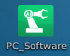 on desktop. 

* **Start with Command Line** 

(1) Power on the robot and use VNC Viewer to connect to the remote desktop.


(2) click  in the upper left corner of the system desktop to open the "**Terminator**".

(3) Enter the following command to start the PC software program. 

```bash
python3 software/armpi_pro_control/main.py
```

### 5.1.2 Software Interface Distribution

The PC software interface is as follow:


The **"Normal Mode"** interface is divided into several areas, as the figure shown below:

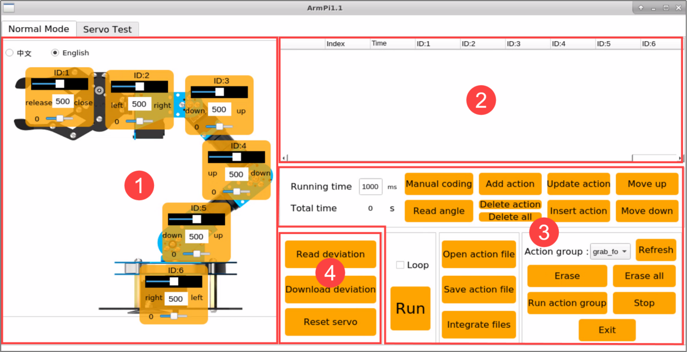

(1) Servo Control Area 

The Servo Control Area displays the corresponding servo icons of robotic arm. You can control the servos by dragging slider bar.

| Icon | Instruction |
|:--:|:--:|
|  | The ID number of servo. Here is ID1. |
| 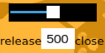 | Adjust servo position. The minimum value is 0 and the maximum value is 1000. |
| 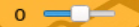 | Adjust servo deviation. The minimum value is -125 and the maximum value is 125. |

(2) Action Data List

The Action Data List displays the running time and servo value of each action of current action group.

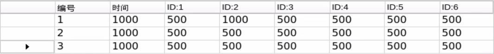

| **Icon** | Instruction |
|:--:|:--:|
|  | Action group number. |
|  | The running time of action. |
| 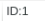 | Modify the value corresponding to the ID number. Double-click 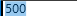to modify directly. |

(3) Action Setting Area

<table class="docutils-nobg" border="1">
<colgroup>
<col width="30%">
</colgroup>
<tbody>
<tr>
<td style="text-align: center;"><strong>Icon</strong></td>
<td style="text-align: center;"><strong>Instruction</strong></td>
</tr>
<tr>
<td style="text-align: center;">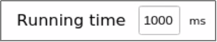</td>
<td style="text-align: center;">The time for running single action. Clickto modify.</td>
</tr>
<tr>
<td style="text-align: center;">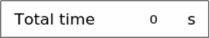</td>
<td style="text-align: center;">The total time for running the action group.</td>
</tr>
<tr>
<td style="text-align: center;">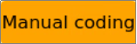</td>
<td style="text-align: center;">Click this button to loose robot's joint and then the joint can be twisted.</td>
</tr>
<tr>
<td style="text-align: center;"></td>
<td style="text-align: center;">Read the angle information after twisting the robotic arm. (This button need to use with "**Motor power off**".)</td>
</tr>
<tr>
<td style="text-align: center;">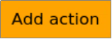</td>
<td style="text-align: center;">Add the current servo values in servo control area to the last line of action data list.</td>
</tr>
<tr>
<td style="text-align: center;"></td>
<td style="text-align: center;"><p>Delete action: delete the selected action in action data list.
Delete all: delete all the actions in action data list</p></td>
</tr>
<tr>
<td style="text-align: center;">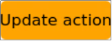</td>
<td style="text-align: center;"><p>Replace the selected action in action data list.</p>
<p>(The selected action will be replaced by the current servo value in servo control area and the running time will be replaced by the time set in "**Action Time**".)</p></td>
</tr>
<tr>
<td style="text-align: center;">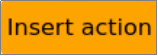</td>
<td style="text-align: center;"><p>Insert a action before the selected action.</p></td>
</tr>
<tr>
<td style="text-align: center;"></td>
<td style="text-align: center;">Exchange the selected action with the previous one.</td>
</tr>
<tr>
<td style="text-align: center;">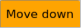</td>
<td style="text-align: center;">Exchange the selected action with the next one.</td>
</tr>
<tr>
<td style="text-align: center;">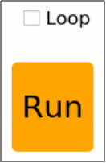</td>
<td style="text-align: center;"><p>Click to run action group in action data list once.</p>
<p>(If click "**loop**", robot will run the action group repeatedly)</p></td>
</tr>
<tr>
<td style="text-align: center;">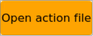</td>
<td style="text-align: center;"><p>Click to open the selected action group and then display in action data list.</p>
<p>(The path to action group file："**/home/ubuntu/software/armpi_pro_control/ActionGroups**")</p></td>
</tr>
<tr>
<td style="text-align: center;">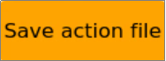</td>
<td style="text-align: center;"><p>Save the current action in action action list to the specific location.</p>
<p>(/home/ubuntu/software/armpi_pro_control/ActionGroups)</p></td>
</tr>
<tr>
<td style="text-align: center;"></td>
<td style="text-align: center;">After opening an action group, click this button and then open another action group file to integrate two action groups into a new one.</td>
</tr>
<tr>
<td style="text-align: center;">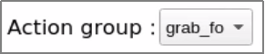</td>
<td style="text-align: center;">Display the saved action group in PC software.</td>
</tr>
<tr>
<td style="text-align: center;"></td>
<td style="text-align: center;">Click to refresh.</td>
</tr>
<tr>
<td style="text-align: center;">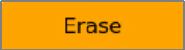</td>
<td style="text-align: center;">Delete the current action group file</td>
</tr>
<tr>
<td style="text-align: center;">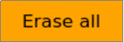</td>
<td style="text-align: center;">(Caution) Delete all action group files.</td>
</tr>
<tr>
<td style="text-align: center;"></td>
<td style="text-align: center;">Perform the selected action group once.</td>
</tr>
<tr>
<td style="text-align: center;">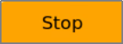</td>
<td style="text-align: center;">Stop the running action group.</td>
</tr>
<tr>
<td style="text-align: center;"></td>
<td style="text-align: center;">Exit the current PC software interface.</td>
</tr>
</tbody>
</table>

(4) Deviation Settings Area (For reference only)

| Icon | Instruction |
|:--:|:--:|
| 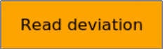 | Click to read the saved deviation automatically. |
| 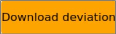 | Click to download the deviation that has been adjusted by PC software to robot. |
| 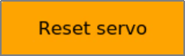 | Click to restore all servos in servo control area to the position corresponding to the value of 500. |

## 5.2 Call Action Group

### 5.2.1 Realization

ArmPi Pro has built-in action groups which are saved in `/home/ubuntu/software/armpi_pro_control/ActionGroups`. We can check and call the built-in action group by PC software or command line. 
The action file must be saved in `/home/ubuntu/software/armpi_pro_control/ActionGroups` for calling.


### 5.2.2 Call Action Group

* **PC sotfware** 

(1) Double click  to enter PC software, as the figure shown below:


(2) Then click **"Open action file"**.

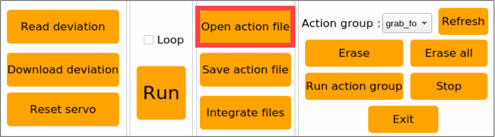

(3) Then select the action group to be executed and click "**Open**".

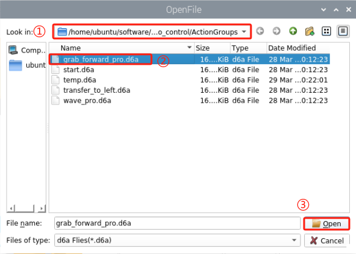

(4) Now, the running time and servo value of each action will be displayed in action data list.

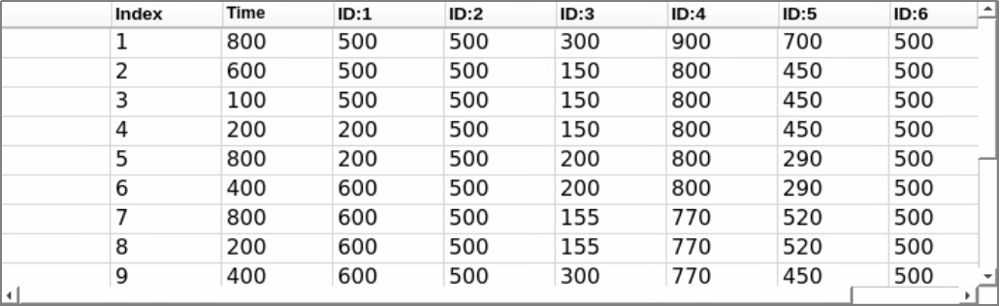

(5) Click "**Run**" to run this action group. If want to repeatedly run the action group, you can click "**loop**".

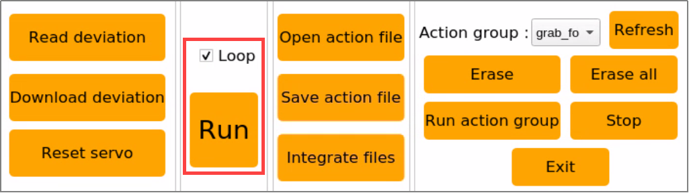

* **Command line** 

(1) Power on the robot and use VNC Viewer to connect to the remote desktop.


(2) Click  in the upper left corner of the system desktop to open the "Terminator".


(3) Enter the following command in the opened terminal interface to switch to the directory of PC software. 

```bash
cd software/armpi_pro_control
```

(4) Enter the command "**ls**" to check all files under this directory. The action group file is stored in the directory "**ActionGroups**" as shown below:

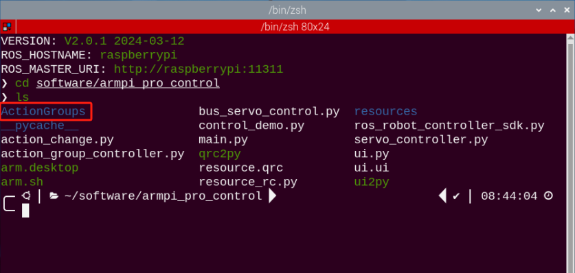

<p id="execute_single_action">

* **Execute single action** 

If want perform single action, you need to modify the program file for calling action.

(1) Enter the following command and press "**Enter**" to open the program file for calling action via vim editor.

```bash
vim control_demo.py
```

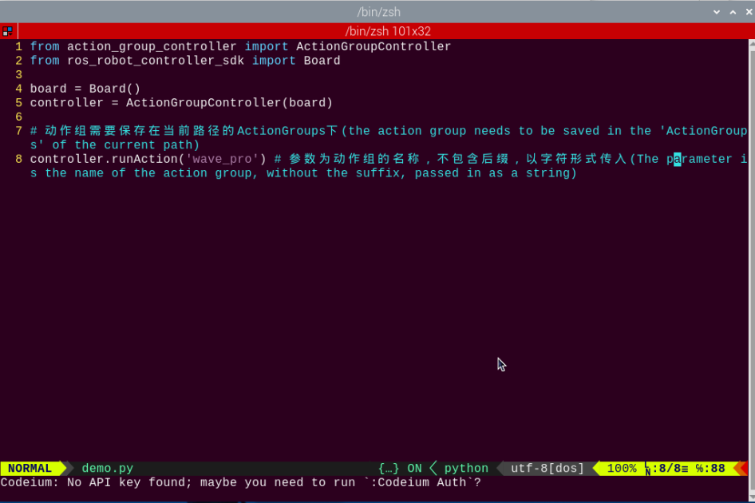

(2) Then press "**i**" to switch to the program editing mode.

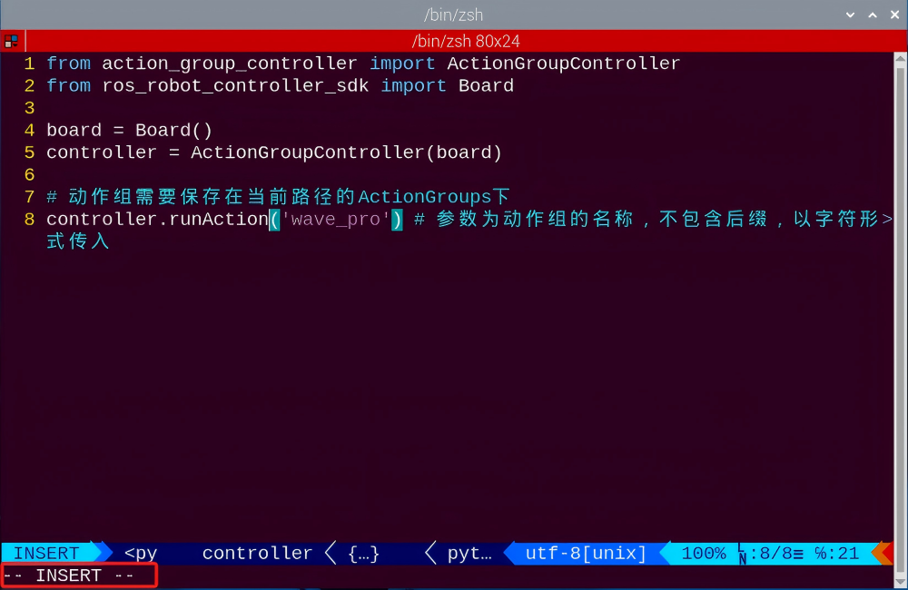

(3) Next, we can find that the program will perform "**wave_pro**" action by default.

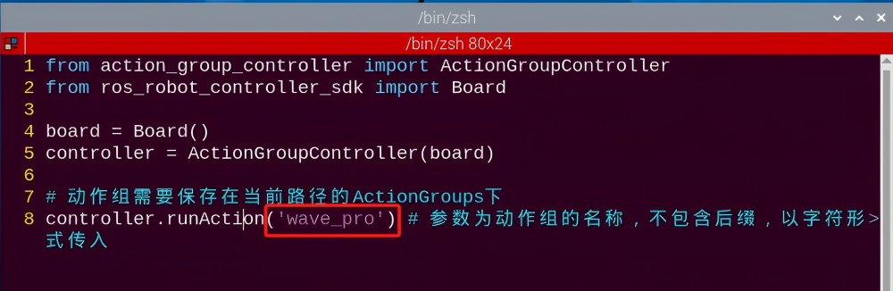

(4) Take changing the default action group to **"grab-forward_pro"** as example. Replace **"wave_pro"** in parenthesis with **"grab-forward_pro"**.

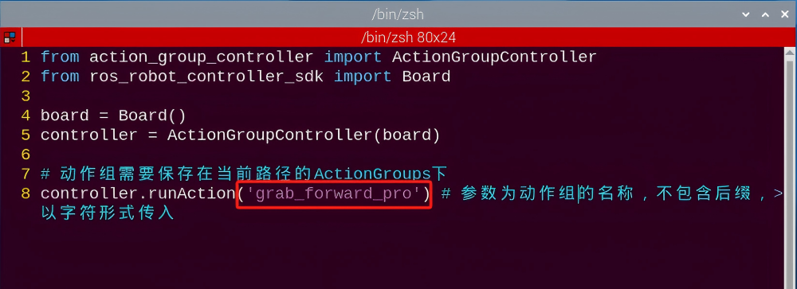

:::{Note}
The action name must be consistent with the file name, otherwise, it will be failed to call!
:::

(5) Press "**Esc**" , and enter "**:wq**". Then press "**Enter**" to save and exit.

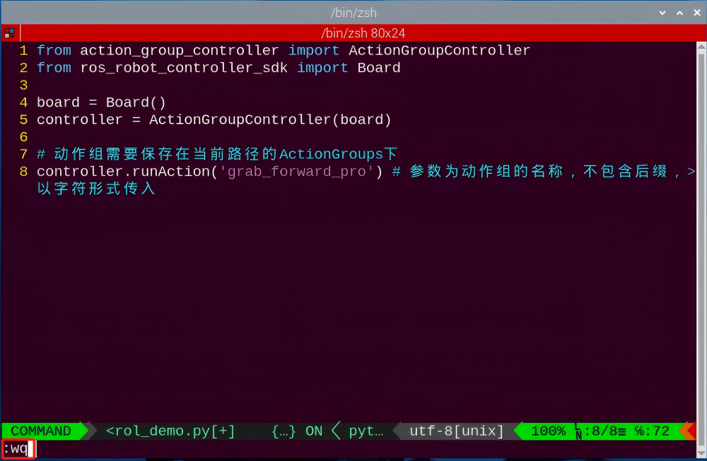

(6) Enter the following command and press "**Enter**" to execute "**grab_forward_Pro**" action once.

:::{Note}
 If no action action file is saved in the path, LX terminal will prompt "**no action group file is found**". Therefore, please make sure the action group to be called is save in the correct path.
:::

* **Call several action groups** 

If want to call several action groups, please refer to the following operation steps. This section will call "**wave_Pro**" and "**grab-forward_Pro**" actions as example:

(1) According to the operation steps in"[**5.2.2 Call Action Group -> Execute Single Action**](#execute_single_action)", enter the following command  to enter program file and editing mode.

```bash
vim control_demo.py
```

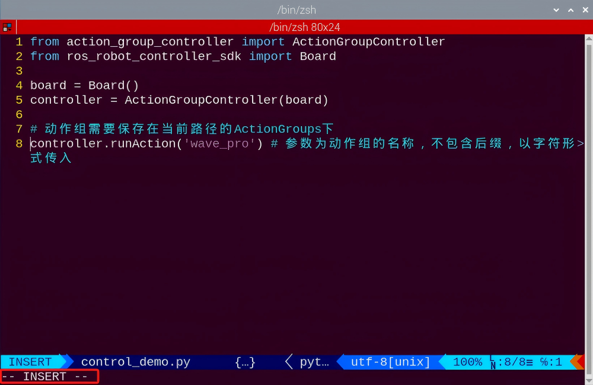

(2) Then copy `controller.runAction('')` function. Please note that the parameters in function should be consistent with the action group name, otherwise, the action can not be performed .

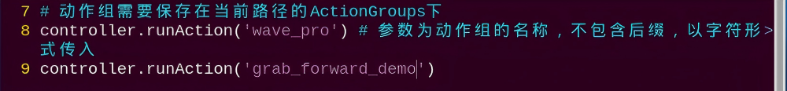

(3) There is another tip for you. For example, after performing two actions above, it there are other action files to be performed, you can select the function in 27 line, press "**Y**" twice and then press "**P**" to copy the function. (Before this step, you need to press "**Esc**" to exit the editing mode.)

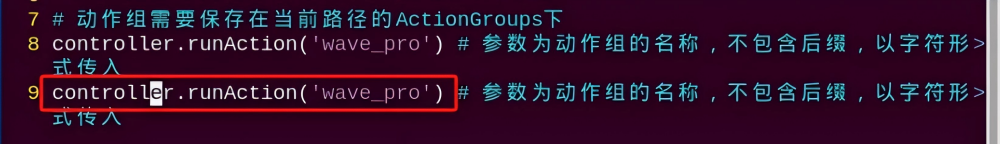

(4) Now, modify the parameter in function with the name of action group to be performed. Then, save and exit. Finally, enter command.

```bash
python3 control_demo.py
```

## 5.3 Action Programming

The values set in this lesson is just for reference, you can adjust them according to the actual situation.

### 5.3.1 Program Goal

Action editing refers to adjusting the angles of corresponding servos based on the target action to achieve the action, and multiple actions are combined into the action group.
Create an action group to allow robotic arm to transport the block to the left side.

### 5.3.2 How to realize it?

* **Action Design** 

(1) Double-click  to open PC software (normal mode).


(2) Click **"Open action file"** and select **"start"** action group file in **"/home/ubuntu/software/armpi_pro_control/ActionGroups"**. Then click "**Open**" to import this action group into action date list to set an initial posture for ArmPi Pro.

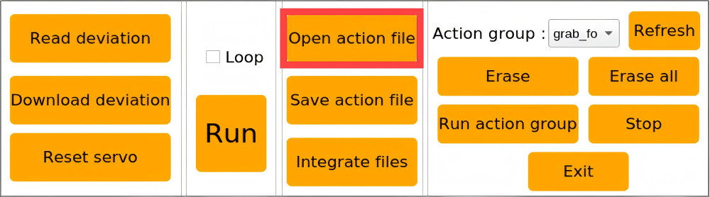

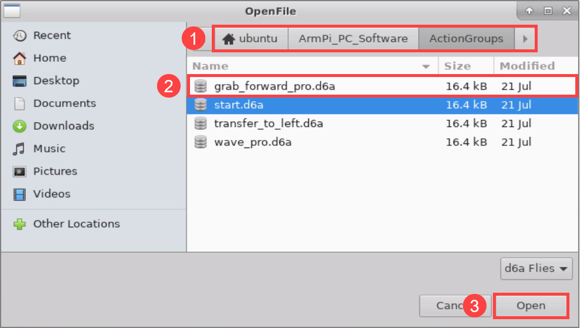

(3) Click   in front of No.1 action to update the servo angel information in servo control area. 

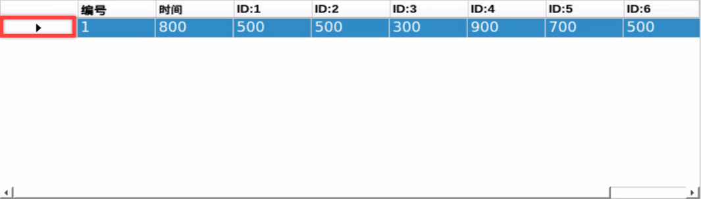

(4) Drag the bar slider of No.5 servo to allow robotic arm to move down to the block.

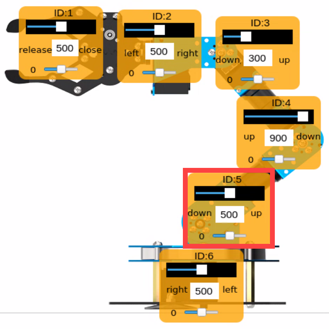

(5) Set the running time as 800ms and click "**Add action**" to get the second action.

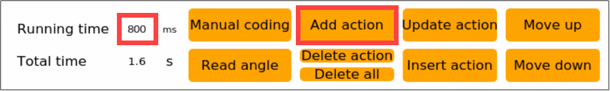

(6) To make action group smoother, add a transition action after setting an action and set the running time as 100ms. Then click "**Add action**" to get No.3 action.

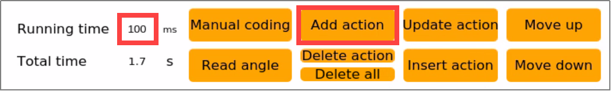

(7) Then drag the sliders of No.1 and No.5 servos to allow the gripper open and move to the block.

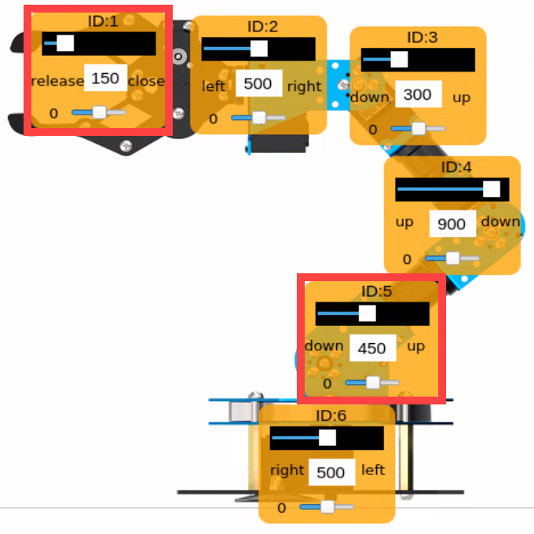

(8) Set the running time as 500ms and click "**Add action**" to get No.4 action.

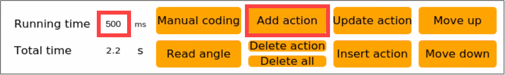

(9) Add a transition action. Set the running time as 200ms and click "**Add action**" to get No.5 action.


(10) Then drag the slider of No.5 servo to point the gripper at the block.


(11) The running time is set as 600ms and click "**Add action**" to get No.6 action.

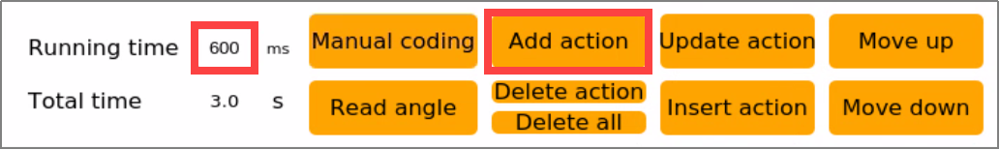

(12) Then add a transition action. Set the running time as 200ms and click "**Add action**" to get No.7 action.

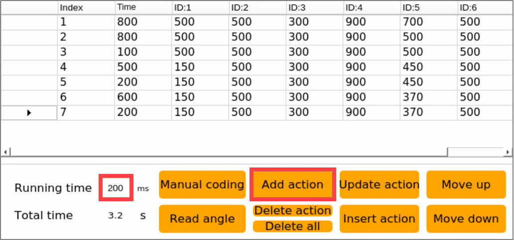

(13) Drag the slider under ID1 servo to grip the block.

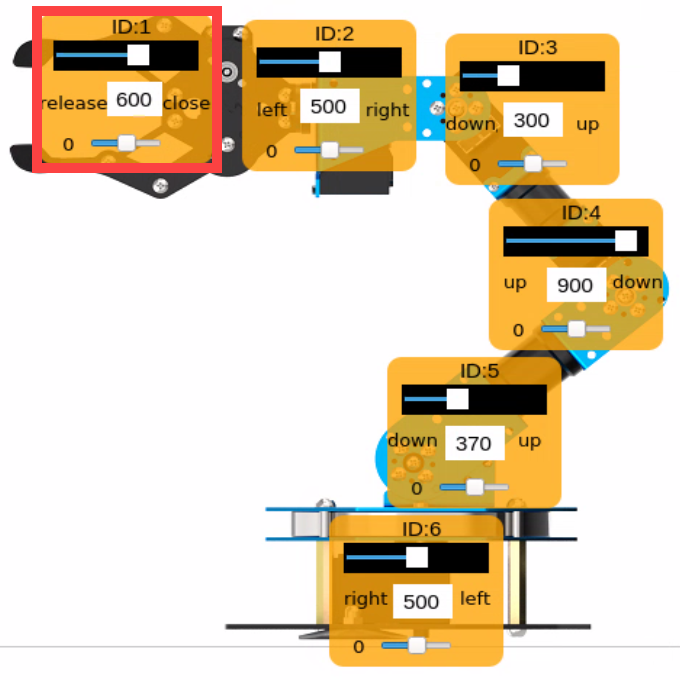

(14) The running time is set as 600ms and then click "**Add action**" to get No.8 action.


(15) Then adjust the value of No.4 and No.5 servos to raise the robotic arm. 

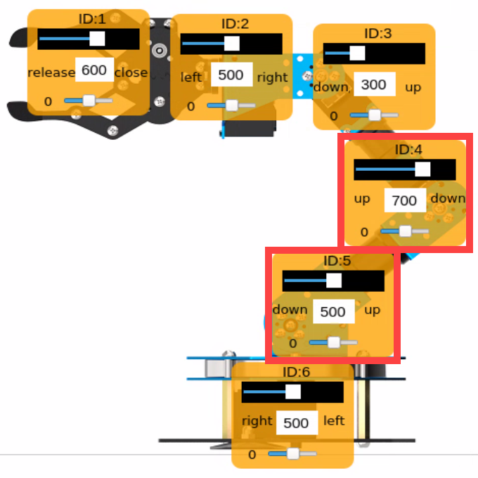

(16) The running time is set as 700ms and then click "**Add action**" to get No.9 action.

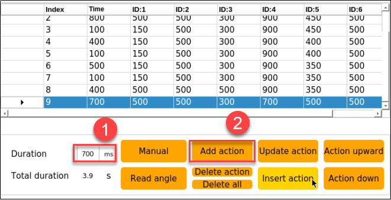

(17) Add a transition action and set the running time as 200ms.


(18) Then adjust the value of No.6 servo to allow the robotic arm to move the block to the left side.


(19) The running time is set as 800ms and then click "**Add action**" to get No.11 action.


(20) Add a transition action and set the running time as 200ms.


(21) After moving the block to the specific position, put it down. This step need to adjust the value of No.3, No.4 and No.5 servos.


(22) Then set the running time as 600ms and click "**Add action**" to get No.13 action.


(23) Add an transition action and its running time is set to 100ms.


(24) The drag the slider of ID1 servo to loose the block.


(25) After completing this action, let robotic arm back to the initial posture. Adjust the value of ID1, ID3, ID4 and ID5 servos to close the gripper and lift the robotic arm.


(26) Set the time to 00ms, and then click "**Add action**" to get No.16 action.


(27) Add an transition action and set its running time to 100ms.


(28) Finally, return the robotic arm to initial posture. No need to adjust the servo value. Find No.1 action and click 。


In meantime, the servo control area at left side will update the value of No.1 action, as the figure shown below:


(29) Finally, set the running time as 800 and click "**Add action**" to get No.18 action.


OK, the entire of this action has been programmed completely, as the figure shown below.


(30) Next, let's look at the performance. Select No.1 action and click "**Run**". If want to execute this action cyclically, you can check "**Loop**".


**3.2.2 Save Action**

:::{Note}
The action name can not contain space key. It is recommended to use "**\_**" instead of space key.
:::

For facilitate debugging sometime, save the completed action group. Click "**Save action file**" and save to the path: **/home/ubuntu/software/armpi_fpv_control/ActionGroups**

Here name the action group as  `transfer_to_left`  and click  `Save` to save action.


## 5.4 Integrate Action File

### 5.4.1 Program Goal

This lesson will teach you how to integrate two action groups into a new action group.

### 5.4.2 Operation Steps

(1) Power on the robot and use VNC Viewer to connect to the remote desktop.


(2) Click "**Integrate Action File**" in action setting area and select the following path:


(3) In the opened interface, select "**grab-forward_pro.d6a**" and double-click to open it.


(4) At this time, we can see that the action group parameters are shown in action data list. (The image is just a part of screenshot)


(5) Then click "Integ**rate action file**" again and double click to open "**wave_pro.d6a**". We can find that action group file has been integrated.


(6) Select No.1 action and click "**Run**" to run the integrated action group once.


(7) Click "**Save action file**" to save this new action group. 


(8) Name the action group. ("**wave_and_grab_forwad**" is a example name)

:::{Note}

The name must be English and not space is included. It is recommended to replace space with  underline.

:::


## 5.5  Import and Export Action File

ArmPi Pro has built-in action group before delivery, and its action group file is stored in the path of Docker container `/home/ubuntu/software/armpi_pro_ control/ActionGroups`. The action group file in the container can be imported and exported in the form of terminal command line.


### 5.5.1 Getting Ready

Power on the robot and use VNC Viewer to connect to the remote desktop.

### 5.5.2 Export Action

Take exporting and importing "**transfer_to_left**" action file as example.

(1) Click  in the upper left corner of the system desktop to open the "**Terminator**".


(2) Enter the following command in the opened terminal interface to copy it to the "/home/ubuntu/share/tmp/".

```bash
cp /home/ubuntu/software/armpi_pro_control/ActionGroups/transfer_to_left.d6a /home/ubuntu/share/tmp/
```

(3) Click  in the upper left corner of the desktop to find the "**transfer_to_left**" file under this path.


### 5.5.3 Import File

The process for importing and exporting actions is the same: import the action group file in the corresponding path. 

(1) Import the "**transfer_to_left**" action group file into the shared folder "**/share/tmp/**" between the Docker container and the Raspberry Pi system.


(2) Click  in the upper left corner of the system desktop to open the "**Terminator**".


(3) Enter the following command in the opened terminal interface 

```bash
cp /home/ubuntu/share/tmp/transfer_to_left.d6a /home/ubuntu/software/armpi_pro_control/ActionGroups/
```

to copy it to the `/home/ubuntu/software/armpi_pro_control/ActionGroups/`.

(4) Now, double-click  to enter PC software (Normal mode).


(5) Click "**Open action file**" and find the imported action file according to the following path.


Or click the drop down of action group to select the imported action file.


(6) Click "**Run**" to perform the action group.


