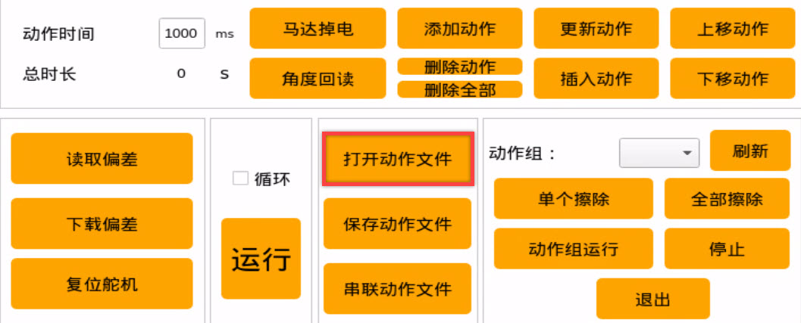
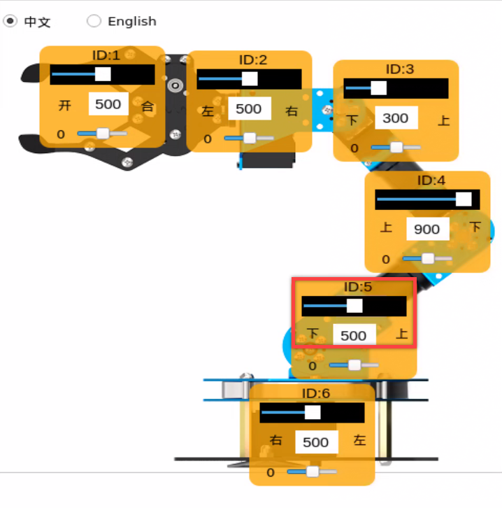
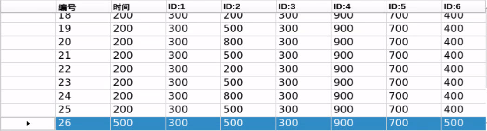

# 机械臂上位机动作编辑课程

## 1. 上位机的介绍

### 1.1 启动上位机

- #### 采用桌面图标启动

双击系统桌面上的PC_Software图标即可启动上位机。


- #### 采用命令行形式启动

1)  将设备开机，并参照课程资料的"**[远程工具安装及容器进入方法\1. 远程桌面工具安装与连接]()**"内容，通过VNC远程连接工具连接。


2)  点击系统桌面左上角的图标，打开Terminator终端。


3)  输入指令"**python3 software/armpi_pro_control/main.py**"启动上位机程序。


### 1.2 上位机界面分布

上位机界面如下图所示：


上位机在主界面"**普通模式**"下分为以下区域：


1.  **舵机操控区域**

舵机操控区域显示了被选中的舵机图标，通过调整对应滑杆值即可调整舵机位置。

| **图标** | **功能说明** |
|:--:|:--:|
|  | 代表舵机的ID号，这里以1为例。 |
|  | 用于调整舵机位置，最小值为0，最大值为1000。 |
|  | 用于调整舵机偏差，最小值为-125，最大值为125。 |

2.  **动作详情列表**

动作详情列表显示了当前动作组每个动作的执行时间，以及每个动作里各个舵机值。


| **图标** | **功能说明** |
|:--:|:--:|
|  | 动作组编号。 |
|  | 动作运行的时间，即执行该动作需所用的时间。 |
|  | 该ID下对应的动作数值，双击下方数值可直接修改。 |

3.  **动作组设置区域**

<table class="docutils-nobg" border="1">
<tbody>
<tr>
<td style="text-align: center;"><strong>图标</strong></td>
<td style="text-align: center;"><strong>功能说明</strong></td>
</tr>
<tr>
<td style="text-align: center;"></td>
<td style="text-align: center;">运行单个动作所需的时间，点击可进行修改。</td>
</tr>
<tr>
<td style="text-align: center;"></td>
<td style="text-align: center;">动作组运行所需的总时长。</td>
</tr>
<tr>
<td style="text-align: center;"></td>
<td style="text-align: center;">点击后机器人的关节会变得松弛，此时可以用手掰动机器人，设计动作。</td>
</tr>
<tr>
<td style="text-align: center;"></td>
<td style="text-align: center;">将掰成形状的角度信息读取出来。（需要搭配"马达掉电"按钮使用）</td>
</tr>
<tr>
<td style="text-align: center;"></td>
<td style="text-align: center;">将当前舵机操控区域的舵机数值作为一个动作，添加至动作详情列表的最后一行。</td>
</tr>
<tr>
<td style="text-align: center;"></td>
<td style="text-align: center;"><p>删除动作：将会删除动作详情列表里选中的动作。</p>
<p>删除全部：将会删除动作详情列表里所有动作。</p></td>
</tr>
<tr>
<td style="text-align: center;"></td>
<td style="text-align: center;"><p>将动作详情列表中选中的数值进行替换。</p>
<p>（舵机数值替换为舵机操控区域的当前舵机值，动作运行时间替换为"动作时间"内设定的时间）</p></td>
</tr>
<tr>
<td style="text-align: center;"></td>
<td style="text-align: center;"><p>在选中的动作上面插入一行动作。</p>
<p>（其中动作的时间为"动作时间(ms)"的时间，角度数值为舵机操控区域的舵机值）</p></td>
</tr>
<tr>
<td style="text-align: center;"></td>
<td style="text-align: center;">将选中的动作与其上一行进行位置交换。</td>
</tr>
<tr>
<td style="text-align: center;"></td>
<td style="text-align: center;">将选中的动作与其下一行进行位置交换。</td>
</tr>
<tr>
<td style="text-align: center;"></td>
<td style="text-align: center;"><p>单击该按钮后将会运行一次动作详情列表的动作。</p>
<p>（如果勾选了"循环"，机器人则重复运行动作）</p></td>
</tr>
<tr>
<td style="text-align: center;"></td>
<td style="text-align: center;"><p>单击后选择要打开的动作组即可将动作组数据加载到动作详情列表中。</p>
<p>（动作组文件路径："/home/ubuntu/software/armpi_pro_control/ActionGroups"）</p></td>
</tr>
<tr>
<td style="text-align: center;"></td>
<td style="text-align: center;"><p>将此时动作详情列表里的动作保存到指定位置。</p>
<p>（/home/ubuntu/software/armpi_pro_control/ActionGroups）</p></td>
</tr>
<tr>
<td style="text-align: center;"></td>
<td style="text-align: center;">打开一个动作组后，点击串联动作文件按钮，继续打开另一个动作组文件，可将两个动作组文件串联成一个新的动作组。</td>
</tr>
<tr>
<td style="text-align: center;"></td>
<td style="text-align: center;">可在上位机中显示已保存的动作组。</td>
</tr>
<tr>
<td style="text-align: center;"></td>
<td style="text-align: center;">按下此按钮，动作组选择栏即可刷新。</td>
</tr>
<tr>
<td style="text-align: center;"></td>
<td style="text-align: center;">删除当前动作组文件。</td>
</tr>
<tr>
<td style="text-align: center;"></td>
<td style="text-align: center;">（慎点）删除所有动作组文件。</td>
</tr>
<tr>
<td style="text-align: center;"></td>
<td style="text-align: center;">执行动作组（选定序号）一次。</td>
</tr>
<tr>
<td style="text-align: center;"></td>
<td style="text-align: center;">停止正在运行的动作组。</td>
</tr>
<tr>
<td style="text-align: center;"></td>
<td style="text-align: center;">退出当前上位机操作界面。</td>
</tr>
</tbody>
</table>

4.  **偏差设置区域（此区域功能按键了解即可）**

| **图标** | **功能说明** |
|:--:|:--:|
|  | 单击后即可自动读取保存的偏差。 |
|  | 单击后即可将通过上位机调整好的偏差下载到机器人中。 |
|  | 单击后即可将舵机操控区域的所有舵机恢复至500位置。 |

## 2. 动作调用教学

### 2.1 实现目标

ArmPi Pro出厂时内置有动作组，其动作组文件储存在"**/home/ubuntu/software/armpi_pro_control/ActionGroups**"路径下。我们可通过上位机软件或终端命令行的形式来查看并调用其内置动作。具体操作步骤如下：

（动作文件必须保存在"/home/ubuntu/software/armpi_pro_control/ActionGroups"路径下才能被调用）。


### 2.2 调用动作组

- #### 2.2.1 通过上位机调用

1)  双击系统桌面图标，即可进入上位机编辑界面，如下图所示：


2)  接下来，点击"**打开动作组**"按钮。

3)  然后在以下选择想要执行的动作组，再点击"**Open**"。


4)  此时动作详情列表将显示动作组的各个动作的运行时间和舵机数值（下图仅为部分动作截图）。


5)  点击"**运行**"按钮，即可运行当前动作详情列表内的所有动作，若想重复当前动作组，可勾选"**循环**"选项。


- #### 2.2.2 通过命令行调用

1)  将设备开机，并参照课程资料的"**[远程工具安装及容器进入方法\1. 远程桌面工具安装与连接]()**"内容，通过VNC远程连接工具连接。


2)  点击系统桌面左上角的图标，打开Terminator终端。


3)  在打开的终端界面中输入"**cd software/armpi_pro_control**"指令，切换到上位机目录内。


4)  输入"**ls**"指令来查看该目录下的所有文件，动作组文件就存放在"**ActionGroups**"目录下，如下图所示。


<span id="_2.2.1 单个动作执行方法" class="anchor"></span>

<p id="anchor_2_2_2_1">

- **单个动作执行方法**

如需执行单个动作，需要前往调用动作的程序文件中进行修改。

1)  输入指令"**vim control_demo.py**"，按下回车，通过vim编辑器打开该程序。


2)  然后按下键盘上的"i"键进入程序编辑模式。


3)  接下来，可以看到程序中默认执行"**wave_pro**"这个动作。


4)  我们将默认动作组修改为"**grab_forward_pro**"为例，将括号内的"**wave_pro**"替换为"**grab_forward_pro**"。


:::{Note}
动作名称要与实际存储的名称一致，否则将调用失败！
:::

5)  按下Esc键，然后再输入"**：**"进入末行命令模式，输入"**wq**"按下回车，将修改保存并退出。


6)  再次输入指令"**python3 control_demo.py**"，按下回车，此时机械臂将执行"**grab_forward_Pro**"动作1次。


:::{Note}
当路径下不存在动作组文件时，LX终端会显示"未能找到动作组文件"的提示。因此请确保被调用的动作组保存在正确路径下。
:::

- **调用多个动作组**

如想同时通过命令行调用多个动作，可参照以下步骤，本节以同时调用"wave_pro"和"grab_forward_pro"为例：

1)  先按照"[2.2 调用动作组\ 单个动作执行方法](#anchor_2_2_2_1)"的操作输入指令"**vim control_demo.py**""进入程序文件，并进入编辑模式。


2)  然后将 **controller.runAction('')** 函数进行复制，函数内参数要与保存的动作文件名称相同，否则无法执行。


3)  除了复制粘贴，这里还有一个复制的小技巧，比如在执行完上面两个动作文件后，需要执行其他的动作文件。鼠标选中8行的函数，按"Y"两下，然后按下"P"即可将上面的函数复制下来（操作此步骤时，请先退出编辑模式，可按下"Esc"键）。


4)  将函数内的参数修改为想要执行的动作组名称即可，然后保存并退出，再次输入指令"**python3 control_demo.py**"即可。

```commandline
python3 control_demo.py
```


## 3. 动作编辑教学

本节文档所设置的数值仅供参考，用户可根据实际情况进行调整。

### 3.1 实现目标

动作编辑即以目标动作为基准，调节相应舵机的角度实现该动作，多个动作组合成动作组。

本节会创建一个机械臂实现"**搬运木块至左侧**"的动作组。

### 3.2 动作实现

- #### 3.2.1 动作设计

1)  双击系统桌面的上位机图标，打开上位机编辑界面的普通模式。


2)  点击"**打开动作文件**"，在"**/home/ubuntu/software/armpi_pro_control/ActionGroups**"路径下，选择"**start**"动作组文件，再点击"**Open**"，即可将这个动作组导入动作详情列表中，给机器人设置一个初始姿态。


3)  在动作详情列表中点击1号动作前面的" "按钮，运行1号动作，使左侧的舵机操控区域同步舵机角度信息，就得到了1号动作。


4)  滑动5号舵机的滑杆，使机械臂向下移向木块。



5)  时间设为800ms，点击"**添加动作**"，即可得到第2个动作。


6)  为了使整套动作更加连贯流畅，我们每设置一个动作之后，就添加一个过渡动作。在上一个动作的基础上，将时间修改为100ms，再次点击"**添加动作**"，即可得到第3个动作。


7)  接下来，让机械爪张开并且靠近木块。这里滑动的是1号和5号舵机的滑杆。


8)  时间设为500ms，点击"**添加动作**"，即可得到4号动作。


9)  再添加一个过渡动作，时间设置为200ms，点击"**添加动作**"，就得到了5号动作。


10) 然后机械爪对准木块的位置，准备开始夹取。这一步调整的是5号舵机的数值滑杆。


11) 时间为600ms，然后点击"**添加动作**"，得到6号动作。


12) 接着添加一个过渡动作，将时间设为200ms，点击"**添加动作**"，得到7号动作。


13) 下面拖动1号舵机的数值滑杆，使机械爪夹紧木块。


14) 时间设置为600ms，最后点击"**添加动作**"，就得到了8号动作。


15) 然后调整4、5号舵机的数值，让机械臂抬高一点。


16) 时间设为700ms，点击"**添加动作**"，得到9号动作。


17) 再将时间设为200ms，添加一个过渡动作。


18) 接下来让机械臂将木块搬运到左侧，调整的是6号舵机的数值。


19) 时间设为800ms，点击"**添加动作**"，得到11号动作。


20) 再添加一个过渡动作，时间为200ms。


21) 木块搬运到指定位置之后，就需要将它放下来，这一步调整的是3、4、5号舵机的数值。


22) 然后将时间设置为800ms，点击"**添加动作**"，就得到13号动作。


23) 添加一个过渡动作，时间设为100ms。


24) 接下来就是滑动1号舵机的数值滑杆，让机械爪松开木块。


25) 搬运完木块之后，就可以将机械臂恢复成初始姿态了。先让闭合机械爪，并抬高机械臂，这里调整的是1、3、4、5号舵机的值。


26) 时间设置为700ms，点击"**添加动作**"，就得到16号动作。


27) 再添加一个过渡动作，时间设为100ms。


28) 最后就是将机械臂恢复到初始姿态，这里不需要再重新调整舵机的值，只需要找到1号动作，点击它前面的这个三角标志。


这时，左边的舵机控制区域的舵机将会同步列表1号动作的数值，如下图所示：


29) 最后再来设置一下这个动作的时间，设为1000，点击"**添加动作**"，即可得到18号动作。


到这一步，"**搬运木块至左侧**"整个动作组就已经编辑完成了完整的动作详情列表如下图所示。


30) 接下来，展示一下整个动作组的整体效果。选中1号动作，然后点击"**运行**"按钮，若想循环执行这个动作组，可勾选"**循环**"选项。


- #### 3.2.2 动作保存

:::{Note}
命名动作组时切勿使用空格键，以免导致后期调试出现保存不成功的情况，空格建议使用下划线"-"来代替。
:::

为了便于后期的调试和管理，可将编辑好的动作组给保存起来。单击"**保存动作文件**"按钮，然后选择以下路径：**/home/ubuntu/software/armpi_fpv_control/ActionGroups**.

这里以"**transfer_to_left**"为例进行命名，单击"**Save**",即可将动作组保存。


## 4. 串联动作文件

### 4.1 实现目标

串联动作文件是将两个动作组文件首尾串联起来，组成一个新的动作组文件，这样可实现动作组文件之间的合并。

### 4.2 操作步骤

1)  根据"**[远程工具安装及容器进入方法\1. 远程桌面工具安装与连接]()**"课程内容,远程连接系统后，启动ArmPi Pro上位机。


2)  点击动作组设置区的"串联动作文件"按钮，选择以下路径：


3)  在打开的弹窗界面中选择"**grab-forward_pro.d6a**"，双击打开。


4)  此时，我们看到动作组详情列表中显示了该动作组参数（以下为部分参数截图）。


5)  再次点击"**串联动作文件**"，选择"**wave_pro.d6a**"，双击打开，即可看到第二个动作组文件串联进来了。



6)  选中1号动作，然后点击"**运行**"，将串联的新的动作组在线运行一遍。


7)  点击"**保存动作文件**"按钮，将新串联的动作组进行保存，以便后期调试。


8)  给串联的新动作进行命名（这里命名为"**wave_and_grab_forwad**"）。注意：名称必须是全英文且不能空格，空格建议用下划线来代替。


## 5. 动作文件的导出与导入

ArmPi Pro出厂时内置有动作组，其动作组文件储存在Docker容器中"**/home/ubuntu/software/armpi_pro_control/ActionGroups**"路径下。我们可通过终端命令行的形式将容器中的动作组文件导入和导出。


### 5.1 准备工作

根据"**[远程工具安装及容器进入方法\1. 远程桌面工具安装与连接]()**"课程内容，将ArmPi Pro通过VNC远程连接到系统桌面。

### 5.2 导出动作

**本节课以"transfer_to_left"动作组文件的导出和导入为例进行说明**

1)  点击系统桌面左上角的图标，打开Terminator终端。


2)  在打开的终端界面中输入"**cp /home/ubuntu/software/armpi_pro_control/ActionGroups/transfer_to_left.d6a /home/ubuntu/share/tmp/"指令，即可复制到"/home/ubuntu/share/tmp/**"路径下。


将"**transfer_to_left.d6a**"动作组文件复制到Docker容器和树莓派系统的共享文件夹"**/share/tmp/**"下。

3)  点击系统桌面左上角的图标，在此路径下即可找到"**transfer_to_left**"文件。


### 5.3 导入动作

导入动作和导出动作同理，将动作组文件放置到对应路径下即可。

1)  将"transfer_to_left"动作组文件放置到Docker容器和树莓派系统的共享文件夹"/share/tmp/"下。


2)  点击系统桌面左上角的图标，打开Terminator终端。


3)  在打开的终端界面中输入"**cp /home/ubuntu/share/tmp/transfer_to_left.d6a /home/ubuntu/software/armpi_pro_control/ActionGroups/"指令，即可复制到"/home/ubuntu/software/armpi_pro_control/ActionGroups/**"路径下。

```commandline
cp /home/ubuntu/share/tmp/transfer_to_left.d6a /home/ubuntu/software/armpi_pro_control/ActionGroups/
```


将"**transfer_to_left.d6a**"动作组文件复制到Docker容器和树莓派系统的共享文件夹"**/home/ubuntu/software/armpi_pro_control/ActionGroups/**"下。

4)  然后双击系统桌面的上位机图标，进入上位机编辑界面的普通模式。


5)  点击"**打开动作文件**"按钮，选择如下图框出的路径，即可在打开的界面中找到的导入的动作文件。


或者直接点击动作组选择栏的下拉按钮，即可在选项框里选择导入的动作文件。


6)  点击按钮即可执行该动作组。
