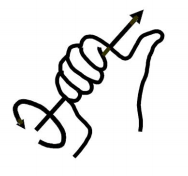
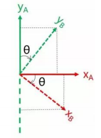
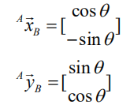
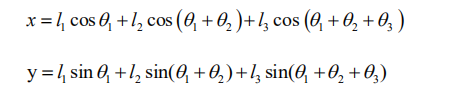
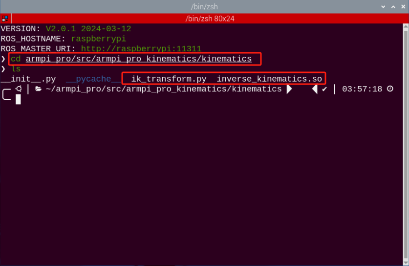
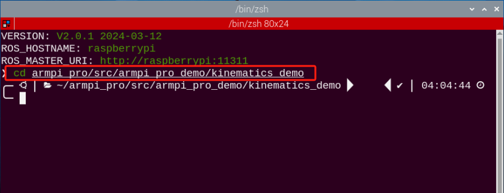
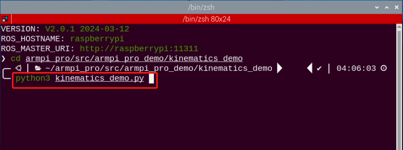
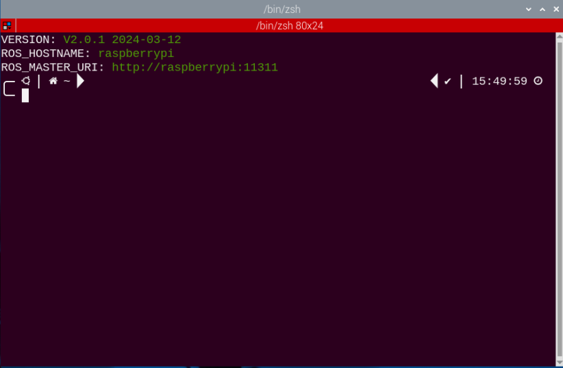
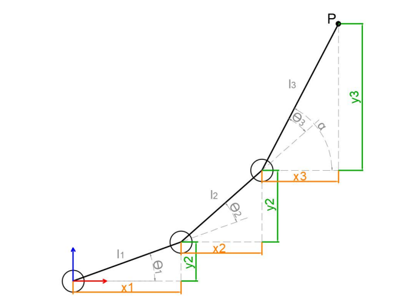
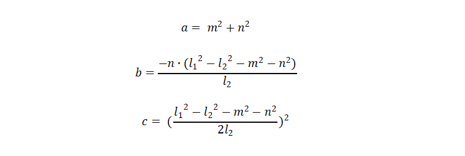

# 6. Forward and Inverse Kinematics Course

## 6.1 Establish robotic Arm Coordinate System

### 6.1.1 Coordinate System Introduction

Most of the descriptions of spatial position, speed and acceleration are in Cartesian coordinate system, which is well known as a coordinate system composed of three mutually perpendicular coordinate axes.When we say how many angles to rotate around a certain axis, the right-hand rule is used to determine the positive direction, as shown below:



### 6.1.2 Position, Translation Swap

The position is represented by a three-dimensional vector, and the translation transformation is the transformation of the coordinate system space position, which can be represented by the position vector of the coordinate system origin O, as shown in the figure below. Multiple translation transformations are also very simple. You can find the coordinates of a point in space in the coordinate system {B} after translation transformation by adding directly between vectors.


### 6.1.3 Angle/Direction, Rotation Transformation

Compared with the position, the representation method of the bearing is relatively troublesome. Before discussing the bearing , it is necessary to explain one point: the three-dimensional position and orientation of an object are usually "attached" to the object with a coordinate system that moves and rotates with it, and then by describing the coordinate system and the reference coordinate system Relationship to describe this object.
Describing the position and orientation of an object in the coordinate system can be equivalently understood as describing the relationship between the coordinate systems. We talk about angle/direction notation here, as long as we talk about the relationship between two coordinate systems. To know how and how much a coordinate system is rotated relative to another coordinate system, what should be done? Let's start with the two-dimensional situation:



By coordinate axis unit vector with the reference coordinate system expressing, though reference the picture we can directly written the following formula:



We define a 2x2 matrix:


Obviously, each column of this matrix is the representation of the coordinate axis unit vector of coordinate system B in the coordinate system. With this matrix, we can draw the x-axis and y-axis of coordinate system B and determine the unique orientation of B.

### 6.1.4 Rotation Matrix

The three-dimensional orientation of space is relatively more complicated, because the orientation of the coordinates on the plane can only have one degree of freedom, that is, to rotate around the axis of the vertical plane. The orientation of objects in space will have three degrees of freedom. However, if we start from the first method in the figure above, we can easily write a 3×3 R matrix, which we call the rotation matrix:


This formula shows that in the rotation matrix from the coordinate system {B} to the coordinate system {A}, each column is the representation of the coordinate axis unit vector of the coordinate system {B} in the coordinate system {A}.

## 6.2 Brief Analysis of Forward Kinematics

### 6.2.1 DH Parameter Introduction

The DH parameter is a mechanical arm mathematical model and coordinate system determination system that uses four parameters to express the position and angle relationship between two pairs of joint links. As we will see below, it artificially reduces two degrees of freedom by limiting the position of the origin and the direction of the X axis, so it only needs four parameters to define a coordinate system with six degrees of freedom.
The four parameters selected by DH have very clear physical meanings, as follows:

① link length : The length of the common normal between the axes of the two joints (Rotation axis of rotation joint, translation axis of translation joint)

② link twist: The angle at which the axis of one joint rotates around their common normal relative to the axis of the other joint

③ link offset: The common normal of one joint and the next joint and the distance between the common normal of one joint and the previous joint along this joint axis

④ joint angle: The common normal of one joint and the next joint and the angle of rotation around the joint axis with the common normal of the previous joint

The above definition is very complicated, but it will be much clearer when combined with the coordinate system.

First of all you should pay attention to the two most important "lines": the joint axis, and the common normal between the axis joint and the adjacent joint.

In the DH parameter system, we set axis as the z axis; common normal as the x axis, and the direction of the x axis is: from this joint to the next joint.
Of course, these two rules alone are not enough to completely determine the coordinate system of each joint. Let's talk about the steps to determine the coordinate system in detail below.

In applications such as the simulation of the robotic arm, we often adopt other methods to establish the coordinate system, but mastering the methods mentioned here is necessary for you to understand the mathematical expression of the robotic arm and understand our subsequent analysis.
The figure below shows two typical robot joints. Although such joints and links are not necessarily similar to the joints and links of any actual robot, they are very common and can easily represent any joint of the actual robot.


### 6.2.2 Determine the Coordinate System

To determine the coordinate system, there are generally the following steps: 

In order to model the robot with DH notation, the first thing is to specify a local ground reference coordinate system for each joint, so a Z axis and an X axis must be specified for each joint.

Specify the Z axis. If the joint is rotating, the Z axis is in the direction of rotation according to the right-hand rule. The rotation angle around the Z axis is a variable of the joint; if the joint is a sliding joint, the Z axis is the direction of movement along a straight line. The link length d along the Z axis is the joint variable.

Specify the X axis.When the two joints are not parallel or intersect, the Z axis is usually a diagonal line, but there is always a common vertical line with the shortest distance, which is orthogonal to any two diagonal lines. Define the X axis of the local reference coordinate system in the direction of the common perpendicular. If an represents the common perpendicular between Zn1, the direction of Xn will be along an.
Of course there are special circumstances. When the Z axes of the two joints are parallel, there will be countless common perpendiculars. At this time, you can select the one that is collinear with the common perpendicular of the previous joint, which can simplify the model; if two joints intersect, there is no common perpendicular between them. In this case, the line perpendicular to the plane formed by the two axes can be defined as X Shaft can simplify the model. 
After attaching the corresponding coordinate system to each joint, as shown in the following figure: 


After determining the coordinate system, we can express the above four parameters in a more concise way:

link length α<sub>i-1</sub> ： the distance from Z<sub>i-1</sub> to Z<sub>i</sub>  along  X<sub>i-1</sub> .

link twist α<sub>i-1</sub> ：Z<sub>i</sub> the angle of relative to Z<sub>i-1</sub> to rotate around X<sub>i-1</sub>.

link offset *d*i ：Xi relative to *Xi*−1 along Zi.

joint angle θ<sub>i</sub> ： X<sub>i</sub>  relative to X<sub>i-1</sub> around Z<sub>i</sub>.

Next we can write the DH parameter table of the robotic arm:

|  i  | α<sub>i-1</sub> | a<sub>i-1</sub> | d<sub>i</sub> | θ<sub>i</sub> |
|:---:|:---------------:|:---------------:|:-------------:|:-------------:|
|  1  |        0        |        0        |       d       | θ<sub>0</sub> |
|  2  |       90        |        0        |       0       | θ<sub>1</sub> |
|  3  |        0        |  l<sub>1</sub>  |       0       | θ<sub>2</sub> |
|  4  |        0        |  l<sub>2</sub>  |       0       | θ<sub>3</sub> |
|  5  |        0        |  l<sub>3</sub>  |       0       |       0       |

According to the formula: 


We can calculate each joint at once, and finally get the positive kinematics formula of the robotic arm:


After obtaining the rotation matrix of each joint, the coordinates of the end can be obtained according to the following formula:


## 6.3 Brief Analysis of Inverse Kinematics

### 6.3.1 Inverse Kinematics Introduction

Inverse kinematics is the process of determining the parameters of the joint movable object to be set to achieve the required posture.
The inverse kinematics of the robotic arm is an important foundation for its trajectory planning and control. Whether the inverse kinematics solution is fast and accurate will directly affect the accuracy of the robotic arm’s trajectory planning and control. Therefore, for the six-degree-of-freedom robotic arm, a fast and accurate The inverse kinematics solution method of is very important.

### 6.3.2 Brief Analysis of Inverse Kinematics

For the robot arm, the position and orientation of the gripper are given to obtain the rotation angle of each joint. The three-dimensional motion of the robotic arm is more complicated. In order to simplify the model, we remove the rotation joint of the station so that the kinematics analysis can be performed on a two-dimensional plane.

Inverse kinematics analysis generally requires a large number of matrix operations, and the process is complex and computationally expensive, so it is difficult to implement. In order to better meet our needs, we use geometric methods to analyze the robotic arm.


We simplify the model of the robotic arm, remove the base pan/tilt, and the actuator part to get the main body of the robotic arm. From the figure above, you can see the coordinates (x, y) of the end point P of the robotic arm, which ultimately consists of three parts （x1+x2+x3，y1+y2+y3）。

Among them θ1, θ2,θ3 in the above figure are the angles of the servo that we need to solve, and α is the angle between the paw and the horizontal plane. From the figure, it is obvious that the top angle of the claw α=θ1+θ2+θ3, based on which we can formulate the following formula:



Among them, x and y are given by the user, and l<sub>1</sub>, l<sub>2</sub>, and l<sub>3</sub> are the inherent properties of the mechanical structure of the robotic arm.
In order to facilitate the calculation, we will deal with the known part and consider the whole:


Substituting m and n into the existing equation, and then simplifying can get:


Through calculation:


We see that the above formula is the root-finding formula of a quadratic equation in one variable:


Based on this, we can find the angle of θ1, and similarly we can also find θ2. From this we can obtain the angles of the three steering gears, and then control the steering gears according to the angles to realize the control of the coordinate position.

### 6.3.3 Inverse Kinematics Program Position

The inverse kinematics program has been packaged, and the path can be found in  `/home/ubuntu/armpi_pro/src/armpi_pro_kinematics/kinematics/` For detailed code descriptions, please refer to the corresponding program comments.



## 6.4 The Movement of Robotic Arm on XYZ Axes

### 6.4.1 Working Principle

Based on the previous basic lessons of forward and inverse kinematics, this lesson will explain how to apply them.
Firstly, return to the initial position and ensure the coordinate system of the starting position of robotic arm. Then use reverse kinematics to control the robotic arm. Calculate the solution of the pitch angle of robotic arm by using the new coordinate system of robotic arm and use the solution of the pitch angle to set the servo angle.
The source code of program is located in: [/home/ubuntu/armpi_pro/src/armpi_pro_demo/kinematics_demokinematics_demo.py]()

### 6.4.2 Operation Steps

:::{Note}
It should be case sensitive when entering command and the “Tab” key can be used to complete the keywords.
:::

(1) Power on the robot and use VNC Viewer to connect to the remote desktop.


(2) clickat the upper left corner of the system desktop to open the Terminator.


(3) Enter the following command to navigate to the directory where the program is located, and press “Enter”. After entering, the terminal will print the prompt.

```commandline
cd armpi_pro/src/armpi_pro_demo/kinematics_demo/
```



(4) Enter the following command, and press “Enter” to start the program. After entering, the terminal will print the prompt.

```commandline
python3 kinematics_demo.py
```



(5) If you want to exit the game, please press “Ctrl+C” in the terminal interface. If it fails, please try more times. 

### 6.4.3 Project Outcome

After starting the game, robotic arm will return to the initial position. Next, Robotic arm will move to 0.15m along the x-axis first and then return to the initial position. Then move to 0.2m along the y-axis first and then return to the initial position. Finally, move to 0.24m along z-axis first and then return to the initial position.

### 6.4.4 Program Analysis

The source code corresponding to this lesson is stored in: [/home/ubuntu/armpi_pro/src/armpi_pro_demo/kinematics_demo/kinematics_demo.py]()

:::{Note}
Before modifying the program, it is necessary to back up the original file. Only after that, proceed with the modifications. Directly modifying the source code files is strictly prohibited to avoid any errors that could lead to the robot malfunctioning and becoming irreparable!!!
:::

* **Import Parameter Module** 

|                  **Import module**                   |                         **Function**                         |
| :--------------------------------------------------: | :----------------------------------------------------------: |
|                      import sys                      | Importing Python sys module is used for getting access to the relevant system functionalities and variables. |
|                     import time                      | Importing Python time module is used for time-related functionalities,such as delay operations. |
|                     import rospy                     | Importing Python library rospy of ROS is used for communicate and interact with ROS system. |
|         from kinematics import ik_transform          | Import the ik_transform function from the kinematics module. It is used for inverse kinematic transformation. |
|       from armpi_pro import bus_servo_control        | Import the bus_servo_control module from the armpi_pro module. It contains functions and methods related to servo control. |
| from hiwonder_servo_msgs.msg import MultiRawIdPosDur | Import the MultiRawIdPosDur message type from the hiwonder_servo_msgs.msg module. It is used to control servo devices. |

The `kinematics` library is mainly used here.

The packaged inverse kinematics program is called here.

{lineno-start=28}

```
ik = ik_transform.ArmIK()
```

**(1) Initialize node**    

{lineno-start=42}

```
    rospy.init_node('kinematics_demo', log_level=rospy.DEBUG)
```

Register a callback function named “stop” that will be automatically called when the ROS node is about to close.

{lineno-start=43}

```
    rospy.on_shutdown(stop)
```

A ROS publisher named `joints_pub` has been created to publish messages to the “/servo_controllers/port_id_1/multi_id_pos_dur” topic.

{lineno-start=45}

```
    joints_pub = rospy.Publisher('/servo_controllers/port_id_1/multi_id_pos_dur', MultiRawIdPosDur, queue_size=1)
    rospy.sleep(0.2)
```

**(2) Set initial position**

{lineno-start=49}

```
    target = ik.setPitchRanges((0.0, 0.12, 0.15), -90, -180, 0)
```

Calculate the solution α of pitch angle based on the given coordinates, pitch angel and the range of pitch angle.

① The first parameter `(0.0，0.12，0.15)` is the coordinates of x, y and z axes.

② The second parameter `-90` is the pitch angle.

③ The third and fourth parameters `-180` and `0` are the range of pitch angle.

**(3) Calculate with inverse kinematics**

Determine if there is a solution for calculating the pitch angle. If there is a solution, the servo can be controlled. The pulse width obtained by calculating the pitch angle is assigned to “servo_data” and the servo angle of 1, 2, 3, 4, 5, and 6 are set to control servo movement.

{lineno-start=50}

```
    if target: 
        servo_data = target[1]
```

**(4) Drive the robotic arm to move**

For `bus_servo_control.set_servos(joints_pub, 1.5, ((1, 200), (2, 500), (3, servo_data['servo3']), (4, servo_data['servo4']),(5, servo_data['servo5']),(6, servo_data['servo6'])))`, the parameters in the parentheses have the following meanings:

① The first parameter `joints_pub` is the publisher of the servo control node message.

② The second parameter `1.5` is the runtime.

③ The third parameter `((3, servo_data['servo3']), (4, servo_data['servo4']), (5, servo_data['servo5']), (6, x_dis))` represents the servo IDs and corresponding angles. Specifically, `(3, servo_data['servo3'])` represents servo ID 3 and its corresponding angle, and `(4, servo_data['servo4']), (5, servo_data['servo5']), (6, x_dis)` have the same meaning.

{lineno-start=53}

```
        bus_servo_control.set_servos(joints_pub, 1.5, ((1, 200), (2, 500), (3, servo_data['servo3']),
                        (4, servo_data['servo4']),(5, servo_data['servo5']),(6, servo_data['servo6'])))
    time.sleep(1.5)
```

**(5) Return to initial position**

{lineno-start=64}

```
    target = ik.setPitchRanges((0.0, 0.12, 0.15), -90, -180, 0)
```

## 6.5 The Movement of Robotic Arm and Chassis car

### 6.5.1 Working Principle

Based on the previous four lessons, chassis is added. In this lesson, the robotic arm changes posture and chassis car moves at the same time so ad to keep the end of robotic arm motionless.

According to the inverse kinematics, By adjusting the value of y-axis coordinate and converting them to the value of ID3, ID4, ID5 and ID6 servos, which can make the end of robotic arm motionless.

The chassis is set to motion mode and adjust corresponding movement position according to the posture of robotic arm.


### 6.5.2 Operation Steps

:::{Note}
It should be case sensitive when entering command and the “Tab” key can be used to complete the keywords.
:::

(1) Power on the robot and use VNC Viewer to connect to the remote desktop.


(2) click  at the upper left corner of the system desktop to open the Terminator.



(3) Enter the command to navigate to the directory where the program is located, and press “Enter”. After entering, the terminal will print the prompt.

```commandline
cd armpi_pro/src/armpi_pro_demo/kinematics_demo/
```

(4) Enter the following command, and press “Enter” to start the program. After entering, the terminal will print the prompt.

```commandline
python3 linkage.py
```

(5) If you want to exit the game, please press “Ctrl+C” in the terminal interface. If it fails, please try more times. 

### 6.5.3 Project Outcome

After starting game, ArmPi Pro will constantly change the posture of robotic arm in a constant contractions and expansions, which make the end of robotic arm motionless.

### 6.5.4 Program Analysis

The source code corresponding to this lesson is stored in: [/home/ubuntu/armpi_pro/src/armpi_pro_demo/kinematics_demo/linkage.py]()

:::{Note}
 Before modifying the program, it is necessary to back up the original file. Only after that, proceed with the modifications. Directly modifying the source code files is strictly prohibited to avoid any errors that could lead to the robot malfunctioning and becoming irreparable!!!
:::

* **Import Parameter Module** 

|                  **Import module**                   |                         **Function**                         |
| :--------------------------------------------------: | :----------------------------------------------------------: |
|                      import sys                      | Importing Python sys module is used for getting access to the relevant system functionalities and variables. |
|                     import time                      | Importing Python time module is used for time-related functionalities,such as delay operations. |
|                     import rospy                     | Importing Python library rospy of ROS is used for communicate and interact with ROS system. |
|         from kinematics import ik_transform          | Import the ik_transform function from the kinematics module. It is used for inverse kinematic transformation. |
|       from armpi_pro import bus_servo_control        | Import the bus_servo_control module from the armpi_pro module. It contains functions and methods related to servo control. |
| from hiwonder_servo_msgs.msg import MultiRawIdPosDur | Import the MultiRawIdPosDur message type from the hiwonder_servo_msgs.msg module. It is used to control servo devices. |

**(1) Initialize node** 

{lineno-start=48}

```
    rospy.init_node('linkage', log_level=rospy.DEBUG)
```

Register a callback function named “stop” that will be automatically called when the ROS node is about to close.

{lineno-start=49}

```
    rospy.on_shutdown(stop)
```

A ROS publisher named  `set_velocity` has been created to publish messages to the `/chassis_control/set_velocity` topic.

A ROS publisher named  `joints_pub` has been created to publish messages to the `/servo_controllers/port_id_1/multi_id_pos_dur ` topic.

{lineno-start=50}

```
	    # 麦轮底盘控制(mecanum chassis control)
    set_velocity = rospy.Publisher('/chassis_control/set_velocity', SetVelocity, queue_size=1)
    # 舵机发布(publish servo)
    joints_pub = rospy.Publisher('/servo_controllers/port_id_1/multi_id_pos_dur', MultiRawIdPosDur, queue_size=1)
    rospy.sleep(0.2) # 延时等生效(delay for taking effect)
```

**(2) Set initial position**

{lineno-start=56}

```
	    # 设置初始位置(set initial position)
    target = ik.setPitchRanges((0.0, 0.10, 0.2), -90, -180, 0) # 运动学求解(kinematics solving)
```

Calculate the solution α of pitch angle based on the given coordinates, pitch angel and the range of pitch angle.

The first parameter `(0.0，0.12，0.15)` is the coordinates of x, y and z axes.

The second parameter `-90` is the pitch angle.

The third and fourth parameters `-180` and `0` are the range of pitch angle.

**(3) Implementation analysis of chassis kinematics**

The chassis motion is controlled by the function `set_velocity.publish()`. It controls the chassis to continuously move.

{lineno-start=67}

```
	        set_velocity.publish(80,270,0) # 线速度80，方向角270，偏航角速度0(小于0，为顺时针方向)(linear velocity is 80, orientation angle is 270, and yaw angular velocity is 0 (if it is less than 0, it indicates clockwise direction))
```

Taking the code `set_velocity.publish (80,270,0)` as an example;

The first parameter `80` is the linear velocity;

The second parameter`270` is the direction angle; 

The third parameter `0` is the yaw angular velocity. When it is less than 0, the chassis rotates clockwise.

**(4) Implementation analysis of robotic arm kinematics**

Before calculating with the inverse kinematics, it is necessary to import  relevant libraries. 

{lineno-start=6}

```
	from kinematics import ik_transform
```

The position of the robotic arm needs to be calculated with inverse kinematics before it moves.

{lineno-start=68}

```
	        target = ik.setPitchRanges((0.0, 0.20, 0.20), -90, -180, 0) # 运动学求解(kinematics solving)
```

Let’s demonstrate on the code `target = ik.setPitchRanges((0.0, 0.20, 0.20), -90, -180, 0)` for inverse kinematics calculation.

 The first parameter `(0, 0.20, 0.20)` represents the position of the end effector in the X, Y, and Z axes respectively. 

The second parameter `-90` is the pitch angle.

The third and fourth parameters `-180` and  `0` represent the range of pitch angle.

Before controlling the movement of the robotic arm, it is necessary to import relevant libraries.

{lineno-start=7}

```
	from armpi_pro import bus_servo_control
from hiwonder_servo_msgs.msg import MultiRawIdPosDur
```

In this program, the robotic arm is controlled to move to the target position by calling `bus_servo_control.set_servos()` function.

{lineno-start=42}

```
	        # 驱动机械臂移动(drive the robotic arm to move)
        bus_servo_control.set_servos(joints_pub, 1.8, ((1, 200), (2, 500), (3, servo_data['servo3']),
                        (4, servo_data['servo4']),(5, servo_data['servo5']),(6, servo_data['servo6'])))
```

Robotic arm controlling takes the code `bus_servo_control.set_servos(joints_pub, 1.8, ((1, 200), (2, 500), (3, servo_data['servo3']),(4, servo_data['servo4']),(5, servo_data['servo5']),(6, servo_data['servo6'])))` as an example.

The first parameter `joints_pub` is to publish servo controlling node message.

The second parameter `1.8` is the running time.

In the third parameter `( (1,200),(2,500),(3, servo_data['servo3']), (4, servo_data['servo4']), (5, servo_data['servo5']), (6, x_dis)`, `1` is the servo number, `200` is the servo angle. Same for the remaining codes.

### 6.5.5 Inverse Kinematics Calculation

The process of inverse kinematics calculate involves amount of matrix manipulations but they will not be explained in this lesson, For a better understanding of inverse kinematics principle, the robotic arm is analyzed here using the geometric method.



The model of the robotic arm is simplified by removing the base pant-tilt and actuator parts to get the body of the robotic arm. From the above figure, the coordinates (x,y) of the end point P of the robotic arm can also be regarded as (x1+x2+x3, y1+y2+y3).
The θ<sub>1</sub>, θ<sub>2</sub> and θ<sub>3</sub> in the figure are the servo angles to be solved, and α is the angle between the claw and the horizontal plane. From the above figure, it can be seen that the pitch angle of claw = α=θ<sub>1</sub>+θ<sub>2</sub>+θ<sub>3</sub>, according to which the following equation can be listed.


x and y are given by the user, and l<sub>1</sub>, l<sub>1</sub>, and l<sub>3</sub> are the inherent properties of the mechanical structure of the robotic arm.
To facilitate the calculation, the known parts are treated for overall consideration:


Substituting m and n into the existing equations and simplifying them:




Accordingly, the angle of θ<sub>1</sub> can be found, and θ<sub>2</sub> and θ<sub>3</sub> can be obtained, so that the angles of the three servos can be solved.
