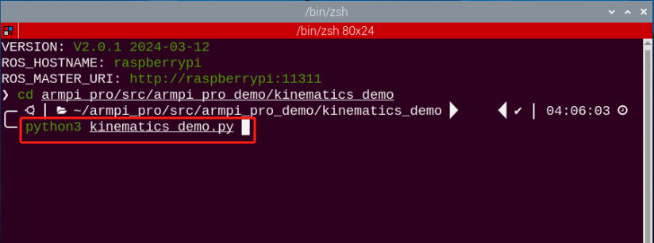

# 机械臂正逆运动学基础课程

## 1. 机械臂坐标系的建立

### 1.1 坐标系介绍

描述空间位置、速度和加速度，大部分都是用笛卡尔坐标系，也就是大家熟知由三个互相垂直的坐标轴所组成的坐标系。当我们说绕某一个轴旋转多少角度时，正方向的确定使用右手定则，如下图：


### 1.2 位置、平移交换

位置是使用一个三维向量来表示，平移变换是坐标系空间位置的变换，可以用坐标系原点 O 的位置向量表示，如下图所示。多次平移变换也很简单，向量之间直接相加就可以求空间中一个点的位置在经过平移变换后的坐标系{B} 中的坐标。


### 1.3 角度/方向、旋转变换

相比于位置，方位的表示方法相对会麻烦一些。在讨论方位之前，有必要先说明一点：一个物体的三维位置和朝向，通常都会在物体上"附上"一个跟着它动跟着它转的坐标系，然后通过描述这个坐标系与参考坐标系的关系来描述这个物体。

描述一个物体在坐标系中的位置和朝向，可以等效理解为描述坐标系之间的关系。我们这里讲角度/方向表示法，只要讲两个坐标系之间的关系就可以了。 要知道一个坐标系相对于另一个坐标系如何旋转、旋转了多少，应该怎么做呢？我们先从二维的情况看起：


通过将坐标轴单位向量用参考坐标系表示，看图可以直接写出下列公式：


我们再定义一个2x2的矩阵：


显然，这个矩阵的每一列为坐标系B的坐标轴单位向量在坐标系中的表示，有了这个矩阵我们就能画出坐标系B的x轴y轴，确定B的唯一朝向。

### 1.4 旋转矩阵

空间三维朝向相对来讲更加复杂，因为平面上坐标的朝向只能有一个自由度，即绕垂直平面的轴旋转。而空间中物体的朝向会有三个自由度。不过如果我们从上图的第一种方法出发，就可以轻松写出一个3×3的R矩阵，我们称它为旋转矩阵：


这个式子表明从坐标系{B}到坐标系{A}的旋转矩阵中，每一列都是坐标系{B}的坐标轴单位向量在坐标系{A}中的表示。

## 2. 正运动学简要分析

### 2.1 DH参数介绍

DH参数就是一个用四个参数表达两对关节连杆之间位置角度关系的机械臂数学模型和坐标系确定系统。通过下文我们会看到，它通过限制原点位置和 X 轴的方向，人为减少了两个自由度，因此它只需要用四个参数即可定义为一个具有六自由度的坐标系。

DH选的四个参数都有非常明确的物理含义，如下：

1.  link length（连杆长度）：两个关节的轴（旋转关节的旋转轴，平移关节的平移轴）之间的公共法线长度

2.  link twist（连杆扭转）：一个关节的轴相对于另一个关节的轴绕它们的公共法线旋转的角度

3.  link offset（连杆偏移）：一个关节与下一个关节的公共法线和它与上一个关节的公共法线沿这个关节轴的距离

4.  joint angle（关节转角）：一个关节与下一个关节的公共法线和它与上一个关节的公共法线绕这个关节轴的转角

以上定义看了很绕口，但是结合坐标系看就会清楚许多。

首先你应该注意到最重要的两条"线"：一个关节的轴（axis），和一个关节的轴与相邻关节的轴之间的公共法线（common normal）。

在 DH 参数体系里，我们把 axis 定为 z 轴；common normal 定为 x 轴，且 x 轴的方向为：从本关节指向下一个关节。

当然，仅仅这两个规则还不足以完全确定每个关节的坐标系。下面我们就来详细讲确定坐标系的步骤。

在机械臂的仿真等应用中，我们也常常会采取其他方法来确立坐标系，但是掌握这里讲的方法，对你理解机械臂的数学表达和理解我们后续的分析是很有必要的。

下图是两个典型的机器人关节。虽然这种关节和连杆不一定与任何实际机器人的关节和连杆相似，但是他们非常常见，且能很容易地表示实际机器人地任何关节。


### 2.2 坐标系确定

确定坐标系，一般有以下几个步骤：

为了用DH表示法对机器人进行建模，第一件事是为每个关节指定一个本地地参考坐标系，因此对于每个关节都必须指定一个Z轴和X轴。

指定Z轴，如果关节是旋转地，Z轴位于按右手规则旋转的方向。绕Z轴的旋转角是关节的变量；如果关节是滑动关节，则Z轴为沿直线运动的方向。沿Z轴的连杆长度d是关节变量。

指定X轴，当两关节不平行或相交时，Z轴通常是斜线，但总有一条距离最短的公垂线，它正交于任意两条斜线。在公垂线方向上定义本地参考坐标系的X轴。如果a n表示Zn1之间的公垂线，则Xn的方向将沿an 。

当然也有特殊情况。当两关节的Z轴平行，就会有无数条公垂线。此时可挑选与前一关节的公垂线共线的一条，可简化模型；两关节相交，他们之间没有公垂线，这时可将垂直于两条轴线构成的平面的直线定义为 X 轴，可简化模型。

给每个关节都附上对应坐标系之后，如下图所示：


确定好坐标系后，我们可以用更简洁的方法来表示上面很绕口的四个参数：

link length（连杆长度）*α*<sub>i-1</sub> ：沿 X<sub>i-1</sub> 的 Z<sub>i-1</sub> 到 Z<sub>i</sub> 的距离

link twist（连杆扭转）*α*<sub>i-1</sub> ：Z<sub>i</sub> 相对于Z<sub>i-1</sub>绕 X<sub>i-1</sub>旋转的角度

link offset（连杆偏移） *d*i ：沿 *Zi*的 *Xi*−1到 *Xi*的距离

joint angle（关节转角）θ<sub>i</sub> ： X<sub>i</sub> 相对于 X<sub>i-1</sub> 绕 Z<sub>i</sub>

接下来我们就可以写出机械臂的 DH 参数表了：

|  i  | α<sub>i-1</sub> | a<sub>i-1</sub> | d<sub>i</sub> | θ<sub>i</sub> |
|:---:|:---------------:|:---------------:|:-------------:|:-------------:|
|  1  |        0        |        0        |       d       | θ<sub>0</sub> |
|  2  |       90        |        0        |       0       | θ<sub>1</sub> |
|  3  |        0        |  l<sub>1</sub>  |       0       | θ<sub>2</sub> |
|  4  |        0        |  l<sub>2</sub>  |       0       | θ<sub>3</sub> |
|  5  |        0        |  l<sub>3</sub>  |       0       |       0       |

根据公式：


我们能一次计算每个关节，最后得到机械臂的正运动学公式：


得到各关节的旋转矩阵后即可根据下面公式得到末端的坐标：


## 3. 逆运动学简要分析

### 3.1 逆运动学简介

逆运动学是决定要达成所需要的姿势所要设置的关节可活动对象的参数的过程。

机械臂的逆运动学问题是其轨迹规划与控制的重要基础，逆运动学求解是否快速准确将直接影响到机械臂轨迹规划与控制的精度，因此针对六自由度机械臂，设计一种快速准确的逆运动学求解方法是十分重要的。

### 3.2 逆运动学简析

对于机械臂而言，就是给出夹持器的位置和朝向后求出每个关节的旋转角度。机械臂的三维运动是比较复杂的，这里为了简化模型，我们去掉下方云台的旋转关节，这样就可以在二维的平面上进行运动学分析了。

进行逆运动学分析一般要进行大量的矩阵运算，过程复杂计算量大所以实现起来较难。为了更好的适应我们的需要，我们使用几何法对机械臂进行分析。


我们将机械臂的模型简化，去掉底座云台，和执行器部分得到机械臂的主体。从上图可以看到机械臂的端点P的坐标（x,y），最终由三个部分组成（x1+x2+x3，y1+y2+y3）。

其中上图的θ1，θ2 ，θ3就是我们要求解的舵机的角度，α是爪子与水平面的夹角。从图上来看显然爪子的俯视角度α=θ1+θ2+θ3，据此我们可以列出下式：


其中x，y由使用者给出，l1、l2、l3为机械臂的机械结构固有属性。

为了方便计算，我们将已知部分处理一下，作整体考虑：


将m、n代入已有方程，再化简可得：


通过计算可得：


我们看到上式为一元二次方程的求根公式，其中：


据此我们可以求出θ1的角度，同理我们也可以求出θ2。由此我们便可求出三个舵机的角度，然后根据角度控制舵机即可实现坐标位置的控制。

### 3.3 逆运动学程序位置

逆运动学程序已经封装好了，路径查看可在容器中的"**/home/ubuntu/armpi_pro/src/armpi_pro_kinematics/kinematics/**"中找到，详细代码说明可参考对应程序注释即可


## 4. 机械臂XYZ三轴移动

:::{Note}
可在本节文件夹下观看演示效果。
:::

### 4.1 实验原理

前面的课程讲述了建立机械臂坐标系、正运动学分析、逆运动学分析，本节课进行运动学的实战应用。

首先回到初始位置，确定初始位置机械臂的坐标系。然后利用逆运动学控制机械臂的运动，主要利用机械臂新坐标，计算机械臂俯仰角的解，然后利用俯仰角的解设置舵机角度。

该程序的源代码位于Docker容器中的：**/home/ubuntu/armpi_pro/src/armpi_pro_demo/kinematics_demokinematics_demo.py**


### 4.2 玩法开启及关闭

:::{Note}
指令的输入需严格区分大小写，另外可按键盘"Tab"键进行关键词补齐。
:::

1)  将设备开机，并参照课程资料的"**[远程工具安装及容器进入方法\1. 远程桌面工具安装与连接]()**"内容，通过VNC远程连接工具连接。


2)  点击系统桌面左上角的图标，打开Terminator终端。


3)  输入进入玩法程序所在目录的指令"**cd armpi_pro/src/armpi_pro_demo/kinematics_demo/**"，并按下回车。成功进入后，终端会打印提示。

```commandline
cd armpi_pro/src/armpi_pro_demo/kinematics_demo/
```


4)  输入启动玩法程序的指令"**python3 kinematics_demo.py**"，并按下回车。成功进入后，终端会打印提示。

```commandline
python3 kinematics_demo.py
```



5)  如需关闭此玩法，只需在终端界面按下"Ctrl+C"。如果关闭失败，可多次按下。

### 4.3 功能实现

玩法开启后，机械臂先回到初始位置，然后机械臂沿X轴移动到0.15米处，返回初始位置，接着沿Y轴向前移动到0.2米处，返回初始位置，最后沿Z轴向上移动到0.24米处，返回初始位置。

### 4.4 程序简要分析

本小节课程文档对应程序的源代码位于Docker容器中的：

**/home/ubuntu/armpi_pro/src/armpi_pro_demo/kinematics_demo/kinematics_demo.py**

:::{Note}
在程序修改前务必将原有出厂程序进行备份，再进行修改，禁止直接在源代码文件中进行修改，避免以错误的方式修改参数之后导致机器人异常且无法修复！！！
:::

- #### 4.4.1 导入参数模块

| **导入模块** | **作用** |
|----|----|
| import sys | 导入了Python的sys模块，用于访问系统相关的功能和变量 |
| import time | 导入了Python的time模块，用于时间相关的功能，例如延时操作 |
| import rospy | 导入了ROS的Python库rospy，用于与ROS系统进行通信和交互 |
| from kinematics import ik_transform | 从 kinematics 模块导入 ik_transform 函数。用于进行逆运动学变换 |
| from armpi_pro import bus_servo_control | 从 armpi_pro 模块导入 bus_servo_control 模块。包含与舵机控制相关的函数和方法 |
| from hiwonder_servo_msgs.msg import MultiRawIdPosDur | hiwonder_servo_msgs.msg 模块导入 MultiRawIdPosDur 消息类型。用于控制舵机设备 |

这里主要用到了运动学相关的库"**kinematics**"。

此处调用已经封装好的逆运动学程序。


- #### 4.4.2 功能逻辑

根据实现效果，梳理该玩法的实现逻辑如下图所示：


首先初始化运动学节点，创建一个舵机发布者，设置好机械臂的初始位置，接着驱动机械臂运动。

- #### 4.4.3 程序逻辑及对应的代码分析

从程序文件梳理得到程序逻辑流程图如下图所示。


- 初始化节点


注册一个回调函数 stop，当ROS节点即将关闭时会自动调用此回调函数。


创建了一个名为 joints_pub 的 ROS 发布者（Publisher），用于发布消息到 **/servo_controllers/port_id_1/multi_id_pos_dur** 主题。


- 设置初始位置


根据给定坐标、俯仰角和俯仰角范围计算出给定俯仰角的解α（alpha）。

第一个参数："**(0.0，0.12，0.15)**"是在XYZ三轴上的位置；

第二个参数："**-90**"是俯仰角。

第三个参数："**-180**"是俯仰角范围。

第四个参数："**0**"是俯仰角范围。

- 运动学求解

判断计算俯仰角是否有解，有解则可以对舵机进行控制。利用计算俯仰角得到的脉冲宽度赋值给"**servo_data**"，设置1、2、3、4、5、6这六个舵机角度，达到控制舵机移动的目的。


- 驱动机械臂移动

bus_servo_control.set_servos(joints_pub, 1.5, ((1, 200), (2, 500), (3, servo_data\['servo3'\]), (4, servo_data\['servo4'\]),(5, servo_data\['servo5'\]),(6, servo_data\['servo6'\])))括号内的参数含义如下：

第一个参数"**joints_pub**"是发布舵机控制节点消息；

第二个参数："**1.5**"是运行时间。

第三个参数："**( (3, servo_data\['servo3'\]), (4, servo_data\['servo4'\]), (5, servo_data\['servo5'\]), (6, x_dis)**"，其中"3"是舵机编号，"**servo_data\['servo3'\]"是舵机角度，"(4, servo_data\['servo4'\]), (5, servo_data\['servo5'\]), (6, x_dis)**"同理。


- 回到初始位置


## 5. 机械臂与车体联动

### 5.1 实验原理

本节课将前面第四课的基础上增加底盘的移动。课程中，在改变机器人的机械臂姿态后，同时让机器人底盘移动，从而达到保持机器人的机械臂末端位置不动的效果。

设置时，根据逆运动学原理，通过调节坐标Y轴的数值，转换为ID为3、4、5和6舵机的数值调节，达到调节机械臂的末端位置不动的效果。

底盘设置成移动模式，根据机械臂的姿态变化，调节对应的移动位置。

该程序的源代码位于Docker容器中的：**/home/ubuntu/armpi_pro/src/object_tracking/scripts/linkage.py**


### 5.2 玩法开启及关闭

:::{Note}
指令的输入需严格区分大小写，另外可按键盘"Tab"键进行关键词补齐。
:::

1)  将设备开机，并参照课程资料的"**[远程工具安装及容器进入方法\1. 远程桌面工具安装与连接]()**"内容，通过VNC远程连接工具连接。


2)  点击系统桌面左上角的图标，打开Terminator终端。


3)  输入进入玩法程序所在目录的指令"**cd armpi_pro/src/armpi_pro_demo/kinematics_demo/**"，并按下回车。成功进入后，终端会打印提示。

```commandline
cd armpi_pro/src/armpi_pro_demo/kinematics_demo/
```


4)  输入启动玩法程序的指令"**python3 linkage.py**"，并按下回车。成功进入后，终端会打印提示。

```commandline
python3 linkage.py
```


5)  如需关闭此玩法，只需在终端界面按下"Ctrl+C"。如果关闭失败，可多次按下。

### 5.3 功能实现

玩法开启后，机器人的机械臂反复改变姿态进行收缩和伸展，机器人的底盘随之改变位置进行前后的移动，使机器人的机械臂的末端位置保持不变，达到机械臂底盘的联动效果。

### 5.4 程序简要分析

本小节课程文档对应程序的源代码位于Docker容器中的：

**/home/ubuntu/armpi_pro/src/armpi_pro_demo/kinematics_demo/linkage.py**

:::{Note}
在程序修改前务必将原有出厂程序进行备份，再进行修改，禁止直接在源代码文件中进行修改，避免以错误的方式修改参数之后导致机器人异常且无法修复！！！
:::

- #### 5.4.1 导入参数模块

| **导入模块** | **作用** |
|----|----|
| import sys | 导入了Python的sys模块，用于访问系统相关的功能和变量 |
| import time | 导入了Python的time模块，用于时间相关的功能，例如延时操作 |
| import rospy | 导入了ROS的Python库rospy，用于与ROS系统进行通信和交互 |
| from kinematics import ik_transform | 从 kinematics 模块导入 ik_transform 函数。用于进行逆运动学变换 |
| from armpi_pro import bus_servo_control | 从 armpi_pro 模块导入 bus_servo_control 模块。包含与舵机控制相关的函数和方法 |
| from hiwonder_servo_msgs.msg import MultiRawIdPosDur | hiwonder_servo_msgs.msg 模块导入 MultiRawIdPosDur 消息类型。用于控制舵机设备 |

- #### 5.4.2 功能逻辑

根据实现效果，梳理该玩法的实现逻辑如下图所示：


首先初始化运动学节点，创建舵机和底盘发布者，设置好机械臂的初始位置。判断计算俯仰角是否有解，有解则可以对舵机进行控制，机器人的机械臂反复改变姿态进行收缩和伸展，机器人的底盘随之改变位置进行前后的移动，使机器人的机械臂的末端位置保持不变。

- #### 5.4.3 程序逻辑及对应的代码分析

从程序文件梳理得到程序逻辑流程图如下图所示。


- 初始化节点


注册一个回调函数 stop，当ROS节点即将关闭时会自动调用此回调函数。


创建了一个名为 set_velocity 的 ROS 发布者（Publisher），用于发布消息到 **/chassis_control/set_velocity** 主题。

创建了一个名为 joints_pub 的 ROS 发布者（Publisher），用于发布消息到 **/servo_controllers/port_id_1/multi_id_pos_dur** 主题。


- 设置初始位置


根据给定坐标、俯仰角和俯仰角范围计算出给定俯仰角的解α（alpha）。

第一个参数："**(0.0，0.12，0.15)**"是在XYZ三轴上的位置；

第二个参数："**-90**"是俯仰角。

第三个参数："**-180**"是俯仰角范围。

第四个参数："**0**"是俯仰角范围。

- 底盘运动学实现分析

底盘运动使用函数set_velocity.publish()控制机器人的底盘不断进行移动。


以代码"**set_velocity.publish(80,270,0)**"为例；

第一个参数"**80**"是线速度；

第二个参数"**270**"是方向角；

第三个参数"**0**"是偏航角速度（小于0时，为顺时针方向）。

- 机械臂逆运动学实现分析

在进行逆运动学求解之前，需要先将相关的库导入：


在机械臂移动前需要先通过逆运动学计算出机械臂位置。


逆运动学求解以代码"**target = ik.setPitchRanges((0.0, 0.20, 0.20), -90, -180, 0)**"为例。

第一个参数"**(0,** **0.20,** **0.20）**"，"**0**"是X轴上的位置，"**0.20**"是Y轴上的位置，"0.20"是Z 轴上的位置；

第二个参数："**-90**"是俯仰角。

第三个参数："**-180**"是俯仰角范围。

第四个参数："**0**"是俯仰角范围。

在控制机械臂移动之前，需要先将相关的库导入：


在机械臂底盘联动程序中，通过调用bus_servo_control.set_servos()函数，可以控制机械臂移动到目标位置。


机械臂控制以代码："**bus_servo_control.set_servos(joints_pub, 1.8, ((1, 200), (2, 500), (3, servo_data\['servo3'\]),(4, servo_data\['servo4'\]),(5, servo_data\['servo5'\]),(6, servo_data\['servo6'\])))**"为例。

第一个参数"**joints_pub**"是发布舵机控制节点消息；

第二个参数："**1.8**"是运行时间。

第三个参数："**( (1,200),(2,500),(3, servo_data\['servo3'\]), (4, servo_data\['servo4'\]), (5, servo_data\['servo5'\]), (6, x_dis)**"，其中"**1**"是舵机编号，"**200**"是舵机角度，"**(2,500),(3, servo_data\['servo3'\]),(4, servo_data\['servo4'\]), (5, servo_data\['servo5'\]), (6, x_dis)**"同理。

### 5.5 逆运动学计算

逆运动学的计算过程需要使用大量的矩阵运算，由于篇幅过长，这里不做详细讲解。但是为了让大家更好地理解逆运动学原理，此处使用几何法对机械臂进行分析。


将机械臂的模型简化，去掉底座云台和执行器部分，得到机械臂的主体。由上图可得，机械臂的端点P的坐标（x,y），也可看作是（x1+x2+x3，y1+y2+y3）。

图中的θ1、θ2、θ3即为需要求解的舵机角度，α是爪子与水平面的夹角。由上图可知，爪子的俯视角度α=θ1+θ2+θ3，据此可以列出下式：


其中，x、y由使用者给定，l1、l2、l3为机械臂的机械结构固有属性。

为了方便计算，将已知部分处理一下，作整体考虑：


将m、n代入已有方程，再化简可得：


通过计算可得：


上式为一元二次方程的求根公式，其中：


据此可以求出θ1的角度，同理可得θ2和θ3，由此便解得三个舵机的角度。
