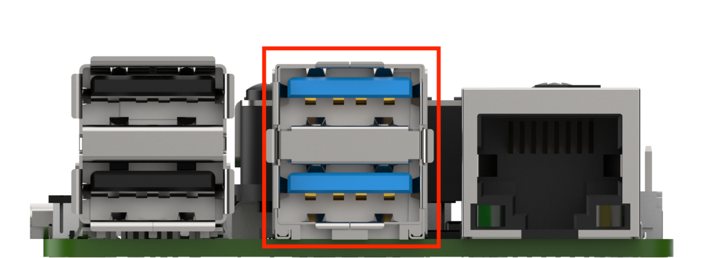
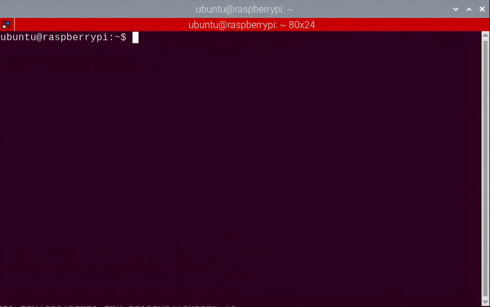
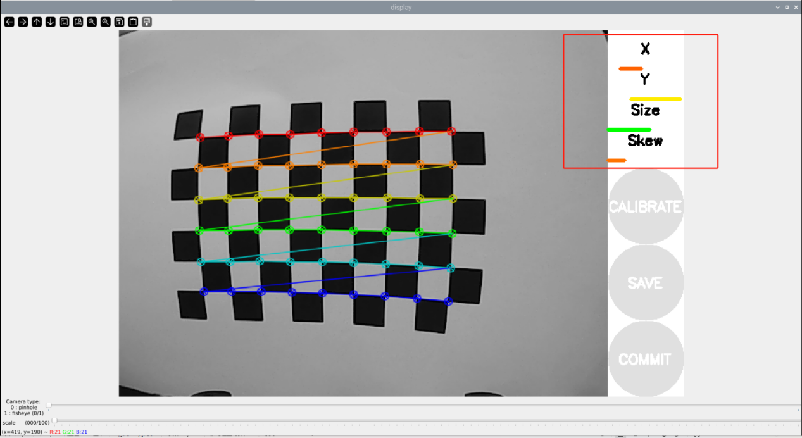
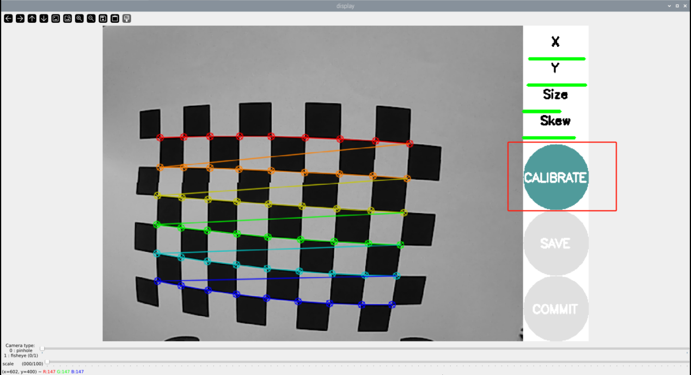
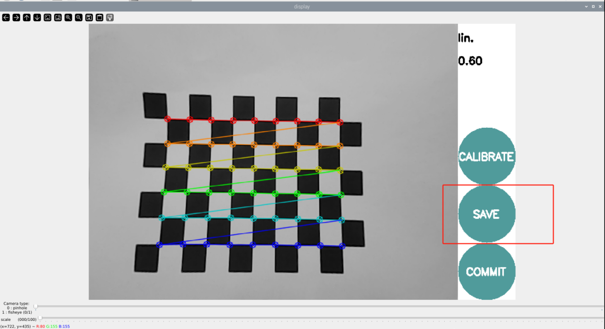
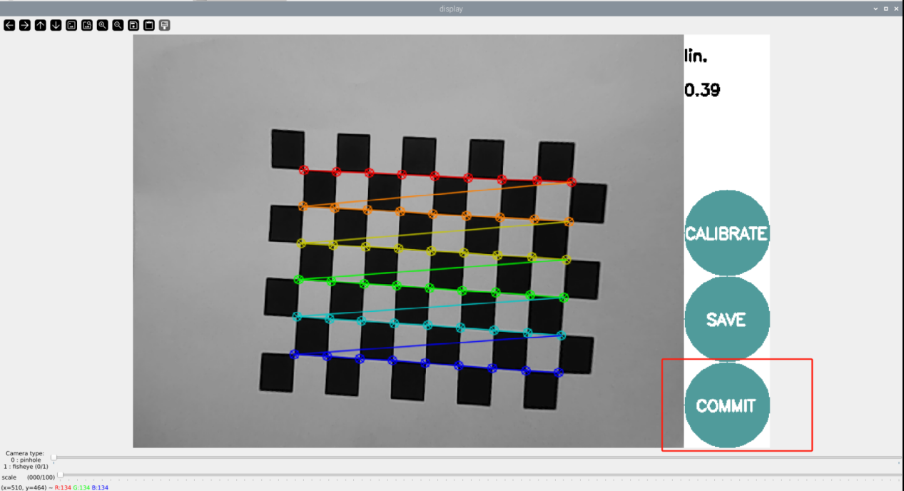

# 7. Monocular Camera Lesson

## 7.1 Monocular Camera Usage

ArmPi FPV is loaded with a USB monocular camera for obtaining camera image. The monocular camera has perception, panoramic, and monitoring functions. Compared with other types of cameras, it has advantages such as low latency, low jitter and plug-and-play capabilities. Furthermore, their compact and lightweight design, as well as high performance make monocular cameras a popular choice for industrial design.

This lesson will connect monocular camera to Raspberry Pi to explain the basic use of camera. 

### 7.1.1 Connect Camera

Connect monocular camera to any USB ports on Raspberry Pi board. It is recommended to connect to USB3.0 port (blue) for higher transmission rate, as shown in the picture below:



### 7.1.2 Start and Close the Game

:::{Note}
The entered command should be case sensitive, and "**Tab**" key can be used to complement key words.
:::

(1) Power on the robot and use VNC Viewer to connect to the remote


(2) Click the left upper corner icon  on the desktop to open the Terminator terminal.



(3) Enter command and press Enter to close the APP auto-start service. 

```bash
sudo ./.stop_ros.sh
```

(4) Enter command and press Enter to turn on camera program file path.

```bash
cd /home/ubuntu/course/vision_course/
```

(5) Enter command and press Enter to turn on camera.

```bash
python3 camera_display.py
```

(6) If want to disable camera image, press "**Ctrl+C**" on terminal. Please try multiple times if fail to disable.

(7) Click the icon  on the upper left corner of the desktop (Note: the command needs to be entered in the system path rather than in the Docker container to start the app service), and input command in the system path and press Enter to start APP service. Wait for the robotic arm to return to its initial position, and the buzzer will beep once.

```bash
sudo systemctl restart start_node.service
```

### 7.1.3 Project Outcome

After starting program, the camera image will display on screen.

### 7.1.4 Program Parameter Analysis

The relevant source code of monocular camera is stored in ： [/home/ubuntu/course/vision_course/camera_display.py](../_static/source_code/camera_display.zip)

* **Read Camera** 

Read camera with the `VideoCapture()` function in cv2 library.

```python
cap = cv2.VideoCapture(-1) #读取摄像头(read camera)
```

* **Read and Display Frame** 

```python
while True:
    ret, frame = cap.read()
    if ret:
        cv2.imshow('frame', frame)
        key = cv2.waitKey(1)
        if key == 27:
            break
    else:
        time.sleep(0.01)
```

Call read method to read camera image, and then call imshow method to display image. Take `cv2.imshow('frame', frame)` as example. The meaning of the augments in brackets is as follow.

The first argument `frame` denotes the title of the display frame.

The second argument `frame` is the camera image.

## 7.2 Camera Calibration

:::{Note}
before starting camera calibration, please print the chessboard picture in the same folder with this document in advance. To remain the smoothness of the picture, it is recommended to use a thick paper or fix the paper with heavy object.
:::

Due to the irregular camera lens, the image captured will be affected by the lens causing distortion. In this circumstance, the image data obtained is not accurate enough so the camera needs to be calibrated manually to minimize the impact. Besides, the camera calibrate can also obtain the internal and external parameters of camera, which will be applied in image reconstruction of 3D scenes.

### 7.2.1 Start and Close the Game

:::{Note}
the input command should be case sensitive, and keywords can be complemented by "**Tab**" key.
:::

(1) Power on the robot and use VNC Viewer to connect to the remote desktop.


(2) Click the icon  in the upper left corner of the desktop to open Terminator terminal.


(3) Enter command and press Enter to close APP auto-start service.

```bash
sudo ./.stop_ros.sh
```

(4) Input command and press Enter to open the camera calibration program.

```bash
roslaunch armpi_fpv_bringup camera_calib.launch
```

(5) After starting the calibration program, place the chessboard horizontally in front of the camera. Keep the chessboard in a horizontal position and quickly move and tilt the chessboard image in front of the camera. When multiple colored lines appear on the chessboard grid and the progress bar on the right side shows changes, it indicates that the calibration is in progress. During calibrating, you need to repeat this operation several times until the progress bar on the right side turns completely green.



In this case, the parameter "**x**" represents the left and right movements in the image field of view. We use it to shift the chessboard left or right. The parameter "**y**" represents the up and down movements in the image field of view. We use it to shift the chessboard up or down. The parameter "**size**" represents the orientation of the image and the distance from the camera. We use it to adjust the distance of the chessboard, either moving it closer or farther. The parameter "**scale**" represents the degree of tilting in the image. We use it to randomly tilt the image at different angles when it is in a horizontal position.

(6) Until the progress bars of the parameters "**x**", "**y**" and "**scale**" turn green on the right, and the "**CALIBRATE**" icon is also displayed in green, it indicates that the calibration is complete, as as shown in the following figure



(7) Then click "**calibrate**" to start computing calibration.

:::{Note}
the duration of the calibration process is determined by the numbers of calibration images. The more images required, the longer the process will take.
:::

(8) After calibration is complete, try to move the chessboard picture within the display to check if it is straight and click "**commit**".




