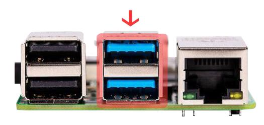
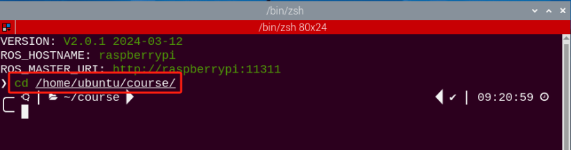

# 单目相机课程

## 1. 单目相机的基本使用

机器人搭载了一个USB单目相机，用来 获取图像的回传画面，相当于机械臂的"眼睛"。单目相机具备了感知功能、环视功能、监测功能，相比其他类型的相机，具有低延迟、低抖动，即插即用等优点，不仅如此，小巧轻便的外形和性价比高的特点，更让单目相机成为了工业设计的热门之选。

本节以树莓派主板开启摄像头，获取回传画面为例 ，简单说明单目相机的基本使用。

### 1.1 连接主板

单目相机可接入树莓派主板中的任意一个USB接口，但为了提高传输速率，这里建议接入3.0接口（蓝色），如下图所示：



### 1.2 开启方法

:::{Note}
输入指令时需要严格区分大小写，且可使用"**Tab**"键补齐关键词。
:::

1)  将设备开机，并参照课程资料的"**[远程工具安装及容器进入方法\1. 远程工具安装与连接]()**"内容，通过VNC远程连接工具连接。


2)  点击系统桌面左上角的图标，打开Terminator终端。


3)  输入指令按下回车，关闭手机APP自启服务。

```commandline
sudo ./.stop_ros.sh
```


4)  接着输入，并按下回车，即可进入打开摄像头程序文件的路径。

```commandline
cd/home/ubuntu/course/
```



5)  再输入指令，回车，即可打开摄像头。

```commandline
python3 camera_display.py
```


6)  如需关闭回传，在终端界面同时按下"**Ctrl+C**"即可，若关闭失败，可重复按下。

7)  点击桌面左上角终端图标（**注意：需要在系统路径下输入指令，而不是在docker容器中输入开启APP服务的指令**），在系统路径下输入 按下回车，启动APP服务，等待机械臂恢复至初始姿态，蜂鸣器"滴"一声即可。

```commandline
sudo systemctl restart start_node.service
```


### 1.3 实现效果

玩法开启后，屏幕上会出现摄像头的回传画面。


### 1.4 程序参数说明

开启摄像头的源代码位于：**/home/ubuntu/course/camera_display.py**


- **读取摄像头**

我们通过从cv2库中的VideoCapture()函数来读取摄像头。


- **读取和显示图像**


先调用read方法读取视频画面的图像，再调用imshow方法显示图像，以代码"**cv2.imshow('frame', frame)**"为例，函数括号内的参数含义如下：

第一个参数"**'frame'**"是显示窗口的标题。

第二个参数"**frame**"是传入的画面图像。

## 2. 相机标定

:::{Note}
开始前需提前将同目录下的棋盘图片打印准备好，为了让棋盘图案保持平整性，所以建议使用纸壳或者硬质平整的物品将棋盘固定。
:::

由于相机本身的镜头会有内凹或外凸，在利用相机取得图像时，图像也会被镜头影响造成畸变，这样取得的图像数据就不够准确，所以需要手动进行标定，减小影响。除此之外，相机标定还可以求出相机的内外参数，这个参数会在图像重构三维场景使用。

### 2.1 标定方法

:::{Note}
输入指令时需要严格区分大小写，且可使用"**Tab**"键补齐关键词。
:::

1)  将设备开机，并参照课程资料的"**[远程工具安装及容器进入方法\1. 远程工具安装与连接]()**"内容，通过VNC远程连接工具连接。


2)  点击系统桌面左上角的图标，打开Terminator终端。


3)  输入指令按下回车，关闭手机APP自启服务。

```commandline
sudo ./.stop_ros.sh
```


4)  输入指令按下回车，开启相机标定程序。

```commandline
roslaunch armpi_pro_bringup camera_calib.launch
```


5)  开启标定程序后，将棋盘横置于镜头正前方，在镜头前保持棋盘横置并快速移动和倾斜棋盘图片，当棋盘格出现多种颜色线条，并且右侧参数进度条有变化时，则表明正在标定中，在标定过程中，我们需要重复多次此操作，直至右侧参数进度条全部变绿。


其中,参数"x"是图像视野中的左和右,我们需要将棋盘左右移动；参数"y"是图像视野中的上和下，我们需要将棋盘上下移动；参数"size"是图像朝向和相机的距离，我们需要将棋盘拿远或拿近；参数"scale"是图像的倾斜程度，我们需要将图像在横置的状态下随机角度的倾斜。

6)  直到右边x，y，size和scale参数进度都变绿色，并且"CALIBRATE"图标显示绿色，此时表示标定完成，如下图所示：


7)  然后点击"calibrate"按钮，开始计算标定。

:::{Note}
计算标定的时常会根据标定图片的数量而定，需要的图片越多则时间越长。
:::

8)  程序计算标定完后，可以尝试在画面中移动棋盘图像，查看图像是否笔直显示，确认没问题后即可点击"commit"按钮提交保存标定数据。


