# 8. ROS+OpenCV Course

## 8.1 Color Recognition

### 8.1.1 Program Logic

Let's learn about the overall process of this section.

**Step 1: Obtain camera image**

Process the live camera feed via OpenCV.

**Step 2: Image binarization**

Convert all pixels in the image to 0 and 1 using OpenCV. Pixels with a value of 0 are represented as black, and pixels with a value of 1 are represented as white.

**Step 3: Erosion and dilation**

Erosion is performed to remove any jagged edges or noise from the image. Dilation expands the image edges to fill in any non-target pixels around the object.

**Step 4: Locate contour** 

Determine the position of the object's contour by separating the black and white areas in the image.

**Step 5: Enclose identified color objects**

Identify color objects (red, green, and blue) and convert their coordinates to the unscaled size. Then, determine if they are the largest color object.

### 8.1.2 Operation Steps

:::{Note}
The input command is case-sensitive, and keywords can be completed using the Tab key.
:::

(1) Start the robot, and connect it to the system desktop using VNC.


(2) Click-on  to open the command-line terminal. Enter the following command and hit Enter to disable the app auto-start service.

```bash
sudo ./.stop_ros.sh
```

(3) Execute the command to navigate to the directory where the game program is located.

```bash
cd course
```

(4) Run the following command to execute the program.

```bash
python3 color_recognition.py
```

(5) If you want to disable the program, please press "**Ctrl+C**". If it fails, try again.

(6) After running the program, you can enable the app service by using a command or restarting the robot. If the app service is not enabled, the related app functions will be inactive. If the robot is restarted, the app service will be automatically activated.

(7) click and enter the following command. Press "**Enter**" to start the app. Wait for the robotic arm to return to its initial posture and the buzzer to beep.

:::{Note}

please enter the command in the system path, not in the Docker container. 

:::

```bash
sudo systemctl restart start_node.service
```

### 8.1.3 Project Outcome

:::{Note}
Please perform the operation on a pure background and avoid moving the color block too quickly.
:::

After running the program, the robotic arm will perform color recognition on objects within its visual range. When an object in the color of red, green, or blue is recognized, it will be highlighted in the live camera feed.

### 8.1.4 Program Analysis

The source code of program is located in：[/home/ubuntu/course/color_recognition.py]()

The color recognition program mainly uses the functions `inRange()`, `findContours()`, and  `morphologyEx()` from the `cv2` library, as well as the `setPixelColor()` function from the `Board` library.

(1) The `inRange()` function is used for binarizing the input image. The first parameter within the parentheses is the input image. The second and third parameters specify the lower and upper thresholds, respectively. If the RGB color values of a pixel fall within the defined range, the pixel is set to 1; otherwise, it is set to 0.

{lineno-start=63}

```python
            frame_mask = cv2.inRange(frame_lab,
                                         (lab_data[i]['min'][0],
                                          lab_data[i]['min'][1],
                                          lab_data[i]['min'][2]),
                                         (lab_data[i]['max'][0],
                                          lab_data[i]['max'][1],
                                          lab_data[i]['max'][2]))  #对原图像和掩模进行位运算(perform bitwise operations on the original image and the mask)
```

(2) The `findContours()` function detects the target contours in the image. The first parameter inside the parentheses is the input image. The second parameter represents the contour retrieval mode. The third parameter indicates the contour approximation method.

{lineno-start=72}

```python
contours = cv2.findContours(closed, cv2.RETR_EXTERNAL, cv2.CHAIN_APPROX_NONE)[-2]  # 找出轮廓(find out contour)
```

(3) The `morphologyEx()` function is employed for morphological transformations. The first parameter is the input image data. The second parameter specifies the type of transformation. The third parameter denotes the size of the frame box.

{lineno-start=70}

```python
            opened = cv2.morphologyEx(frame_mask, cv2.MORPH_OPEN, np.ones((3, 3), np.uint8))  # 开运算(opening operation)
            closed = cv2.morphologyEx(opened, cv2.MORPH_CLOSE, np.ones((3, 3), np.uint8))  # 闭运算(closing operation)
```

(4) The`setPixelColor()` function controls the RGB lights on the expansion board.

{lineno-start=24}

```python
def set_rgb(color):
    if color == "red":
        board.set_rgb([[1, 255, 0, 0], [2, 255, 0, 0]])
    elif color == "green":
        board.set_rgb([[1, 0, 255, 0], [2, 0, 255, 0]])
    elif color == "blue":
        board.set_rgb([[1, 0, 0, 255], [2, 0, 0, 255]])
    else:
        board.set_rgb([[1, 0, 0, 0], [2, 0, 0, 0]])
```

Taking the example code `board.set_rgb([[1, 255, 0, 0],[2, 255, 0, 0]])`, the parameters within the parentheses have the following meanings:
The first parameter `1` represents the RGB light number. `1` corresponds to RGB1, and `2` represents RGB2.
The second parameter `[255, 0, 0]` determines the RGB color channel values. The `255`, `0`, and `0` respectively represent the values of R, G, and B. It is set to red.

## 8.2 Target Positioning

### 8.2.1 Program Logic

Firstly, before positioning the color block, it is necessary to use the Lab color space to perform color recognition. Start by converting the RGB color space to Lab. Then, proceed with operations such as binarization, opening and closing, obtaining contours containing only the target color. This helps to achieve color recognition.

Next, iterate through all the found contours of the target color and compare them to find the contour with the largest area. Retrieve the coordinates of the four corners of the target contour, and calculate the center coordinates.

Lastly, outline the target contour with a red bounding box. Display the coordinates of the contour's center point. Then, control the LED lights on the expansion board to light up corresponding color.

### 8.2.2 Operation Steps

:::{Note}
The input command is case-sensitive, and keywords can be completed using the Tab key.
:::

(1) Start the robot, and connect it to the system desktop using VNC.


(2) Click-on  to open the command-line terminal. Enter the following command and hit Enter to disable the app auto-start service.

```bash
sudo ./.stop_ros.sh
```

(3) Execute the command to navigate to the directory where the game program is located.

```bash
cd course
```

(4) Run the following command to execute the program.

```bash
python3 get_color_position.py
```

(5) If you want to disable the program, please press "**Ctrl+C**". If it fails, try again.

(6) After running the program, you can enable the app service by using a command or restarting the robot. If the app service is not enabled, the related app functions will be inactive. If the robot is restarted, the app service will be automatically activated.

(7) Click  and enter the following command. Press "**Enter**" to start the app. Wait for the robotic arm to return to its initial posture and the buzzer to beep once.

```bash
sudo systemctl restart start_node.service
```

### 8.2.3 Project Outcome

After running the program, the robotic arm moves to aim the camera directly at the front. In the live camera feed, when a red color block is recognized, it will be outlined in a bounding box. The x and y coordinates of the color block's center point will be displayed. The recognized color will be shown in the lower-left corner of the live camera feed.

### 8.2.4 Program Analysis

The source code of program is located in：[/home/ubuntu/course/get_color_position.py]()

{lineno-start=1}

```python
#!/usr/bin/python3
# coding=utf8
import os
import cv2
import math
import time
import numpy as np
from common.yaml_handle import get_yaml_data
from common.ros_robot_controller_sdk import Board

range_rgb = {
    'red':   (0, 0, 255),
    'blue':  (255, 0, 0),
    'green': (0, 255, 0),
    'black': (0, 0, 0),
    'white': (255, 255, 255),
    'None': (0, 0, 0)}
```

After obtaining the contour with the largest area, the minAreaRect() function from the cv2 library is called to obtain the minimum bounding rectangle of the contour. The point-set array or vector of the point coordinates are stored in the parenthesis.
Call the `boxPoints()` function to obtain the coordinates of the four corners for the target rectangle.

{lineno-start=82}

```python
        box = np.int0(cv2.boxPoints(rect))
```

For example, `box = np.int0(cv2.boxPoints(rect))` retrieves the coordinates of the four corners of the minimum bounding rectangle for the target contour. Using these coordinates, the center coordinates of the rectangle can be calculated.

## 8.3 Color Tracking

### 8.3.1 Program Description

Recognize the color and process it with Lab color space. Firstly, convert RGB color space to LAB and then perform binaryzation, dilation and erosion and other operations to obtain the outline of the target color. Then frame the contour of the color to complete color recognition.
Then process height of robotic arm after recognition. The coordinates (x,y,z) of center point of image take as the set value and the currently obtained coordinates are used as input value to update pid.
Then, calculate on the basis the feedback of image position. Finally, the coordinate value will change linearly through the change of the position, so as to achieve the effect of tracking. 

<p id="anchor_8_3_2"></p>

### 8.3.2 Operation Steps

:::{Note}
It should be case sensitive when entering command and the "**Tab**" key can be used to complete the keywords.
:::

<span id="3_enter_game"></span>

* **Enter Game** 

(1) Power on the robot and use VNC Viewer to connect to the remote desktop.


(2) Click  in the upper left corner of the system desktop to open the "**Terminator**".


(3) Enter the following command, and press "**Enter**" to access the color tracking game. After entering the game, the prompt shown in the following red box will appear.

```bash
rosservice call /color_tracking/enter "{}"
```

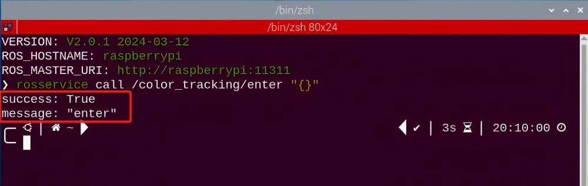

* **Start image transmission** 

(1) Start with browser

To avoid consuming too much running memory of Raspberry Pi. It is recommended to use an external browser to open the transmitted image. 
The specific steps are as follows:

① Select a browser. Take Google Chrome as example.


② Then enter the default IP address **"192.168.149.1:8080/"** (Note: this IP address is the default IP address for direction connection mode. If it is LAN mode, please enter "Device IP address：8080/" for example, "192.168.149.1:8080/") If fail to open, you can try it several times or restart camera.

:::{Note}
 If it is in LAN mode, the method to obtain device IP address can refer to "[**Robot Network Configuration Instruction**](https://docs.hiwonder.com/projects/ArmPi_Pro/en/latest/docs/15_network_configuration.html)"
:::


③ Then, click the option shown in the following figure to open the display window of the transmitted image.

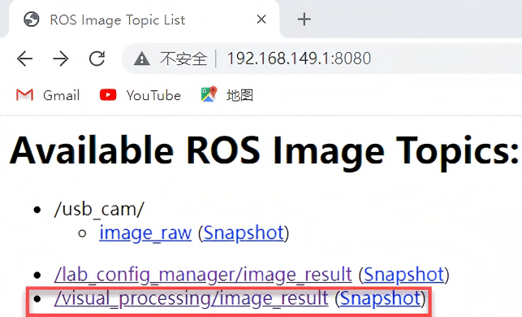


(2) Start with rqt 

① After completing the steps of "[**8.3.2 Operation Steps -> Enter Game**](#3_enter_game)" and do not exit the terminal, open a new terminal.

② Enter the following command and press "**Enter**" to open rqt.

```bash
rqt_image_view
```


③ Click the red box as the figure shown below, select "**/visual_processing/image_result**" for the topic of color tracking and remain other settings unchanged. 


:::{Note}
After opening image, the topic option must be selected. Otherwise, after starting game, the recognition process can not be displayed normally.
:::

<span id="3_start_game"></span>

* **Start Game**

(1) Now, enter the terminal according to the steps in "[**8.3.2 Operation Steps -> Enter Game**](#3_enter_game)" and input the following command. Then if the prompt shown in the following red box appears, which means game has been started successfully.

```bash
rosservice call /color_tracking/set_running "data: true"
```

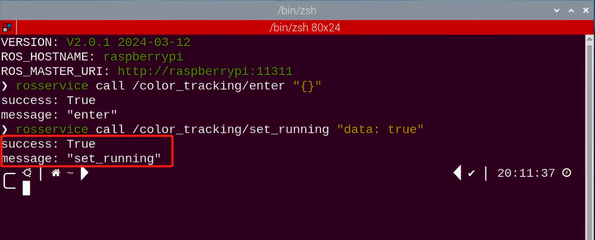

(2) After starting the game, select the target color. Take blue as example. Enter the following command. 

```bash
rosservice call /color_tracking/set_target "data: 'blue'"
```

:::{Note}
 If want to change to green or red, you can fill in green or red in "**data: ' '**" (The entered command should be case sensitive).
:::

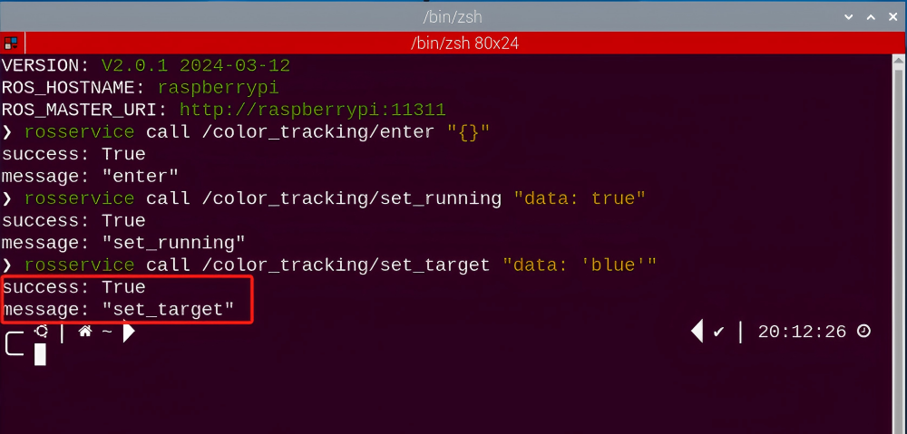

* **Stop and Exit** 

(1) If want to stop the game, enter the following command. After stopping, you can refer to the content of "[**8.3.2 Operation Steps -> Start Game**](#3_start_game)" to change the tracking color to green or red.

```bash
rosservice call /color_tracking/set_running "data: false"
```

(2) If want to exit the game, enter the command below to exit.

```bash
rosservice call /color_tracking/exit "{}"
```

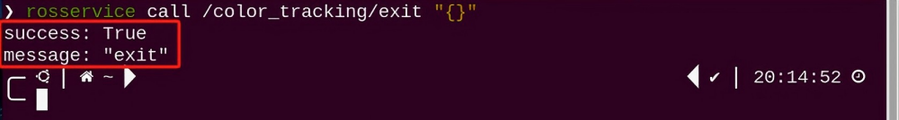

:::{Note}
Before exiting the game, it will keep running when Raspberry Pi is powered on. To avoid consume too much running memory of Raspberry Pi, you need to exit the game first according to the operation steps above before performing other AI vision games.
:::

(3) If want exit the image transmission, press "**Ctrl+C**" to return and open the terminal of rqt. If fail to exit, please keep trying several times.

### 8.3.3 Project Outcome

After starting game, place the blue block within the detected range of camera. The target color will be framed in rqt tool after recognition. At this time, move the block slowly. Then the robotic arm will move with the target color.

### 8.3.4 Program Analysis

The source code for the program corresponding to this section is located in the Docker container:

[/home/ubuntu/armpi_pro/src/visual_processing/scripts/visual_processing_node.py](../_static/source_code/visual_processing_node.zip)(image processing)

[/home/ubuntu/armpi_pro/src/color_tracking/scripts/color_tracking_node.py](../_static/source_code/color_tracking_node.zip)(tracking control)

:::{Note}
please back up the initial program before making any modifications. It is prohibited editing the source code files directly to prevent making changes in an incorrect manner that could lead to robot malfunctions, rendering them irreparable.
:::

* **Import Parameter Module**

| **Imported Module**                                  | **Function**                                                 |
| ---------------------------------------------------- | ------------------------------------------------------------ |
| import sys                                           | The sys module of Python is imported to access to system-related functionalities and variables. |
| import cv2                                           | The OpenCV library of Python is imported to perform image processing and computer vision-related functions. |
| import time                                          | The time module of Python is imported to perform time-related functionalities, such as delay operations. |
| import math                                          | The math module of Python is imported to perform mathematical operations and functions. |
| import rospy                                         | The Python library rosy is imported for  communication and interaction with ROS. |
| import numpy as np                                   | The NumPy library is imported and is renamed as np for performing array and matrix operations. |
| from armpi_pro import Misc                           | The Misc module is imported from arm_pi_pro package to handle the recognized rectangular data. |
| from armpi_pro import apriltag                       | The apriltag module is imported from arm_pi_pro package  to perform Apriltag recognition and processing. |
| from threading import RLock, Timer                   | The "**RLock**" class and "**Timer**" class is imported from the threading module of Python for thread-related operations. |
| from std_srvs.srv import *                           | All service message types are imported from the std_srvs in ROS for defining and using standard service messages. |
| from std_msgs.msg import *                           | All message types are imported form the std_msgs package in ROS for defining and using standard messages. |
| from sensor_msgs.msg import Image                    | The image message type is imported from the sensor_msgs packages for processing image data. |
| from visual_processing.msg import Result             | The Result message type is imported from the visual_processing package for the message of image processing results. |
| from visual_processing.srv import SetParam           | The SetParam service type is imported from the visual_processing packages for using customs service related to parameter settings. |
| from sensor.msg import Led                           | The Led message type is imported form the sensor.msg module for controlling or representing the LED status on a sensor. |
| from chassis_control.msg import *                    | All message types are imported from the chassis_control.msg module, which indicated that all message types defined in this module is imported to perform the chassis control. |
| from visual_patrol.srv import SetTarget              | The SetTarget service type is imported from the visual_patrol.srv module is used to set a target for line following. |
| from hiwonder_servo_msgs.msg import MultiRawIdPosDur | The MultiRawIdPosDur message type is imported from the hiwonder_servo_msgs.msg module for controlling servos. |
| from armpi_pro import PID                            | The PID class is imported from thearmpi_pro module to perform PID algorithm. |
| from armpi_pro import bus_servo_control              | The bus_servo_control module is imported from the armpi_pro module, including the functions and methods related to the servo control. |
| from kinematics import ik_transform                  | The ik_transform function is imported from the kinematics module to perform conversion of inverse kinematics. |

(1) Initializing functions and variables

{lineno-start=229}

```python
	# 单颜色识别函数(single color recognition function)
def color_detect(img, color):
    global pub_time
    global publish_en
    global color_range_list
    
    if color == 'None':
        return img
    
    msg = Result()
    area_max = 0
    area_max_contour = 0
    img_copy = img.copy()
    img_h, img_w = img.shape[:2]
    frame_resize = cv2.resize(img_copy, size_m, interpolation=cv2.INTER_NEAREST)
    frame_lab = cv2.cvtColor(frame_resize, cv2.COLOR_BGR2LAB)  # 将图像转换到LAB空间(convert the image to LAB space)

    if color in color_range_list:
        color_range = color_range_list[color]
        frame_mask = cv2.inRange(frame_lab, tuple(color_range['min']), tuple(color_range['max']))  # 对原图像和掩模进行位运算(perform bitwise operation on the original image and the mask)
        eroded = cv2.erode(frame_mask, cv2.getStructuringElement(cv2.MORPH_RECT, (2, 2)))          # 腐蚀(erode)
        dilated = cv2.dilate(eroded, cv2.getStructuringElement(cv2.MORPH_RECT, (2, 2)))            # 膨胀(dilate)
        contours = cv2.findContours(dilated, cv2.RETR_EXTERNAL, cv2.CHAIN_APPROX_NONE)[-2]         # 找出轮廓(find contours)
        area_max_contour, area_max = getAreaMaxContour(contours)                                   # 找出最大轮廓(find the largest contour)

        if area_max > 100:  # 有找到最大面积(found the maximum area)
            (centerx, centery), radius = cv2.minEnclosingCircle(area_max_contour)  # 获取最小外接圆(obtain the minimum circumscribed circle)
            msg.center_x = int(misc.map(centerx, 0, size_m[0], 0, img_w))
            msg.center_y = int(misc.map(centery, 0, size_m[1], 0, img_h))
            msg.data = int(misc.map(radius, 0, size_m[0], 0, img_w))
            cv2.circle(img, (msg.center_x, msg.center_y), msg.data+5, range_rgb[color], 2)
```

(2) Binarization

Using the `inRange()` function from the cv2 library to perform binarization on image. 

{lineno-start=248}

```python
	        frame_mask = cv2.inRange(frame_lab, tuple(color_range['min']), tuple(color_range['max']))  # 对原图像和掩模进行位运算(perform bitwise operation on the original image and the mask)
```

The first parameter `frame_lab` is the input image;

The second parameter `tuple(color_range['min'])` is the lower limit of threshold;

The third parameter `tuple(color_range['max'])` is the upper limit of threshold.

(3) Dilation and erosion

To reduce interference and create smoother images, erosion and dilation processes are applied.

{lineno-start=249}

```python
	        eroded = cv2.erode(frame_mask, cv2.getStructuringElement(cv2.MORPH_RECT, (2, 2)))          # 腐蚀(erode)
        dilated = cv2.dilate(eroded, cv2.getStructuringElement(cv2.MORPH_RECT, (2, 2)))            # 膨胀(dilate)
```

erode() function is applied to erode image. Here uses an example of the code `eroded = cv2.erode(frame_mask, cv2.getStructuringElement(cv2.MORPH_RECT, (3, 3)))`. The meaning of parameters in parentheses are as follow:

The first parameter `frame_mask` is the input image.

The second parameter `cv2.getStructuringElement(cv2.MORPH_RECT, (3, 3))` is the structural elements and kernel that determines the nature of operation. The first parameter in parentheses is the shape of kernel and the second parameter is the size of kernel.

dilate() function is applied to dilate image. The meaning of parameters in parentheses is the same as the parameters of erode() function.

(4) Obtain the contour of the maximum area

After processing the above image, obtain the contour of the recognition target.  The findContours() function in cv2 library is involved in this process.

{lineno-start=251}

```python
	        contours = cv2.findContours(dilated, cv2.RETR_EXTERNAL, cv2.CHAIN_APPROX_NONE)[-2]         # 找出轮廓(find contours)
```

The `erode()` function is applied to erode. Take code "**contours = cv2.findContours(dilated, cv2.RETR_EXTERNAL, cv2.CHAIN_APPROX_NONE)\[-2\]**" as example.

The first parameter `dilated` is the input image.

The second parameter `cv2.RETR_EXTERNAL` is the contour retrieval mode.

The third parameter `cv2.CHAIN_APPROX_NONE)[-2]` is the approximate method of contour.
Find the maximum contour from the obtained contours. To avoid interference, set a minimum value. Only when the area is greater than this 
minimum value, the target contour will take effect. The minimum value 
here is  `100`.

{lineno-start=252}

```python
	        area_max_contour, area_max = getAreaMaxContour(contours)                                   # 找出最大轮廓(find the largest contour)

        if area_max > 100:  # 有找到最大面积(found the maximum area)
```

(5) Obtain the minimum enclosing circle and display it on the transmitted image

Using the `minEnclosingCircle()` function from the cv2 library to obtain the minimum bounding circle and its center coordinates for the target contour. Then, utilize the `circle()` function to display the enclosing circle on the live feed image.

{lineno-start=254}

```python
	        if area_max > 100:  # 有找到最大面积(found the maximum area)
            (centerx, centery), radius = cv2.minEnclosingCircle(area_max_contour)  # 获取最小外接圆(obtain the minimum circumscribed circle)
            msg.center_x = int(misc.map(centerx, 0, size_m[0], 0, img_w))
            msg.center_y = int(misc.map(centery, 0, size_m[1], 0, img_h))
            msg.data = int(misc.map(radius, 0, size_m[0], 0, img_w))
            cv2.circle(img, (msg.center_x, msg.center_y), msg.data+5, range_rgb[color], 2)
            publish_en = True
```

(6) Tracking Control

Take the center coordinates X and Y as the set value.
Perform an inverse kinematic calculation using the X and Y coordinates of the image center as set values and the X and Y coordinates of the currently detected target as input values to determine the target position. 

{lineno-start=142}

```python
                # Z轴追踪((tracking along the Z-axis))
                z_pid.SetPoint = img_h / 2.0  # 设定(set)
                z_pid.update(center_y)        # 当前(current)
                dy = z_pid.output             # 输出(output)
                z_dis += dy

                z_dis = 0.22 if z_dis > 0.22 else z_dis
                z_dis = 0.17 if z_dis < 0.17 else z_dis

	                target = ik.setPitchRanges((0, round(y_dis, 4), round(z_dis, 4)), -90, -85, -95) # 逆运动学求解(inverse kinematics solving)
                if target:
                    # 发布舵机控制节点消息,移动机械臂(publish node message for servo control to move the robotic arm)
                    servo_data = target[1]
                    bus_servo_control.set_servos(joints_pub, 0.02, (
                        (3, servo_data['servo3']), (4, servo_data['servo4']), (5, servo_data['servo5']), (6, x_dis)))
```

The inverse kinematics takes an example of the code`ik.setPitchRanges((0, round(y_dis, 4), round(z_dis, 4)), -90, -85, -95)`, where the meaning of the parameters in parentheses are as follow:

In the first parameter `(0, round(y_dis, 4), round(z_dis, 4)`, `0` represents the position on x axis; `round(y_dis, 4)` represents the position on Y axis; `round(z_dis, 4)` represents the position on Z axis.

The second parameter `-90` represents the pitch angle.

The third parameter `-80` represents the range of the pitch angle.

The fourth parameter `-90` represents the range of the pitch angle.

The servo control takes an example of `bus_servo_control.set_servos(joints_pub, 20, ( (3, servo_data['servo3']), (4, servo_data['servo4']), (5, servo_data['servo5']), (6, x_dis)))`, where the meaning of the parameters in parentheses are as follow:

The first parameter, `joints_pub,` publishes messages to control the servo. 

The second parameter `0.02` represents the runtime in the unit of seconds. 

The third parameter, `((3, servo_data['servo3']), (4, servo_data['servo4']), (5, servo_data['servo5']), (6, x_dis)),` consists of tuples where:`3` is the servo number.

`servo_data['servo3']` is the angle of the servo.

Similarly, `(4, servo_data['servo4']), (5, servo_data['servo5']), (6, x_dis)` follow the same pattern.

### 8.3.5 Function Extension

<p id="anchor_8_3_5_1"></p>

* **Add New Recognition Color** 

Color tracking has three built-in color red, green and blue. In addition to the built-in colors, we can add other recognition colors. For example, add pink as a new recognizable color. The operation steps are as follow:

(1) Open the terminal, enter the following command and press "**Enter**" to open the tool for color threshold adjustment. If no transmitted image appears in the pop-up interface, it means the camera fails to connect and needs to be checked whether the wire is connected.

```bash
python3 /home/ubuntu/software/lab_config/main.py
```

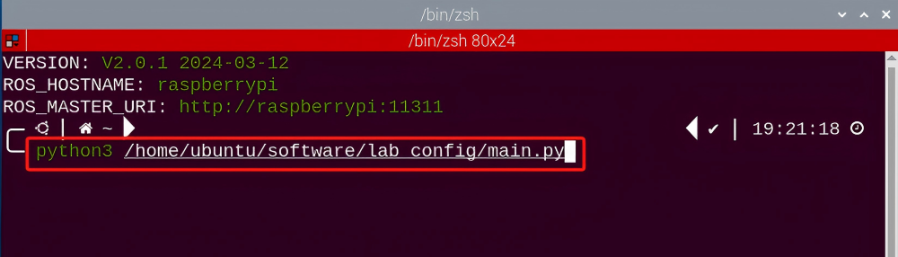

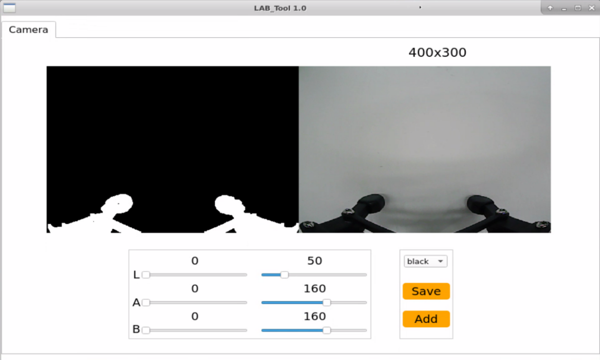

(2) After the camera is connected completely, you can see that the right side is real-time transmitted image and the right side is the color to be collected. Then click "**Add**" in the lower right color to name the new color.

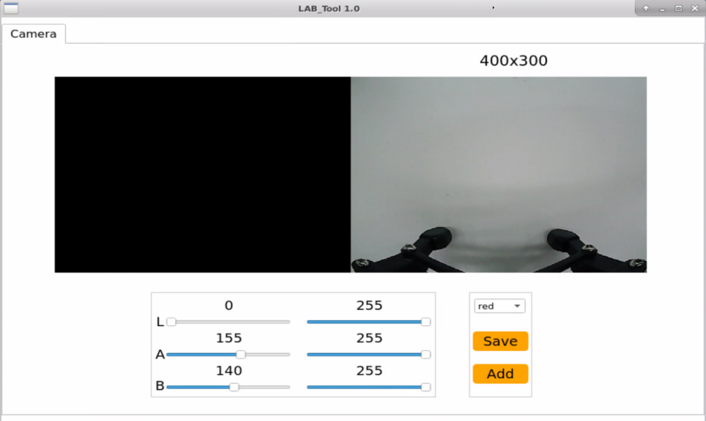

(3)  Fill in the name of added color and click "**Ok**". The color will be updated to "**pink**" in the color options bar in the lower right corner.


(4) Point the camera at the pink object. Then drag the following six slider bars until the pink area becomes white and other areas become black and click "**Save**" to save data.

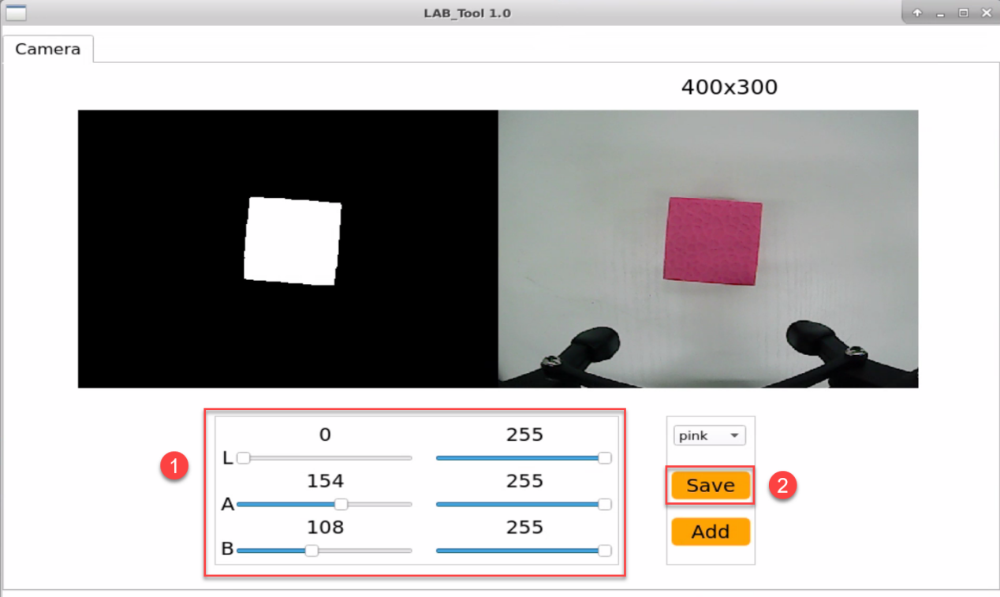

(5) Refer to step 2 to open a new terminal. Enter the following command to navigate to the directory where the game program is located, then press "**Enter**". 

```bash
cd /home/ubuntu/armpi_pro/src/color_tracking/scripts/
```

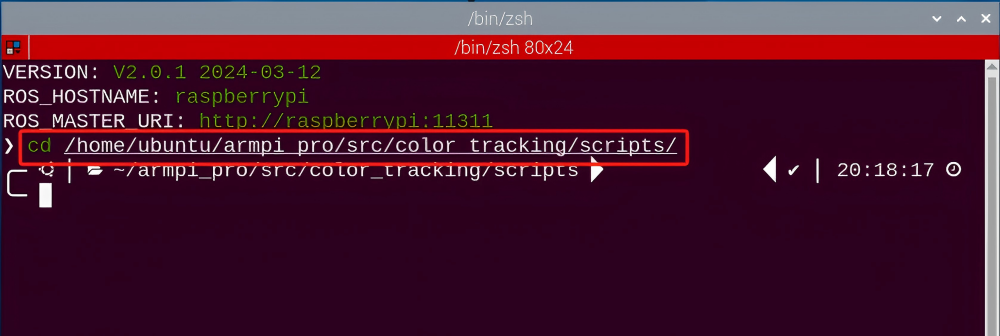

(6) Enter the command below to open the program.

```bash
vim color_tracking_node.py
```

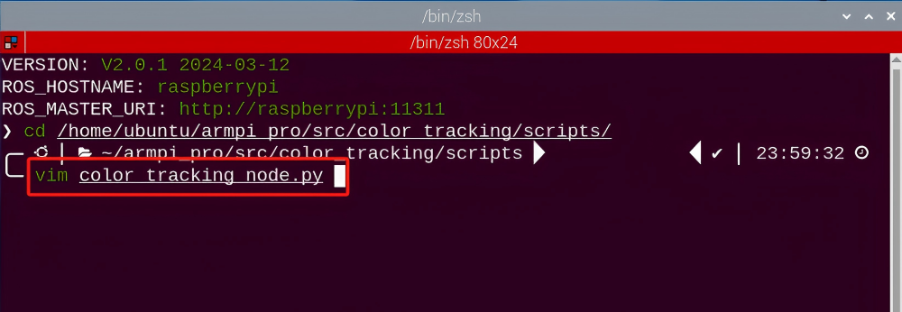

(7) Locate the code to be modified, press the "**i**" key on the keyboard, and enter the editing mode when the content shown in the following red box in the lower-left corner appears.

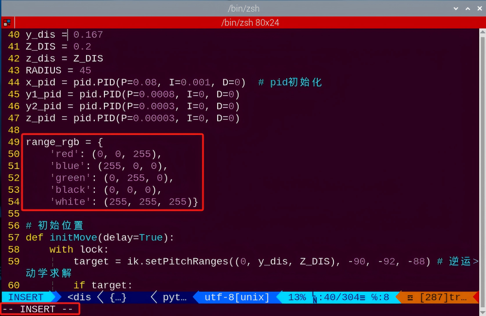

(8) Enter the pink's RGB value "**'pink': (203, 192, 255),**" into the source code.

```python
'pink': (203, 192, 255),
```

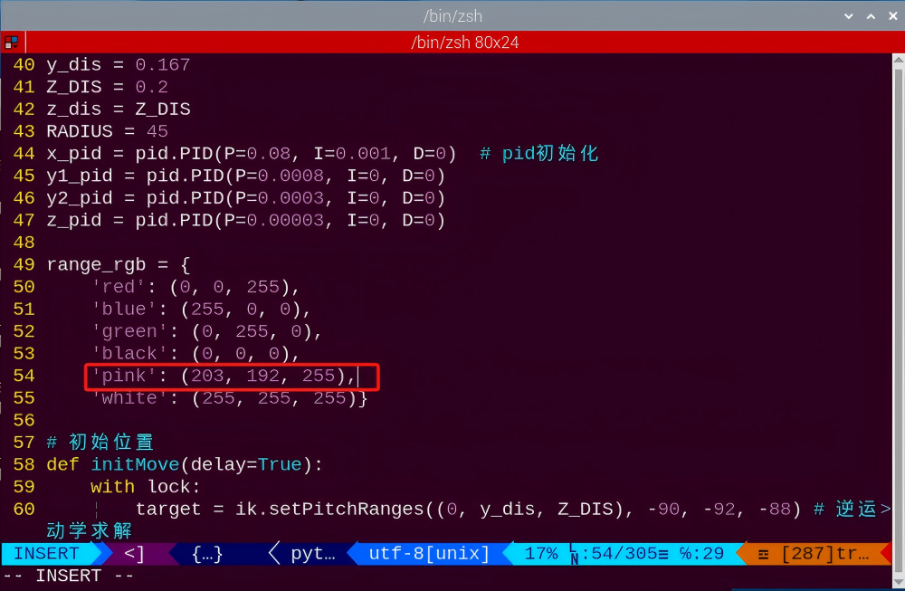

(9)  Press the "**Esc**", enter "**:wq**", and press "**Enter**" to complete the save and exit operation.

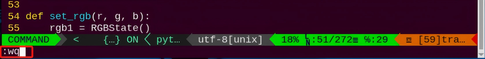

(10)  Follow "[**8.3.2 Operation Steps**](#anchor_8_3_2)" to start the color tracking game.

(11) Place the pink object in front of the camera, and move it slowly. The ArmPi Pro robotic arm will follow its movement.


(12) If you need to add other colors as recognizable colors, you can refer to "[**8.3.5 Function Extension -> Add New recognition Color**](#anchor_8_3_5_1)".

## 8.4 Tag Recognition

### 8.4.1 Program Description

AprilTag as a vision location identifier is similar to QR code or bar code, which can detect the tag and calculate its relative position quickly.

We use the trained tag. Firstly, obtain and process image. Then detect the tag and get the information. Finally, frame the recognized tag and perform the corresponding action.

### 8.4.2 Operation Steps

:::{Note}
It should be case sensitive when entering command and the "**Tab**" key can be used to complete the keywords.
:::

<span id="4_enter_game"></span>

* **Enter Game** 

(1) Power on the robot and use VNC Viewer to connect to the remote desktop.

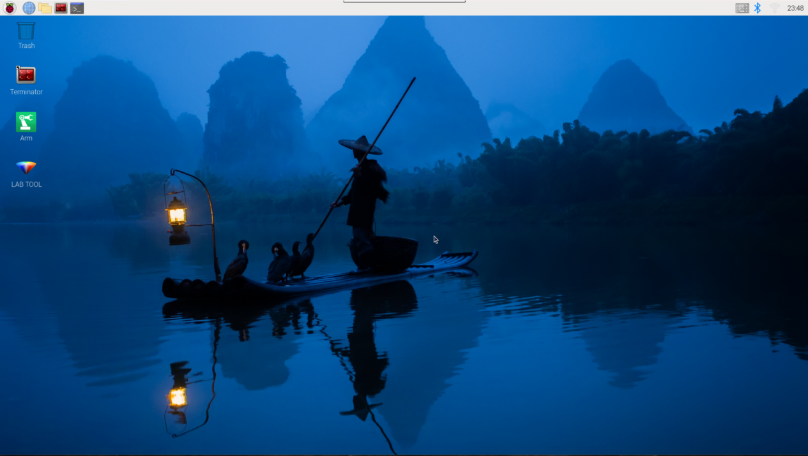

(2) Click  in the upper left corner of the system desktop to open the "**Terminator**".


(3) Enter the following command, and press "**Enter**" to access the tag recognition game. After entering the game, the prompt shown in the following red box will appear.

```bash
rosservice call /apriltag_detect/enter "{}"
```

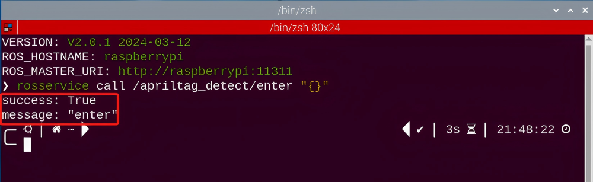

* **Start image transmission** 

(1)  Start with browser

To avoid consuming too much running memory of Raspberry Pi. It is recommended to use an external browser to open the transmitted image. 
The specific steps are as follows:

① Select a browser. Take Google Chrome as example.


② Then enter the default IP address "**192.168.149.1:8080/**" (Note: this IP address is the default IP address for direction connection mode. If it is LAN mode, please enter "**Device IP address+：8080/**" for example, "**192.168.149.1:8080/**") If fail to open, you can try it several times or restart camera.

:::{Note}
If it is in LAN mode, the method to obtain device IP address can refer to "[**Robot Network Configuration Course**](https://docs.hiwonder.com/projects/ArmPi_Pro/en/latest/docs/15_network_configuration.html)"
:::

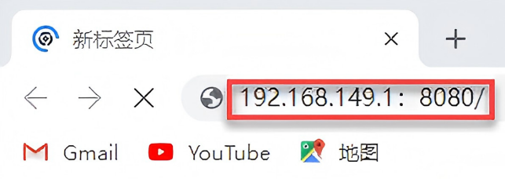

③ Then, click the option shown in the following figure to open the display window of the transmitted image.


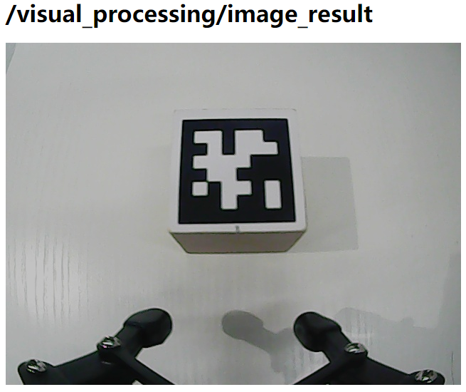

(2) Start with rqt

① After completing the steps of "[**8.4.2 Operation Steps -> Enter Game**](#4_enter_game)" and do not exit the terminal, open a new terminal.

② Enter command and press "**Enter**" to open rqt.

```bash
rqt_image_view
```


:::{Note}
 After opening image, the topic option must be selected. Otherwise, after starting game, the recognition process can not be displayed normally.
:::

* **Start Game**

Now, enter the terminal according to the steps in "[**8.4.2 Operation Steps -> Enter Game**](#4_enter_game)" and input the following command. 

```bash
rosservice call /apriltag_detect/set_running "data: true"
```

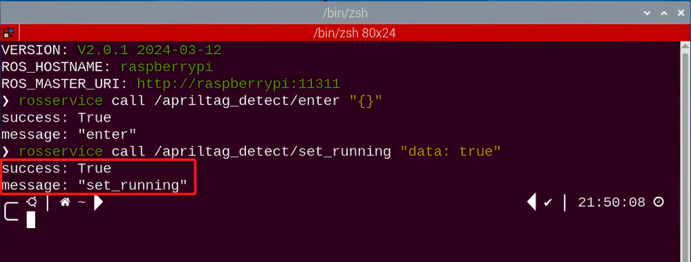

* **Stop and Exit** 

(1) If want to stop the game, enter the following command.

```bash
rosservice call /apriltag_detect/set_running "data: false"
```

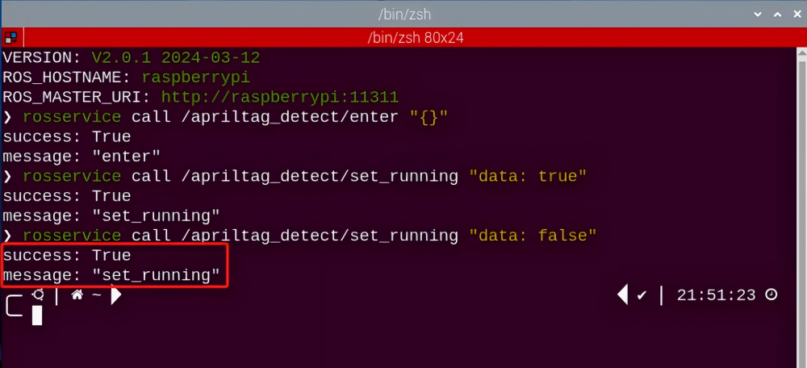

(2) If want to exit the game, enter the command below to exit.

```bash
rosservice call /apriltag_detect/exit "{}"
```

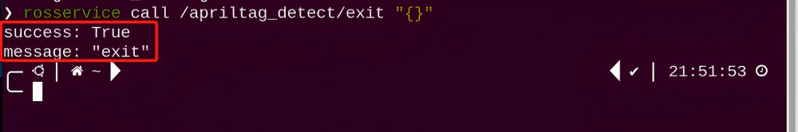

:::{Note}
Before exiting the game, it will keep running when Raspberry Pi is powered on. To avoid consume too much running memory of Raspberry Pi, you need to exit the game first according to the operation steps above before performing other AI vision games.
:::

(3) If want to exit the image transmission, press "**Ctrl+C**" to return and open the terminal of rqt. If fail to exit, please keep trying several times.

### 8.4.3 Project Outcome

After starting the game, the robotic arm will recognize the tag ID. Then, you can see that the tag ID will be framed in rqt tool after recognition and the robotic arm will perform the corresponding action.

| **Tag ID** | **Corresponding action** |
| :--------: | :----------------------: |
|     1      |   Drawing a triangle.    |
|     2      |     Drawing a circle     |
|     3      |   Drifting performance   |

### 8.4.4 Program Analysis

The source code for the program corresponding to this section is located in the Docker container:

[/home/ubuntu/armpi_pro/src/visual_processing/scripts/visual_processing_node.py](../_static/source_code/visual_processing_node.zip)(image processing)

[/home/ubuntu/armpi_pro/src/apriltag_detect/scripts/apriltag_detect_node.py](../_static/source_code/apriltag_detect_node.zip)(chassis control)

:::{Note}
please back up the initial program before making any modifications. It is prohibited editing the source code files directly to prevent making changes in an incorrect manner that could lead to robot malfunctions, rendering them irreparable.
:::

* **Import Parameter Module** 

|                 **Imported Module**                  |                         **Function**                         |
| :--------------------------------------------------: | :----------------------------------------------------------: |
|                      import sys                      | The sys module of Python is imported to access to system-related functionalities and variables. |
|                      import cv2                      | The OpenCV library of Python is imported to perform image processing and computer vision-related functions. |
|                     import time                      | The time module of Python is imported to perform time-related functionalities, such as delay operations. |
|                     import math                      | The math module of Python is imported to perform mathematical operations and functions. |
|                     import rospy                     | The Python library rosy is imported for  communication and interaction with ROS. |
|                  import numpy as np                  | The NumPy library is imported and is renamed as np for performing array and matrix operations. |
|              from armpi_pro import Misc              | The Misc module is imported from arm_pi_pro package to handle the recognized rectangular data. |
|            from armpi_pro import apriltag            | The apriltag module is imported from arm_pi_pro package  to perform Apriltag recognition and processing. |
|          from threading import RLock, Timer          | The "**RLock**" class and "**Timer**" class is imported from the threading module of Python for thread-related operations. |
|              from std_srvs.srv import *              | All service message types are imported from the std_srvs in ROS for defining and using standard service messages. |
|              from std_msgs.msg import *              | All message types are imported form the std_msgs package in ROS for defining and using standard messages. |
|          from sensor_msgs.msg import Image           | The image message type is imported from the sensor_msgs packages for processing image data. |
|       from visual_processing.msg import Result       | The Result message type is imported from the visual_processing package for the message of image processing results. |
|      from visual_processing.srv import SetParam      | The SetParam service type is imported from the visual_processing packages for using customs service related to parameter settings. |
|              from sensor.msg import Led              | The Led message type is imported form the sensor.msg module for controlling or representing the LED status on a sensor. |
|          from chassis_control.msg import *           | All message types are imported from the chassis_control.msg module, which indicated that all message types defined in this module is imported to perform the chassis control. |
|       from visual_patrol.srv import SetTarget        | The SetTarget service type is imported from the visual_patrol.srv module is used to set a target for line following. |
| from hiwonder_servo_msgs.msg import MultiRawIdPosDur | The MultiRawIdPosDur message type is imported from the hiwonder_servo_msgs.msg module for controlling servos. |
|              from armpi_pro import PID               | The PID class is imported from thearmpi_pro module to perform PID algorithm. |
|       from armpi_pro import bus_servo_control        | The bus_servo_control module is imported from the armpi_pro module, including the functions and methods related to the servo control. |
|         from kinematics import ik_transform          | The ik_transform function is imported from the kinematics module to perform conversion of inverse kinematics |

(1)  Initializing Functions and Variables

{lineno-start=102}

```python
	# 检测apriltag函数(detect apriltag function )
detector = apriltag.Detector(searchpath=apriltag._get_demo_searchpath())
def apriltag_Detect(img):
    global pub_time
    global publish_en
    global id_smallest
    
    msg = Result()
    img_copy = img.copy()
    img_h, img_w = img.shape[:2]
    frame_resize = cv2.resize(img_copy, size_m, interpolation=cv2.INTER_NEAREST)
    gray = cv2.cvtColor(frame_resize, cv2.COLOR_BGR2GRAY)
    detections = detector.detect(gray, return_image=False)
    
    if len(detections) != 0:
        for i, detection in enumerate(detections):
            tag_id = int(detection.tag_id)        # 获取tag_id(obtain tag_id )
            corners = np.rint(detection.corners)  # 获取四个角点(obtain four corners)
            for i in range(4):
                corners[i][0] = int(misc.map(corners[i][0], 0, size_m[0], 0, img_w))
                corners[i][1] = int(misc.map(corners[i][1], 0, size_m[1], 0, img_h))
            cv2.drawContours(img, [np.array(corners, np.int)], -1, (0, 255, 255), 2)
            object_center_x = int(misc.map(detection.center[0], 0, size_m[0], 0, img_w))
            object_center_y = int(misc.map(detection.center[1], 0, size_m[1], 0, img_h))  # 中心点(center point)
            object_angle = int(math.degrees(math.atan2(corners[0][1] - corners[1][1], corners[0][0] - corners[1][0])))  # 计算旋转角(calculate rotation angle)
            cv2.putText(img, str(tag_id), (object_center_x - 10, object_center_y + 10), cv2.FONT_HERSHEY_SIMPLEX, 1, [0, 255, 255], 2)
            if id_smallest == 'None' or tag_id <= id_smallest:
                id_smallest = tag_id        
                msg.center_x = object_center_x
                msg.center_y = object_center_y
                msg.angle = object_angle
                msg.data = id_smallest
                
        id_smallest = 'None'
        publish_en = True
```

(2) Obtain the Vertices Information

Get the four vertices of tag with `np.rint()` function.

{lineno-start=116}

```python
	    if len(detections) != 0:
        for i, detection in enumerate(detections):
            tag_id = int(detection.tag_id)        # 获取tag_id(obtain tag_id )
            corners = np.rint(detection.corners)  # 获取四个角点(obtain four corners)
            for i in range(4):
                corners[i][0] = int(misc.map(corners[i][0], 0, size_m[0], 0, img_w))
                corners[i][1] = int(misc.map(corners[i][1], 0, size_m[1], 0, img_h))
```

(3) Detect Tag

① After obtaining the vertices information, the tag is recognized by calling `drawContours()` function in cv2 library. 

{lineno-start=123}

```python
	            cv2.drawContours(img, [np.array(corners, np.int)], -1, (0, 255, 255), 2)
```

The meaning of parameters in parentheses is as follow:

The first parameter `img` is the input image.

The second parameter `[np.array(corners, np.int)]` is the contour which is list in Python.
The third parameter `-1` is the index of the contour, where the value represents all contours in the drawn contour list.

The fourth parameter `(0, 255, 255)` is the color of contour and its order is B, G and R.
The fifth parameter "**2**" is the width of contour.

② Obtain the ID (tag_id) of the tag.

{lineno-start=117}

```python
	        for i, detection in enumerate(detections):
            tag_id = int(detection.tag_id)        # 获取tag_id(obtain tag_id )
```

③ Print the tag ID and type in the transmitted image by calling `putText()` function in cv2 library.

{lineno-start=127}

```python
            cv2.putText(img, str(tag_id), (object_center_x - 10, object_center_y + 10), cv2.FONT_HERSHEY_SIMPLEX, 1, [0, 255, 255], 2)
```

The meaning of parameters in parentheses is as follow:

The first parameter `img` is the input image.

The second parameter `str(tag_id)` is the display content.

The third parameter `(object_center_x - 10, object_center_y + 10)` is the display position.

The fourth parameter `cv2.FONT_HERSHEY_SIMPLEX` is the type of font.

The fifth parameter `1` is the size of font.

The sixth parameter `[0, 255, 255]` is the color of font and its color is B, G and R. Here is yellow.

The seventh parameter `2` is the thickness of font.

(4)  Action Control

After obtaining ID, control ArmPi Pro to perform corresponding action by calling `set_velocity.publish()` function in hiwonder_servo_msgs.msg library.

{lineno-start=68}

```python
# 移动控制函数(motion control functions)
def move():
    global move_en
    global detect_id

    while __isRunning:
        if move_en and detect_id != 'None': # 移动使能和检测到标签(move to detect the tag)
            rospy.sleep(0.5)
            if detect_id == 1: # 标签id为1，机器人画三角形(if the tag id is 1, the robot draws a triangle)
                # 发布底盘控制消息,80为线速度:0~200，45为方向角:0~360，0为偏航角速度:-1~1(Publishing chassis control message, where 80 is the linear velocity in the range of 0 to 200, 45 is the orientation angle in the range of 0 to 360, and 0 is the yaw rate in the range of -1 to 1.)
                set_velocity.publish(100,60,0) # 画三角形第一条边(draw the first side of the triangle)
                rospy.sleep(2.6)  # 延时2.6秒(delay for 2.6s)
                set_velocity.publish(100,180,0) # 画三角形第二条边(draw the second side of the triangle)
                rospy.sleep(2.6)  # 延时2.6秒(delay for 2.6s)
                set_velocity.publish(100,300,0) # 画三角形第三条边(draw the third side of the triangle)
                rospy.sleep(2.6)  # 延时2.6秒(delay for 2.6s)

            elif detect_id == 2: # 标签id为2，机器人画圆形(if the tag id is 2, the robot draws a circle)
                 for i in range(360):# 通过for循环,持续改变机器人的运动方向,这样运动轨迹就是一个圆形(Use a for loop to continuously change the robot's motion direction, and the motion trajectory is a circle.)
                    set_velocity.publish(100,i,0)  
                    rospy.sleep(0.02)

            elif detect_id == 3: # 标签id为3，机器人定圆漂移(if the tag id is 3, the robot performs circular drifting)
                set_velocity.publish(100,180,-0.45) # 横移和原地旋转进行合成，就成了定圆漂移(Combine lateral movement with rotating in place resulting in a circular drift maneuver.)
                rospy.sleep(10.2)

            move_en = False
            detect_id = 'None'
            set_velocity.publish(0,90,0) # 停止移动(stop moving)

        else:
            rospy.sleep(0.01)
```

Motor control is illustrated by the code example `set_velocity.publish(100, 60, 0),` where the meanings of the parameters within the parentheses are as follows:

The first parameter `100` represents the linear velocity, indicating the motor's speed in millimeters per second. The range is "**-100 to 100**", and when the value is negative, the motor rotates in reverse.

The second parameter `90` denotes the orientation angle, representing the direction of the vehicle's movement in degrees. The range is "**0 to 360**". Here, 90 degrees corresponds to forward movement, 270 degrees is backward, 0 degrees is right, and 180 degrees is left. Other angle values represent corresponding directions.

The third parameter `dx` stands for the yaw angular velocity, indicating the rate of deviation for the vehicle. It is measured in 5 degrees per second. In the program, the range is set as "**-0.8 to 0.8**". Positive values result in clockwise rotation, while negative values lead to counterclockwise rotation.

## 8.5 Target Tracking

### 8.5.1 Program Description

Recognize the color and process it with Lab color space. Firstly, convert RGB color space to LAB and then perform binaryzation, dilation and erosion and other operations to obtain the outline of the target color. Then frame the contour of the color to complete color recognition.

Then process height of robotic arm after recognition. The coordinates (x,y,z) of center point of image takes as the set value and the currently obtained coordinates are used as input value to update pid.

Then, calculate on the basis the feedback of image position. Finally, the coordinate value will change linearly through the change of the position, so as to achieve the effect of tracking.

<p id="anchor_8_5_2"></p>

### 8.5.2 Operation Steps

:::{Note}
It should be case sensitive when entering command and the "**Tab**" key can be used to complete the keywords.
:::

<span id="5_enter_game"></span>

* **Enter Game** 

(1) Power on the robot and use VNC Viewer to connect to the remote desktop.


(2) Clickin the upper left corner of the system desktop to open the "**Terminator**".


(3) Enter the following command to execute the target tracking program. 

```bash
rosrun object_tracking object_tracking_node.py
```

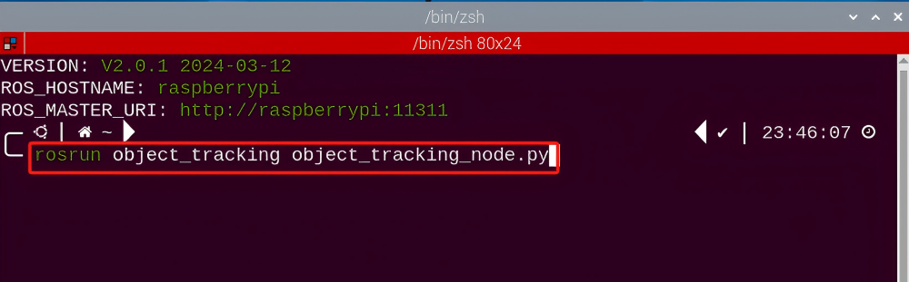

(4)  Keep the previously opened terminal and open a new one. Enter the following command in the new terminal and press "**Enter**" to enter the target tracking game. If successful, a prompt will appear, as shown below:

```bash
rosservice call /object_tracking/enter "{}"
```

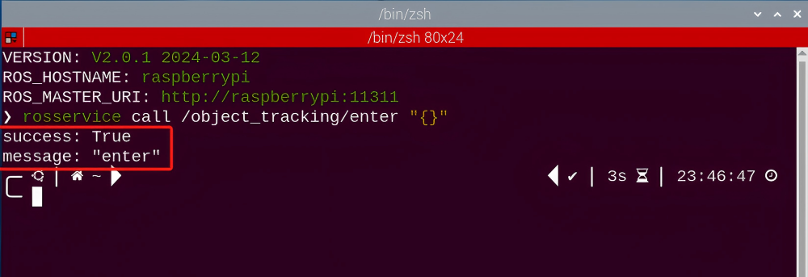

* **Start image transmission** 

(1) Start with Browser

To avoid consuming too much running memory of Raspberry Pi. It is recommended to use an external browser to open the transmitted image. 

① Select a browser. Take Google Chrome as example.


② Then enter the default IP address "**192.168.149.1:8080/**" (Note: this IP address is the default IP address for direction connection mode. If it is LAN mode, please enter "**Device IP address+：8080/**". For example, "**192.168.149.1:8080/**") If fail to open, you can try it several times or restart camera.

:::{Note}
If it is in LAN mode, the method to obtain device IP address can refer to "[**Robot Network Configuration Course**](https://docs.hiwonder.com/projects/ArmPi_Pro/en/latest/docs/15_network_configuration.html)".
:::


③ Then, click the option shown in the following figure to open the display window of the transmitted image.


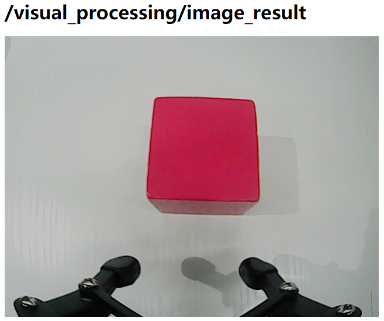

(2) Start with rqt 

① After completing the steps of "[**8.5.2 Operation Steps -> Enter Game**](#5_enter_game)" and do not exit the terminal, open a new terminal.

② Enter the command and press "**Enter**" to open rqt.

```bash
rqt_image_view
```


③ Click the red box as the figure shown below, select **"/visual_processing/image_result"** for the topic of line following and remain other settings unchanged. 

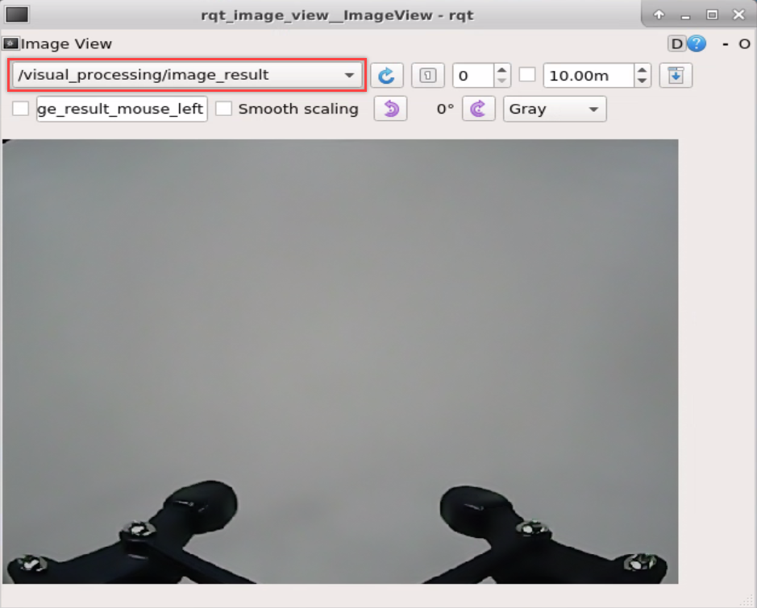

:::{Note}
After opening image, the topic option must be selected. Otherwise, after starting game, the recognition process can not be displayed normally.
:::

<span id="5_start_game"></span>

* **Start Game**

(1) Now, enter the terminal according to the steps in "[**8.5.2 Operation Steps -> Enter Game**](#5_enter_game)" and input command "**rosservice call /object_tracking/set_running 'data: true'**". Then if the prompt shown in the following red box appears, which means game has been started successfully.

```bash
rosservice call /object_tracking/set_running "data: true"
```

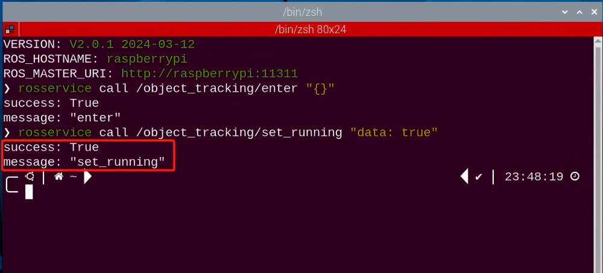

(2) After starting the game, select the target color. Take blue as example. Enter the command 

```bash
rosservice call /object_tracking/set_target "data: 'blue'"
```

:::{Note}
If want to change to green or red, you can fill in green or red in "**data: ' '**" (The entered command should be case sensitive).
:::

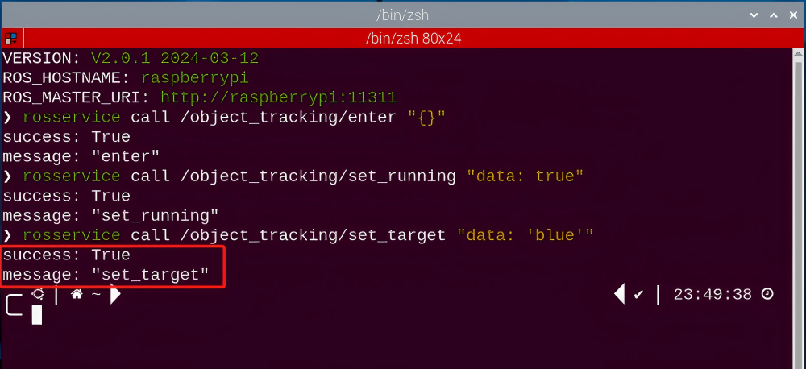

* **Stop and Exit** 

(1) If want to stop the game, enter command "**rosservice call /object_tracking/set_running 'data: false'**". After stopping, you can refer to the content of "[**8.5.2 Operation Steps -> Start Game**](#5_start_game)" to change other tracking colors.

```bash
rosservice call /object_tracking/set_running "data: false"
```

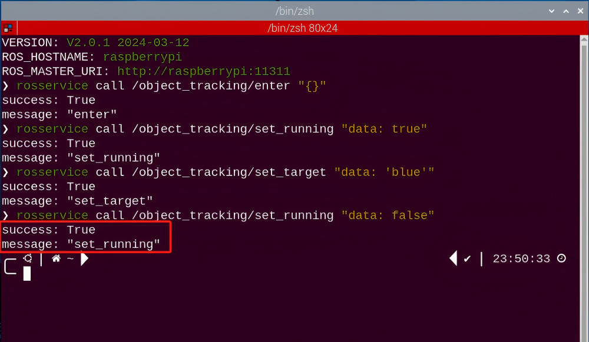

(2) If want to exit the game, enter the following command to exit.

```bash
rosservice call /object_tracking/exit "{}"
```

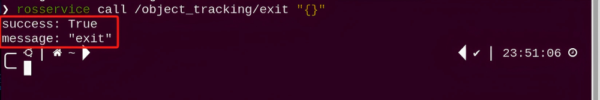

:::{Note}

Before exiting the game, it will keep running when Raspberry Pi is powered on. To avoid consume too much running memory of Raspberry Pi, you need to exit the game first according to the operation steps above before performing other AI vision games.

:::

(3) If want to close the image transmission, press "**Ctrl+C**" to return and open the terminal of rqt. If fail to exit, please keep trying several times.

### 8.5.3 Project Outcome

After starting game, place the blue block within the detected range of camera. The target color will be framed in rqt tool after recognition. At this time, move the block slowly. Then the robotic arm will rotate to the direction of the block and the car will move to the block.

### 8.5.4 Program Analysis

The source code of the program is located in the Docker container:

[/home/ubuntu/armpi_pro/src/visual_processing/scripts/visual_processing_node.py](../_static/source_code/visual_processing_node.zip)(image processing)

[/home/ubuntu/armpi_pro/src/object_tracking/scripts/object_tracking_node.py](../_static/source_code/object_tracking_node.zip)(motion control)

:::{Note}
 please back up the initial program before making any modifications. It is prohibited editing the source code files directly to prevent making changes in an incorrect manner that could lead to robot malfunctions, rendering them irreparable.
:::

* **Import Parameter Module**

| **Imported Module**                                  | **Function**                                                 |
| ---------------------------------------------------- | ------------------------------------------------------------ |
| import sys                                           | The sys module of Python is imported to access to system-related functionalities and variables. |
| import cv2                                           | The OpenCV library of Python is imported to perform image processing and computer vision-related functions. |
| import time                                          | The time module of Python is imported to perform time-related functionalities, such as delay operations. |
| import math                                          | The math module of Python is imported to perform mathematical operations and functions. |
| import rospy                                         | The Python library rosy is imported for  communication and interaction with ROS. |
| import numpy as np                                   | The NumPy library is imported and is renamed as np for performing array and matrix operations. |
| from armpi_pro import Misc                           | The Misc module is imported from arm_pi_pro package to handle the recognized rectangular data. |
| from armpi_pro import apriltag                       | The apriltag module is imported from arm_pi_pro package  to perform Apriltag recognition and processing. |
| from threading import RLock, Timer                   | The "**RLock**" class and "**Timer**" class is imported from the threading module of Python for thread-related operations. |
| from std_srvs.srv import *                           | All service message types are imported from the std_srvs in ROS for defining and using standard service messages. |
| from std_msgs.msg import *                           | All message types are imported form the std_msgs package in ROS for defining and using standard messages. |
| from sensor_msgs.msg import Image                    | The image message type is imported from the sensor_msgs packages for processing image data. |
| from visual_processing.msg import Result             | The Result message type is imported from the visual_processing package for the message of image processing results. |
| from visual_processing.srv import SetParam           | The SetParam service type is imported from the visual_processing packages for using customs service related to parameter settings. |
| from sensor.msg import Led                           | The Led message type is imported form the sensor.msg module for controlling or representing the LED status on a sensor. |
| from chassis_control.msg import *                    | All message types are imported from the chassis_control.msg module, which indicated that all message types defined in this module is imported to perform the chassis control. |
| from visual_patrol.srv import SetTarget              | The SetTarget service type is imported from the visual_patrol.srv module is used to set a target for line following. |
| from hiwonder_servo_msgs.msg import MultiRawIdPosDur | The MultiRawIdPosDur message type is imported from the hiwonder_servo_msgs.msg module for controlling servos. |
| from armpi_pro import PID                            | The PID class is imported from thearmpi_pro module to perform PID algorithm. |
| from armpi_pro import bus_servo_control              | The bus_servo_control module is imported from the armpi_pro module, including the functions and methods related to the servo control. |
| from kinematics import ik_transform                  | The ik_transform function is imported from the kinematics module to perform conversion of inverse kinematics. |

* **Image Processing**

{lineno-start=229}

```python
	# 单颜色识别函数(single color recognition function)
def color_detect(img, color):
    global pub_time
    global publish_en
    global color_range_list
    
    if color == 'None':
        return img
    
    msg = Result()
    area_max = 0
    area_max_contour = 0
    img_copy = img.copy()
    img_h, img_w = img.shape[:2]
    frame_resize = cv2.resize(img_copy, size_m, interpolation=cv2.INTER_NEAREST)
    frame_lab = cv2.cvtColor(frame_resize, cv2.COLOR_BGR2LAB)  # 将图像转换到LAB空间(convert the image to LAB space)

    if color in color_range_list:
        color_range = color_range_list[color]
        frame_mask = cv2.inRange(frame_lab, tuple(color_range['min']), tuple(color_range['max']))  # 对原图像和掩模进行位运算(perform bitwise operation on the original image and the mask)
        eroded = cv2.erode(frame_mask, cv2.getStructuringElement(cv2.MORPH_RECT, (2, 2)))          # 腐蚀(erode)
        dilated = cv2.dilate(eroded, cv2.getStructuringElement(cv2.MORPH_RECT, (2, 2)))            # 膨胀(dilate)
        contours = cv2.findContours(dilated, cv2.RETR_EXTERNAL, cv2.CHAIN_APPROX_NONE)[-2]         # 找出轮廓(find contours)
        area_max_contour, area_max = getAreaMaxContour(contours)                                   # 找出最大轮廓(find the largest contour)

        if area_max > 100:  # 有找到最大面积(found the maximum area)
            (centerx, centery), radius = cv2.minEnclosingCircle(area_max_contour)  # 获取最小外接圆(obtain the minimum circumscribed circle)
            msg.center_x = int(misc.map(centerx, 0, size_m[0], 0, img_w))
            msg.center_y = int(misc.map(centery, 0, size_m[1], 0, img_h))
            msg.data = int(misc.map(radius, 0, size_m[0], 0, img_w))
            cv2.circle(img, (msg.center_x, msg.center_y), msg.data+5, range_rgb[color], 2)
            publish_en = True
        
        if publish_en:
            if (time.time()-pub_time) >= 0.06:
                result_pub.publish(msg)  # 发布结果(publish results)
                pub_time = time.time()
```

* **Binarization** 

Using the `inRange ()` function from the cv2 library to perform binarization operation on image

{lineno-start=248}

```python
	        frame_mask = cv2.inRange(frame_lab, tuple(color_range['min']), tuple(color_range['max']))  # 对原图像和掩模进行位运算(perform bitwise operation on the original image and the mask)
```

The first parameter `frame_lab` is the input image.

The second parameter `tuple(color_range['min'])` is the lower limit of threshold.

The third parameter `tuple(color_range['max'])` is the upper lower of threshold.

* **Dilation and erosion** 

Using the `inRange ()` function from the cv2 library to perform binarization operation on image.

{lineno-start=249}

```python
	        eroded = cv2.erode(frame_mask, cv2.getStructuringElement(cv2.MORPH_RECT, (2, 2)))          # 腐蚀(erode)
        dilated = cv2.dilate(eroded, cv2.getStructuringElement(cv2.MORPH_RECT, (2, 2)))            # 膨胀(dilate)
```

The first parameter `frame_lab` is the input image.
The second parameter `tuple(color_range['min'])`is the lower limit of threshold.
The third parameter `tuple(color_range['max'])` is the upper lower of threshold.

* **Obtain the contour with the largest area**

After processing the above image, it is necessary to obtain the contour of the target. The findContours() function from the cv2 library is involved in this process.

{lineno-start=251}

```python
	        contours = cv2.findContours(dilated, cv2.RETR_EXTERNAL, cv2.CHAIN_APPROX_NONE)[-2]         # 找出轮廓(find contours)
```

The `erode()` function is applied to erode. Here uses an example of the code `contours = cv2.findContours(dilated, cv2.RETR_EXTERNAL, cv2.CHAIN_APPROX_NONE)[-2]`.
The first parameter `dilated` is the input image.
The second parameter `cv2.RETR_EXTERNAL` is the contour retrieval mode.
The third parameter `cv2.CHAIN_APPROX_NONE)[-2]` is the approximate method of contour.
Find the maximum contour from the obtained contours. To avoid interference, set a minimum value. Only when the area is greater than this minimum value, the target contour will take effect. The minimum value here is "**50**". 

{lineno-start=252}

```python
	        area_max_contour, area_max = getAreaMaxContour(contours)                                   # 找出最大轮廓(find the largest contour)

        if area_max > 100:  # 有找到最大面积(found the maximum area)
```

* **Obtain the minimum enclosing circle and display on the live feed image**

The `minEnclosingCircle()` function from the cv2 library is utilized to obtain the minimum enclosing circle and the coordinates of its center for the target contour. The obtained circle is then displayed in the feedback image using the `circle()` function.

{lineno-start=254}

```python
        if area_max > 100:  # 有找到最大面积(found the maximum area)
            (centerx, centery), radius = cv2.minEnclosingCircle(area_max_contour)  # 获取最小外接圆(obtain the minimum circumscribed circle)
            msg.center_x = int(misc.map(centerx, 0, size_m[0], 0, img_w))
            msg.center_y = int(misc.map(centery, 0, size_m[1], 0, img_h))
            msg.data = int(misc.map(radius, 0, size_m[0], 0, img_w))
            cv2.circle(img, (msg.center_x, msg.center_y), msg.data+5, range_rgb[color], 2)
            publish_en = True
```

* **Motion Control**

By invoking the `bus_servo_control.set_servos()` function to control the servos on robotic arm to allow the robotic arm to move with the target within the recognition range.

{lineno-start=125}

```python
        if __isRunning:
            if center_x > 0 and center_y > 0:
                # 机械臂X轴追踪(robotic arm X-axis tracking)
                if abs(center_x - img_w/2.0) < 15:
                    center_x = img_w/2.0
                arm_x_pid.SetPoint = img_w/2.0  # 设定(set)
                arm_x_pid.update(center_x)      # 当前(current)
                arm_x += arm_x_pid.output       # 输出(output)
                arm_x = 200 if arm_x < 200 else arm_x
                arm_x = 800 if arm_x > 800 else arm_x
                
                # 机械臂Y轴追踪(robotic arm Y-axis tracking)
                if abs(center_y - img_h/2.0) < 15:
                    center_y = img_h/2.0
                arm_y_pid.SetPoint = img_h/2.0  # 设定(set)
                arm_y_pid.update(center_y)      # 当前(current)
                arm_y += arm_y_pid.output       # 输出(output)
                arm_y = 50 if arm_y < 50 else arm_y
                arm_y = 300 if arm_y > 300 else arm_y
                
                # 机械臂移动(robotic arm movement)
                bus_servo_control.set_servos(joints_pub, 0.02, ((3, arm_y), (6, arm_x)))
                
                # 麦轮底盘X轴追踪(mecanum chassis X-axis tracking)
                if abs(arm_x - Arm_X) < 5:
                    arm_x = Arm_X
                x_pid.SetPoint = Arm_X    # 设定(set)
                x_pid.update(arm_x)       # 当前(current)
                dx = x_pid.output         # 输出(output)
                dx = -200 if dx < -200 else dx
                dx = 200 if dx > 200 else dx
```

Take the code `bus_servo_control.set_servos(joints_pub, 20, ((3, arm_y), (6, arm_x)))` as example and the meaning of parameters in parentheses are as follow:

The first parameter `joints_pub` is to publish the message of the servo control node.

The second parameter `20` is the running time.

The third parameter is `( (3, arm_y), (6, arm_x)`. `3` is the servo number, "**arm_y']**" is the servo angle.

Lastly, by invoking the `set_velocity.publis()` function, the motors on ArmPi Pro is controlled to drive the mecanum wheels to achieve the performance of tracking.

{lineno-start=148}

```python
                # 麦轮底盘X轴追踪(mecanum chassis X-axis tracking)
                if abs(arm_x - Arm_X) < 5:
                    arm_x = Arm_X
                x_pid.SetPoint = Arm_X    # 设定(set)
                x_pid.update(arm_x)       # 当前(current)
                dx = x_pid.output         # 输出(output)
                dx = -200 if dx < -200 else dx
                dx = 200 if dx > 200 else dx
                
                # 麦轮底盘Y轴追踪(mecanum chassis Y-axis tracking)
                if abs(arm_y - Arm_Y) < 5:
                    arm_y = Arm_Y
                y_pid.SetPoint = Arm_Y   # 设定(set)
                y_pid.update(arm_y)      # 当前(current)
                dy = -y_pid.output       # 输出(output)
                dy = -180 if dy < -180 else dy
                dy = 180 if dy > 180 else dy
                
                # 麦轮底盘移动(mecanum chassis movement)
                set_translation.publish(dx,dy)
                move = True
```

Taking the code `bus_servo_control.set_servos(joints_pub, 20, ((3, arm_y), (6, arm_x)))` as an example, the parameters in the parentheses are explained as follows:

First parameter: `joints_pub` is used to publish messages to the servo control node.

Second parameter: 0.02 specifies the execution time in seconds.

Third parameter: `((3, arm_y), (6, arm_x))`. Here, 3 represents the servo ID, and arm_y is the servo angle. Similarly, (6, arm_x) follows the same format.

Finally, the robot's Mecanum wheels can be controlled to achieve tracking functionality by calling the `set_velocity.publish()` function, which adjusts the motor movement of the ArmPi Pro robot.

### 8.5.5 Function Extension

<span id="anchor_8_5_5_1" class="anchor"></span>

* **Add New Recognition Color** 

Target tracking has three built-in color red, green and blue. In addition to the built-in colors, you can add other recognition colors. For example, add pink as a new recognizable color. The operation steps are as follow:

(1)  Open the terminal, enter the following command and press "**Enter**" to open the tool for color threshold adjustment. If no transmitted image appears in the pop-up interface, it means the camera fails to connect and needs to be checked whether the wire is connected.

```bash
python3 /home/ubuntu/software/lab_config/main.py
```


(2) After the camera is connected completely, you can see that the right side is real-time transmitted image and the right side is the color to be collected. Then click "**Add**" in the lower right color to name the new color.


(3) Fill in the name of added color and click "**Ok**". The color will be updated to "**pink**" in the color options bar in the lower right corner.

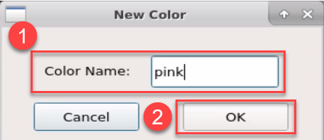

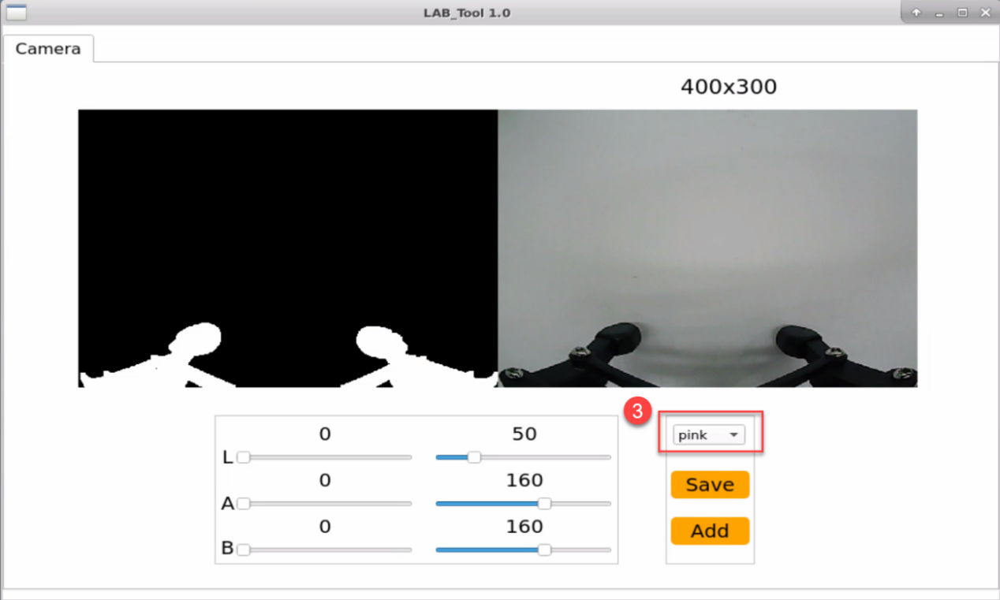

(4) Point the camera at the pink object. Then drag the following six slider bars until the pink area becomes white and other areas become black and click "**Save**" to save data.


(5) Refer to step 2 to open a new terminal, and enter the following command to navigate to the directory where the program is located. Then, press "**Enter**".

```bash
cd /home/ubuntu/armpi_pro/src/object_tracking/scripts/
```

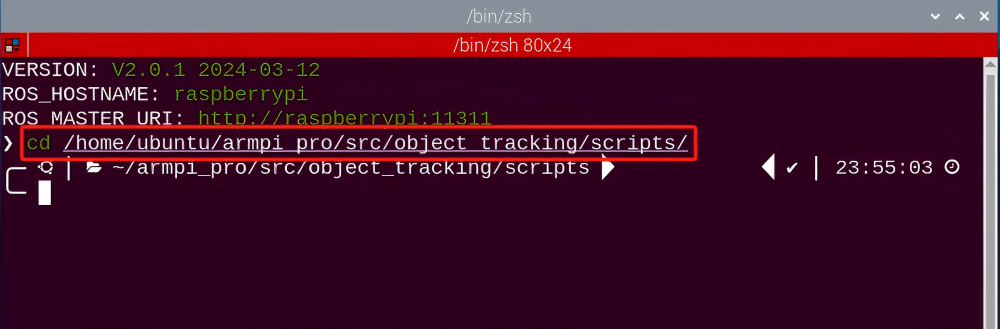

(6) Enter the following command to open the program.

```bash
vim object_tracking_node.py
```

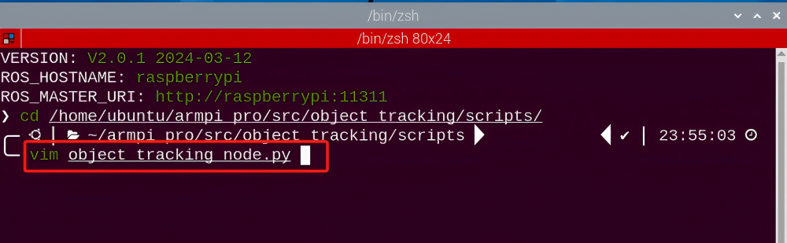

(7) Locate the code to be modified, press the "**i**" key on the keyboard, and enter the editing mode when the content shown in the following red box in the lower-left corner appears.

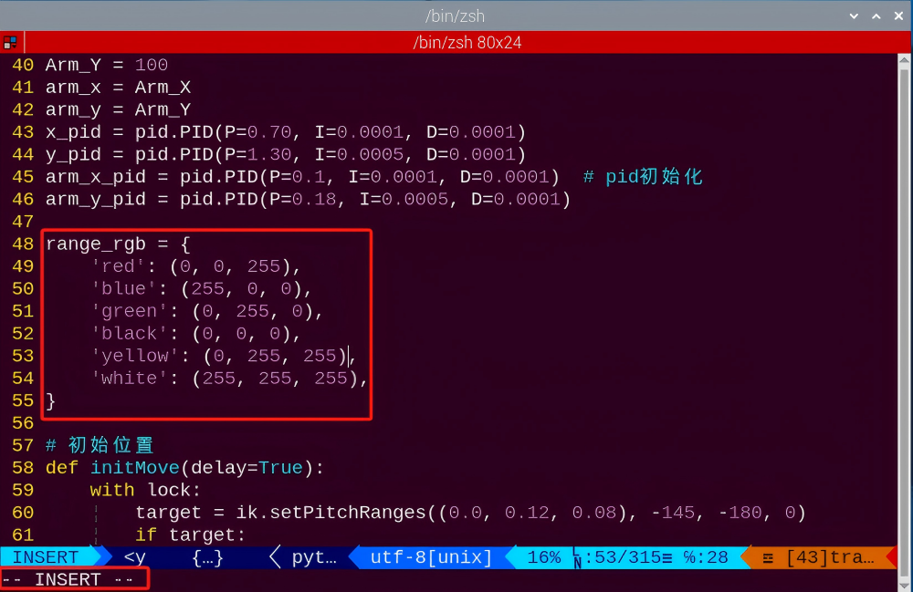

(8) Enter the pink's RGB value "'pink': (203, 192, 255)," into the source code.

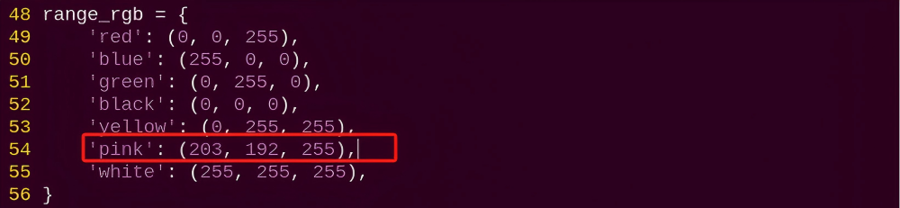

(9) Press the "**Esc**", enter "**:wq**", and press "**Enter**" to complete the save and exit operation.

(10) Follow "[**8.5.2 Operation Steps**](#anchor_8_5_2)" to start the color tracking.

(11) Put pink object in front of the camera then slowly move the object. Arm Pi Pro will move with it.

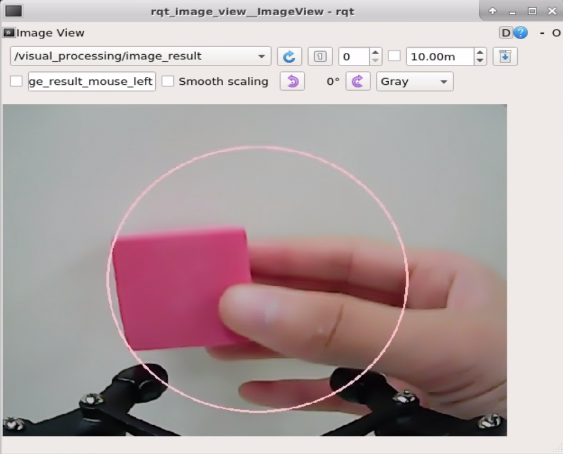

(12) If want to add other colors as new recognizable color, you can refer to the operation steps of "[**8.5.5 Function Extension -> Add New Recognition Color**](#anchor_8_5_5_1)".

## 8.6 Face Recognition

### 8.6.1 Program Description

Firstly, the pan-tilt servo is set to rotate to search the human face. Then use the trained face to detect the face by the scaling screen, and convert the  coordinates of the recognized face to the coordinates before scaling. Judge whether it is the largest face, and frame the recognized face.

Finally, control the servo angle to let robot perform the feedback after recognition.

### 8.6.2 Operation Steps

:::{Note}
It should be case sensitive when entering command and the **"Tab"** key can be used to complete the keywords.
:::

<p id="5_enter_game"></p>

* **Enter Game** 

(1) Power on the robot and use VNC Viewer to connect to the remote desktop.


(2)  clickin the upper left corner of the system desktop to open the "**Terminator**".


(3) Enter the following command, and press "**Enter**" to access the face recognition game. After entering the game, the prompt shown in the following red box will appear.

```bash
rosservice call /face_detect/enter "{}"
```

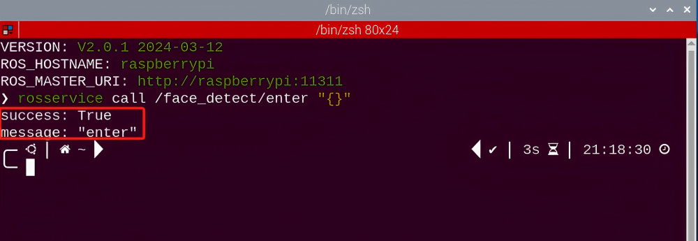

* **Start image transmission** 

(1)  Start with browser

To avoid consuming too much running memory of Raspberry Pi. It is recommended to use an external browser to open the transmitted image. 
The specific steps are as follows:

① Select a browser. Take Google Chrome as example.


② Then enter the default IP address "**192.168.149.1:8080/**" (Note: this IP address is the default IP address for direction connection mode. If it is LAN mode, please enter "**Device IP address+：8080/**" such as "**192.168.149.1:8080/**") If fail to open, you can try it several times or restart camera.

:::{Note}
 If it is in LAN mode, the method to obtain device IP address can refer to "[**Robot Network Configuration Course**](https://docs.hiwonder.com/projects/ArmPi_Pro/en/latest/docs/15_network_configuration.html)".
:::


③ Then, click the option shown in the following figure to open the display window of the transmitted image.

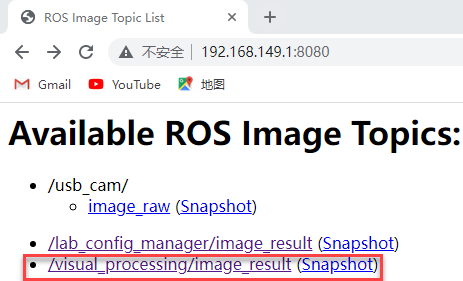

(2) Start with rqt

① After completing the steps of "[**8.6.2 Operation Steps -> Enter Game**](#6_enter_game)" and do not exit the terminal, open a new terminal.

② Enter command "**rqt_image_view**" and press "**Enter**" to open rqt.

```bash
rqt_image_view
```

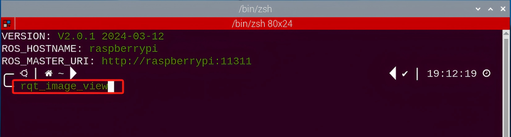

③ Click the red box as the figure shown below, select "**/visual_processing/image_result**" for the topic of line following and remain other settings unchanged. 


:::{Note}
 After opening image, the topic option must be selected. Otherwise, after starting game, the recognition process can not be displayed normally.
:::

* **Start Game** 

(1) Now, enter the terminal according to the steps in "[**8.6.2 Operation Steps -> Enter Game**](#6_enter_game)" and input the following command. 

```bash
rosservice call /face_detect/set_running "data: true"
```

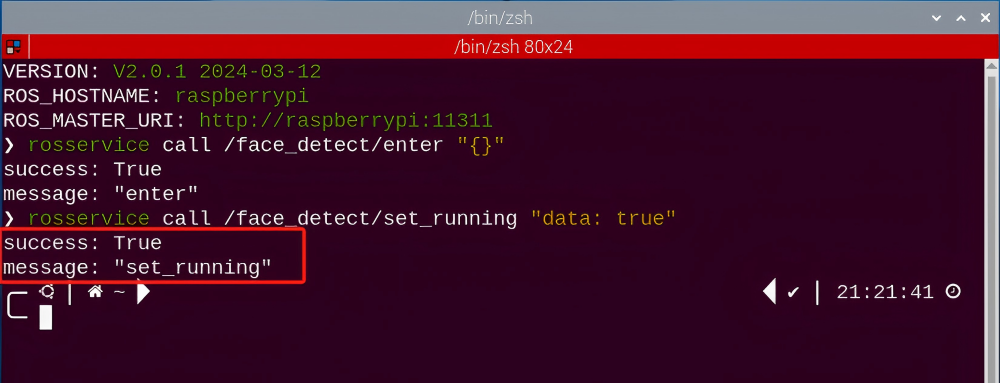

* **Stop and Exit** 

(1) If want to stop the game, enter the command.

```bash
rosservice call /face_detect/set_running "data: false"
```

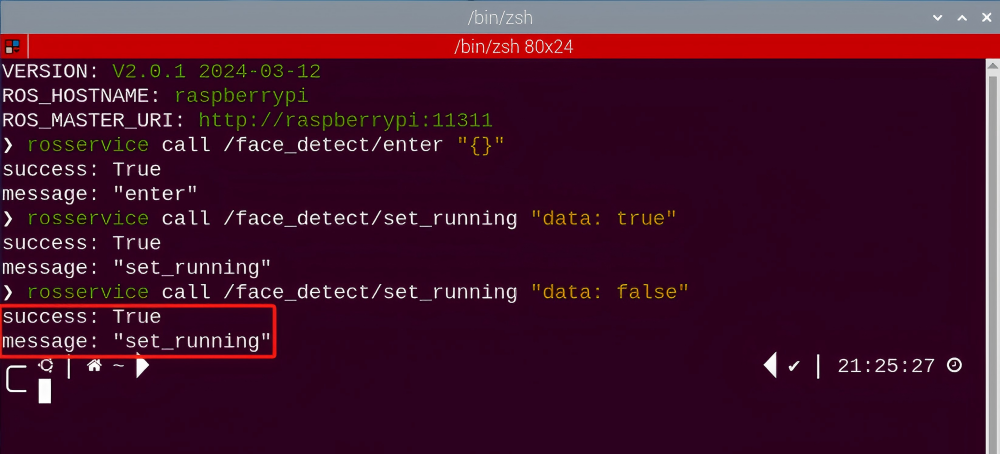

(2) If want to exit the game, enter command "**rosservice call /face_detect/exit '{}'**" to exit.

```bash
rosservice call /face_detect/exit "{}"
```

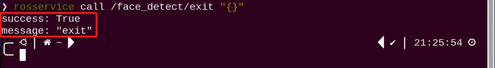

:::{Note}
Before exiting the game, it will keep running when Raspberry Pi is powered on. To avoid consume too much running memory of Raspberry Pi, you need to exit the game first according to the operation steps above before performing other AI vision games.
:::

(3) If want to exit the image transmission, press "**Ctrl+C**" to return and open the terminal of rqt. If fail to exit, please keep trying several times.

### 8.6.3 Project Outcome

After starting the game, the robotic arm will search for human face from side to side. Then, the human face will be framed in rqt tool after recognition and the gripper of robotic arm will rotate left and right before opening and closing.

### 8.6.4 Program Analysis

The source code for the program corresponding to this section is located in the Docker container:

[/home/ubuntu/armpi_pro/src/visual_processing/scripts/visual_processing_node.py](../_static/source_code/visual_processing_node.zip)(image processing)

[/home/ubuntu/armpi_pro/src/face_detect/scripts/face_detect_node.py](../_static/source_code/face_detect_node.zip)(action feedback)

:::{Note}
 please back up the initial program before making any modifications. It is prohibited editing the source code files directly to prevent making changes in an incorrect manner that could lead to robot malfunctions, rendering them irreparable.
:::

* **Import Parameter Module** 

| **Imported Module**                                  | **Function**                                                 |
| ---------------------------------------------------- | ------------------------------------------------------------ |
| import sys                                           | The sys module of Python is imported to access to system-related functionalities and variables. |
| import cv2                                           | The OpenCV library of Python is imported to perform image processing and computer vision-related functions. |
| import time                                          | The time module of Python is imported to perform time-related functionalities, such as delay operations. |
| import math                                          | The math module of Python is imported to perform mathematical operations and functions. |
| import rospy                                         | The Python library rosy is imported for  communication and interaction with ROS. |
| import numpy as np                                   | The NumPy library is imported and is renamed as np for performing array and matrix operations. |
| from armpi_pro import Misc                           | The Misc module is imported from arm_pi_pro package to handle the recognized rectangular data. |
| from armpi_pro import apriltag                       | The apriltag module is imported from arm_pi_pro package  to perform Apriltag recognition and processing. |
| from threading import RLock, Timer                   | The "**RLock**" class and "**Timer**" class is imported from the threading module of Python for thread-related operations. |
| from std_srvs.srv import *                           | All service message types are imported from the std_srvs in ROS for defining and using standard service messages. |
| from std_msgs.msg import *                           | All message types are imported form the std_msgs package in ROS for defining and using standard messages. |
| from sensor_msgs.msg import Image                    | The image message type is imported from the sensor_msgs packages for processing image data. |
| from visual_processing.msg import Result             | The Result message type is imported from the visual_processing package for the message of image processing results. |
| from visual_processing.srv import SetParam           | The SetParam service type is imported from the visual_processing packages for using customs service related to parameter settings. |
| from sensor.msg import Led                           | The Led message type is imported form the sensor.msg module for controlling or representing the LED status on a sensor. |
| from chassis_control.msg import *                    | All message types are imported from the chassis_control.msg module, which indicated that all message types defined in this module is imported to perform the chassis control. |
| from visual_patrol.srv import SetTarget              | The SetTarget service type is imported from the visual_patrol.srv module is used to set a target for line following. |
| from hiwonder_servo_msgs.msg import MultiRawIdPosDur | The MultiRawIdPosDur message type is imported from the hiwonder_servo_msgs.msg module for controlling servos. |
| from armpi_pro import PID                            | The PID class is imported from thearmpi_pro module to perform PID algorithm. |
| from armpi_pro import bus_servo_control              | The bus_servo_control module is imported from the armpi_pro module, including the functions and methods related to the servo control. |
| from kinematics import ik_transform                  | The ik_transform function is imported from the kinematics module to perform conversion of inverse kinematics. |

* **Initializing functions and variables** 

{lineno-start=64}

```python
	# 人脸识别函数(face recognition function)
def face_detect(img):
    global pub_time
    global publish_en
    
    msg = Result()
    img_copy = img.copy()
    img_h, img_w = img.shape[:2]
    blob = cv2.dnn.blobFromImage(img_copy, 1, (140, 140), [104, 117, 123], False, False)
    net.setInput(blob)
    detections = net.forward() #计算识别(calculate recognition)
    for i in range(detections.shape[2]):
        confidence = detections[0, 0, i, 2]
        if confidence > conf_threshold:
	            #识别到人脸的各个坐标转换会回未缩放前的坐标(each coordinate of the recognized face will be converted to the coordinate before scaling)
            x1 = int(detections[0, 0, i, 3] * img_w)
            y1 = int(detections[0, 0, i, 4] * img_h)
            x2 = int(detections[0, 0, i, 5] * img_w)
            y2 = int(detections[0, 0, i, 6] * img_h)             
            cv2.rectangle(img, (x1, y1), (x2, y2), (0, 255, 0), 2) #将识别到的人脸框出(frame the recognized face)
            
            msg.center_x = int((x1 + x2)/2)
            msg.center_y = int((y1 + y2)/2)
            msg.data = round(confidence, 2)
            publish_en = True
        
        if publish_en:
            if (time.time()-pub_time) >= 0.06:
                result_pub.publish(msg)  # 发布结果(publish results)
                pub_time = time.time()
```

* **Image pre-processing** 

Using the `cv2.dnn.blobFromImage()` function from cv2 library to perform pre-processing on image.

{lineno-start=72}

```python
	    blob = cv2.dnn.blobFromImage(img_copy, 1, (140, 140), [104, 117, 123], False, False)
```

① The first parameter `img_copy` represents the input image. 

② The second parameter `1` is the scale factor for the image after mean subtraction is performed. 

③ The third parameter `(140, 140)` represents the spatial dimensions of the output image, with the values denoting a width (w) of 150 and a height (h) of 150.

④ The fourth parameter `[104, 117, 123]` signifies the values subtracted from each channel. 

⑤ In OpenCV, the channel order is B, G, R. Here, the values imply subtracting 104 from the B channel, 117 from the G channel, and 123 from the R channel. The fifth parameter "**False**" determines whether to swap the R and B channels. By default, it is set to "**False**", meaning no swapping of R and B channels. If the mean subtraction order is assumed to be R, G, B, then R and B channels need to be swapped, which would require setting this parameter to "**True**". 

⑥ The sixth parameter "**False**" decides whether to crop the image. By default, it is set to "**False**", implying no image cropping. The image's size is adjusted directly, while preserving the aspect ratio. If set to "**True**", the image is first scaled proportionally, and then cropped from its center according to the dimensions specified in parameter three.

* **Coordinates conversion** 

During the preprocessing process, the image undergoes scaling, resulting in mismatched coordinates for the detected faces and the actual scene. Therefore, after completing image preprocessing, it is necessary to perform coordinate transformation.

{lineno-start=78}

```python
	            #识别到人脸的各个坐标转换会回未缩放前的坐标(each coordinate of the recognized face will be converted to the coordinate before scaling)
            x1 = int(detections[0, 0, i, 3] * img_w)
            y1 = int(detections[0, 0, i, 4] * img_h)
            x2 = int(detections[0, 0, i, 5] * img_w)
            y2 = int(detections[0, 0, i, 6] * img_h)  
```

* **Information feedback** 

By using the `rectangle()` function from the cv2 library, the faces within the returned image are highlighted with rectangular bounding boxes.

{lineno-start=83}

```python
            cv2.rectangle(img, (x1, y1), (x2, y2), (0, 255, 0), 2) #将识别到的人脸框出(frame the recognized face)
```

The parameters within the function parentheses are as follows: 

① The first parameter `img` represents the input image. 

② The second parameter `(x1, y1)` denotes the starting coordinates of the rectangle. 

③ The third parameter `(x2, y2)` indicates the ending coordinates of the rectangle. 

④ The fourth parameter `(0, 255, 0)` represents the color of the rectangle's outline, using the BGR order; in this case, it's green. 

⑤ The fifth parameter `2` is the width of the rectangle's outline. 
A value of  `-1`  means that the rectangle will be filled with the color specified in parameter four.

* **Action Feedback** 

When a face is detected, the corresponding action of the ArmPi Pro robot can be executed by calling the `bus_servo_control.set_servos()` function from the hiwonder_servo_msgs.msg library.

{lineno-start=82}

```python
    while __isRunning:
        if start_greet: #人脸在画面中间(The face is in the center of the image)
            start_greet = False                
            action_finish = False
            
            # 控制机械臂打招呼(Control the robotic arm to wave hello)
            bus_servo_control.set_servos(joints_pub, 0.3, ((2, 300),)) # 机械臂腕部向左转(rotate the wrist of the robotic arm to the left)
            rospy.sleep(0.3)

            bus_servo_control.set_servos(joints_pub, 0.6, ((2, 700),)) # 机械臂腕部向右转(rotate the wrist of the robotic arm to the right)
            rospy.sleep(0.6)
            
            bus_servo_control.set_servos(joints_pub, 0.6, ((2, 300),)) # 机械臂腕部向左转(rotate the wrist of the robotic arm to the left)
            rospy.sleep(0.6)
            
            bus_servo_control.set_servos(joints_pub, 0.3, ((2, 500),)) # 机械臂腕部回中(return the wrist of the robotic arm to the initial position)
            rospy.sleep(0.3)
            
            bus_servo_control.set_servos(joints_pub, 0.4, ((1, 200),)) # 机械爪张开(open the robotic gripper)
            rospy.sleep(0.4)

            bus_servo_control.set_servos(joints_pub, 0.4, ((1, 500),)) # 机械爪闭合(close the robotic gripper)
            rospy.sleep(0.4)
            
            bus_servo_control.set_servos(joints_pub, 0.4, ((1, 200),)) # 机械爪张开(open the robotic gripper)
            rospy.sleep(0.4)
```

{lineno-start=115}

```python
        else:
            if have_move:
                # 机械臂打招呼后复位(the robotic arm returns to the initial position after waving hello)
                have_move = False
                bus_servo_control.set_servos(joints_pub, 0.2, ((1, 500), (2, 500)))
                rospy.sleep(0.2)
                
            # 没有识别到人脸，机械臂左右转动(If the face is not detected, the robotic arm will rotate left and right.)
            if servo6_pulse > 875 or servo6_pulse < 125:
                d_pulse = -d_pulse
            bus_servo_control.set_servos(joints_pub, 0.05, ((6, servo6_pulse),))           
            servo6_pulse += d_pulse       
           
            rospy.sleep(0.05)    
```

Taking the code `bus_servo_control.set_servos(joints_pub, 300, ((2, 300),))` as an example, the parameters in the parentheses are explained as follows:

First parameter: `(joints_pub)` is used to publish messages to the servo control node.

Second parameter: `300` represents the execution time in milliseconds.

Third parameter: `((2, 300),),` where 2 is the servo ID and 300 is the servo angle.

## 8.7 Line Following

### 8.7.1 Program Description 

Recognize the color and process it with Lab color space. Firstly, convert RGB color space to LAB and then perform binaryzation, dilation and erosion and other operations to obtain the outline of the target color. Then frame the line and its center point.
Finally, after identifying red line, ArmPi Pro will follow the line.

<p id="anchor_8_7_2"></p>

### 8.7.2 Operation Steps

:::{Note}
It should be case sensitive when entering command and the "**Tab**" key can be used to complete the keywords.
:::

<span id="7_enter_game"></span>

* **Enter Game** 

(1) Power on the robot and use VNC Viewer to connect to the remote desktop.


<span id="anchor_7_2_1_1" class="anchor"></span>

(2) Click  in the upper left corner of the system desktop to open the "**Terminator**".


(3) Enter the following command, and press "**Enter**" to access the line following game. After entering the game, the prompt shown in the following red box will appear.

```bash
rosservice call /visual_patrol/enter "{}"
```

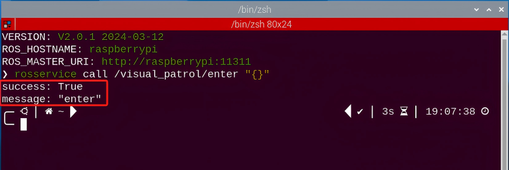

* **Start image transmission** 

(1) Start with browser

To avoid consuming too much running memory of Raspberry Pi. It is recommended to use an external browser to start image transmission. 

The specific steps are as follows:

① Select a browser. Take Google Chrome as example.


② Then enter the default IP address "**192.168.149.1:8080/**" (Note: this IP address is the default IP address for direction connection mode. If it is LAN mode, please enter "**Device IP address+：8080/**", for example, "**192.168.149.1:8080/**" ) If fail to open, you can try it several times or restart the Raspberry Pi and the computer.


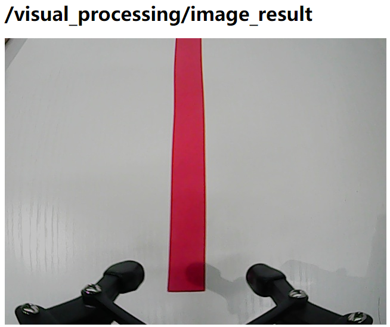

* **Start with rqt** 

(1) After completing the steps of  "[**8.7.2 Operation Steps -> Enter Game**](#7_enter_game)"  and do not exit the terminal, open a new terminal.

(2) Enter the following command and press "**Enter**" to open rqt.

```bash
rqt_image_view
```


(3) Click the red box as the figure shown below, select "**/visual_processing/image_result**" for the topic of line following and remain other settings unchanged. 


:::{Note}
After opening image, the topic option must be selected. Otherwise, after starting game, the recognition process can not be displayed normally.
:::

<span id="7_start_game" class="anchor"></span>

* **Start Game** 

(1) Now, enter the terminal according to the steps in "[**8.7.2 Operation Steps -> Enter Game**](#7_enter_game)" and input the following command. Then if the prompt shown in the following red box appears, which means game has been started successfully.

```bash
rosservice call /visual_patrol/set_running "data: true"
```

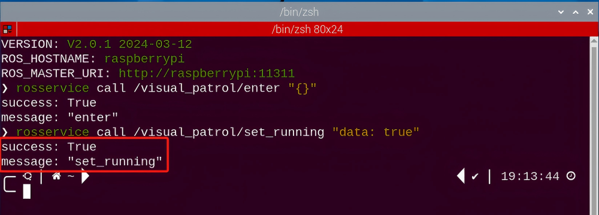

(2) After starting the game, select the line color. Take following red line as example. Enter the command below.

```bash
rosservice call /visual_patrol/set_target "data: 'red'"
```

:::{Note}
If want to change the target line from red to green or blue. You can replace red in "**data: 'red '**" with green or blue. (The entered command should be case sensitive.)
:::

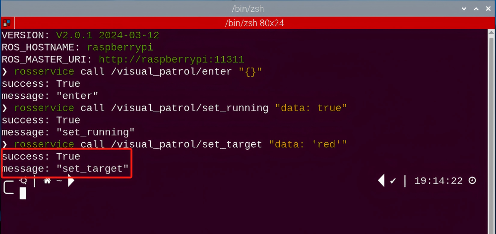

* **Stop and Exit** 

(1) If want to stop the game, enter the following command. After stopping , you can refer to the content of "[**8.7.2 Operation Steps -> Start Game**](#7_start_game)" to change line color and start following again. 

```bash
rosservice call /visual_patrol/set_running "data: false"
```

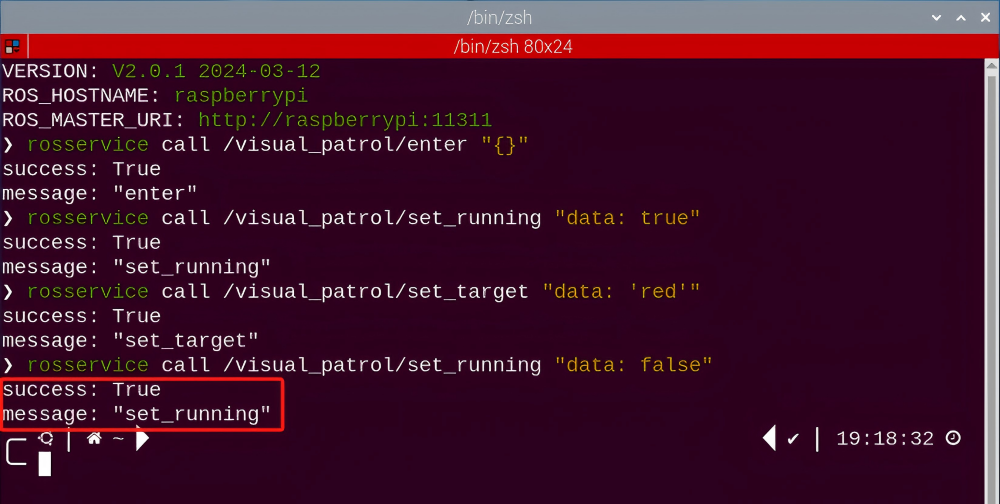

(2) If want to exit the game, enter the following command to exit.

```bash
rosservice call /visual_patrol/exit "{}"
```

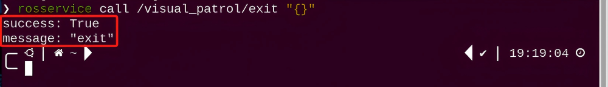

:::{Note}
Before exiting the game, it will keep running when Raspberry Pi is powered on. To avoid consume too much running memory of Raspberry Pi, you need to exit the game first according to the operation steps above before performing other AI vision games.
:::

(3) If want to exit the image transmission, press "**Ctrl+C**" to return and open the terminal of rqt. If fail to exit, please keep trying several times.

### 8.7.3 Project Outcome

Stick the tape on a flat surface and put ArmPi Pro on the red line. After starting game, robot will follow the red line.


### 8.7.4 Program Analysis

The source code for the program corresponding to this section is located in the Docker container:

[/home/ubuntu/armpi_pro/src/visual_processing/scripts/visual_processing_node.py](../_static/source_code/visual_processing_node.zip)(image processing)

[/home/ubuntu/armpi_pro/src/visual_patrol/scripts/visual_patrol_node.py](../_static/source_code/visual_patrol_node.zip)(line following)

:::{Note}
please back up the initial program before making any modifications. It is prohibited editing the source code files directly to prevent making changes in an incorrect manner that could lead to robot malfunctions, rendering them irreparable.
:::

* **Import Parameter Module** 

| **Imported Module**                                  | **Function**                                                 |
| ---------------------------------------------------- | ------------------------------------------------------------ |
| import sys                                           | The sys module of Python is imported to access to system-related functionalities and variables. |
| import cv2                                           | The OpenCV library of Python is imported to perform image processing and computer vision-related functions. |
| import time                                          | The time module of Python is imported to perform time-related functionalities, such as delay operations. |
| import math                                          | The math module of Python is imported to perform mathematical operations and functions. |
| import rospy                                         | The Python library rosy is imported for  communication and interaction with ROS. |
| import numpy as np                                   | The NumPy library is imported and is renamed as np for performing array and matrix operations. |
| from armpi_pro import Misc                           | The Misc module is imported from arm_pi_pro package to handle the recognized rectangular data. |
| from armpi_pro import apriltag                       | The apriltag module is imported from arm_pi_pro package  to perform Apriltag recognition and processing. |
| from threading import RLock, Timer                   | The "**RLock**" class and "**Timer**" class is imported from the threading module of Python for thread-related operations. |
| from std_srvs.srv import *                           | All service message types are imported from the std_srvs in ROS for defining and using standard service messages. |
| from std_msgs.msg import *                           | All message types are imported form the std_msgs package in ROS for defining and using standard messages. |
| from sensor_msgs.msg import Image                    | The image message type is imported from the sensor_msgs packages for processing image data. |
| from visual_processing.msg import Result             | The Result message type is imported from the visual_processing package for the message of image processing results. |
| from visual_processing.srv import SetParam           | The SetParam service type is imported from the visual_processing packages for using customs service related to parameter settings. |
| from sensor.msg import Led                           | The Led message type is imported form the sensor.msg module for controlling or representing the LED status on a sensor. |
| from chassis_control.msg import *                    | All message types are imported from the chassis_control.msg module, which indicated that all message types defined in this module is imported to perform the chassis control. |
| from visual_patrol.srv import SetTarget              | The SetTarget service type is imported from the visual_patrol.srv module is used to set a target for line following. |
| from hiwonder_servo_msgs.msg import MultiRawIdPosDur | The MultiRawIdPosDur message type is imported from the hiwonder_servo_msgs.msg module for controlling servos. |
| from armpi_pro import PID                            | The PID class is imported from thearmpi_pro module to perform PID algorithm. |
| from armpi_pro import bus_servo_control              | The bus_servo_control module is imported from the armpi_pro module, including the functions and methods related to the servo control. |
| from kinematics import ik_transform                  | The ik_transform function is imported from the kinematics module to perform conversion of inverse kinematics. |

* **Initializing functions and variables** 

{lineno-start=159}

```python
	# 线条识别函数(line recognition function)
def line_detect(img, color):
    global pub_time
    global publish_en
    global color_range_list
    
    if color == 'None':
        return img
    
    n = 0
    line_width = 0
    msg = Result()
    area_max = 0
    weight_sum = 0
    centroid_x_sum = 0
    area_max_contour = 0
    img_copy = img.copy()
    img_h, img_w = img.shape[:2]
    frame_resize = cv2.resize(img_copy, size_s, interpolation=cv2.INTER_NEAREST)
    #frame_gb = cv2.GaussianBlur(frame_resize, (3, 3), 3) 
    #将图像分割成上中下三个部分，这样处理速度会更快，更精确(divide the image into three parts (upper, middle, and lower) can make the processing faster and more accurate)
    for r in roi:
        roi_h = roi_h_list[n]
        n += 1       
        blobs = frame_resize[r[0]:r[1], r[2]:r[3]]
        frame_lab = cv2.cvtColor(blobs, cv2.COLOR_BGR2LAB)  # 将图像转换到LAB空间(convert the image to LAB space)
        if color in color_range_list:
            color_range = color_range_list[color]
            frame_mask = cv2.inRange(frame_lab, tuple(color_range['min']), tuple(color_range['max']))  # 对原图像和掩模进行位运算(perform bitwise operation on the original image and the mask)
            eroded = cv2.erode(frame_mask, cv2.getStructuringElement(cv2.MORPH_RECT, (2, 2)))  # 腐蚀(erode)
            dilated = cv2.dilate(eroded, cv2.getStructuringElement(cv2.MORPH_RECT, (2, 2)))  # 膨胀(dilate)
            contours = cv2.findContours(dilated, cv2.RETR_EXTERNAL, cv2.CHAIN_APPROX_NONE)[-2]  # 找出轮廓(find contours)
            area_max_contour, area_max = getAreaMaxContour(contours)  # 找出最大轮廓(find the largest contour)
        if area_max > 50:  # 有找到最大面积(found the maximum area)
            rect = cv2.minAreaRect(area_max_contour)  #最小外接矩形(minimum bounding rectangle)
            box = np.int0(cv2.boxPoints(rect))        #最小外接矩形的四个顶点(four vertices of the minimum bounding rectangle)
            for i in range(4):
```

* **Binarization** 

Using the `inRange()` function from the cv2 library to perform binarization on image. 

{lineno-start=187}

```python
	            frame_mask = cv2.inRange(frame_lab, tuple(color_range['min']), tuple(color_range['max']))  # 对原图像和掩模进行位运算(perform bitwise operation on the original image and the mask)
```

The first parameter `frame_lab` is the input image;

The second parameter `tuple(color_range['min'])` is the lower limit of threshold;

The third parameter `tuple(color_range['max'])` is the upper limit of 
threshold.

* **Dilation and Erosion** 

To reduce interference and create smoother images, erosion and dilation processes are applied.

{lineno-start=188}

```python
	            eroded = cv2.erode(frame_mask, cv2.getStructuringElement(cv2.MORPH_RECT, (2, 2)))  # 腐蚀(erode)
            dilated = cv2.dilate(eroded, cv2.getStructuringElement(cv2.MORPH_RECT, (2, 2)))  # 膨胀(dilate)
```

`erode()` function is applied to erode image. Here uses an example of the code `eroded = cv2.erode(frame_mask, cv2.getStructuringElement (cv2.MORPH_RECT, (3, 3)))`. The meaning of parameters in parentheses are as follow:

The first parameter `frame_mask` is the input image.

The second parameter `cv2.getStructuringElement(cv2.MORPH_RECT, (3, 3))` is the structural elements and kernel that determines the nature of operation. 

The first parameter in parentheses is the shape of kernel and the second parameter is the size of kernel.

`dilate()` function is applied to dilate image. The meaning of parameters in parentheses is the same as the parameters of "**erode()**" function.

* **Obtain the contour of the maximum area** 

After processing the above image, obtain the contour of the recognition target.  The "**findContours()**" function in cv2 library is involved in this process.

{lineno-start=190}

```python
	            contours = cv2.findContours(dilated, cv2.RETR_EXTERNAL, cv2.CHAIN_APPROX_NONE)[-2]  # 找出轮廓(find contours)
```

The `erode()` function is applied to erode. Take code `contours = cv2.findContours(dilated, cv2.RETR_EXTERNAL, cv2.CHAIN_APPROX_NONE)[-2]`as example.

The first parameter `dilated` is the input image.

The second parameter `cv2.RETR_EXTERNAL` is the contour retrieval mode.

The third parameter `cv2.CHAIN_APPROX_NONE)[-2]` is the approximate method of contour.

Find the maximum contour from the obtained contours. To avoid interference, set a minimum value. Only when the area is greater than this minimum value, the target contour will take effect. The minimum value here is `50`. 

{lineno-start=191}

```python
	            area_max_contour, area_max = getAreaMaxContour(contours)  # 找出最大轮廓(find the largest contour)
        if area_max > 50:  # 有找到最大面积(found the maximum area)
```

* **Obtain position information** 

The `minAreaRect()` function in cv2 library is used to obtain the minimum external rectangle of the target contour, and the coordinates of its four vertices are obtained through the `boxPoints()` function. Then, the coordinates of the center point of the rectangle can be calculated from the coordinates of the vertexes of the rectangle.

{lineno-start=193}

```python
	            rect = cv2.minAreaRect(area_max_contour)  #最小外接矩形(minimum bounding rectangle)
            box = np.int0(cv2.boxPoints(rect))        #最小外接矩形的四个顶点(four vertices of the minimum bounding rectangle)
            for i in range(4):
                box[i, 1] = box[i, 1] + (n - 1)*roi_h + roi[0][0]
                box[i][0] = int(misc.map(box[i][0], 0, size_s[0], 0, img_w))
                box[i][1] = int(misc.map(box[i][1], 0, size_s[1], 0, img_h))
            cv2.drawContours(img, [box], -1, (0, 255, 255), 2)  #画出四个点组成的矩形(draw a rectangle with four points)
            #获取矩形的对角点(obtain the diagonal points of the rectangle)
            pt1_x, pt1_y = box[0, 0], box[0, 1]
            pt2_x, pt2_y = box[1, 0], box[1, 1]
            pt3_x, pt3_y = box[2, 0], box[2, 1]
            center_x = int((pt1_x + pt3_x) / 2) #中心点(center point)
            center_y = int((pt1_y + pt3_y) / 2)
            line_width = int(abs(pt1_x - pt2_x))
            cv2.circle(img, (center_x, center_y), 5, (0,0,0), -1) #画出中心点(draw the center point)
```

* **Line Following Control** 

After performing the image processing, control the motors on ArmPi Pro through invoking the `set_velocity.publis()` function.

{lineno-start=104}

```python
            # PID算法巡线(line following with PID algorithm)
            if abs(center_x - img_w/2) < 20: # 目标横坐标与画面中心坐标的差值小于20像素点，机器人不做处理(If the difference between the target placement coordinate and the center coordinate of the image is less than 20 pixels, the robot will not take any action.)
                center_x = img_w/2
            x_pid.SetPoint = img_w/2      # 设定(set)
            x_pid.update(center_x)        # 当前(current)
            dx = round(x_pid.output, 2)   # 输出(output)
            dx = 0.8 if dx > 0.8 else dx
            dx = -0.8 if dx < -0.8 else dx
            set_velocity.publish(100, 90, dx)
            move = True
```

`set_velocity.publish()` function is used for motor control. Here use an example of the code `set_velocity.publish(100, 90, dx)`:

The first parameter `100` represents the linear velocity, indicating the speed of the motor in millimeters per second. The range is "**-100 to 100**". When the value is negative, the motor rotates in the opposite direction.

The second parameter `90` represents the heading angle, indicating the direction of movement for the vehicle in degrees. The range is "**0 to 360**". Where 90 degrees corresponds to forward, 270 degrees to backward, 0 degrees to right, and 180 degrees to left. 

The third parameter `dx` represents the yaw angular velocity, indicating the rate of yaw change for the vehicle. It is measured in 5 degrees per second and is constrained in the program to the range of "**-0.8 to 0.8**". A positive value corresponds to clockwise rotation, 

### 8.7.5 Function Extension

<span id="anchor_8_7_5_1" class="anchor"></span>

* **Add New Recognition Color** 

In addition to the built-in colors (red and white), we can add other colors for line following. For example, add purple as a new recognition color. The operation step are as follow:

(1) Open the terminal, enter the following command and press "**Enter**" to open the tool for color threshold adjustment. If no transmitted image appears in the pop-up interface, it means the camera fails to connect and needs to be checked whether the cable is connected.

```bash
python3 /home/ubuntu/software/lab_config/main.py
```


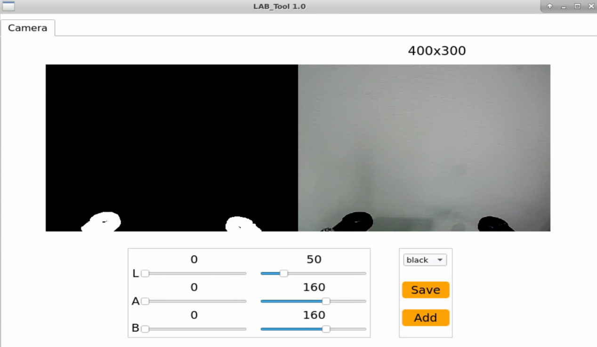

(2) After the camera is connected completely, click "**Add**" in the lower right color to name the new color.

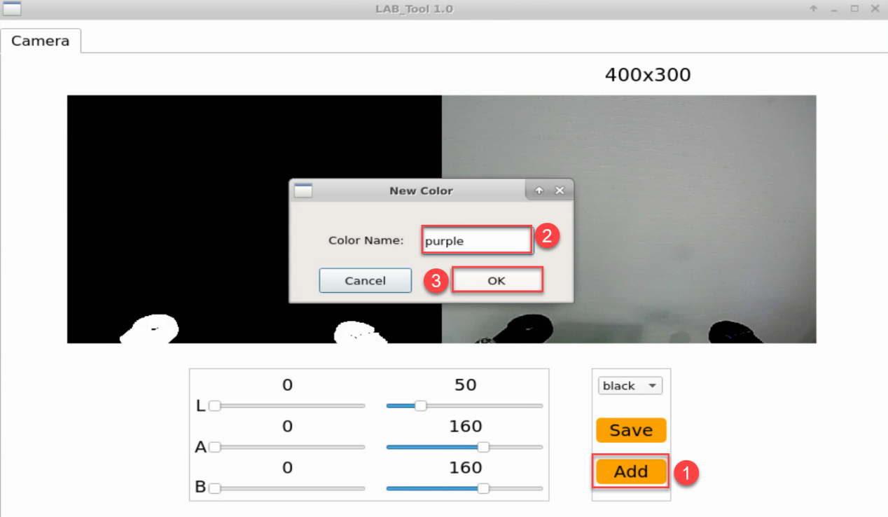

(3) The right side is real-time transmitted image and the right side is the color to be collected. Point the camera at the purple tape and then drag the following six slider bars until the purple area becomes white and other areas become black. The threshold can be adjusted according the actual situation. Then click "**Save**" to save data.

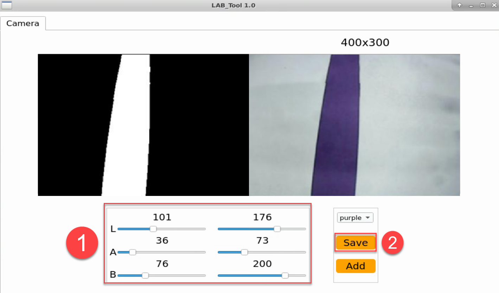

(4) Refer to step 2 to open a new terminal. Enter the following command to navigate to the directory where the game program is located, then press "**Enter**". 

```bash
cd /home/ubuntu/armpi_pro/src/visual_patrol/scripts/
```

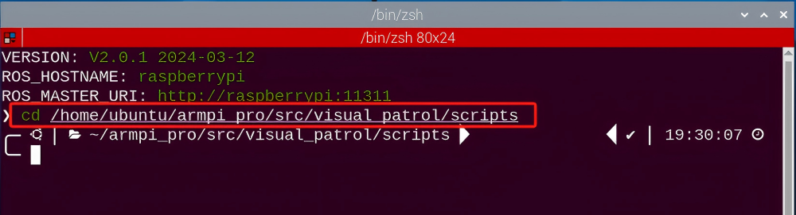

(5) Enter the command below to open the program file, then press "**Enter**".

```bash
vim visual_patrol_node.py
```

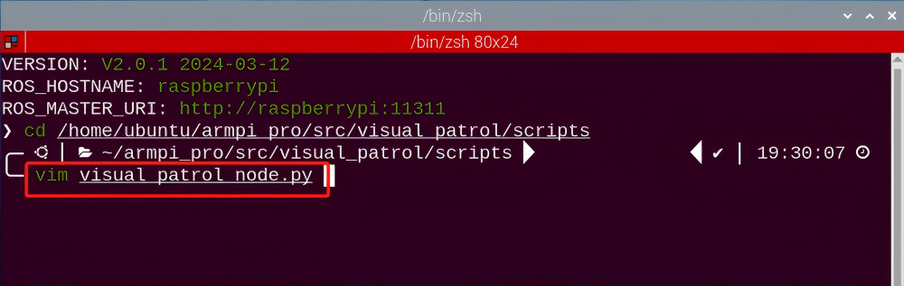

(6) Locate the code to be modified, press the "**i**" key on the keyboard, and enter the editing mode when the content shown in the following red box in the lower-left corner appears.

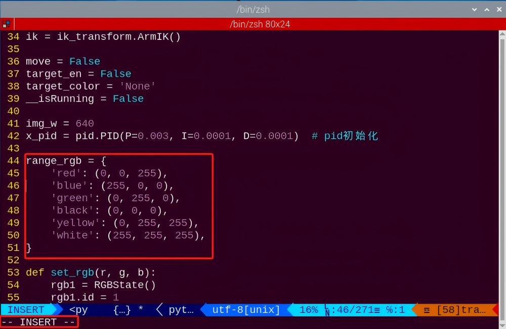

(7) Enter the purple's RGB value into the source code.

{lineno-start=51}

```python
'purple': (203, 192, 255),
```

(8) Press the "**Esc**", enter "**:wq**", and press "**Enter**" to complete the save and exit operation.


(9) Follow "[**8.7.2 Operation Steps**](#anchor_8_7_2)" to start the visual line following game.

(10) Place the ArmPi Pro in front of the purple line, and it will follow the movement of the purple line. If you need to add other colors as recognizable color, please refer to step "[**8.7.5 Function Extension -> Add New Recognition Color**](#anchor_8_7_5_1)".

## 8.8 Intelligent Picking

:::{Note}
It is recommended to place the color block in the center of the camera's field of view for the game implementation. Avoid positioning it too far away or too close to the camera, as this may cause the robotic arm failing to pick it up.
:::

### 8.8.1 Working Principle

Firstly, recognize the color and convert the object color through Lab color. Then, frame the target object with circle after processing the object image.

After recognizing, robotic arm will pick according to the position of block and place it to the specified position.  

### 8.8.2 Operation Steps

:::{Note}
It should be case sensitive when entering command and the "**Tab**" key can be used to complete the keywords.
:::

<span id="8_enter_game" class="anchor"></span>

* **Enter Game** 

(1) Power on the robot and use VNC Viewer to connect to the remote desktop.


(1) click in the upper left corner of the system desktop to open the "**Terminator**".


(3) Enter the following command, and press "**Enter**" to access the intelligent picking game. 

```bash
rosrun intelligent_grasp intelligent_grasp_node.py
```

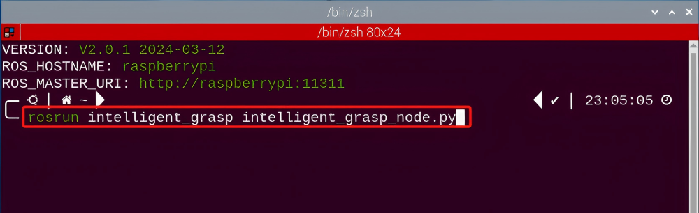

(4) Keep the previously opened terminal and open a new one. Enter the following command in the new terminal and press "**Enter**" to enter the intelligent picking game. If successful, a prompt will appear, as shown below:

```bash
rosservice call /intelligent_grasp/enter "{}"
```
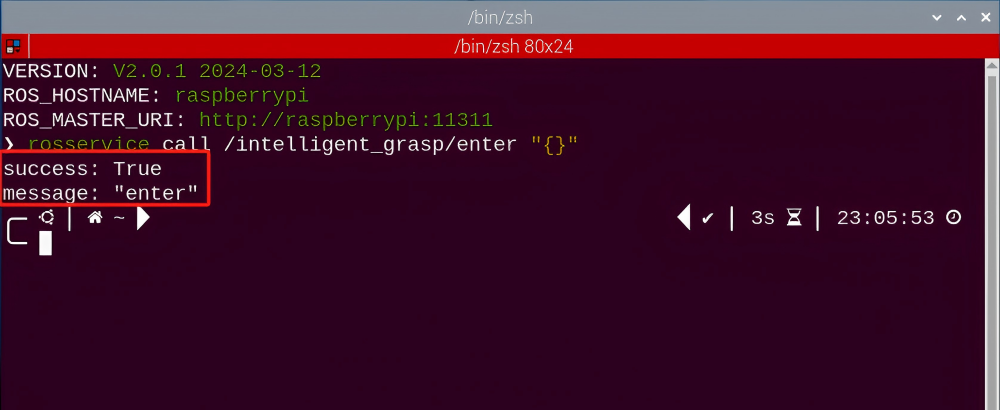

* **Start image transmission** 

To avoid consuming too much running memory of Raspberry Pi. It is recommended to use an external browser to open the transmitted image. 
The specific steps are as follows:

(1) Select a browser. Take Google Chrome as example.


(2) Then enter the default IP address "**192.168.149.1:8080/**" (Note: this IP address is the default IP address for direction connection mode. If it is LAN mode, please enter "**Device IP address+：8080/**" for example, "**192.168.149.1:8080/**") If fail to open, you can try it several times or restart camera.

:::{Note}
If it is in LAN mode, the method to obtain device IP address can refer to "[**Robot Network Configuration Course**](https://docs.hiwonder.com/projects/ArmPi_Pro/en/latest/docs/15_network_configuration.html)"
:::

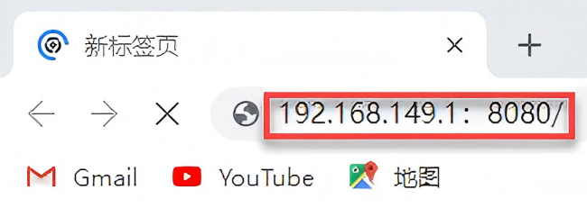

(3) Then, click the option shown in the following figure to open the display window of the transmitted image.


* **Start with rqt** 

(1) After completing the steps of "[**8.8.2 Operation Steps -> Enter Game**](#8_enter_game)" and do not exit the terminal, open a new terminal.

(2) Enter the following command and press "**Enter**" to open rqt.

```bash
rqt_image_view
```


(3) Click the red box as the figure shown below, select "**/visual_processing/image_result**" for the topic of line following and remain other settings unchanged. 


:::{Note}
 After opening image, the topic option must be selected. Otherwise, after starting game, the recognition process can not be displayed normally.
:::

* **Start Game**

Now, enter the terminal according to the steps in "[**8.8.2 Operation Steps -> Enter Game**](#8_enter_game)" and input the following command. Then if the prompt shown in the following red box appears, which means game has been started successfully.

```bash
rosservice call /intelligent_grasp/set_running "data: true"
```


* **Stop and Exit**

(1) If want to stop the game, enter the following command to exit.

```bash
rosservice call /intelligent_grasp/set_running "data: false"
```

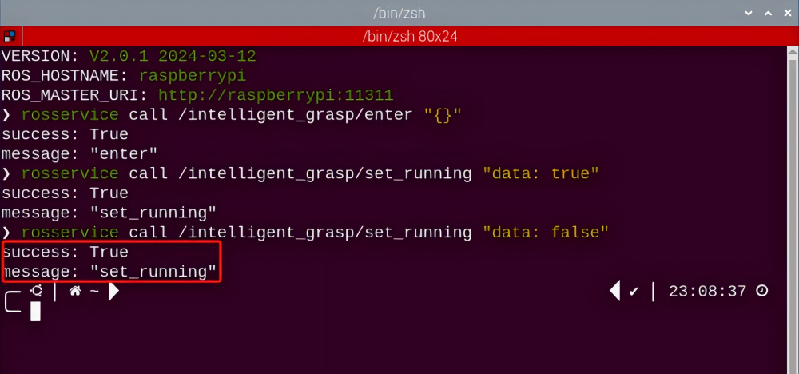

(2) If want to exit the game, enter the command below to exit.

```bash
rosservice call /intelligent_grasp/exit "{}"
```

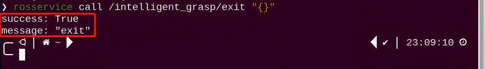

:::{Note}
Before exiting the game, it will keep running when Raspberry Pi is powered on. To avoid consume too much running memory of Raspberry Pi, you need to exit the game first according to the operation steps above before performing other AI vision games.
:::

(3) If want to close the image transmission, press "**Ctrl+C**" to return and open the terminal of rqt. If fail to exit, please keep trying several times.

### 8.8.3 Project Outcome

After starting the game, the robotic arm will rotate to search the block. We can see that that target block is framed in rqt tool after recognition. Then the robotic arm will slowly move to the block, grip and place it to the specified position.

### 8.8.4 Program Analysis

The source code of the program is located in the Docker container:

[/home/ubuntu/armpi_pro/src/visual_processing/scripts/visual_processing_node.py](../_static/source_code/visual_processing_node.zip)(image analysis)

[/home/ubuntu/armpi_pro/src/intelligent_grasp/scripts/intelligent_grasp_node.py](../_static/source_code/intelligent_grasp_node.zip)(picking control)

The source code of program is located in: [/home/ubuntu/armpi_pro/src/intelligent_grasp/scripts/intelligent_grasp_node.py](../_static/source_code/intelligent_grasp_node.zip)

:::{Note}

please back up the initial program before making any modifications. It is prohibited editing the source code files directly to prevent making changes in an incorrect manner that could lead to robot malfunctions, rendering them irreparable.
:::

* **Import Parameter Module**

| **Imported Module**                                  | **Function**                                                 |
| ---------------------------------------------------- | ------------------------------------------------------------ |
| import sys                                           | The sys module of Python is imported to access to system-related functionalities and variables. |
| import cv2                                           | The OpenCV library of Python is imported to perform image processing and computer vision-related functions. |
| import time                                          | The time module of Python is imported to perform time-related functionalities, such as delay operations. |
| import math                                          | The math module of Python is imported to perform mathematical operations and functions. |
| import rospy                                         | The Python library rosy is imported for  communication and interaction with ROS. |
| import numpy as np                                   | The NumPy library is imported and is renamed as np for performing array and matrix operations. |
| from armpi_pro import Misc                           | The Misc module is imported from arm_pi_pro package to handle the recognized rectangular data. |
| from armpi_pro import apriltag                       | The apriltag module is imported from arm_pi_pro package  to perform Apriltag recognition and processing. |
| from threading import RLock, Timer                   | The "**RLock**" class and "**Timer**" class is imported from the threading module of Python for thread-related operations. |
| from std_srvs.srv import *                           | All service message types are imported from the std_srvs in ROS for defining and using standard service messages. |
| from std_msgs.msg import *                           | All message types are imported form the std_msgs package in ROS for defining and using standard messages. |
| from sensor_msgs.msg import Image                    | The image message type is imported from the sensor_msgs packages for processing image data. |
| from visual_processing.msg import Result             | The Result message type is imported from the visual_processing package for the message of image processing results. |
| from visual_processing.srv import SetParam           | The SetParam service type is imported from the visual_processing packages for using customs service related to parameter settings. |
| from sensor.msg import Led                           | The Led message type is imported form the sensor.msg module for controlling or representing the LED status on a sensor. |
| from chassis_control.msg import *                    | All message types are imported from the chassis_control.msg module, which indicated that all message types defined in this module is imported to perform the chassis control. |
| from visual_patrol.srv import SetTarget              | The SetTarget service type is imported from the visual_patrol.srv module is used to set a target for line following. |
| from hiwonder_servo_msgs.msg import MultiRawIdPosDur | The MultiRawIdPosDur message type is imported from the hiwonder_servo_msgs.msg module for controlling servos. |
| from armpi_pro import PID                            | The PID class is imported from thearmpi_pro module to perform PID algorithm. |
| from armpi_pro import bus_servo_control              | The bus_servo_control module is imported from the armpi_pro module, including the functions and methods related to the servo control. |
| from kinematics import ik_transform                  | The ik_transform function is imported from the kinematics module to perform conversion of inverse kinematics. |

* **Initializing functions and variables**

{lineno-start=273}

```python
	# 多颜色识别函数(multiple colors recognition function)
def colors_detect(img, color_list):
    global pub_time
    global publish_en
    global color_range_list
    
    if color_list == 'RGB' or color_list == 'rgb':
        color_list = ('red','green','blue')
    else:
        return img
    
    msg = Result()
    msg.data = 0
    color_num = 0
    max_area = 0
    color_area_max = None
    areaMaxContour_max = 0
    
    img_copy = img.copy()
    img_h, img_w = img.shape[:2]
    frame_resize = cv2.resize(img_copy, size_m, interpolation=cv2.INTER_NEAREST)
    frame_lab = cv2.cvtColor(frame_resize, cv2.COLOR_BGR2LAB)  # 将图像转换到LAB空间(convert the image to LAB space)
    
    for color in color_list:
        if color in color_range_list:
            color_range = color_range_list[color]
            frame_mask = cv2.inRange(frame_lab, tuple(color_range['min']), tuple(color_range['max']))  # 对原图像和掩模进行位运算(perform bitwise operation on the original image and the mask)
            eroded = cv2.erode(frame_mask, cv2.getStructuringElement(cv2.MORPH_RECT, (2, 2)))          # 腐蚀(erode)
            dilated = cv2.dilate(eroded, cv2.getStructuringElement(cv2.MORPH_RECT, (2, 2)))            # 膨胀(dilate)
            contours = cv2.findContours(dilated, cv2.RETR_EXTERNAL, cv2.CHAIN_APPROX_NONE)[-2]         # 找出轮廓(find contours)
            areaMaxContour, area_max = getAreaMaxContour(contours)                                   # 找出最大轮廓(find the largest contour)
            if areaMaxContour is not None:
                if area_max > max_area:#找最大面积(find the largest area)
                    max_area = area_max
                    color_area_max = color
```

* **Binarization** 

Use the `inRange ()` function from the cv2 library to binarize the image

{lineno-start=299}

```python
	            frame_mask = cv2.inRange(frame_lab, tuple(color_range['min']), tuple(color_range['max']))  # 对原图像和掩模进行位运算(perform bitwise operation on the original image and the mask)
```

The first parameter `frame_lab` is the input image.

The second parameter `tuple(color_range['min'])` is the lower limit of threshold.

The third parameter `tuple(color_range['max'])` is the upper lower of threshold.

* **Dilation and erosion** 

To reduce interference and make a smooth image, it is necessary to perform dilation and erosion operations on the image.

{lineno-start=300}

```python
	            eroded = cv2.erode(frame_mask, cv2.getStructuringElement(cv2.MORPH_RECT, (2, 2)))          # 腐蚀(erode)
            dilated = cv2.dilate(eroded, cv2.getStructuringElement(cv2.MORPH_RECT, (2, 2)))            # 膨胀(dilate)
```

`erode()` function is applied to erode image. Here uses an example of the code `eroded = cv2.erode(frame_mask, cv2.getStructuringElement (cv2.MORPH_RECT, (2, 2)))` as example. The meaning of parameters in parentheses are as follow:

The first parameter `frame_mask` is the input image.

The second parameter `cv2.getStructuringElement(cv2.MORPH_RECT, (2, 2))` is the structural elements and kernel that determines the nature of operation. The first parameter in parentheses is the shape of kernel and the second parameter is the size of kernel.

`dilate()` function is applied to dilate image. The meaning of parameters in parentheses is the same as the parameters of "**erode()**" function.

* **Obtain the contour with the maximum area**

After processing the above image, obtain the contour of the recognition target. The `findContours()` function from the cv2 library is involved in this process.

{lineno-start=251}

```python
	            contours = cv2.findContours(dilated, cv2.RETR_EXTERNAL, cv2.CHAIN_APPROX_NONE)[-2]         # 找出轮廓(find contours)
```

The `erode()` function is applied to erode. Here uses an example of code `contours = cv2.findContours(dilated, cv2.RETR_EXTERNAL, cv2.CHAIN_ APPROX_NONE)[-2]`.

The first parameter `dilated` is the input image.

The second parameter `cv2.RETR_EXTERNAL` is the contour retrieval mode.

The third parameter`cv2.CHAIN_APPROX_NONE)[-2]` is the approximation method for contours.

Find the maximum contour from the obtained contours. To avoid interference, set a minimum value. Only when the area is greater than this minimum value, the target contour will take effect.

{lineno-start=303}

```python
            areaMaxContour, area_max = getAreaMaxContour(contours)                                   # 找出最大轮廓(find the largest contour)
            if areaMaxContour is not None:
```

* **Obtain position information**

The `minAreaRect()` function from the cv2 library is used to obtain the minimum enclosing circle and its center coordinates for the target contour. The `circle()`function is employed to display the circumcircle in the feedback image.

{lineno-start=310}

```python
	    if max_area > 100:  # 有找到最大面积(found the maximum area)
        (centerx, centery), radius = cv2.minEnclosingCircle(areaMaxContour_max)  # 获取最小外接圆(obtain the minimum circumscribed circle)
        msg.center_x = int(misc.map(centerx, 0, size_m[0], 0, img_w))
        msg.center_y = int(misc.map(centery, 0, size_m[1], 0, img_h))
        radius = int(misc.map(radius, 0, size_m[0], 0, img_w))
```

* **Determine the color block with the largest area.**

{lineno-start=318}

```python
	        if color_area_max == 'red':  #红色最大(red is the largest)
            msg.data = 1
        elif color_area_max == 'green':  #绿色最大(green is the largest)
            msg.data = 2
        elif color_area_max == 'blue':  #蓝色最大(blue is the largest)
            msg.data = 3
```

* **Gripping Control**

The position of the target on x, y and z axes are obtained after processing image. Then get the target position calculated by inverse kinematics and grip it.

{lineno-start=118}

```python
# 机器人移动函数(robot movement function)
def move():
    global arm_move
    global detect_color
    
    coord_list = { 'red':(-0.2, 0.15, -0.06),
                   'green':(-0.2, 0.05, -0.06),
                   'blue':(-0.2, -0.05, -0.06)}
    
    while __isRunning:
        if arm_move and detect_color != 'None': # 等待可以夹取(wait for the grasping)
            target_color = detect_color  # 暂存目标颜色(save target color temporarily)
            set_rgb(range_rgb[target_color][2], range_rgb[target_color][1], range_rgb[target_color][0])    # 设置rgb灯颜色(set the color of RGB light)
            rospy.sleep(0.1)
            set_buzzer(1900, 0.1, 0.9, 1) # 蜂鸣器响一下(buzzer makes a sound)
            bus_servo_control.set_servos(joints_pub, 500, ((1, 120),)) #张开机械爪(open the robotic gripper)
            rospy.sleep(0.5)
            target = ik.setPitchRanges((0, round(y_dis + offset_y, 4), -0.08), -180, -180, 0) #机械臂向下伸(the robotic arm extends downward)
            if target:
                servo_data = target[1]
                bus_servo_control.set_servos(joints_pub, 1, ((3, servo_data['servo3']), (4, servo_data['servo4']),
                                                                (5, servo_data['servo5']), (6, x_dis)))
            rospy.sleep(1.5)
            bus_servo_control.set_servos(joints_pub, 0.5, ((1, 450),)) # 闭合机械爪(close the robotic gripper)
            rospy.sleep(0.8)
```

The inverse kinematics takes `ik.setPitchRanges((0, round(y_dis + offset_y, 4), -0.08), -180, -180, 0)` as an example and the meaning of parameters in parentheses are as follow:

The first parameter is`(0, round(y_dis + offset_y, 4)`. "**0**" is the position of the target on x-axis. `round(y_dis, 4)` is the position of the target on y-axis. `round(z_dis, 4)` is the position of the target on z-axis.

The second parameter `-180` is the pitch angle.

The third parameter "**-180**" is the range of the pitch angle.

The fourth parameter `0` is the range of pitch angle.The servo control uses an example of code `bus_servo_control.set_servos(joints_pub, 20, ( (3, servo_data['servo3']), (4, servo_data['servo4']), (5, servo_data['servo5']), (6, x_dis)))` and the meaning of parameters in parentheses is as follow:

The first parameter `joints_pub` is to publish the message of servo control node.
The second parameter "**20**" is the running time.

The third parameter is `( (3, servo_data['servo3']), (4, servo_data['servo4']), (5, servo_data['servo5']), (6, x_dis)`. Among them, `3` is the servo number. `servo_data['servo3']` and the rest of parameters are the servo angle.

### 8.8.5 Function Extension

During the process of the game, if the robotic gripper fails to pick up the target, please ensure that the robotic arm deviation has been properly adjusted first. After confirming the adjustment, if the problem persists, you can modify the relevant parameters based on the following content.
As shown in the figure below, when the robotic arm recognizes the target, it will move to the top of the target. You can modify the parameter "**y_dis+offset_y**" to adjust the position. It is recommended to modify the parameter by ±0.01 each time. When the value is increased, the robotic arm will move 0.01m in the positive direction of the y-axis, and when the value is decreased, it will move 0.01m in the negative direction.

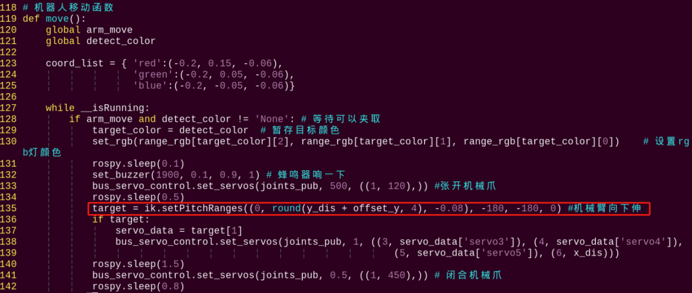

## 8.9 Intelligent Transport

:::{Note}
It is recommended to place the color block in the center of the camera's field of view for the game implementation. Avoid positioning it too far away or too close to the camera, as this may cause the robotic arm failing to pick it up.
:::

### 8.9.1 Getting Ready

Use yellow electrical tape to lay out the line-following map as the figure shown below:

It is recommended that the distance between two placement lines should be greater than 15cm. The radius of the turning arc should not be too small, otherwise it may affect the line-following performance.

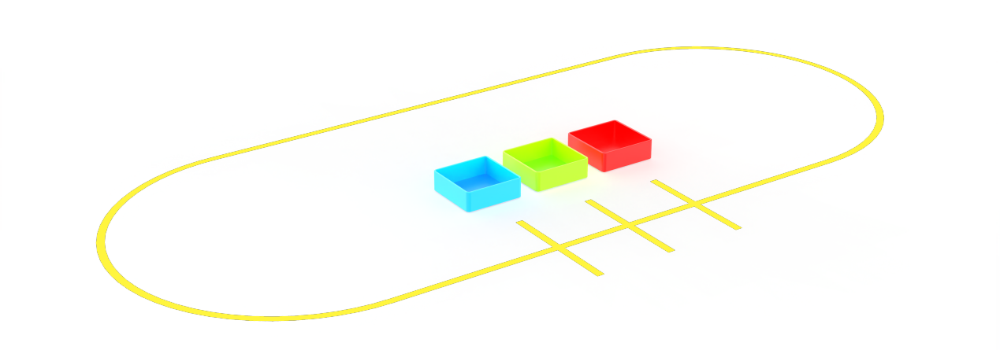

### 8.9.2 Working Principle

Recognize the block color first and grip it. Then read the corresponding position of the recognized color and detect the line color. After recognizing yellow line, the car will follow the line.
In the process of moving, the car will keep detecting the yellow line. When recognizing the numbers of line corresponding the colored block, the car will move to the corresponding position of color sorting. At this time, the robotic arm will put down the block and enter the next round of recognition.

<p id="anchor_8_9_3"></p>

### 8.9.3 Operation Steps

:::{Note}
It should be case sensitive when entering command and the "**Tab**" key can be used to complete the keywords.
:::

<span id="9_enter_game" class="anchor"></span>

* **Enter Game** 

(1) Power on the robot and use VNC Viewer to connect to the remote desktop.


(2) Click  in the upper left corner of the system desktop to open the "**Terminator**".


(3) Enter the following command to start the intelligent transport game.

```bash
rosrun intelligent_transport intelligent_transport_node.py
```

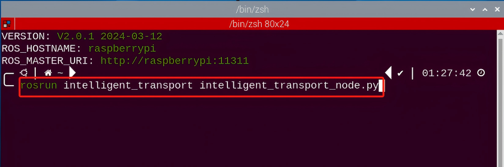

(4) Enter the command below and press "**Enter**" to enter the intelligent transport game. If successful, a prompt will appear, as shown below:

```bash
rosservice call /intelligent_transport/enter "{}"
```

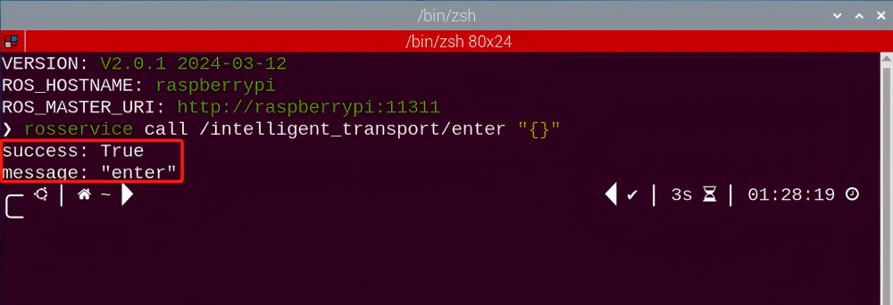

<span id="anchor_9_3_2" class="anchor"></span>

* **Start image transmission** 

(1) Start with browser

To avoid consuming too much running memory of Raspberry Pi. It is recommended to use an external browser to start image transmission. 

The specific steps are as follows:

①  Select a browser. Take Google Chrome as example.


② Then enter the default IP address "**192.168.149.1:8080/**" (Note: this IP address is the default IP address for direction connection mode). If it is LAN mode, please enter "**Device IP address+：8080/**" such as "**192.168.149.1:8080/**") If fail to open, you can try it several times or restart camera.

:::{Note}
 If it is in LAN mode, the method to obtain device IP address can refer to "[**Robot Network Configuration Course**](https://docs.hiwonder.com/projects/ArmPi_Pro/en/latest/docs/15_network_configuration.html)".
:::


③ Then, click the option shown in the following figure to open the display window of the transmitted image.


(2) Start with rqt

After completing the steps of "[**8.9.3 Operation Steps -> Enter Game**](#9_enter_game)" and do not exit the terminal, open a new terminal.

① Enter the following command and press "**Enter**" to open rqt.

```bash
rqt_image_view
```


② Click the red box as the figure shown below, select "**/visual_processing/image_result**" for the topic of line following and remain other settings unchanged, as the figure shown below:


:::{Note}
After opening image, the topic option must be selected. Otherwise, after starting game, the recognition process can not be displayed normally.
:::

* **Start Game** 

Now, enter the terminal according to the steps in "[**8.9.3 Operation Steps -> Enter Game**](#9_enter_game)" and input the following command. Then if the prompt shown in the following red box appears, which means game has been started successfully.

```bash
rosservice call /intelligent_transport/set_running "data: true"
```

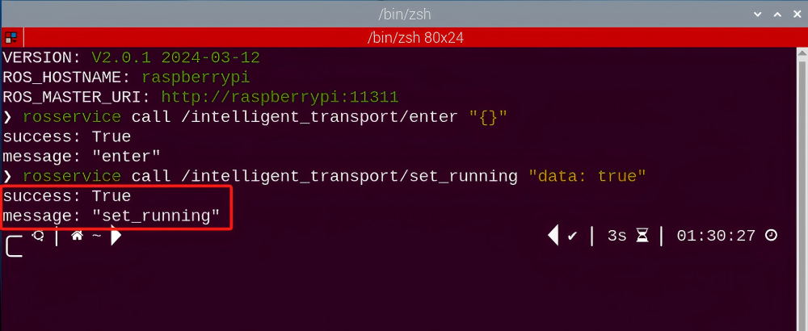

**9.3.4 Stop and Exit** 

(1) If want to stop the game, enter the following command.

```bash
rosservice call /intelligent_transport/set_running "data: false"
```

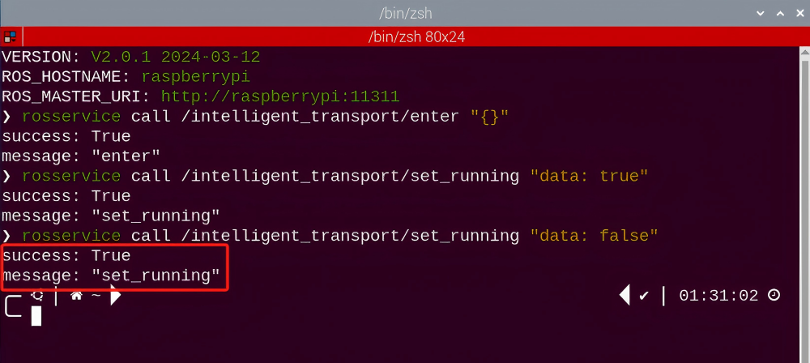

(2) If want to exit the game, enter the command below to exit.

```bash
rosservice call /intelligent_transport/exit "{}"
```

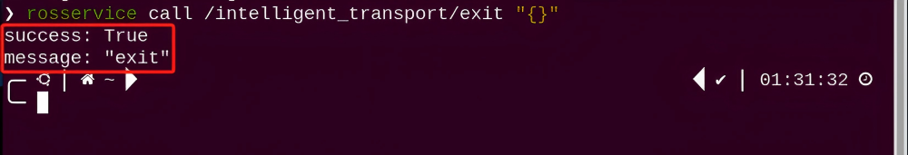

:::{Note}
Before exiting the game, it will keep running when Raspberry Pi is powered on. To avoid consume too much running memory of Raspberry Pi, you need to exit the game first according to the operation steps above before performing other AI vision games.
:::

(3) If want to close the image transmission, press "**Ctrl+C**" to return and open the terminal of rqt. If fail to exit, please keep trying several times.

### 8.9.4 Project Outcome

:::{Note}
It is recommended to place the color block in the center of the camera's field of view for the game implementation. Avoid positioning it too far away or too close to the camera, as this may cause the robotic arm failing to pick it up.
:::

After starting the game, hold the block within the detected range of camera. When the block is recognized by ArmPi Pro, it will grip it and keep following line. Then place the block with different colors to the corresponding position.
If you need to modify the time between placing the color block and waiting for the next pick-up, please refer to the "[**8.9.6 Function Extension**](#anchor_8_9_6)" for further learning.

### 8.9.5 Program Analysis

The source code of the program is located in the Docker container:

[/home/ubuntu/armpi_pro/src/visual_processing/scripts/visual_processing_node.py](../_static/source_code/visual_processing_node.zip)(image processing)

[/home/ubuntu/armpi_pro/src/intelligent_transport/scripts/intelligent_transport_node.py](../_static/source_code/intelligent_transport_node.zip)(function realization)

The source code of program is located in: [/home/ubuntu/armpi_pro/src/intelligent_transport/scripts/intelligent_transport_node.py](../_static/source_code/intelligent_transport_node.zip).

:::{Note}
 please back up the initial program before making any modifications. It is prohibited editing the source code files directly to prevent making changes in an incorrect manner that could lead to robot malfunctions, rendering them irreparable.
:::

* **Import Parameter Module**

| **Imported Module**                                  | **Function**                                                 |
| ---------------------------------------------------- | ------------------------------------------------------------ |
| import sys                                           | The sys module of Python is imported to access to system-related functionalities and variables. |
| import cv2                                           | The OpenCV library of Python is imported to perform image processing and computer vision-related functions. |
| import time                                          | The time module of Python is imported to perform time-related functionalities, such as delay operations. |
| import math                                          | The math module of Python is imported to perform mathematical operations and functions. |
| import rospy                                         | The Python library rosy is imported for  communication and interaction with ROS. |
| import numpy as np                                   | The NumPy library is imported and is renamed as np for performing array and matrix operations. |
| from armpi_pro import Misc                           | The Misc module is imported from arm_pi_pro package to handle the recognized rectangular data. |
| from armpi_pro import apriltag                       | The apriltag module is imported from arm_pi_pro package  to perform Apriltag recognition and processing. |
| from threading import RLock, Timer                   | The "**RLock**" class and "**Timer**" class is imported from the threading module of Python for thread-related operations. |
| from std_srvs.srv import *                           | All service message types are imported from the std_srvs in ROS for defining and using standard service messages. |
| from std_msgs.msg import *                           | All message types are imported form the std_msgs package in ROS for defining and using standard messages. |
| from sensor_msgs.msg import Image                    | The image message type is imported from the sensor_msgs packages for processing image data. |
| from visual_processing.msg import Result             | The Result message type is imported from the visual_processing package for the message of image processing results. |
| from visual_processing.srv import SetParam           | The SetParam service type is imported from the visual_processing packages for using customs service related to parameter settings. |
| from sensor.msg import Led                           | The Led message type is imported form the sensor.msg module for controlling or representing the LED status on a sensor. |
| from chassis_control.msg import *                    | All message types are imported from the chassis_control.msg module, which indicated that all message types defined in this module is imported to perform the chassis control. |
| from visual_patrol.srv import SetTarget              | The SetTarget service type is imported from the visual_patrol.srv module is used to set a target for line following. |
| from hiwonder_servo_msgs.msg import MultiRawIdPosDur | The MultiRawIdPosDur message type is imported from the hiwonder_servo_msgs.msg module for controlling servos. |
| from armpi_pro import PID                            | The PID class is imported from thearmpi_pro module to perform PID algorithm. |
| from armpi_pro import bus_servo_control              | The bus_servo_control module is imported from the armpi_pro module, including the functions and methods related to the servo control. |
| from kinematics import ik_transform                  | The ik_transform function is imported from the kinematics module to perform conversion of inverse kinematics. |

* **Initializing Functions and Variables** 

{lineno-start=273}

```python
	# 多颜色识别函数(multiple colors recognition function)
def colors_detect(img, color_list):
    global pub_time
    global publish_en
    global color_range_list
    
    if color_list == 'RGB' or color_list == 'rgb':
        color_list = ('red','green','blue')
    else:
        return img
    
    msg = Result()
    msg.data = 0
    color_num = 0
    max_area = 0
    color_area_max = None
    areaMaxContour_max = 0
    
    img_copy = img.copy()
    img_h, img_w = img.shape[:2]
    frame_resize = cv2.resize(img_copy, size_m, interpolation=cv2.INTER_NEAREST)
    frame_lab = cv2.cvtColor(frame_resize, cv2.COLOR_BGR2LAB)  # 将图像转换到LAB空间(convert the image to LAB space)
    
    for color in color_list:
        if color in color_range_list:
            color_range = color_range_list[color]
            frame_mask = cv2.inRange(frame_lab, tuple(color_range['min']), tuple(color_range['max']))  # 对原图像和掩模进行位运算(perform bitwise operation on the original image and the mask)
            eroded = cv2.erode(frame_mask, cv2.getStructuringElement(cv2.MORPH_RECT, (2, 2)))          # 腐蚀(erode)
            dilated = cv2.dilate(eroded, cv2.getStructuringElement(cv2.MORPH_RECT, (2, 2)))            # 膨胀(dilate)
            contours = cv2.findContours(dilated, cv2.RETR_EXTERNAL, cv2.CHAIN_APPROX_NONE)[-2]         # 找出轮廓(find contours)
            areaMaxContour, area_max = getAreaMaxContour(contours)                                   # 找出最大轮廓(find the largest contour)
            if areaMaxContour is not None:
                if area_max > max_area:#找最大面积(find the largest area)
                    max_area = area_max
                    color_area_max = color
```

* **Binarization** 

Use the `inRange ()` function from the cv2 library to perform binarization operation on image.

{lineno-start=299}

```python
	            frame_mask = cv2.inRange(frame_lab, tuple(color_range['min']), tuple(color_range['max']))  # 对原图像和掩模进行位运算(perform bitwise operation on the original image and the mask)
```

The first parameter `frame_lab` is the input image.

The second parameter `tuple(color_range['min'])` is the lower limit of threshold.

The third parameter `tuple(color_range['max'])` is the upper lower of threshold.

* **Dilation and Erosion** 

To reduce interference and make a smoother image, it is necessary to perform dilation and erosion operations on image.

{lineno-start=300}

```python
	            eroded = cv2.erode(frame_mask, cv2.getStructuringElement(cv2.MORPH_RECT, (2, 2)))          # 腐蚀(erode)
            dilated = cv2.dilate(eroded, cv2.getStructuringElement(cv2.MORPH_RECT, (2, 2)))            # 膨胀(dilate)
```

The `erode()` function is applied to erode. Uses an example of the code `eroded = cv2.erode(frame_mask, cv2.getStructuringElement(cv2.MORPH_RECT, (2, 2)))`. The meanings of parameters in parentheses are as follow:

The first parameter `frame_mask` is the input image.

The second parameter `cv2.getStructuringElement(cv2.MORPH_RECT, (2, 2))` is the structural elements and kernel that determines the nature of operation. The first parameter in parentheses is the shape of kernel and the second parameter is the size of kernel.
`dilate()` function is applied to dilate image. The meaning of parameters in parentheses is the same as the parameters of `erode()` function.

* **Obtain the contour with the largest area** 

After processing the above image, it is necessary to obtain the contour of the target. The `findContours()` function from the cv2 library is involved in this process.

{lineno-start=302}

```python
	            contours = cv2.findContours(dilated, cv2.RETR_EXTERNAL, cv2.CHAIN_APPROX_NONE)[-2]         # 找出轮廓(find contours)
```

{lineno-start=303}

```python
	            areaMaxContour, area_max = getAreaMaxContour(contours)                                   # 找出最大轮廓(find the largest contour)
            if areaMaxContour is not None:
```

* **Obtain the minimum enclosing circle and display on the live feed image** 

The `minEnclosingCircle()` function from the cv2 library is utilized to obtain the minimum enclosing circle and the coordinates of its center for the target contour. The obtained circle is then displayed in the feedback image using the `circle()` function.

{lineno-start=310}

```python
	    if max_area > 100:  # 有找到最大面积(found the maximum area)
        (centerx, centery), radius = cv2.minEnclosingCircle(areaMaxContour_max)  # 获取最小外接圆(obtain the minimum circumscribed circle)
        msg.center_x = int(misc.map(centerx, 0, size_m[0], 0, img_w))
        msg.center_y = int(misc.map(centery, 0, size_m[1], 0, img_h))
        radius = int(misc.map(radius, 0, size_m[0], 0, img_w))
        
        cv2.circle(img, (msg.center_x, msg.center_y), radius+5, range_rgb[color_area_max], 2)
```

* **Determine the color block with the largest area** 

{lineno-start=318}

```python
	        if color_area_max == 'red':  #红色最大(red is the largest)
            msg.data = 1
        elif color_area_max == 'green':  #绿色最大(green is the largest)
            msg.data = 2
        elif color_area_max == 'blue':  #蓝色最大(blue is the largest)
            msg.data = 3
```

* **Grip the block** 

The position of the target on x, y and z axes is obtained after processing image. Then the target position is calculated using inverse kinematics. Lastly, robot will perform the gripping action.

{lineno-start=331}

```python
                    # 机械臂追踪移动到色块上方(the robotic arm tracks and moves above the color block)
                    target = ik.setPitchRanges((0, round(y_dis, 4), 0.03), -180, -180, 0)
                    if target:
                        servo_data = target[1]
                        bus_servo_control.set_servos(joints_pub, 0.02,((3, servo_data['servo3']),         
                             (4, servo_data['servo4']),(5, servo_data['servo5']), (6, x_dis)))
                    
                    if dx < 2 and dy < 0.003 and not stable: # 等待机械臂稳定停在色块上方(wait for the robotic arm to steadily stop above the color block)
                        num += 1
                        if num == 10:
                            stable = True  # 设置可以夹取(Set to grip)
                            num = 0
                    else:
                        num = 0
                    
                    if stable: #控制机械臂进行夹取(control the robotic arm to grip)
                        offset_y = misc.map(target[2], -180, -150, -0.03, 0.03)
                        set_rgb(range_rgb[detect_color][2], range_rgb[detect_color][1], range_rgb[detect_color][0])       # 设置rgb灯颜色(set the color of the RGB light)
                        target_color = detect_color # 暂存目标颜色(save the target color temporarily)
                        set_buzzer(1900, 0.1, 0.9, 1) #蜂鸣器响一下(the buzzer makes a sound)
                        
                        bus_servo_control.set_servos(joints_pub, 0.5, ((1, 120),)) #张开机械爪(open the robotic gripper)
                        rospy.sleep(0.5)
                        target = ik.setPitchRanges((0, round(y_dis + offset_y, 5), -0.07), -180, -180, 0) #机械臂向下伸(the robotic arm extends downward)
```

The inverse kinematics takes `((0, round(y_dis, 4), 0.03), -180, -180, 0)` as example and the meanings of parameters in parentheses are as follows:

The first parameter is `(0, round(y_dis, 4)`. "**0**" is the position of the target on x-axis. `round(y_dis, 4)` is the position of the target on y-axis. `0.03` is the position of the target on z-axis.

The second parameter `-180` is the angle of x-axis.

The third parameter `-180` is the range of the pitch angle.

The fourth parameter `0` is the range of pitch angle.

The servo control takes the code `bus_servo_control.set_servos(joints_pub, 20, ( (3, servo_data['servo3']), (4, servo_data['servo4']), (5, servo_data['servo5']), (6, x_dis)))` as example and the meaning of parameters in parentheses is as follow:

The first parameter `joints_pub` is to publish the message of servo control node.

The second parameter `20` is the running time.

The third parameter is `( (3, servo_data['servo3']), (4, servo_data['servo4']), (5, servo_data['servo5']), (6, x_dis)`. Among them, `3` is the servo number. `servo_data['servo3']` and the rest of parameters are the servo angle.

* **Line Following** 

After gripping the block, the car will follow the line. Firstly, judge if there is the line within the detected range. The code is shown in the following figure:  

{lineno-start=218}

```python
            elif line_width > 0: #识别到线条(detected line)
```

Then the current x-coordinate of line subtracts the value of ideal center point. Get the yaw rate by PID mapping to adjust the speed of motor.

{lineno-start=219}

```python
                # PID算法巡线(Line following with PID algorithm)
                if abs(line_center_x - img_w/2) < 30:
                    line_center_x = img_w/2
                line_x_pid.SetPoint = img_w/2      # 设定(set)
                line_x_pid.update(line_center_x)   # 当前(current)
                dx = round(line_x_pid.output, 2)   # 输出(output)
                dx = 0.8 if dx > 0.8 else dx
                dx = -0.8 if dx < -0.8 else dx
                
                set_velocity.publish(100, 90, dx) # 控制底盘(control the chassis)
                chassis_move = True
```

Take the code `set_velocity.publish(100, 90, dx)` as example: 

The first parameter `100` is the linear velocity.

The second parameter `90` is the angular velocity.

The third parameter `dx` is the yaw rate. The larger the yaw rate, the faster the rotation speed of car.

* **Recognize the placement line** 

(1) Determine the number of lines

In the process of identifying the color of block, we set the corresponding numbers of recognized lines for placement position of different blocks, as the figure shown below: 

{lineno-start=206}

```python
    position = {'red':1, 'green':2, 'blue':3, 'None':-1} # 色块对应位置横线数(number of placement lines corresponding to the color block position)
```

If the recognized color is red, the robot will run the the code for transporting the block to the first placement line when it identifies single line.

If the recognized color is green, the robot will transport the block to the second placement line when only two lines are recognized. 

In the process of following line, the car will keep detecting the placement line. If the following condition is satisfied, which means the line is recognized.

{lineno-start=232}

```python
                    if line_width > 100 and block_clamp:  # 在夹取着色块时检测横线(detect placement line while gripping the color block)
```

Then determine the position of placement line.

{lineno-start=238}

```python
                        if transversae_num == position[target_color]: # 判断当前横线数量是否等于目标颜色对应的数量(check if the current number of placement lines equals the number of lines corresponding to the target color)
```

The width of the line is obtained by the following function.

{lineno-start=158}

```python
        # 更新线条或者色块位置参数(update line or color block position parameters)
        if detect_step == 'line':
            line_center_x = center_x
            line_center_y = center_y
            line_width = data
```

* **Stop recognizing** 

After all the lines are recognized completely, the recognition function will be stopped to prevent the interference from repeat recognition of the same placement line. 

{lineno-start=233}

```python
                        if (time.time()-transversae_time) > 1:
                            transversae_num += 1
                            print(transversae_num)
                            transversae_time = time.time()
```

* **Place the block** 

When the numbers of recognized placement lines is equivalent to the numbers of placement lines corresponding to the placement position of the target block, the car will stop in the corresponding position and the robotic arm will be controlled to place the block to the corresponding position.

{lineno-start=247}

```python
                elif place_en:
                    if time.time() >= place_delay: # 延时停下来，把色块放到横线旁边(Delay and stop, place the color block next to the placement line)
                        rospy.sleep(0.1)
                        set_velocity.publish(0, 0, 0)
                        target = ik.setPitchRanges((-0.24, 0.00, -0.04), -180, -180, 0) #机械臂移动到色块放置位置(move the robotic arm to the color block placement position)
                        if target:
                            servo_data = target[1]
                            bus_servo_control.set_servos(joints_pub, 1.2, ((6, servo_data['servo6']),)) 
                            rospy.sleep(1)
                            bus_servo_control.set_servos(joints_pub, 1.5, ((3, servo_data['servo3']), (4, servo_data['servo4']), (5, servo_data['servo5'])))
                        rospy.sleep(1.8)

                        bus_servo_control.set_servos(joints_pub, 0.5, ((1, 150),))  # 张开机械爪(open the robotic gripper)
                        rospy.sleep(0.8)
```

In the code shown in the figure above, the inverse kinematics is used to set the movement of robotic arm. Take code `target = ik.setPitchRanges((-0.24, 0.00, -0.04), -180, -180, 0)` as example:

The first parameter `(-0.24, 0.00, -0.04)` is the coordinate value (x,y,and z axes)  of the end of robotic arm.

The second parameter `-180` is the pitch angle value of the end of robotic arm.

The third and fourth parameter `-180` and  `0`  is the range of the pitch angle.

Due the limitation of the detected range of camera, when the car has not moved to the corresponding position and the lines is no longer in the detected range. Therefore, it is necessary to add a delay, so that the car can keep moving when the line is not recognized.

{lineno-start=239}

```python
                            place_en = True  # 放置使能(placement enable)
                            if transversae_num == 1:
                                place_delay = time.time() + 1.1 # 设置延时停下来时间(set delay stopping time)
                            elif transversae_num == 2:
                                place_delay = time.time() + 1.1
                            elif transversae_num == 3:
                                place_delay = time.time() + 1.2
```

Then the car continues following the line and return to the initial position, and starts the next round of recognizing and sorting.

{lineno-start=268}

```python
                        move_time = time.time() + (11.5 - transversae_num) # 设置放置色块后要巡线的时间，让机器人回到初始位置(set the time for line following after placing the color block, and make the robot return to the initial position)
                            
                        # 变量重置(reset variables)
                        place_en = False
                        block_clamp = False
                        target_color = 'None'
                        set_rgb('black')
                        transversae_num = 0
                
                if not block_clamp and time.time() >= move_time: # 放置色块后机器人巡线回到初始位置(the robot follows the line returning to the initial position after placing the color block)
                    rospy.sleep(0.1)
                    set_velocity.publish(0, 0, 0)
                    detect_step = 'color'
```

<p id="anchor_8_9_6"></p>

### 8.9.6 Function Extension

(1) Click  in the upper left corner of the system desktop to open the "**Terminator**".


(2) Enter the following command in the command line terminal, and press "**Enter**" to navigate to the game directory.

```bash
cd armpi_pro/src/intelligent_transport/scripts/
```

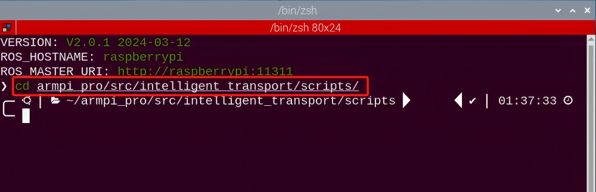

(3) Enter the command in the command line terminal, and press "**Enter**" to open the program file.

```bash
vim intelligent_transport_node.py
```

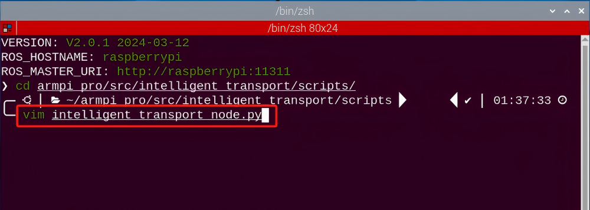

(4) Press "**i**" to enter the editing mode.

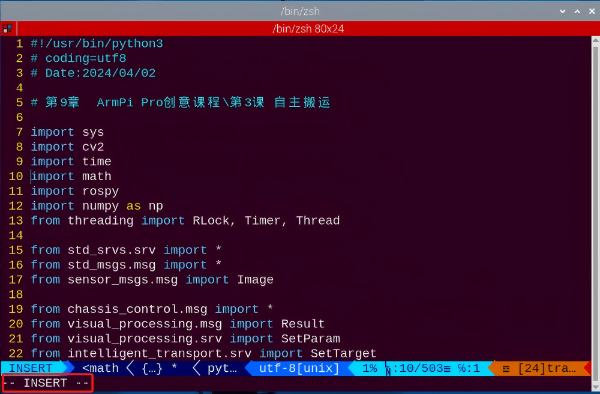

(5) To modify the code, the number in the red box shown in following diagram represents the time to wait for the next pick-up after placing the color block. Please modify it according to the actual situation of your map. 

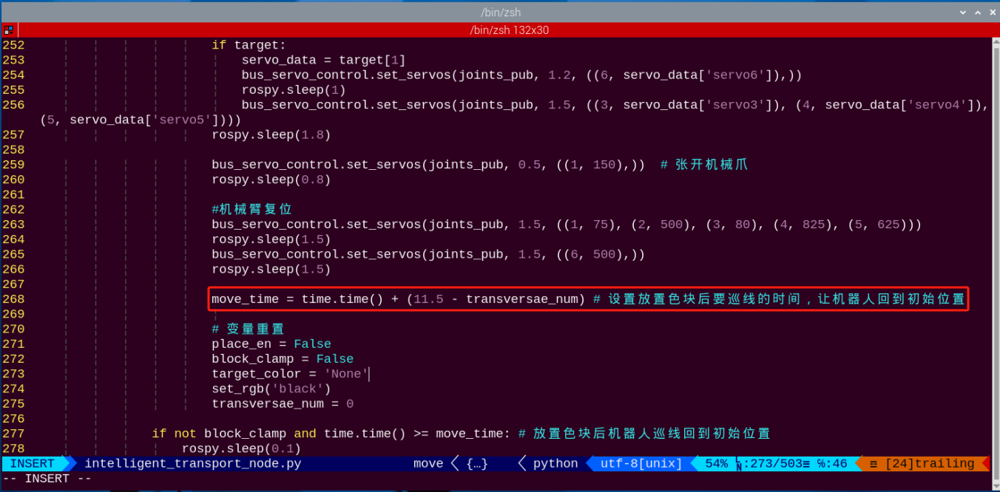

(6) After modifying, press the "**Esc**", and enter "**:wq**" to save and exit operation.

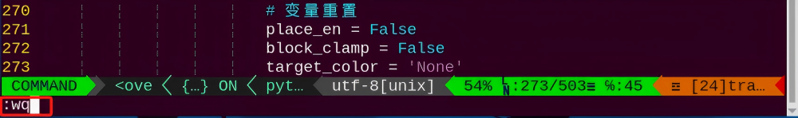

(7) After that, please follow [**8.9.3 Operation Steps**](#anchor_8_9_3) to start the game.

## 8.10 Smart Stacking

:::{Note}
It is recommended to place the color block in the center of the camera's field of view for the game implementation. Avoid positioning it too far away or too close to the camera, as this may cause the robotic arm failing to pick it up.
:::

### 8.10.1 Program Description

The process of whole game includes three parts: recognize, grip, stack.

Firstly, recognize the block tag within vision range.

Next, through positioning, image segmenting, contour search and other processing, the tag contour is found. Then, the quadrilateral is detected,and the straight line is fitted to form a closed loop by acquiring the four corner points.
Code and decode the tag detected to get corresponding tag ID number.
Determine the gripping sequence by comparing ID number: small ID number will be gripped first.

Finally, pick and stack the block at stacking area. After stacking, the robotic arm will return to the initial position.

### 8.10.2 Operation Steps

:::{Note}
It should be case sensitive when entering command and the "**Tab**" key can be used to complete the keywords.
:::

* **Getting Ready** 

Prepare three tag blocks (tag 1, tag 2, tag3) and place them within the detected range, The distance between two blocks can not smaller than 3cm.

<span id="10_enter_game" class="anchor"></span>

* **Enter Game** 

(1) Power on the robot and use VNC Viewer to connect to the remote desktop.


(2)  Click  in the upper left corner of the system desktop to open the "**Terminator**".


(3) Enter the following command to start the smart stacking game.

```bash
rosrun intelligent_palletizer intelligent_palletizer_node.py
```

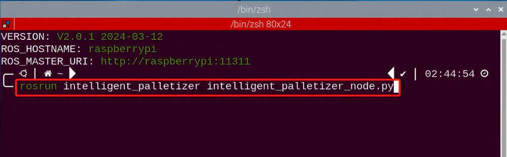

(4) Keep the previously opened terminal and open a new one. Enter the following command, and press "**Enter**" to enter the smart stacking game. If successful, a prompt will appear, as shown below:

```bash
rosservice call /intelligent_palletizer/enter "{}"
```

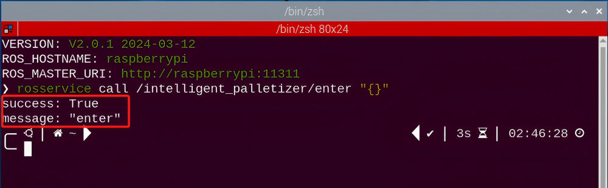

* **Start image transmission** 

(1) To avoid consuming too much running memory of Raspberry Pi. It is recommended to use an external browser to start image transmission. 
The specific steps are as follows:

① Select a browser. Take Google Chrome as example.


②  Then enter the default IP address "**192.168.149.1:8080/**" (Note: this IP address is the default IP address for direction connection mode). If it is LAN mode, please enter "**Device IP address+：8080/**" such as "**192.168.149.1:8080/**") If fail to open, you can try it several times or restart camera.

:::{Note}
If it is in LAN mode, the method to obtain device IP address can refer to "[**Robot Network Configuration Course**](https://docs.hiwonder.com/projects/ArmPi_Pro/en/latest/docs/15_network_configuration.html)"
:::


③ Then, click the option shown in the following figure to open the display window of the transmitted image.


* **Start with rqt** 

(1)  After completing the steps of "[**8.10.2 Operation Steps -> Enter Game**](#10_enter_game)" and do not exit the terminal, open a new terminal.

```bash
rqt_image_view
```


(2) Enter command "**rqt_image_view**" and press "**Enter**" to open rqt.

```bash
rqt_image_view
```

(3) Click the red box as the figure shown below, select "**/visual_processing/image_result**" for the topic of line following and remain other settings unchanged, as the figure shown below:

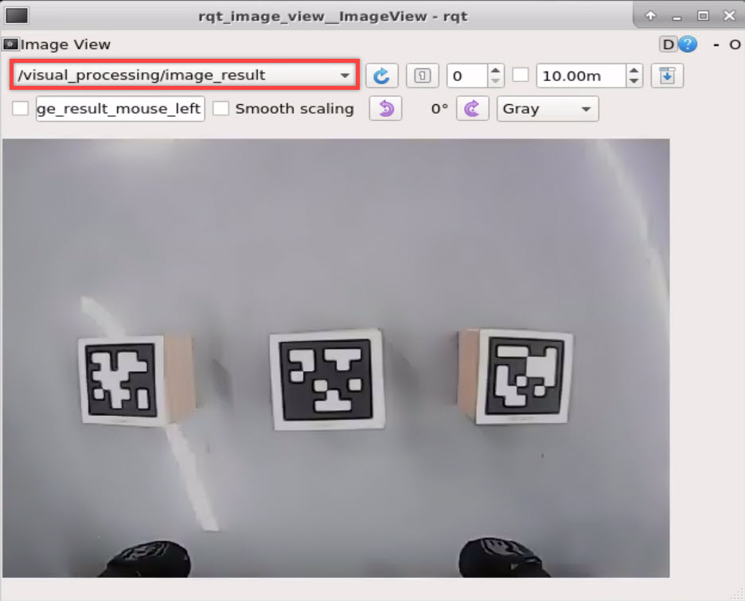

:::{Note}
After opening image, the topic option must be selected. Otherwise, after starting game, the recognition process can not be displayed normally.
:::

* **Start Game** 

Now, enter the terminal according to the steps in "[**8.10.2 Operation Steps -> Enter Game**](#10_enter_game)" and input the following command. Then if the prompt shown in the following red box appears, which means game has been started successfully.

```bash
rosservice call /intelligent_palletizer/set_running "data: true"
```

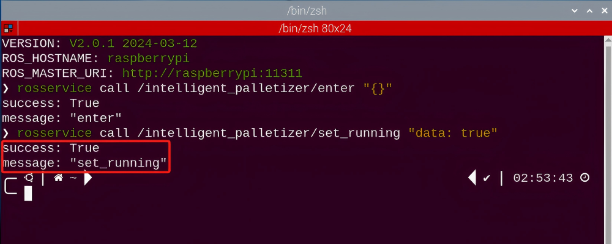

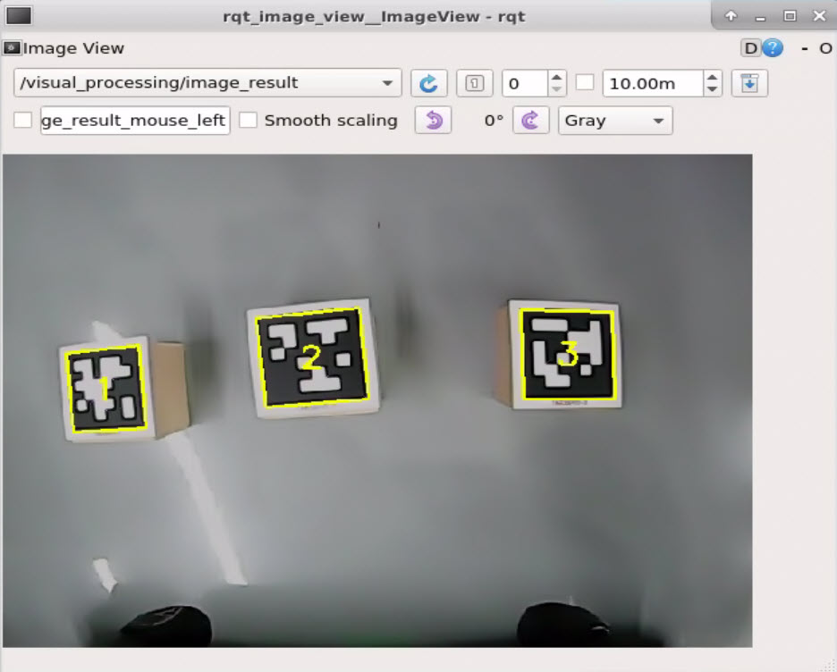

* **Stop and Exit**  

(1) If want to stop the game, enter the following command.

```bash
rosservice call /intelligent_palletizer/set_running "data: false"
```

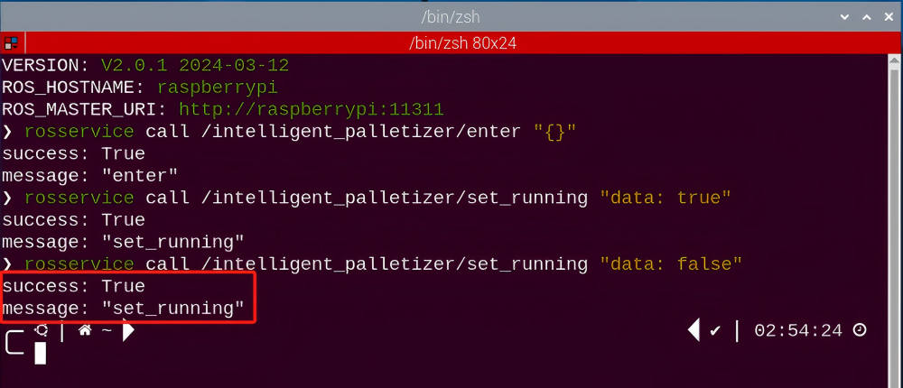

(2) If want to exit the game, enter this command to exit.

```bash
rosservice call /intelligent_palletizer/exit "{}"
```

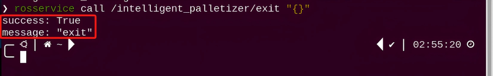

:::{Note}
Before exiting the game, it will keep running when Raspberry Pi is powered on. To avoid consume too much running memory of Raspberry Pi, you need to exit the game first according to the operation steps above before performing other AI vision games.
:::

(3) If want to close the image transmission, press "**Ctrl+C**" to return and open the terminal of rqt. If fail to exit, please keep trying several times.

### 8.10.3 Project Outcome

:::{Note}
To ensure proper functionality, it is recommended to place the color block at the center of the camera's field of view. Avoid placing it too far away or too far back, as this may cause the robotic arm to fail in grasping.
:::

After starting game, ArmPi Pro will recognize the block tag within the detected range. Then the robotic arm will grip and stack the block at the stacking area. 

### 8.10.4 Program Analysis

The program file is stored in:

[/home/ubuntu/armpi_pro/src/visual_processing/scripts/visual_processing_node.py](../_static/source_code/visual_processing_node.zip)(image processing)

[/home/ubuntu/armpi_pro/src/intelligent_palletizer/scripts/intelligent_palletizer_node.py](../_static/source_code/intelligent_palletizer_node.zip)(stacking control)

:::{Note}
please back up the initial program before making any modifications. It is prohibited editing the source code files directly to prevent making changes in an incorrect manner that could lead to robot malfunctions, rendering them irreparable.
:::

* **Import Parameter Module** 

| **Imported Module**                                  | **Function**                                                 |
| ---------------------------------------------------- | ------------------------------------------------------------ |
| import sys                                           | The sys module of Python is imported to access to system-related functionalities and variables. |
| import cv2                                           | The OpenCV library of Python is imported to perform image processing and computer vision-related functions. |
| import time                                          | The time module of Python is imported to perform time-related functionalities, such as delay operations. |
| import math                                          | The math module of Python is imported to perform mathematical operations and functions. |
| import rospy                                         | The Python library rosy is imported for  communication and interaction with ROS. |
| import numpy as np                                   | The NumPy library is imported and is renamed as np for performing array and matrix operations. |
| from armpi_pro import Misc                           | The Misc module is imported from arm_pi_pro package to handle the recognized rectangular data. |
| from armpi_pro import apriltag                       | The apriltag module is imported from arm_pi_pro package  to perform Apriltag recognition and processing. |
| from threading import RLock, Timer                   | The "**RLock**" class and "**Timer**" class is imported from the threading module of Python for thread-related operations. |
| from std_srvs.srv import *                           | All service message types are imported from the std_srvs in ROS for defining and using standard service messages. |
| from std_msgs.msg import *                           | All message types are imported form the std_msgs package in ROS for defining and using standard messages. |
| from sensor_msgs.msg import Image                    | The image message type is imported from the sensor_msgs packages for processing image data. |
| from visual_processing.msg import Result             | The Result message type is imported from the visual_processing package for the message of image processing results. |
| from visual_processing.srv import SetParam           | The SetParam service type is imported from the visual_processing packages for using customs service related to parameter settings. |
| from sensor.msg import Led                           | The Led message type is imported form the sensor.msg module for controlling or representing the LED status on a sensor. |
| from chassis_control.msg import *                    | All message types are imported from the chassis_control.msg module, which indicated that all message types defined in this module is imported to perform the chassis control. |
| from visual_patrol.srv import SetTarget              | The SetTarget service type is imported from the visual_patrol.srv module is used to set a target for line following. |
| from hiwonder_servo_msgs.msg import MultiRawIdPosDur | The MultiRawIdPosDur message type is imported from the hiwonder_servo_msgs.msg module for controlling servos. |
| from armpi_pro import PID                            | The PID class is imported from thearmpi_pro module to perform PID algorithm. |
| from armpi_pro import bus_servo_control              | The bus_servo_control module is imported from the armpi_pro module, including the functions and methods related to the servo control. |
| from kinematics import ik_transform                  | The ik_transform function is imported from the kinematics module to perform conversion of inverse kinematics. |

* **Initializing Functions and Variables** 

{lineno-start=102}

```python
	# 检测apriltag函数(detect apriltag function )
detector = apriltag.Detector(searchpath=apriltag._get_demo_searchpath())
def apriltag_Detect(img):
    global pub_time
    global publish_en
    global id_smallest
    
    msg = Result()
    img_copy = img.copy()
    img_h, img_w = img.shape[:2]
    frame_resize = cv2.resize(img_copy, size_m, interpolation=cv2.INTER_NEAREST)
    gray = cv2.cvtColor(frame_resize, cv2.COLOR_BGR2GRAY)
    detections = detector.detect(gray, return_image=False)
```

* **Obtain the information of corner point**

Obtain the four corner points through  `np.rint()` function.

{lineno-start=116}

```python
	    if len(detections) != 0:
        for i, detection in enumerate(detections):
            tag_id = int(detection.tag_id)        # 获取tag_id(obtain tag_id )
            corners = np.rint(detection.corners)  # 获取四个角点(obtain four corners)
            for i in range(4):
                corners[i][0] = int(misc.map(corners[i][0], 0, size_m[0], 0, img_w))
                corners[i][1] = int(misc.map(corners[i][1], 0, size_m[1], 0, img_h))
```

* **Detect Tag** 

(1) After getting the corner point information of tag, recognize tag by calling  `drawContours()` function in cv2 library.

{lineno-start=123}

```python
	            cv2.drawContours(img, [np.array(corners, np.int)], -1, (0, 255, 255), 2)
```

The meaning of parameter in parentheses is as follow:

The first parameter `img` is the input image.

The second parameter `[np.array(corners, np.int)]` is the contour which is list in Python.

The third parameter `-1` is the index of contour. The value here represents all contour in drawing contour list.

The fourth parameter `(0, 255, 255)` is the contour color. The value sequence is B, G, and R. The color here is yellow.

The fifth parameter `2` is the width of contour.

(2) By calling `putText()` function in cv2 library, print the tag ID and type on the live feed image.

{lineno-start=127}

```python
	            cv2.putText(img, str(tag_id), (object_center_x - 10, object_center_y + 10), cv2.FONT_HERSHEY_SIMPLEX, 1, [0, 255, 255], 2)
```

The meaning of parameters in parentheses is as follow:

The first parameter `img` is the input image.

The second parameter `str(tag_id)` is the displayed content.

The third parameter `(object_center_x - 10, object_center_y + 10)` is the display position.

The fourth parameter `cv2.FONT_HERSHEY_SIMPLEX` is the font type.

The fifth parameter `1` is the size of font.

The sixth parameter `[0, 255, 255]` is the font color and its sequence is B, G, R. The value here is yellow.

The seventh parameter `2` is the thickness of font.

* **Control Action** 

{lineno-start=50}

```python
# 初始位置(initial position)
def initMove(delay=True):
    with lock:
        target = ik.setPitchRanges((0, 0.15, 0.0), -180, -180, 0) # 逆运动学求解(inverse kinematics solving)
        if target:
            servo_data = target[1]
            bus_servo_control.set_servos(joints_pub, 1.8, ((1, 200), (2, 500), (3, servo_data['servo3']), (4, servo_data['servo4']),
                                                                                (5, servo_data['servo5']),(6, servo_data['servo6'])))
    if delay:
        rospy.sleep(2)

# 设置蜂鸣器(set buzzer)
def set_buzzer(freq, on_time, off_time, repeat):
    msg = BuzzerState()
    msg.freq = freq
    msg.on_time = on_time
    msg.off_time = off_time
    msg.repeat = repeat
    buzzer_pub.publish(msg)
```

(1) Pick the Block

① By determining whether the coordinate of tag block is change, then we can determine if the black is stable. If it meets the conditions, robotic arm will grip the block.

{lineno-start=108}

```python
    while __isRunning:
        if steadier and object_center_x > 0 and object_center_y > 0: 
            # 木块已经放稳，进行追踪夹取(the color block has been placed stably, and the robotic arm can track and grip it)
```

② Robotic arm moves to above the block using the inverse kinematics.

{lineno-start=144}

```python
            # 机械臂追踪移动到木块上方(the robotic arm tracks and moves above the color block)
            target = ik.setPitchRanges((0, round(y_dis, 4), 0.0), -180, -180, 0)
```

The analysis of code above is as follow:

The first parameter `0` is the position in x-axis.

The second parameter `round(y_dis, 4), 0.0)` is the position in y-axis.

The third parameter `-180` is the pitch angle.

The fourth and fifth parameter `-180`, `0` is the range of pitch angle.

③ When the determination conditions are met, robotic arm will stop above the block and adjust the angle of robotic arm.

{lineno-start=152}

```python
            if abs(dx) < 3 and abs(dy) < 0.003 and not stack_en: # 等待机械臂稳定停在木块上方(wait for the robotic arm to stably stop above the color block)
                count_ += 1
                if count_ == 10:
                    count_ = 0
                    stack_en = True
                    angle = object_angle % 90
                    offset_y = misc.map(target[2], -180, -150, -0.01, 0.02) # 设置位置补偿(set position compensation)
```

④ Then the robotic arm is controlled to grip and raise the block through `bus_servo_control.set_servos()` function.

{lineno-start=175}

```python
                bus_servo_control.set_servos(joints_pub, 0.5, ((1, 450),)) # 闭合机械爪(close the robotic gripper)
                rospy.sleep(0.8)
                
                bus_servo_control.set_servos(joints_pub, 1.5, ((1, 450), (2, 500), (3, 80), (4, 825), (5, 625), (6, 500))) # 机械臂抬起来(raise the robotic arm)
                rospy.sleep(1.5)
```

* **Place the Block** 

Using the inverse kinematics to control the robotic arm to transport and put down the block.

{lineno-start=192}

```python
                target = ik.setPitchRanges(place_coord[stack_num], -180, -180, 0) # 机械臂移动到色块放置位置(the robotic arm moves to the position for placing the color block)
                if target:
                    servo_data = target[1]
                    bus_servo_control.set_servos(joints_pub, 1, ((3, servo_data['servo3']), (4, servo_data['servo4']), (5, servo_data['servo5']))) # 再放下了(then put down)
                rospy.sleep(1)
```

Take `target = ik.setPitchRanges(place_coord[stack_num], -180, -180, 0)` as example. 

The first parameter `place_coord[stack_num]` represents the coordinate position of tag block. The following image is the position information of corresponding ID.

The second parameter `-180` is the pitch angle.

The third and fourth parameters `-180` and `0` are the range of the pitch angle.

{lineno-start=105}

```python
    place_coord = {1:(0.18, 0.0, -0.09),
                   2:(0.18, 0.0, -0.05),
                   3:(0.18, 0.0, -0.02)}
```

Controlling each servo by bus_servo_control.set_servos() and let gripper put down and release the block.

{lineno-start=206}

```python
                if target:
                    servo_data = target[1]
                    bus_servo_control.set_servos(joints_pub, 1, ((1, 200), (2, 500), (3, servo_data['servo3']),
                                                                    (4, servo_data['servo4']), (5, servo_data['servo5'])))
                    rospy.sleep(1)
                    bus_servo_control.set_servos(joints_pub, 1.5, ((6, servo_data['servo6']),))
                    rospy.sleep(1.5)
```

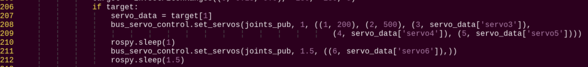

* **Evaluate the layers** 

When stacking action is executed three times, it will starts from scratch.

{lineno-start=201}

```python
                if stack_num >= 3: # 码垛计量大于等于3，进行重置(If the stacking measurement is greater than or equal to 3, reset it)
                    stack_num = 0
```

* **Restore to the Initial Status** 

Robotic arm returns to the initial posture through inverse kinematics.

{lineno-start=204}

```python
                #机械臂复位(return the robotic arm to the initial position)
                target = ik.setPitchRanges((0, 0.15, 0.0), -180, -180, 0)
                if target:
                    servo_data = target[1]
                    bus_servo_control.set_servos(joints_pub, 1, ((1, 200), (2, 500), (3, servo_data['servo3']),
                                                                    (4, servo_data['servo4']), (5, servo_data['servo5'])))
                    rospy.sleep(1)
                    bus_servo_control.set_servos(joints_pub, 1.5, ((6, servo_data['servo6']),))
                    rospy.sleep(1.5)
                
                start_en = True
                reset()  # 变量重置(reset variables)
```
