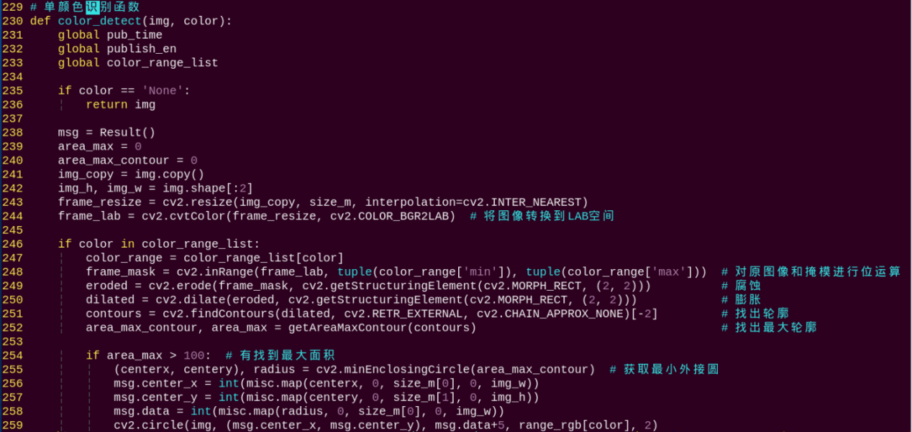
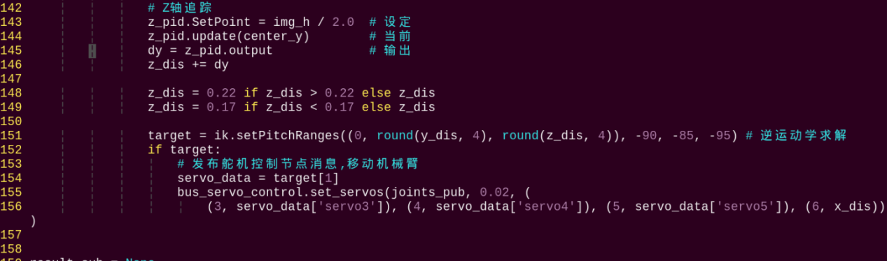
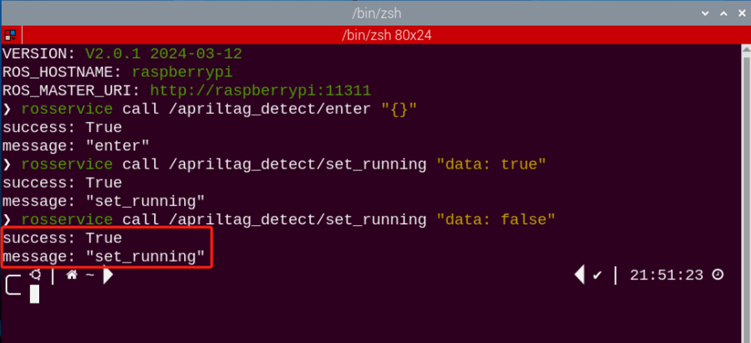
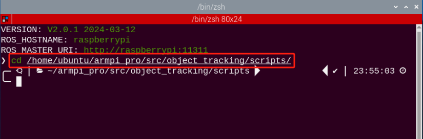
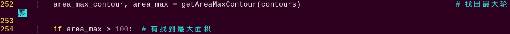
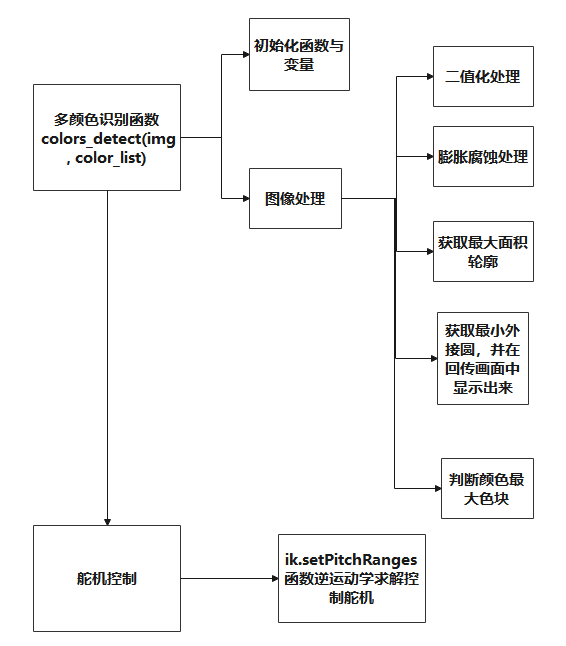

# ROS+OpenCV课程

## 1. 颜色识别

:::{Note}
可在本节文件夹下观看演示效果。
:::

### 1.1 实现流程

下面看一下本节课整体实现的流程：

**第一步，调取摄像头的图像：**

通过OpenCV处理摄像头的实时图像。

**第二步，图像的二值化：**

OpenCV将图像中的所有像素以0和1来表示，将值为0的像素点用黑色显示，值为1的用白色显示。

**第三步，腐蚀和膨胀：**

腐蚀处理的目的是去除图像边缘的毛刺。膨胀处理会将图像的边缘扩大，用以填充目标物体边缘或内部的非目标像素点。

**第四步，找出轮廓的位置：**

通过对黑、白区域进行分界来找出目标物体的轮廓位置。

**第五步，将识别到的颜色物体框出：**

将识别到的颜色物体（红绿蓝三种）转换为未缩放前的坐标，进而判断是否为最大的颜色物体。

### 1.2 玩法开启及关闭

:::{Note}
指令的输入需严格区分大小写，另外可按键盘"**Tab**"键进行关键词补齐。
:::

1)  将设备开机，并参照课程资料的"**[远程工具安装及容器进入方法\1. 远程桌面工具安装与连接]()**"内容，通过VNC远程连接工具连接。


2)  点击系统桌面左上角的图标，打开Terminator终端，输入指令按下回车，关闭手机APP自启服务。

```commandline
sudo ./.stop_ros.sh
```

3)  输入进入玩法程序所在目录的指令，按下回车键。

```commandline
cd course
```

4)  输入运行玩法程序的指令，按下回车键

```commandline
python3 color_recognition.py
```

5)  如需关闭此程序，可按下"**Ctrl+C**"，若关闭失败，可多次按下。

玩法体验完毕后，可通过指令或重启机器人来开启手机APP服务。如未开启手机APP服务，则APP相关功能会失效。（若机器人重启，手机APP服务将会自动开启）

点击桌面左上角终端图标（**注意：需要在系统路径下输入指令，而不是在docker容器中输入开启APP服务的指令**），在系统路径下输入指令，按下回车，启动APP服务，等待机械臂恢复至初始姿态，蜂鸣器"滴"一声即可。

```commandline
sudo systemctl restart start_node.service
```

### 1.3 实现效果

:::{Note}
请在纯色背景下操作，且手持色块移动时不宜过快。
:::

程序运行后，机械臂会对视觉范围内的物体进行颜色识别。当识别到红、绿、蓝三种颜色的物体时，回传画面会框选该物体。


### 1.4 程序简要分析

该程序的源代码位于Docker容器中的：

**/home/ubuntu/course/color_recognition.py**


颜色识别实验主要用到cv2库中的inRange()、findContours()和morphologyEx()函数，以及Board库中的setPixelColor()函数。其中：

- **inRange()** 函数用于对输入图像进行二值化处理。括号内的第一个参数是输入图像。第二个、第三个参数分别是阈值的下限和上限。当像素点RGB的颜色数值处于上、下限之间时，该像素点被赋值为1，否则为0。


- **findContours()** 函数用于查找图像中的目标轮廓。括号内的第一个参数是输入图像。第二个参数是轮廓的检索模式，第三个参数是轮廓的近似方法。


- **morphologyEx()** 函数用于进行形态学的变换。该函数的第一个参数为输入的图像数据，第二个参数为进行变化的方式，第三个参数表示方框的大小。


- set_rgb(color)函数用于控制扩展板上的RGB彩灯。


以代码"b**oard.set_rgb(\[\[1,** **255, 0, 0\],\[2, 255, 0, 0\])**"为例，括号内的参数含义如下：

第一个参数"**1**"是RGB灯序号，"**1**"代表RGB1，而"**2**"则代表RGB2；

第二个参数"\[**255, 0, 0\]**"是RGB的颜色通道参数，"**255**"、"**0**"、"**0**"分别代表R、G、B通道的数值，此处为红色。

## 2. 色块位置识别

:::{Note}
可在本节文件夹下观看演示效果。
:::

### 2.1 实现流程

首先，色块在确定位置之前，需先进行颜色识别。我们使用Lab颜色空间来进行处理。先将RGB颜色空间转换为Lab，再进行二值化处理、开运算、闭运算等操作，获得只包含目标颜色的轮廓，即可实现物体颜色的识别。

接着，遍历所有找到的目标颜色轮廓，通过逐一比较，找到最大轮廓面积。然后获取目标轮廓的四个角点坐标，并计算出中心点坐标。

最后，将目标轮廓用红框框出，显示轮廓的中心坐标，并控制扩展板的LED灯亮起目标颜色。

### 2.2 玩法开启及关闭

:::{Note}
指令的输入需严格区分大小写，另外可按键盘"**Tab**"键进行关键词补齐。
:::

1)  将设备开机，并参照课程资料的"**[远程工具安装及容器进入方法\1. 远程桌面工具安装与连接]()**"内容，通过VNC远程连接工具连接。


2)  点击系统桌面左上角的图标，打开Terminator终端，输入指令按下回车，关闭手机APP自启服务。

```commandline
sudo ./.stop_ros.sh
```

3)  输入进入玩法程序所在目录的指令，按下回车键。

```commandline
cd course
```

4)  输入运行玩法程序的指令，按下回车键。

```commandline
python3 get_color_position.py
```

5)  如需关闭此程序，可按下"**Ctrl+C**"，若关闭失败，可多次按下。

玩法体验完毕后，可通过指令或重启机器人来开启手机APP服务。如未开启手机APP服务，则APP相关功能会失效。（若机器人重启，手机APP服务将会自动开启）

点击桌面左上角终端图标（**注意：需要在系统路径下输入指令，而不是在docker容器中输入开启APP服务的指令**），在系统路径下输入按下回车，启动APP服务，等待机械臂恢复至初始姿态，蜂鸣器"滴"一声即可。

```commandline
python3 get_color_position.py
```


### 2.3 实现效果

程序运行后，机械臂运动，使摄像头正对正前方。在回传画面内可以看到当红色色块被识别到后，会将红色色块框出，并显示色块中心点的x、y坐标，在回传画面左下角显示识别到的颜色。


### 2.4 程序简要分析

该程序的源代码位于Docker容器中的：

**/home/ubuntu/course/get_color_position.py**


在获得最大轮廓面积后，通过调用cv2库内的minAreaRect()函数，可以得到其最小外接矩形，括号内是存放了点坐标的点集数组或向量。

通过调用boxPoints()函数，可以获取目标矩形的四个顶点坐标。


以"**box = np.int0(cv2.boxPoints(rect))**"为例，此处得到了目标轮廓最小外接矩形的四个顶点坐标，后续可以在此基础上，通过计算求得该矩形的中心坐标。

## 3. 颜色追踪

:::{Note}
可在本节文件夹下观看演示效果。
:::

### 3.1 实验原理

下面我们看下本节课整体实现的流程：

首先需要对颜色进行识别，我们使用Lab颜色空间来进行处理。先将RGB颜色空间转换为Lab，然后进行二值化处理，再经过膨胀腐蚀等操作，可获得只包含目标颜色的轮廓，再将该颜色轮廓用圆圈框起，便可实现物体颜色的识别。

接着在识别到后对机械臂高度部分进行处理，以图像的中心点的x、y、z坐标作为设定值，以当前获取的x、y、z坐标作为输入值进行更新pid。

然后会根据图像位置的反馈进行计算，最后通过位置的变化使坐标数值进行线性变化，从而达到追踪的效果。

该程序的源代码位于Docker容器中的：**/home/ubuntu/armpi_pro/src/color_tracking/scripts/color_tracking_node.py**


### 3.2 玩法开启及关闭

:::{Note}
指令的输入需严格区分大小写，另外可按键盘"Tab"键进行关键词补齐。
:::

<span id="anchor_3_2_1" class="anchor"></span>

- #### 3.2.1 玩法进入

1)  将设备开机，并参照课程资料的"**[远程工具安装及容器进入方法\1. 远程桌面工具安装与连接]()**"内容，通过VNC远程连接工具连接。


<span id="anchor_3_2_1_2" class="anchor"></span>

2)  点击系统桌面左上角的图标，打开Terminator终端。


3)  输入指令，然后按下回车进入颜色追踪玩法。当成进入后，会出现打印提示，如下图所示：

```commandline
rosservice call /color_tracking/enter "{}"
```


- #### 3.2.2 回传图像开启

1. **使用外部浏览器开启**

**为避免过多占用树莓派的运行内存，建议使用外部浏览器来开启图像回传画面，具体步骤如下：**

- 选择任意一个外部浏览器，这里以谷歌浏览器为例。


-  然后在地址栏输入默认IP地址如"**192.168.149.1:8080/**"

:::{Note}
此IP地址为直连模式下的默认IP地址，若为局域网模式，则输入："**设备IP地址+：8080/"，如"192.168.149.1:8080/**"

如果是局域网连接模式，设备IP地址获取方法可参考"**[机器人网络课程配置\1. 修改网络连接模式]()**"
:::


-  然后点击下图框出选项，即可打开回传画面。


2. **使用rqt工具开启**

-  [3.2 玩法开启及关闭\ 玩法进入](#anchor_3_2_1)终端不关闭的情况下，再打开一个新的终端。

-  输入指令，按下回车，稍等片刻即可打开rqt工具。

```commandline
rqt_image_view
```


3. 单击下图所示红框位置，对视觉巡线的话题选项（topic）进行选择，选项为"**/visual_processing/image_result**"，其余设置保持不变。


:::{Note}
图像开启后请务必选择话题选项，否则在后续玩法启动后，将无法正常显示其识别过程。
:::

<span id="anchor_3_2_2" class="anchor"></span>

- #### 3.2.3 玩法启动

1.  此时返回[3.2 玩法开启及关闭\ 玩法进入](#anchor_3_2_1)开启的终端，输入指令，同理出现下图所框提示即为启动成功。

```commandline
rosservice call /color_tracking/set_running "data: true"
```


2.  启动玩法后我们还需要设置参数即选择追踪的目标颜色，这里以追踪蓝色为例，输入指令：

```commandline
rosservice call /color_tracking/set_target "data: 'blue'"
```

:::{Note}
追踪绿色和红色可在"data: ' '内填写green或red。（严格区分大小写）
:::


- #### 3.2.4 玩法停止及退出

1)  如需停止该玩法，输入指令，在停止该玩法后可参考[2.3 玩法启动](#anchor_3_2_2)，更换绿色或红色进行追踪。

```commandline
rosservice call /color_tracking/set_running "data: false"
```


2)  如需退出该玩法，输入指令，按下回车即可退出。

```commandline
rosservice call /color_tracking/exit "{}"
```


:::{Note}
玩法在未退出时，会在当前树莓派通电状态下持续运行。为避免过多占用树莓派的运行内存，如需执行其它AI视玩法，请先按照上述指令关闭当前玩法，并将命令行终端关闭。
:::

3)  如需关闭摄像头回传图像，返回开启rqt工具的终端，按下"Ctrl+C"即可，若关闭失败，可重复多次，直至退出。

### 3.3 功能实现

玩法开启后我们将蓝方块移至摄像头范围内，在rqt工具内可以看到当识别到后，会将目标颜色框出。此时手持色块进行缓慢移动，机械臂可以跟随目标颜色的移动而移动。


### 3.4 功能延伸

<span id="canchor_3_4_1" class="anchor"></span>

- #### 增加新的可识别颜色

颜色追踪玩法程序内置了三种颜色：红、绿、蓝。除了这三种内置的颜色，我们还可以添加其它可识别颜色，例如**我们将粉色作为新的可识别颜色，程序步骤如下：**

1)  参照[步骤2](#anchor_3_2_1_2)，打开新的终端，输入指令，打开颜色阈值调试工具。若在弹出的界面中没有出现回传画面，说明摄像头未连接成功，需检查一下摄像头连接线是否连接好。

```commandline
python3 /home/ubuntu/software/lab_config/main.py
```


2)  连接成功后，我们可以看到界面右侧是实时回传画面，左侧是需要被采集的颜色。在界面右下角的选项栏中选择"**Add**"增加新的颜色。


3)  我们以粉色为例，填写增加的颜色的名字，点击"**OK**"即增加成功；此时右下角的颜色选项栏中会将颜色更新为"**pink**"。


4)  将摄像头对准粉色物品，然后拖动下方的六个滑杆，使得左侧画面中粉色物品的区域全部变为白色，其它区域为黑色。接着点击"**save**"按钮保存数据。


5)  参照[步骤2](#anchor_3_2_1_2)，打开新的终端，输入进到玩法程序所在目录的指令，按下回车。

```commandline
cd /home/ubuntu/armpi_pro/src/color_tracking/scripts/
```


6)  输入指令，打开程序。

```commandline
vim color_tracking_node.py
```


7)  找到要修改的代码部分，按下键盘的"i"键，当出现左下角框出内容时，即进入编辑模式。


8)  在源代码中输入粉色的RGB值。

**'pink': (203, 192, 255),**


9)  按下键盘的"**Esc**"键，并输入"**:wq**"，按下回车，即可完成保存与退出操作。


10) 按照（"[3.2 玩法开启及关闭\ 玩法进入](#anchor_3_2_1)"）的步骤启动颜色追踪玩法。

11) 将粉色物品放在摄像头前，并手持该物品缓慢移动，ArmPi Pro的机械臂便会跟随粉色物品的移动而移动。


12) 如果需添加其它颜色作为可识别颜色，可参考前面的步骤[3.4 功能延\ 增加新的可识别颜色](#canchor_3_4_1)

### 4.5 程序简要分析

本小节课程文档对应程序的源代码位于Docker容器中的：

**/home/ubuntu/armpi_pro/src/visual_processing/scripts/visual_processing_node.py（图像处理）**

**/home/ubuntu/armpi_pro/src/color_tracking/scripts/color_tracking_node.py（追踪控制）**

:::{Note}
在程序修改前务必将原有出厂程序进行备份，再进行修改，禁止直接在源代码文件中进行修改，避免以错误的方式修改参数之后导致机器人异常且无法修复！！！
:::


- #### 4.5.1 导入参数模块

| **导入模块** | **作用** |
|----|----|
| import sys | 导入了Python的sys模块，用于访问系统相关的功能和变量 |
| import cv2 | 导入了OpenCV库，用于图像处理和计算机视觉相关的功能 |
| import time | 导入了Python的time模块，用于时间相关的功能，例如延时操作 |
| import math | 导入了Python的math模块，用于数学运算和函数 |
| import rospy | 导入了ROS的Python库rospy，用于与ROS系统进行通信和交互 |
| import numpy as np | 导入了NumPy库，并将其重命名为np，用于进行数组和矩阵操作 |
| from armpi_pro import misc | 从armpi_pro包中导入了misc模块，用于处理识别得到的矩形数据 |
| from armpi_pro import apriltag | 从armpi_pro包中导入了apriltag模块，用于Apriltag识别和处理的功能 |
| from threading import RLock, Timer | 从Python的threading模块中导入了RLock类和Timer类，用于线程相关的操作 |
| from std_srvs.srv import \* | 从ROS的std_srvs包中导入了所有的服务消息类型，用于定义和使用标准的服务消息 |
| from std_msgs.msg import \* | 从ROS的std_msgs包中导入了所有的消息类型，用于定义和使用标准的消息 |
| from sensor_msgs.msg import Image | 从ROS的sensor_msgs包中导入了Image消息类型，用于处理图像数据 |
| from visual_processing.msg import Result | 从visual_processing包中导入了Result消息类型，用于图像处理结果的消息 |
| from visual_processing.srv import SetParam | 从visual_processing包中导入了SetParam服务类型，设置参数的自定义服务 |
| from ros_robot_controller.msg import RGBState, RGBsState | 从ros_robot_controller.msg模块导入 RGBState, RGBsState消息类型。用于控制或表示传感器设备上的RGB灯状态 |
| from chassis_control.msg import \* | 从 chassis_control.msg 模块导入所有消息类型。这意味着导入该模块中定义的所有消息类型，用于底盘控制 |
| from visual_patrol.srv import SetTarget | 从 visual_patrol.srv 模块导入 SetTarget 服务类型。用于设置视觉巡逻的目标 |
| from hiwonder_servo_msgs.msg import MultiRawIdPosDur | hiwonder_servo_msgs.msg 模块导入 MultiRawIdPosDur 消息类型。用于控制舵机设备 |
| from armpi_pro import pid | 从 armpi_pro 模块导入pid类。用于实现比例-积分-微分（PID）控制算法 |
| from armpi_pro import bus_servo_control | 从 armpi_pro 模块导入 bus_servo_control 模块。包含与舵机控制相关的函数和方法 |
| from kinematics import ik_transform | 从 kinematics 模块导入 ik_transform 函数。用于进行逆运动学变换 |

- #### 4.5.2 功能逻辑

根据实现效果，梳理该玩法的实现逻辑如下图所示：


通过摄像头获取图像信息，再进行图像处理，即对图像进行二值化处理，为了降低干扰，令图像更平滑，对图像进行腐蚀和膨胀处理，然后获取目标最大面积轮廓和最小外接圆，得到颜色追踪区域，接着根据逆运动学求解出机械臂的运动角度，控制舵机进行颜色追踪。

- #### 4.5.3 程序逻辑及对应的代码分析

从程序文件梳理得到程序逻辑流程图如下图所示。


从上图得到，程序的逻辑流程主要为颜色识别函数和舵机控制，以下的文档内容将依照上述程序逻辑流程图进行编写。

1. **图像处理**

- 初始化函数与变量



- 二值化处理

采用cv2库中的inRange()函数对图像进行二值化处理。


第一个参数"**frame_lab**"是输入图像；

第二个参数"**tuple(color_range\['min'\])**"是阈值下限；

第三个参数"**tuple(color_range\['max'\])**"是阈值上限；

- 腐蚀膨胀处理

为了降低干扰，令图像更平滑，需要对图像进行腐蚀和膨胀处理。


erode()函数用于对图像进行腐蚀操作。以代码"**eroded = cv2.erode(frame_mask, cv2.getStructuringElement(cv2.MORPH_RECT, (2, 2)))**"为例，括号内的参数含义如下：

第一个参数"**frame_mask**"是输入图像；

第二个参数"**cv2.getStructuringElement(cv2.MORPH_RECT, (2, 2))**"是决定操作性质的结构元素或内核。其中，括号内的第一个参数是内核形状，第二个参数是内核尺寸。

dilate()函数用于对图像进行膨胀操作。此函数括号内参数的含义与erode()函数的相同。

- 获取最大面积轮廓

完成上述的图像处理后，需要获取识别目标的轮廓，此处涉及cv2库中的findContours()函数。


erode()函数用于对图像进行腐蚀操作。以代码"**contours = cv2.findContours(dilated, cv2.RETR_EXTERNAL, cv2.CHAIN_APPROX_NONE)\[-2\]**"为例：

第一个参数"**dilated**"是输入图像；

第二个参数"**cv2.RETR_EXTERNAL**"是轮廓的检索模式；

第三个参数" **cv2.CHAIN_APPROX_NONE)\[-2\]**"是轮廓的近似方法。

在获得的轮廓中寻找面积最大的轮廓，而为了避免干扰，需要设定一个最小值，仅当面积大于该值时，目标轮廓才有效，此处最小值为"**100**"。


- 获取最小外接圆，并在回传画面中显示出来

采用cv2库中的minEnclosingCircle()函数获取目标轮廓的最小外接圆与圆心坐标，并通过circle()函数将外接圆在回传画面中显示出来。


2. **追踪控制**

以图像中心点的X、Y坐标为设定值，以当前识别目标的X、Y坐标为输入值，进行逆运动学计算，得到目标位置。



逆运动学计算以代码为例"**ik.setPitchRanges((0, round(y_dis, 4), round(z_dis, 4)), -90, -85, -95)**"为例：括号内的参数含义如下：

第一个参数"**(0, round(y_dis, 4), round(z_dis, 4)**"，"**0**"是X轴上的位置，"**round(y_dis, 4)**"是Y轴上的位置，"**round(z_dis, 4)**"是Z 轴上的位置；

第二个参数："**-90**"是俯仰角。

第三个参数："**-85**"是俯仰角范围。

第四个参数："**-95**"是俯仰角范围。

舵机控制以代码"**bus_servo_control.set_servos(joints_pub, 0.02, ( (3, servo_data\['servo3'\]),(4,servo_data\['servo4'\]), (5, servo_data\['servo5'\]), (6, x_dis)))**"为例，括号内的参数含义如下：

第一个参数"**joints_pub**"是发布舵机控制节点消息；

第二个参数："**0.02**"是运行时间，单位为秒。

第三个参数："**( (3, servo_data\['servo3'\]), (4, servo_data\['servo4'\]), (5, servo_data\['servo5'\]), (6, x_dis)**"，其中"**3**"是舵机编号，"**servo_data\['servo3'\]**"是舵机角度，"**(4, servo_data\['servo4'\]), (5, servo_data\['servo5'\]), (6, x_dis)**"同理。

## 4. 标签识别

:::{Note}
可在本节文件夹下观看演示效果。
::::

### 4.1 实验原理

AprilTag作为一种视觉定位标志符，类似于二维码或者条形码，可以用于快速地检测标签并计算出其相对位置，能够满足实时性的要求。

我们使用训练好的标签模型，通过摄像头获取标签图像，并对它进行处理，然后对标签进行检测，获取标签信息，最后将识别到的标签框出，并控制机器人做出对应的动作。

该程序的源代码位于Docker容器中的：**/home/ubuntu/armpi_pro/src/apriltag_detect/scripts/apriltag_detect_node.py**


### 4.2 玩法开启及关闭

:::{Note}
指令的输入需严格区分大小写，另外可按键盘"Tab"键进行关键词补齐。
:::

<span id="anchor_4_2_1" class="anchor"></span>

- #### 4.2.1 玩法进入

1)  将设备开机，并参照课程资料的"**[远程工具安装及容器进入方法\1. 远程桌面工具安装与连接]()**"内容，通过VNC远程连接工具连接。


2)  点击系统桌面左上角的图标，打开Terminator终端。


3)  输入指令，然后按下回车进入标签识别玩法。当成进入后，会出现打印提示，如下图所示：

```commandline
rosservice call /apriltag_detect/enter "{}"
```


- #### 4.2.2 回传图像开启

1. **使用外部浏览器开启**

**为避免过多占用树莓派的运行内存，建议使用外部浏览器来开启图像回传画面，具体步骤如下：**

- 选择任意一个外部浏览器，这里以谷歌浏览器为例。


- 然后在地址栏输入默认IP地址如"**192.168.149.1:8080/**"，（注意：此IP地址为直连模式下的默认IP地址，若为局域网模式，则输入："**设备IP地址+：8080/"，如"192.168.149.1:8080/**"）。如果打开失败，可以重复多次或者重启树莓派和电脑。

:::{Note}
如果是局域网连接模式，设备IP地址获取方法可参考"**[机器人网络配置课程\2. 修改网络连接模式]()**"
:::


- 然后点击下图框出选项，即可打开回传画面。


2. **使用rqt工具开启**

-  [4.2 玩法开启及关闭\ 玩法进入](#anchor_4_2_1)终端不关闭的情况下，再打开一个新的终端。

-  输入指令，按下回车，稍等片刻即可打开rqt工具。

```commandline
rqt_image_view
```


-  单击下图所示红框位置，对视觉巡线的话题选项（topic）进行选择，选项为"**/visual_processing/image_result**"，其余设置保持不变。


:::{Note}
图像开启后请务必选择话题选项，否则在后续玩法启动后，将无法正常显示其识别过程。
:::

3. **玩法启动**

此时返回[4.2 玩法开启及关闭\ 玩法进入](#anchor_4_2_1)开启的终端，输入指令，同理出现下图所框提示即为启动成功。

```commandline
rosservice call /apriltag_detect/set_running "data: true"
```


4. **玩法停止及退出**

1)  如需停止该玩法，输入指令：

```commandline
rosservice call /apriltag_detect/set_running "data: false"
```



2)  如需退出该玩法，输入指令：

```commandline
rosservice call /apriltag_detect/exit "{}"
```


:::{Note}
玩法在未退出时，会在当前树莓派通电状态下持续运行。为避免过多占用树莓派的运行内存，如需执行其它AI视玩法，请先按照上述指令关闭当前玩法，并将命令行终端关闭。
:::

3)  如需关闭摄像头回传图像，返回开启rqt工具的终端，按下"**Ctrl+C**"即可，若关闭失败，可重复多次，直至退出。

### 4.3 功能实现

玩法开启后机械臂识别到标签ID时会，在rqt工具内可以看到当标签被识别到后，会将标签目标框出，此时机械臂的车身将进行移动。

| **标签ID** | **执行动作** |
|-------|--------------|
| 1       | 车身画三角形 |
| 2       | 车身画圆形   |
| 3       | 漂移         |


### 4.4 程序简要分析

本小节课程文档对应程序的源代码位于Docker容器中的：

**/home/ubuntu/armpi_pro/src/visual_processing/scripts/visual_processing_node.py（图像处理）**

**/home/ubuntu/armpi_pro/src/apriltag_detect/scripts/apriltag_detect_node.py（底盘控制）**

:::{Note}
在程序修改前务必将原有出厂程序进行备份，再进行修改，禁止直接在源代码文件中进行修改，避免以错误的方式修改参数之后导致机器人异常且无法修复！！！
:::

- #### 4.4.1 导入参数模块

| **导入模块** | **作用** |
|----|----|
| import sys | 导入了Python的sys模块，用于访问系统相关的功能和变量 |
| import cv2 | 导入了OpenCV库，用于图像处理和计算机视觉相关的功能 |
| import time | 导入了Python的time模块，用于时间相关的功能，例如延时操作 |
| import math | 导入了Python的math模块，用于数学运算和函数 |
| import rospy | 导入了ROS的Python库rospy，用于与ROS系统进行通信和交互 |
| import numpy as np | 导入了NumPy库，并将其重命名为np，用于进行数组和矩阵操作 |
| from armpi_pro import misc | 从armpi_pro包中导入了misc模块，用于处理识别得到的矩形数据 |
| from armpi_pro import apriltag | 从armpi_pro包中导入了apriltag模块，用于Apriltag识别和处理的功能 |
| from threading import RLock, Timer | 从Python的threading模块中导入了RLock类和Timer类，用于线程相关的操作 |
| from std_srvs.srv import \* | 从ROS的std_srvs包中导入了所有的服务消息类型，用于定义和使用标准的服务消息 |
| from std_msgs.msg import \* | 从ROS的std_msgs包中导入了所有的消息类型，用于定义和使用标准的消息 |
| from sensor_msgs.msg import Image | 从ROS的sensor_msgs包中导入了Image消息类型，用于处理图像数据 |
| from visual_processing.msg import Result | 从visual_processing包中导入了Result消息类型，用于图像处理结果的消息 |
| from visual_processing.srv import SetParam | 从visual_processing包中导入了SetParam服务类型，设置参数的自定义服务 |
| from ros_robot_controller.msg import RGBState, RGBsState | 从ros_robot_controller.msg模块导入 RGBState, RGBsState消息类型。用于控制或表示传感器设备上的RGB灯状态 |
| from chassis_control.msg import \* | 从 chassis_control.msg 模块导入所有消息类型。这意味着导入该模块中定义的所有消息类型，用于底盘控制 |
| from visual_patrol.srv import SetTarget | 从 visual_patrol.srv 模块导入 SetTarget 服务类型。用于设置视觉巡逻的目标 |
| from hiwonder_servo_msgs.msg import MultiRawIdPosDur | hiwonder_servo_msgs.msg 模块导入 MultiRawIdPosDur 消息类型。用于控制舵机设备 |
| from armpi_pro import pid | 从 armpi_pro 模块导入pid类。用于实现比例-积分-微分（PID）控制算法 |
| from armpi_pro import bus_servo_control | 从 armpi_pro 模块导入 bus_servo_control 模块。包含与舵机控制相关的函数和方法 |
| from kinematics import ik_transform | 从 kinematics 模块导入 ik_transform 函数。用于进行逆运动学变换 |

- #### 4.4.2 功能逻辑

根据实现效果，梳理该玩法的实现逻辑如下图所示：


通过摄像头获取图像信息，当检测到不同标签时，机器人会做出不同的动作进行演示，当检测到标签ID1时，车身移动画三角形；当检测到标签ID2时，车身移动画圆形；当检测到标签ID3时，车身演示漂移。

- #### 4.4.3 程序逻辑及对应的代码分析

从程序文件梳理得到程序逻辑流程图如下图所示。


1. **处理图像**

- 初始化函数与变量


- 获取角点信息

通过 **np.rint()** 获取标签的四个角点。


- 检测标签

- 1)  获取标签的角点信息后，通过调用cv2库中的drawContours()函数，标识出标签。


函数括号内的参数含义如下：

第一个参数"**img**"是输入图像；

第二个参数"**\[np.array(corners, np.int)\]**"是轮廓本身，在Python中为list；

第三个参数"**-1**"是轮廓的索引，此处数值代表绘制轮廓list内的所有轮廓；

第四个参数"**(0, 255, 255)**"是轮廓颜色，其顺序为B、G、R，此处为黄色；

第五个参数"**2**"是轮廓宽度。

- 2)  获取标签的ID（tag_id）。


- 3)  通过调用cv2库中的putText()函数，将标签的ID与类型打印在回传画面内。


函数括号内的参数含义如下：

第一个参数是"**img**"是输入图像；

第二个参数是"**str(tag_id)**"是显示内容；

第三个参数是"**(object_center_x - 10, object_center_y + 10)**"是显示位置；

第四个参数是"**cv2.FONT_HERSHEY_SIMPLEX**"是字体类型；

第五个参数是"**1**"是字体大小；

第六个参数是"**\[0, 255, 255\]**"是字体颜色，其顺序为B、G、R，此处为黄色；

第七个参数是"**2**"是字体粗细。

2. **控制动作**

获取标签ID后，通过调用 **hiwonder_servo_msgs.msg** 库中 **set_velocity.publish()** 函数，控制 **ArmPi Pro** 机器人执行对应动作。


电机控制以代码"**set_velocity.publish(100,60,0)**"为例，括号内的参数含义如下：

第一个参数"**100**"是线速度，表示的是电机的速度，单位是毫米每秒，范围是"-100~100"，数值为负数时电机是反转。

第二个参数"**90**"是方向角，代表的是小车移动的方向，单位是度，范围是"0~360"，其中90度是向前方，270度是向后，0度是向右，180度向左，其他方向角度以此类推。

第三个参数"**dx**"是偏航角速度，代表的是小车的偏移速率，单位是5度每秒，在程序里范围被设置为"-0.8~0.8"，正数是顺时针转动，负数是逆时针转动。

## 5. 目标追踪

### 5.1 实验原理

首先需要对颜色进行识别，我们使用Lab颜色空间来进行处理。先将RGB颜色空间转换为Lab，然后进行二值化处理，再经过膨胀腐蚀等操作，可获得只包含目标颜色的轮廓，再将该颜色轮廓用圆圈框起，便可实现物体颜色的识别。

接着在识别到后对机械臂高度部分进行处理，以图像的中心点的x、y、z坐标作为设定值，以当前获取的x、y、z坐标作为输入值进行更新pid。

然后会根据图像位置的反馈进行计算，最后通过位置的变化使坐标数值进行线性变化，从而达到追踪的效果。

<p id="anchor_5_2"></p>

### 5.2 玩法开启及关闭

:::{Note}
指令的输入需严格区分大小写，另外可按键盘"Tab"键进行关键词补齐。
:::

<span id="anchor_5_2_1" class="anchor"></span>

- #### 5.2.1 玩法进入

1)  将设备开机，并参照课程资料的"**[远程工具安装及容器进入方法\1. 远程桌面工具安装与连接]()**"内容，通过VNC远程连接工具连接。


2)  点击系统桌面左上角的图标，打开Terminator终端。


3)  输入指令运行目标追踪玩法程序。

```commandline
rosrun object_tracking object_tracking_node.py
```


4)  **之前打开的终端不关闭**，然后打开一个新的终端，输入指令，然后按下回车进入目标追踪玩法。当成进入后，会出现打印提示，如下图所示：

```commandline
rosservice call /object_tracking/enter "{}"
```


- #### 5.2.2 回传图像开启

1. **使用外部浏览器开启**

**为避免过多占用树莓派的运行内存，建议使用外部浏览器来开启图像回传画面，具体步骤如下：**

-  选择任意一个外部浏览器，这里以谷歌浏览器为例。


-  然后在地址栏输入默认IP地址如"**192.168.149.1:8080/**"，（注意：此IP地址为直连模式下的默认IP地址，若为局域网模式，则输入："**设备IP地址+：8080/"，如"192.168.149.1:8080/**"）。如果打开失败，可以重复多次或者重启树莓派和电脑。

:::{Note}
如果是局域网连接模式，设备IP地址获取方法可参考"**第13章 机器人网络课程配置\第2课 修改网络连接模式**"
:::


-  然后点击下图框出选项，即可打开回传画面。


2. **使用rqt工具开启**

-  [5.2 玩法开启及关闭\ 玩法进入](#anchor_5_2_1)终端不关闭的情况下，再打开一个新的终端。

-  输入指令，按下回车，稍等片刻即可打开rqt工具。

```commandline
rqt_image_view
```


-  单击下图所示红框位置，对目标追踪的话题选项（topic）进行选择，选项为"**/visual_processing/image_result**"，其余设置保持不变。


:::{Note}
图像开启后请务必选择话题选项，否则在后续玩法启动后，将无法正常显示其识别过程。
:::

<span id="anchor_5_2_3" class="anchor"></span>

- #### 5.2.3 玩法启动

-  此时返回 [5.2 玩法开启及关闭\ 玩法进入](#anchor_5_2_1) 步骤4开启的终端，输入指令，同理出现下图所框提示即为启动成功。

```commandline
rosservice call /object_tracking/set_running "data: true"
```


- 启动玩法后我们还需要设置参数即选择追踪的目标颜色，这里以追踪蓝色为例，输入指令。

```commandline
rosservice call /object_tracking/set_target "data: 'blue'"
```

:::{Note}
追踪绿色和红色可在 **data: ' '** 内填写green或red。（严格区分大小写）
:::


- #### 5.2.4 玩法停止及退出

1)  如需停止该玩法，输入指令。在停止该玩法后可参考 [2.3 玩法启动](#_2.3 玩法启动)，更换其他颜色进行追踪。

```commandline
rosservice call /object_tracking/set_running "data: false"
```


2)  如需退出该玩法，输入指令即可退出。

**rosservice call /object_tracking/exit "{}"**


**<span class="mark">注意：玩法在未退出时，会在当前树莓派通电状态下持续运行。为避免过多占用树莓派的运行内存，如需执行其它AI视玩法，请先按照上述指令关闭当前玩法。</span>**

3)  如需关闭摄像头回传图像，返回开启rqt工具的终端，按下"Ctrl+C"即可，若关闭失败，可重复多次，直至退出。

### 5.3 功能实现

玩法开启后我们将蓝色方块移至摄像头范围内，在rqt工具内可以看到当识别到后，会将目标颜色框出。此时手持色块进行缓慢移动，机械臂会转向色块的方向，然后小车会朝色块方向行驶。


### 5.4 功能延伸 

<span id="anchor_5_4_1" class="anchor"></span>

- #### 5.4.1 增加新的可识别颜色

颜色追踪玩法程序内置了三种颜色：红、绿、蓝。除了这三种内置的颜色，我们还可以添加其它可识别颜色，例如**我们将粉色作为新的可识别颜色，程序步骤如下：**

1)  打开新的终端，输入指令，打开颜色阈值调试工具。若在弹出的界面中没有出现回传画面，说明摄像头未连接成功，需检查一下摄像头连接线是否连接好。

```commandline
python3 /home/ubuntu/software/lab_config/main.py
```


2)  连接成功后，我们可以看到界面右侧是实时回传画面，左侧是需要被采集的颜色。在界面右下角的选项栏中选择"**Add**"增加新的颜色。


3)  我们以粉色为例，填写增加的颜色的名字，点击"**OK**"即增加成功；此时右下角的颜色选项栏中会将颜色更新为"**pink**"。


4)  将摄像头对准粉色物品，然后拖动下方的六个滑杆，使得左侧画面中粉色物品的区域全部变为白色，其它区域为黑色。接着点击"**save**"按钮保存数据。


5)  打开新的终端，输入进到玩法程序所在目录的指令，按下回车。

```commandline
cd /home/ubuntu/armpi_pro/src/object_tracking/scripts/
```



6)  输入指令，打开程序。

```commandline
vim object_tracking_node.py
```


7)  找到要修改的代码部分，按下键盘的"**i**"键，当出现左下角框出内容时，即进入编辑模式。


8)  在源代码中输入粉色的RGB值"**'pink': (203, 192, 255),**"。


9)  按下键盘的"**Esc**"键，并输入"**:wq**"，按下回车，即可完成保存与退出操作。


10) 按照（"[5.2 玩法开启及关闭](#anchor_5_2)"）的步骤启动颜色追踪玩法。

11) 将粉色物品放在摄像头前，并手持该物品缓慢移动，ArmPi Pro的机械臂便会跟随粉色物品的移动而移动。


12) 如果需添加其它颜色作为可识别颜色，可参考前面的步骤[5.4 功能延伸\ 增加新的可识别颜色](#anchor_5_4_1) 。

### 5.5 程序简要分析

本小节课程文档对应程序的源代码位于Docker容器中的：

**/home/ubuntu/armpi_pro/src/visual_processing/scripts/visual_processing_node.py（图像处理）**

**/home/ubuntu/armpi_pro/src/object_tracking/scripts/object_tracking_node.py（移动控制）**


:::{Note}
在程序修改前务必将原有出厂程序进行备份，再进行修改，禁止直接在源代码文件中进行修改，避免以错误的方式修改参数之后导致机器人异常且无法修复！！！
:::

- #### 5.5.1 导入参数模块

| **导入模块** | **作用** |
|----|----|
| import sys | 导入了Python的sys模块，用于访问系统相关的功能和变量 |
| import cv2 | 导入了OpenCV库，用于图像处理和计算机视觉相关的功能 |
| import time | 导入了Python的time模块，用于时间相关的功能，例如延时操作 |
| import math | 导入了Python的math模块，用于数学运算和函数 |
| import rospy | 导入了ROS的Python库rospy，用于与ROS系统进行通信和交互 |
| import numpy as np | 导入了NumPy库，并将其重命名为np，用于进行数组和矩阵操作 |
| from armpi_pro import misc | 从armpi_pro包中导入了misc模块，用于处理识别得到的矩形数据 |
| from armpi_pro import apriltag | 从armpi_pro包中导入了apriltag模块，用于Apriltag识别和处理的功能 |
| from threading import RLock, Timer | 从Python的threading模块中导入了RLock类和Timer类，用于线程相关的操作 |
| from std_srvs.srv import \* | 从ROS的std_srvs包中导入了所有的服务消息类型，用于定义和使用标准的服务消息 |
| from std_msgs.msg import \* | 从ROS的std_msgs包中导入了所有的消息类型，用于定义和使用标准的消息 |
| from sensor_msgs.msg import Image | 从ROS的sensor_msgs包中导入了Image消息类型，用于处理图像数据 |
| from visual_processing.msg import Result | 从visual_processing包中导入了Result消息类型，用于图像处理结果的消息 |
| from visual_processing.srv import SetParam | 从visual_processing包中导入了SetParam服务类型，设置参数的自定义服务 |
| from ros_robot_controller.msg import RGBState, RGBsState | 从ros_robot_controller.msg模块导入 RGBState, RGBsState消息类型。用于控制或表示传感器设备上的RGB灯状态 |
| from chassis_control.msg import \* | 从 chassis_control.msg 模块导入所有消息类型。这意味着导入该模块中定义的所有消息类型，用于底盘控制 |
| from visual_patrol.srv import SetTarget | 从 visual_patrol.srv 模块导入 SetTarget 服务类型。用于设置视觉巡逻的目标 |
| from hiwonder_servo_msgs.msg import MultiRawIdPosDur | hiwonder_servo_msgs.msg 模块导入 MultiRawIdPosDur 消息类型。用于控制舵机设备 |
| from armpi_pro import pid | 从 armpi_pro 模块导入pid类。用于实现比例-积分-微分（PID）控制算法 |
| from armpi_pro import bus_servo_control | 从 armpi_pro 模块导入 bus_servo_control 模块。包含与舵机控制相关的函数和方法 |
| from kinematics import ik_transform | 从 kinematics 模块导入 ik_transform 函数。用于进行逆运动学变换 |

- #### 5.5.2 功能逻辑

根据实现效果，梳理该玩法的实现逻辑如下图所示：


通过摄像头获取图像信息，再进行图像处理，即对图像进行二值化处理，为了降低干扰，令图像更平滑，对图像进行腐蚀和膨胀处理，然后获取目标最大面积轮廓和最小外接圆，得到色块追踪区域，接着根据PID算法让机械臂转向色块位置，并且小车朝色块方向行驶。

- #### 5.5.3 程序逻辑及对应的代码分析

从程序文件梳理得到程序逻辑流程图如下图所示。


从上图得到，程序的逻辑流程主要为颜色识别函数和移动控制，以下的文档内容将依照上述程序逻辑流程图进行编写。

1. **图像处理**


- **二值化处理**

采用cv2库中的inRange()函数对图像进行二值化处理。


第一个参数"**frame_lab**"是输入图像；

第二个参数"**tuple(color_range\['min'\])**"是阈值下限；

第三个参数"**tuple(color_range\['max'\])**"是阈值上限；

- **腐蚀膨胀处理**

为了降低干扰，令图像更平滑，需要对图像进行腐蚀和膨胀处理。


erode()函数用于对图像进行腐蚀操作。以代码"**eroded = cv2.erode(frame_mask, cv2.getStructuringElement(cv2.MORPH_RECT, (2, 2)))**"为例，括号内的参数含义如下：

第一个参数"**frame_mask**"是输入图像；

第二个参数"**cv2.getStructuringElement(cv2.MORPH_RECT, (2, 2))**"是决定操作性质的结构元素或内核。其中，括号内的第一个参数是内核形状，第二个参数是内核尺寸。

dilate()函数用于对图像进行膨胀操作。此函数括号内参数的含义与erode()函数的相同。

- **获取最大面积轮廓**

完成上述的图像处理后，需要获取识别目标的轮廓，此处涉及cv2库中的findContours()函数。


erode()函数用于对图像进行腐蚀操作。以代码"**contours = cv2.findContours(dilated, cv2.RETR_EXTERNAL, cv2.CHAIN_APPROX_NONE)\[-2\]**"为例：

第一个参数"**dilated**"是输入图像；

第二个参数"**cv2.RETR_EXTERNAL**"是轮廓的检索模式；

第三个参数"**cv2.CHAIN_APPROX_NONE)\[-2\]**"是轮廓的近似方法。

在获得的轮廓中寻找面积最大的轮廓，而为了避免干扰，需要设定一个最小值，仅当面积大于该值时，目标轮廓才有效，此处最小值为"**100**"。



- **获取最小外接圆，并在回传画面中显示出来**

采用cv2库中的minEnclosingCircle()函数获取目标轮廓的最小外接圆与圆心坐标，并通过circle()函数将外接圆在回传画面中显示出来。


2. **移动控制**

通过调用bus_servo_control.set_servos()函数控制机械臂的舵机，使机械臂可以随着视觉范围目标的移动而移动。


以代码"**bus_servo_control.set_servos(joints_pub, 20, ((3, arm_y), (6, arm_x)))**"为例，括号内的参数含义如下：

第一个参数："**joints_pub**"是发布舵机控制节点消息；

第二个参数："**0.02**"是运行时间，单位为秒。

第三个参数："**((3, arm_y), (6, arm_x)）**"，其中"**3**"是舵机编号，"**arm_y**"是舵机角度，(6, arm_x)）同理。

最后，再通过调用set_velocity.publis()函数来控制ArmPi Pro机器人的电机，使麦轮移动，达到追踪的效果。


电机控制以代码"**set_translation.publish(dx,dy)**"为例，括号内的参数含义如下：

第一个参数："**dx**"是X轴移动距离，这里我们将"**dx**"的范围设置为（-200~200）；

第二个参数："**dy**"是Y轴移动距离，这里我们将"**dy**"的范围设置为（-180~180）。

## 6. 人脸识别

:::{Note}
可在本节文件夹下观看演示效果。
:::

### 6.1 实验原理

人工智能中最为一个广泛的应用当属图像识别，而图像识别中的人脸识别是最火热的应

用，常常应用于门锁和手机人脸解锁等场景。

下面看下本节课整体实现的流程：

我们先设定云台舵机进行左右转动来获取人脸，然后使用训练好的人脸模型，通过缩放画面检测人脸，接着将识别到的人脸坐标转换为未缩放前的坐标，进而判断是否为最大的人脸，并将识别到的人脸框出。

最后通过控制舵机角度转动让机器人来执行识别后的反馈。

该程序的源代码位于Docker容器中的： **/home/ubuntu/armpi_pro/src/face_detect/scripts/face_detect_node.py**


### 6.2 实验步骤

:::{Note}
指令的输入需严格区分大小写，另外可按键盘"**Tab**"键进行关键词补齐。
:::

<p id="anchor_6_2_1"></p>

- #### 6.2.1 玩法进入

1)  将设备开机，并参照课程资料的"**第8章 远程工具安装及容器进入方法\第1课 远程桌面工具安装与连接**"内容，通过VNC远程连接工具连接。


2)  点击系统桌面左上角的图标，打开Terminator终端。


3)  输入指令，然后按下回车进入人脸识别玩法。当成功进入后，会出现打印提示，如下图所示：

```commandline
rosservice call /face_detect/enter "{}"
```


- #### 6.2.2 回传图像开启

1. **使用外部浏览器开启**

**为避免过多占用树莓派的运行内存，建议使用外部浏览器来开启图像回传画面，具体步骤如下：**

- 选择任意一个外部浏览器，这里以谷歌浏览器为例。


- 然后在地址栏输入默认IP地址如"**192.168.149.1:8080/**"，（注意：此IP地址为直连模式下的默认IP地址，若为局域网模式，则输入："**设备IP地址+：8080/"，如"192.168.149.1:8080/**"）。如果打开失败，可以重复多次或者重启树莓派和电脑。

:::{Note}
如果是局域网连接模式，设备IP地址获取方法可参考"机器人网络课程配置\2. 修改网络连接模式**"
:::


- 然后点击下图框出选项，即可打开回传画面。


2. **使用rqt工具开启**

1)  [6.2 实验步骤\ 玩法进入](#anchor_6_2_1)终端不关闭的情况下，再打开一个新的终端。

2)  输入指令，按下回车，稍等片刻即可打开rqt工具。

```commandline
rqt_image_view
```


3)  单击下图所示红框位置，对人脸识别的话题选项（topic）进行选择，选项为"**/visual_processing/image_result**"，其余设置保持不变。


:::{Note}
图像开启后请务必选择话题选项，否则在后续玩法启动后，将无法正常显示其识别过程。
:::

- #### 6.2.3 玩法启动

此时返回[6.2 实验步骤\ 玩法进入](#anchor_6_2_1)开启的终端，输入指令按下回车，同理出现下图所框提示即为启动成功。

```commandline
rosservice call /face_detect/set_running "data: true"
```


- #### 6.2.4 玩法停止及退出

1)  如需停止该玩法，输入指令：

```commandline
rosservice call /face_detect/set_running "data: false"
```


2)  如需退出该玩法，输入指令， 按下回车即可退出。

```commandline
rosservice call /face_detect/exit "{}"
```


<span class="mark">注意：玩法在未退出时，会在当前树莓派通电状态下持续运行。为避免过多占用树莓派的运行内存，如需执行其它AI视玩法，请先按照上述指令关闭当前玩法，并将命令行终端关闭。</span>

3)  如需关闭摄像头回传图像，返回开启rqt工具的终端，按下"**Ctrl+C**"即可，若关闭失败，可重复多次，直至退出。

### 6.3 功能实现

玩法开启后机械臂将左右来回转动寻找人脸，在rqt工具内可以看到当脸部被识别到后，会将人脸目标框出，此时机械臂的爪子将进行左右转动后再张开闭合。


### 6.4 程序简要分析

本小节课程文档对应程序的源代码位于Docker容器中的：

**/home/ubuntu/armpi_pro/src/visual_processing/scripts/visual_processing_node.py（图像处理）**

**/home/ubuntu/armpi_pro/src/face_detect/scripts/face_detect_node.py（动作反馈）**

:::{Note}
在程序修改前务必将原有出厂程序进行备份，再进行修改，禁止直接在源代码文件中进行修改，避免以错误的方式修改参数之后导致机器人异常且无法修复！！！
:::

- #### 6.4.1 导入参数模块

| **导入模块** | **作用** |
|----|----|
| import sys | 导入了Python的sys模块，用于访问系统相关的功能和变量 |
| import cv2 | 导入了OpenCV库，用于图像处理和计算机视觉相关的功能 |
| import time | 导入了Python的time模块，用于时间相关的功能，例如延时操作 |
| import math | 导入了Python的math模块，用于数学运算和函数 |
| import rospy | 导入了ROS的Python库rospy，用于与ROS系统进行通信和交互 |
| import numpy as np | 导入了NumPy库，并将其重命名为np，用于进行数组和矩阵操作 |
| from armpi_pro import misc | 从arm_pi_pro包中导入了misc模块，用于处理识别得到的矩形数据 |
| from armpi_pro import apriltag | 从arm_pi_pro包中导入了apriltag模块，用于Apriltag识别和处理的功能 |
| from threading import RLock, Timer | 从Python的threading模块中导入了RLock类和Timer类，用于线程相关的操作 |
| from std_srvs.srv import \* | 从ROS的std_srvs包中导入了所有的服务消息类型，用于定义和使用标准的服务消息 |
| from std_msgs.msg import \* | 从ROS的std_msgs包中导入了所有的消息类型，用于定义和使用标准的消息 |
| from sensor_msgs.msg import Image | 从ROS的sensor_msgs包中导入了Image消息类型，用于处理图像数据 |
| from visual_processing.msg import Result | 从visual_processing包中导入了Result消息类型，用于图像处理结果的消息 |
| from visual_processing.srv import SetParam | 从visual_processing包中导入了SetParam服务类型，设置参数的自定义服务 |
| from ros_robot_controller.msg import RGBState, RGBsState | 从ros_robot_controller.msg 模块导入RGBState, RGBsState消息类型。用于控制或表示传感器设备上的RGB状态 |
| from chassis_control.msg import \* | 从 chassis_control.msg 模块导入所有消息类型。这意味着导入该模块中定义的所有消息类型，用于底盘控制 |
| from visual_patrol.srv import SetTarget | 从 visual_patrol.srv 模块导入 SetTarget 服务类型。用于设置视觉巡逻的目标 |
| from hiwonder_servo_msgs.msg import MultiRawIdPosDur | hiwonder_servo_msgs.msg 模块导入 MultiRawIdPosDur 消息类型。用于控制舵机设备 |
| from armpi_pro import pid | 从 armpi_pro 模块导入pid类。用于实现比例-积分-微分（PID）控制算法 |
| from armpi_pro import bus_servo_control | 从 armpi_pro 模块导入 bus_servo_control 模块。包含与舵机控制相关的函数和方法 |
| from kinematics import ik_transform | 从 kinematics 模块导入 ik_transform 函数。用于进行逆运动学变换 |

- #### 6.4.2 功能逻辑

根据实现效果，梳理该玩法的实现逻辑如下图所示：


通过摄像头获取图像信息，控制机械臂左右寻找人脸，寻找到人脸之后，对获取到的人脸数据进行处理，将回传画面中的人脸框出来，并且机械臂的爪子进行左右转动后再张开闭合。

- #### 6.4.3 程序逻辑及对应的代码分析

从程序文件梳理得到程序逻辑流程图如下图所示。


从上图得到，程序的逻辑流程主要为人脸识别函数和动作反馈，以下的文档内容将依照上述程序逻辑流程图进行编写。

1. **图像处理**

- 初始化函数与变量


- 图像预处理

采用cv2库中的cv2.dnn.blobFromImage()函数对图像进行预处理。


第一个参数"**img_copy**"是输入图像；

第二个参数"**1**"是完成减均值后的图像缩放比例；

第三个参数"**(140, 140)**"是输出图像的空间尺寸，此处数值表示宽w=150，高h=150；

第四个参数"**\[104, 117, 123\]**"是各通道减去值，OpenCV的图像通道顺序为B、G、R。此处数值表示B通道的值减去104，G通道的值减去117，R通道的值减123；

第五个参数"**False**"用于决定是否交换R、B通道，默认为"False"，即不交换R、B通道。当减均值的顺序假设为R、G、B，则需交换R、B通道，即填入"True"；

第六个参数"**False**"用于决定是否裁剪图像，默认为"False"，即不裁剪图像，直接对其大小进行调整，且保留纵横比。当值为"True"，先将图像按比例进行缩放，然后从其中心处按照参数三的设定尺寸进行裁剪。

- 坐标转换

在预处理过程中，图像经过缩放处理，得到的人脸坐标与实际画面是不匹配的。因此，在完成图像预处理后，需要对坐标进行转换。


- 信息反馈

通过调用cv2库中的rectangle()函数，用矩形方框标识出回传画面内的人脸。


函数括号内的参数含义如下：

第一个参数"**img**"是输入图像；

第二个参数"**(x1, y1)**"是矩形的起始坐标；

第三个参数"**(x2, y2)**"是矩形的结束坐标；

第四个参数"**(0, 255, 0)**"是矩形边线颜色，其顺序为B、G、R，此处为绿色；

第五个参数"**2**"是矩形边线宽度。值为"-1"时，代表用参数四指定颜色填充矩形；

2. **动作反馈**

当检测到人脸，通过调用hiwonder_servo_msgs.msg库中bus_servo_control.set_servos()函数控制ArmPi Pro机器人执行对应动作。


舵机控制以代码"**bus_servo_control.set_servos(joints_pub, 300, ((2, 300),))**"为例，括号内的参数含义如下：

第一个参数"**(joints_pub)**"是发布舵机控制节点消息。

第二个参数："**300**"是运行时间。

第三个参数："**((2, 300),)**"，其中"**2**"是舵机编号，"**300**"是舵机角度。

## 7. 视觉巡线

:::{Note}
可在本节文件夹下观看演示效果。
:::

### 7.1 实验原理 

首先需要对颜色进行识别，我们使用Lab颜色空间来进行处理。先将RGB颜色空间转换为Lab，然后进行二值化处理，再经过膨胀腐蚀等操作，可获得只包含目标颜色的轮廓，将线条的轮廓用方框框起来，同时用方框画出线条的中心点。

最后当识别到红色线条后，ArmPi Pro机器人将沿着线条行驶，从而达到智能巡线的效果。

该程序的源代码位于Docker容器中的：**/home/ubuntu/armpi_pro/src/visual_patrol/scripts/visual_patrol_node.py**


<p id="anchor_7_2"></p>

### 7.2 玩法开启及关闭

:::{Note}
指令的输入需严格区分大小写，另外可按键盘"Tab"键进行关键词补齐。
:::

<span id="anchor_7_2_1" class="anchor"></span>

- #### 7.2.1 玩法进入

1)  将设备开机，并参照课程资料的"**[远程工具安装及容器进入方法\1. 远程桌面工具安装与连接]()**"内容，通过VNC远程连接工具连接。


<span id="anchor_7_2_1_1" class="anchor"></span>

2)  点击系统桌面左上角的图标，打开Terminator终端。


3)  输入指令，然后按下回车进入视觉巡线玩法。当成进入后，会出现打印提示，如下图所示：

```commandline
rosservice call /visual_patrol/enter "{}"
```


- #### 7.2.2 回传图像开启

1. **使用外部浏览器开启**

**为避免过多占用树莓派的运行内存，建议使用外部浏览器来开启图像回传画面，具体步骤如下：**

- 选择任意一个外部浏览器，这里以谷歌浏览器为例。


- 然后在地址栏输入默认IP地址如"**192.168.149.1:8080/**"，（注意：此IP地址为直连模式下的默认IP地址，若为局域网模式，则输入："**设备IP地址+：8080/"，如"192.168.149.1:8080/**"）。如果打开失败，可以重复多次或者重启树莓派和电脑。

:::{Note}
如果是局域网连接模式，设备IP地址获取方法可参考"**[机器人网络课程配置\2. 修改网络连接模式]()**"
:::


-  然后点击下图框出选项，即可打开回传画面。


2. **使用rqt工具开启**

-  [7.2 玩法开启及关闭\ 玩法进入](#anchor_7_2_1)终端不关闭的情况下，再打开一个新的终端。

-  输入指令，按下回车，稍等片刻即可打开rqt工具。

```commandline
rqt_image_view
```


-  单击下图所示红框位置，对视觉巡线的话题选项（topic）进行选择，选项为"**/visual_processing/image_result**"，其余设置保持不变。


:::{Note}
图像开启后请务必选择话题选项，否则在后续玩法启动后，将无法正常显示其识别过程。
:::

<span id="anchor_7_2_3" class="anchor"></span>

- #### 7.2.3 玩法启动

1)  此时返回[7.2 玩法开启及关闭\ 玩法进入](#anchor_7_2_1)开启的终端，输入指令并安按下回车，同理出现下图所框提示即为启动成功。

```commandline
rosservice call /visual_patrol/set_running "data: true"
```


2)  启动玩法后我们还需要设置参数即选择巡线的颜色，这里以追踪红色为例，输入指令：

```commandline
rosservice call /visual_patrol/set_target "data: 'red'"
```

:::{Note}
巡线绿色和蓝色可在"data: 'red '"内red替换为 green 或 blue。(严格区分大小写)
:::


- #### 7.2.4 玩法停止及退出

1)  如需停止该玩法，输入指令，按下回车即可。在停止该玩法后可参考 [7.2 玩法开启及关闭\ 玩法启动](#anchor_7_2_3)，更换其他颜色进行巡线。

```commandline
rosservice call /visual_patrol/set_running "data: false"
```


2)  如需退出该玩法，输入指令并按下回车，即可退出。

```commandline
rosservice call /visual_patrol/exit "{}"
```


:::{Note}
玩法在未退出时，会在当前树莓派通电状态下持续运行。为避免过多占用树莓派的运行内存，如需执行其它AI视觉玩法，请先按照上述指令关闭当前玩法。
:::

3)  如需关闭摄像头回传图像，返回开启rqt工具的终端，按下"**Ctrl+C**"即可，若关闭失败，可重复多次，直至退出。

### 7.3 功能实现

将红色的电工胶带铺设在所用场地，并将ArmPi Pro机器人置于红色线条上。启动玩法后，机器人将巡红色线条进行移动。


### 7.4 功能延伸

<span id="anchor_7_4_1" class="anchor"></span>

- #### 7.4.1增加新的巡线颜色

视觉巡线玩法程序内置了红色和白色。除了内置的颜色，我们还可以添加其它可巡线的颜色，例如**我们将紫色作为新的可识别颜色，程序步骤如下**：

1)  参照[步骤2](#anchor_7_2_1_1)，打开新的终端，输入指令，打开颜色阈值调试工具。若在弹出的界面中没有出现回传画面，说明摄像头未连接成功，需检查一下摄像头连接线是否连接好。

```commandline
python3 /home/ubuntu/software/lab_config/main.py
```


2)  连接成功后，在界面右下角的颜色选项栏中选择"**Add**"，添加新的颜色名称。


3)  此时界面右侧是实时回传画面，左侧是需要被采集的颜色。将摄像头对准紫色胶带，然后拖动下方的六个滑杆，使得左侧画面中紫色物品的区域全部变为白色，其它区域为黑色，阈值以自己调整结果为准。接着点击"**save**"按钮保存数据。


4)  参照[步骤2](#anchor_7_2_1_1)，打开新的终端，输入进到玩法程序所在目录的指令，按下回车。

```commandline
cd /home/ubuntu/armpi_pro/src/visual_patrol/scripts/
```


5)  输入打开程序文件的指令并按下回车。

```commandline
vim visual_patrol_node.py
```


6)  找到要修改的代码部分，按下键盘的"**i**"键，当出现左下角框出内容时，即进入编辑模式。


7)  在源代码中输入紫色的RGB值。

**'purple': (203, 192, 255),**


8)  按下键盘的"**Esc**"键，并输入"**:wq**"，按下回车，即可完成保存与退出操作。


9)  按照（" [7.2 玩法开启及关闭](#anchor_7_2)"）的步骤启动视觉巡线玩法。

10) 将ArmPi Pro放在紫色线条前，ArmPi Pro的机身便会跟随紫色线条的行驶。如果需添加其它颜色作为可识别颜色，可参考前面的步骤[7.4 功能延伸\ 增加新的巡线颜色](#anchor_7_4_1)。

### 7.5 程序简要分析

本小节课程文档对应程序的源代码位于Docker容器中的：

**/home/ubuntu/armpi_pro/src/visual_processing/scripts/visual_processing_node.py（图像处理）**

**/home/ubuntu/armpi_pro/src/visual_patrol/scripts/visual_patrol_node.py（巡线控制）**

:::{Note}
在程序修改前务必将原有出厂程序进行备份，再进行修改，禁止直接在源代码文件中进行修改，避免以错误的方式修改参数之后导致机器人异常且无法修复！！！
:::

- #### 7.5.1 导入参数模块

| **导入模块** | **作用** |
|----|----|
| import sys | 导入了Python的sys模块，用于访问系统相关的功能和变量 |
| import cv2 | 导入了OpenCV库，用于图像处理和计算机视觉相关的功能 |
| import time | 导入了Python的time模块，用于时间相关的功能，例如延时操作 |
| import math | 导入了Python的math模块，用于数学运算和函数 |
| import rospy | 导入了ROS的Python库rospy，用于与ROS系统进行通信和交互 |
| import numpy as np | 导入了NumPy库，并将其重命名为np，用于进行数组和矩阵操作 |
| from armpi_pro import misc | 从arm_pi_pro包中导入了misc模块，用于处理识别得到的矩形数据 |
| from armpi_pro import apriltag | 从arm_pi_pro包中导入了apriltag模块，用于Apriltag识别和处理的功能 |
| from threading import RLock, Timer | 从Python的threading模块中导入了RLock类和Timer类，用于线程相关的操作 |
| from std_srvs.srv import \* | 从ROS的std_srvs包中导入了所有的服务消息类型，用于定义和使用标准的服务消息 |
| from std_msgs.msg import \* | 从ROS的std_msgs包中导入了所有的消息类型，用于定义和使用标准的消息 |
| from sensor_msgs.msg import Image | 从ROS的sensor_msgs包中导入了Image消息类型，用于处理图像数据 |
| from visual_processing.msg import Result | 从visual_processing包中导入了Result消息类型，用于图像处理结果的消息 |
| from visual_processing.srv import SetParam | 从visual_processing包中导入了SetParam服务类型，设置参数的自定义服务 |
| from ros_robot_controller.msg import RGBState, RGBsState | 从ros_robot_controller.msg模块导入 RGBState, RGBsState消息类型。用于控制或表示传感器设备上的RGB灯状态 |
| from chassis_control.msg import \* | 从 chassis_control.msg 模块导入所有消息类型。这意味着导入该模块中定义的所有消息类型，用于底盘控制 |
| from visual_patrol.srv import SetTarget | 从 visual_patrol.srv 模块导入 SetTarget 服务类型。用于设置视觉巡逻的目标 |
| from hiwonder_servo_msgs.msg import MultiRawIdPosDur | hiwonder_servo_msgs.msg 模块导入 MultiRawIdPosDur 消息类型。用于控制舵机设备 |
| from armpi_pro import pid | 从 armpi_pro 模块导入pid类。用于实现比例-积分-微分（PID）控制算法 |
| from armpi_pro import bus_servo_control | 从 armpi_pro 模块导入 bus_servo_control 模块。包含与舵机控制相关的函数和方法 |
| from kinematics import ik_transform | 从 kinematics 模块导入 ik_transform 函数。用于进行逆运动学变换 |

- #### 7.5.2 功能逻辑

根据实现效果，梳理该玩法的实现逻辑如下图所示：


通过摄像头获取图像信息，再进行图像处理，即对图像进行二值化处理，为了降低干扰，令图像更平滑，对图像进行腐蚀和膨胀处理，然后获取目标最大面积轮廓和最小外接矩形，推算出目标的中心坐标，最后根据中心坐标利用PID算法控制机器人底盘进行巡线移动。

- #### 7.5.3 程序逻辑及对应的代码分析

从程序文件梳理得到程序逻辑流程图如下图所示。


从上图得到，程序的逻辑流程主要为线条识别函数和巡线控制，以下的文档内容将依照上述程序逻辑流程图进行编写。

1. **图像处理**

- 初始化函数与变量


- 二值化处理

采用cv2库中的inRange()函数对图像进行二值化处理。


第一个参数"**frame_lab**"是输入图像；

第二个参数"**tuple(color_range\['min'\])**"是阈值下限；

第三个参数"**tuple(color_range\['max'\])**"是阈值上限；

- 腐蚀膨胀处理

为了降低干扰，令图像更平滑，需要对图像进行腐蚀和膨胀处理。


erode()函数用于对图像进行腐蚀操作。以代码"**eroded = cv2.erode(frame_mask, cv2.getStructuringElement(cv2.MORPH_RECT, (2, 2)))**"为例，括号内的参数含义如下：

第一个参数"**frame_mask**"是输入图像；

第二个参数"**cv2.getStructuringElement(cv2.MORPH_RECT, (2, 2))**"是决定操作性质的结构元素或内核。其中，括号内的第一个参数是内核形状，第二个参数是内核尺寸。

dilate()函数用于对图像进行膨胀操作。此函数括号内参数的含义与erode()函数的相同。

- 获取最大面积轮廓

完成上述的图像处理后，需要获取识别目标的轮廓，此处涉及cv2库中的findContours()函数。


erode()函数用于对图像进行腐蚀操作。以代码"**contours = cv2.findContours(dilated, cv2.RETR_EXTERNAL, cv2.CHAIN_APPROX_NONE)\[-2\]**"为例：

第一个参数"**dilated**"是输入图像；

第二个参数"**cv2.RETR_EXTERNAL**"是轮廓的检索模式；

第三个参数" **cv2.CHAIN_APPROX_NONE)\[-2\]**"是轮廓的近似方法。

在获得的轮廓中寻找面积最大的轮廓，而为了避免干扰，需要设定一个最小值，仅当面积大于该值时，目标轮廓才有效，此处最小值为"**50**"。


- 获取位置信息

采用cv2库中的minAreaRect()函数获取目标轮廓的最小外接矩形，并通过boxPoints()函数得到其四个顶点的坐标。随后，可以由矩形的顶点坐标推算出其中心点坐标。


2. **巡线控制**

完成图像处理后，通过调用**set_velocity.publish()** 函数控制ArmPi Pro机器人的电机移动。


**set_velocity.publish()** 用于电机控制，以代码"**set_velocity.publish(100, 90, dx)**"为例，括号内的参数含义如下：

第一个参数"**100**"是线速度，表示的是电机的速度，单位是毫米每秒，范围是"**-100~100**"，数值为负数时电机是反转。

第二个参数"**90**"是方向角，代表的是小车移动的方向，单位是度，范围是"**0~360**"，其中90度是向前方，270度是向后，0度是向右，180度向左，其他方向角度以此类推。

第三个参数"**dx**"是偏航角速度，代表的是小车的偏移速率，单位是5度每秒，在程序里范围被设置为"**-0.8~0.8**"，正数是顺时针转动，负数是逆时针转动。

## 8. 智能抓取

:::{Note}
为保证玩法的实现，建议将色块放置在摄像头视野的中心位置，不能放置过远或靠后，否则机械臂将夹取失败。
:::

### 8.1 实验原理

首先，需要对颜色进行识别，此处使用Lab颜色空间进行处理，将图像颜色空间由RGB转换为Lab，随后对图像进行二值化、腐蚀、膨胀等操作，获得只包含目标颜色的轮廓，并用圆圈将其标识出来。

完成颜色识别后，根据图像位置的反馈进行计算，控制ArmPi Pro机器人的机械臂夹取目标并放置到指定位置。

### 8.2 玩法开启及关闭

:::{Note}
指令的输入需严格区分大小写，另外可按键盘"Tab"键进行关键词补齐。
:::

<span id="anchor_8_2_2" class="anchor"></span>

- #### 8.2.2 玩法进入

1)  将设备开机，并参照课程资料的"**[远程工具安装及容器进入方法\1. 远程桌面工具安装与连接]()**"内容，通过VNC远程连接工具连接。


2)  点击系统桌面左上角的图标，打开Terminator终端。


3)  输入指令按下回车，运行智能抓取玩法程序。

```commandline
rosrun intelligent_grasp intelligent_grasp_node.py
```


4)  之前打开的终端不关闭，然后打开一个新的终端，输入指令，然后按下回车进入智能抓取玩法。当成功进入后，会出现打印提示，如下图所示：

```commandline
rosservice call /intelligent_grasp/enter "{}"
```


- #### 8.2.2 回传图像开启

1. **使用外部浏览器开启**

**为避免过多占用树莓派的运行内存，建议使用外部浏览器来开启图像回传画面，具体步骤如下：**

-  选择任意一个外部浏览器，这里以谷歌浏览器为例。


-  然后在地址栏输入默认IP地址如"**192.168.149.1:8080/**"，（注意：此IP地址为直连模式下的默认IP地址，若为局域网模式，则输入："**设备IP地址+：8080/"，如"192.168.149.1:8080/**"）。如果打开失败，可以重复多次或者重启树莓派和电脑。

:::{Note}
如果是局域网连接模式，设备IP地址获取方法可参考"**第13章 机器人网络课程配置\第2课 修改网络连接模式**"
:::


-  然后点击下图框出选项，即可打开回传画面。


2. 使用rqt工具开启

1)  [8.2 玩法开启及关闭\ 玩法进入](#anchor_8_2_2)终端不关闭的情况下，再打开一个新的终端。

2)  输入指令，按下回车，稍等片刻即可打开rqt工具。

```commandline
rqt_image_view
```


3)  单击下图所示红框位置，对智能抓取的话题选项（topic）进行选择，选项为"**/visual_processing/image_result**"，其余设置保持不变。


:::{Note}
图像开启后请务必选择话题选项，否则在后续玩法启动后，将无法正常显示其识别过程。
:::

- #### 8.2.3 玩法启动

此时返回[8.2 玩法开启及关闭\ 玩法进入](#anchor_8_2_2)步骤4开启的终端，输入指令，同理出现下图所框提示即为启动成功。

```commandline
rosservice call /intelligent_grasp/set_running "data: true"
```


- #### 8.2.4 玩法停止及退出

1)  如需停止该玩法，输入指令。

```commandline
rosservice call /intelligent_grasp/set_running "data: false"
```


2)  如需退出该玩法，输入指令即可退出。

```commandline
rosservice call /intelligent_grasp/exit "{}"
```


:::{Note}
玩法在未退出时，会在当前树莓派通电状态下持续运行。为避免过多占用树莓派的运行内存，如需执行其它AI视玩法，请先按照上述指令关闭当前玩法，并将命令行终端关闭。
:::

3)  如需关闭摄像头回传图像，返回开启rqt工具的终端，按下"Ctrl+C"即可，若关闭失败，可重复多次，直至退出。

### 8.3 功能实现

:::{Note}
为保证玩法的实现，建议将色块放置在摄像头视野的中心位置，不能放置过远或靠后，否则机械臂将夹取失败。
:::

玩法开启后机械臂将左右来回转动寻找色块，在rqt工具内可以看到当色块被识别到后，会将色块目标框出，此时机械臂缓慢的移动到色块所在位置后将它夹取，并放置到指定位置。


### 8.4 程序简要分析

本小节课程文档对应程序的源代码位于Docker容器中的：

**/home/ubuntu/armpi_pro/src/visual_processing/scripts/visual_processing_node.py（图像分析）**

**/home/ubuntu/armpi_pro/src/intelligent_grasp/scripts/intelligent_grasp_node.py（抓取控制）**

该程序的源代码位于Docker容器中的：**/home/ubuntu/armpi_pro/src/intelligent_grasp/scripts/intelligent_grasp_node.py**


:::{Note}在程序修改前务必将原有出厂程序进行备份，再进行修改，禁止直接在源代码文件中进行修改，避免以错误的方式修改参数之后导致机器人异常且无法修复！！！
:::

- #### 8.4.1 导入参数模块

| **导入模块** | **作用** |
|----|----|
| import sys | 导入了Python的sys模块，用于访问系统相关的功能和变量 |
| import cv2 | 导入了OpenCV库，用于图像处理和计算机视觉相关的功能 |
| import time | 导入了Python的time模块，用于时间相关的功能，例如延时操作 |
| import math | 导入了Python的math模块，用于数学运算和函数 |
| import rospy | 导入了ROS的Python库rospy，用于与ROS系统进行通信和交互 |
| import numpy as np | 导入了NumPy库，并将其重命名为np，用于进行数组和矩阵操作 |
| from armpi_pro import misc | 从armpi_pro包中导入了misc模块，用于处理识别得到的矩形数据 |
| from armpi_pro import apriltag | 从armpi_pro包中导入了apriltag模块，用于Apriltag识别和处理的功能 |
| from threading import RLock, Timer | 从Python的threading模块中导入了RLock类和Timer类，用于线程相关的操作 |
| from std_srvs.srv import \* | 从ROS的std_srvs包中导入了所有的服务消息类型，用于定义和使用标准的服务消息 |
| from std_msgs.msg import \* | 从ROS的std_msgs包中导入了所有的消息类型，用于定义和使用标准的消息 |
| from sensor_msgs.msg import Image | 从ROS的sensor_msgs包中导入了Image消息类型，用于处理图像数据 |
| from visual_processing.msg import Result | 从visual_processing包中导入了Result消息类型，用于图像处理结果的消息 |
| from visual_processing.srv import SetParam | 从visual_processing包中导入了SetParam服务类型，设置参数的自定义服务 |
| from ros_robot_controller.msg import RGBState, RGBsState | 从ros_robot_controller.msg模块导入 RGBState, RGBsState消息类型。用于控制或表示传感器设备上的RGB灯状态 |
| from chassis_control.msg import \* | 从 chassis_control.msg 模块导入所有消息类型。这意味着导入该模块中定义的所有消息类型，用于底盘控制 |
| from visual_patrol.srv import SetTarget | 从 visual_patrol.srv 模块导入 SetTarget 服务类型。用于设置视觉巡逻的目标 |
| from hiwonder_servo_msgs.msg import MultiRawIdPosDur | hiwonder_servo_msgs.msg 模块导入 MultiRawIdPosDur 消息类型。用于控制舵机设备 |
| from armpi_pro import pid | 从 armpi_pro 模块导入pid类。用于实现比例-积分-微分（PID）控制算法 |
| from armpi_pro import bus_servo_control | 从 armpi_pro 模块导入 bus_servo_control 模块。包含与舵机控制相关的函数和方法 |
| from kinematics import ik_transform | 从 kinematics 模块导入 ik_transform 函数。用于进行逆运动学变换 |

- #### 8.4.2 功能逻辑

根据实现效果，梳理该玩法的实现逻辑如下图所示：


通过摄像头获取图像信息，机械臂左右来回转动寻找色块，当识别到色块后，会对识别到的图像进行处理，获得色块的位置信息，接着控制机械臂去夹取色块，再将色块放置到指定位置。

- #### 8.4.3 程序逻辑及对应的代码分析

从程序文件梳理得到程序逻辑流程图如下图所示。



从上图得到，程序的逻辑流程主要为多颜色识别函数和舵机控制，以下的文档内容将依照上述程序逻辑流程图进行编写。

1. **处理图像**

- 初始化函数与变量


- 二值化处理

采用cv2库中的inRange()函数对图像进行二值化处理。


第一个参数"**frame_lab**"是输入图像；

第二个参数"**tuple(color_range\['min'\])**"是阈值下限；

第三个参数"**tuple(color_range\['max'\])**"是阈值上限；

- 腐蚀膨胀处理

为了降低干扰，令图像更平滑，需要对图像进行腐蚀和膨胀处理。


erode()函数用于对图像进行腐蚀操作。以代码"**eroded = cv2.erode(frame_mask, cv2.getStructuringElement(cv2.MORPH_RECT, (2, 2)))**"为例，括号内的参数含义如下：

第一个参数"**frame_mask**"是输入图像；

第二个参数"**cv2.getStructuringElement(cv2.MORPH_RECT, (2, 2))**"是决定操作性质的结构元素或内核。其中，括号内的第一个参数是内核形状，第二个参数是内核尺寸。

dilate()函数用于对图像进行膨胀操作。此函数括号内参数的含义与erode()函数的相同。

- 获取最大面积轮廓

完成上述的图像处理后，需要获取识别目标的轮廓，此处涉及cv2库中的findContours()函数。


erode()函数用于对图像进行腐蚀操作。以代码"**contours = cv2.findContours(dilated, cv2.RETR_EXTERNAL, cv2.CHAIN_APPROX_NONE)\[-2\]**"为例：

第一个参数"**dilated**"是输入图像；

第二个参数"**cv2.RETR_EXTERNAL**"是轮廓的检索模式；

第三个参数"**cv2.CHAIN_APPROX_NONE)\[-2\]**"是轮廓的近似方法。

在获得的轮廓中寻找面积最大的轮廓，而为了避免干扰，需要设定一个最小值，仅当面积大于该值时，目标轮廓才有效。


- 获取位置信息

采用cv2库中的minEnclosingCircle()函数获取目标轮廓的最小外接圆与圆心坐标，并通过circle()函数将外接圆在回传画面中显示出来。


- 判断颜色最大的色块


2. **抓取控制**

图像处理之后，得到目标在XYZ轴的位置，通过逆运动学计算，得到目标位置，夹取目标。


逆运动学计算以代码"**ik.setPitchRanges((0, round(y_dis + offset_y, 4), -0.08), -180, -180, 0)**"为例，括号内的参数含义如下：

第一个参数："**(0, round(y_dis + offset_y, 4)**"，"**0**"是X轴上的位置，"**round(y_dis, 4)**"是Y轴上的位置，"**round(z_dis, 4)**"是Z 轴上的位置；

第二个参数："**-180**"是俯仰角；

第三个参数："**-180**"是俯仰角范围；

第四个参数："**0**"是俯仰角范围。

舵机控制以代码"**bus_servo_control.set_servos(joints_pub, 20, ( (3, servo_data\['servo3'\]), (4, servo_data\['servo4'\]), (5, servo_data\['servo5'\]), (6, x_dis)))**"为例，括号内的参数含义如下：

第一个参数"**joints_pub**"是发布舵机控制节点消息；

第二个参数："**0.02**"是运行时间，单位为秒；

第三个参数："**((3, servo_data\['servo3'\]), (4, servo_data\['servo4'\]), (5, servo_data\['servo5'\]), (6, x_dis))**"，其中"**3**"是舵机编号，"**servo_data\['servo3'\]**"是舵机角度，"**(4servo_data\['servo4'\])， (5, servo_data\['servo5'\]), (6, x_dis)**"同理。

### 8.5 功能拓展

用户在使用体验玩法过程中，如果发现机械爪无法正常对夹取目标时，需要先确认机械臂偏差是否正确调节好。确认调节好之后，如果还是存在有无法正常夹取的情况，则可以根据下面内容对相关参数进行修改。

如下图所示，当机械臂识别到目标之后会移动到目标上方，在这里我们可以在"**y_dis+offset_y**"这个参数的基础上进行修改，建议每次修改范围是±0.01，数值增加时机械臂会往y轴正方向移动0.01m，数值减少时机械臂会往负方向移动0.01m。


## 9. 自主搬运

:::{Note}
为保证玩法的实现，建议将色块放置在摄像头视野的中心位置，不能放置过远或靠后，否则机械臂将夹取失败。
:::

手持色块放置在摄像头可识别范围内，当ArmPi Pro识别到木块颜色后，将它夹取，然后开始巡线行驶，并将不同颜色的木块放置到对应的位置。

### 9.1 道具准备

使用黄色电工胶带铺设巡线地图，如下图所示：

**建议两条横线之间的距离不小于15cm；拐弯的圆弧半径不能太小；否则会影响巡线效果。**


### 9.2 实现原理

下面我们看下本节课整体实现的流程：

ArmPi Pro机械臂上的摄像头先对木块颜色进行识别然后再夹取，接着读取识别到的颜色所对应的位置。然后对线条颜色进行检测，识别到黄线后，小车进行巡线行驶。

行驶的过程中小车不断检测横线，当识别到<span class="mark">色块对应</span>的横线数目时，小车会行驶到对应颜色分拣的位置。这时，机械臂再放下色块，继续巡线行驶，进行下一轮的识别。

<p id="anchor_9_3"></p>

### 9.3 玩法开启及关闭

:::{Note}
指令的输入需严格区分大小写，另外可按键盘"Tab"键进行关键词补齐。
:::

<span id="anchor_9_3_1" class="anchor"></span>

- #### 9.3.1  玩法进入

1)  将设备开机，并参照课程资料的"**[远程工具安装及容器进入方法\1. 远程桌面工具安装与连接]()**"内容，通过VNC远程连接工具连接。


2)  点击系统桌面左上角的图标，打开Terminator终端。


3)  输入指令启动自主搬运玩法程序。

```commandline
rosrun intelligent_transport intelligent_transport_node.py
```


4)  输入指令，然后按下回车进入自主搬运玩法。当成功进入后，会出现打印提示，如下图所示：

```commandline
rosservice call /intelligent_transport/enter "{}"
```


<span id="anchor_9_3_2" class="anchor"></span>

- #### 9.3.2 回传图像开启

1. **使用外部浏览器开启**

**为避免过多占用树莓派的运行内存，建议使用外部浏览器来开启图像回传画面，具体步骤如下：**

- 选择任意一个外部浏览器，这里以谷歌浏览器为例。


-  然后在地址栏输入默认IP地址如"**192.168.149.1:8080/**"，（注意：此IP地址为直连模式下的默认IP地址，若为局域网模式，则输入："**设备IP地址+：8080/"，如"192.168.149.1:8080/**"）。如果打开失败，可以重复多次或者重启树莓派和电脑。

:::{Note}
如果是局域网连接模式，设备IP地址获取方法可参考"**[机器人网络课程配置\2. 修改网络连接模式]()**"
:::


- 然后点击下图框出选项，即可打开回传画面。


2. **使用rqt工具开启**

1)  [9.3 玩法开启及关闭\ 玩法进入](#anchor_9_3_1)终端不关闭的情况下，再打开一个新的终端。

2)  输入指令，按下回车，稍等片刻即可打开rqt工具。

```commandline
rqt_image_view
```


3)  单击下图所示红框位置，对自主搬运的话题选项（topic）进行选择，选项为"**/visual_processing/image_result**"，其余设置保持不变。


:::{Note}
图像开启后请务必选择话题选项，否则在后续玩法启动后，将无法正常显示其识别过程。
:::

- #### 9.3.3 玩法启动

此时返回 [9.3 玩法开启及关闭\ 玩法进入](#anchor_9_3_1)开启的终端，输入指令，同理出现下图所框提示即为启动成功。

```commandline
rosservice call /intelligent_transport/set_running "data: true"
```


- #### 9.3.4 玩法停止及退出

1)  如需停止该玩法，输入指令。

```commandline
rosservice call /intelligent_transport/set_running "data: false"
```


2)  如需退出该玩法，输入指令即可退出。

```commandline
rosservice call /intelligent_transport/exit "{}"
```


:::{Note}
玩法在未退出时，会在当前树莓派通电状态下持续运行。为避免过多占用树莓派的运行内存，如需执行其它AI视玩法，请先按照上述指令关闭当前玩法，并将命令行终端关闭。
:::

3)  如需关闭摄像头回传图像，返回开启rqt工具的终端，按下"**Ctrl+C**"即可。

### 9.4 功能实现

:::{Note}
为保证玩法的实现，建议将色块放置在摄像头视野的中心位置，不能放置过远或靠后，否则机械臂将夹取失败。
:::

玩法开启后，手持色块放置在摄像头可识别范围内，当ArmPi Pro识别到木块颜色后，即将它进行夹取，然后开始巡线行驶，并将不同颜色的木块放置到对应的位置。

如果需要修改放置色块后到重新等待夹取的时间，请前往下文 **9.5 功能拓展** 学习。

### 9.5 功能拓展

1)  点击系统桌面左上角的图标，打开Terminator终端。


2)  在命令行终端输入指令，并按下回传，前往玩法目录。

```commandline
cd armpi_pro/src/intelligent_transport/scripts/
```


3)  在命令行终端输入指令，并按下回传，打开程序文件。

```commandline
vim intelligent_transport_node.py
```


4)  按下"**i**"进入编辑模式。


5)  修改此处代码，框中的数字就是放置色块后到重新等待夹取的时间，按自己铺设地图的实际情况进行修改。


6)  修改完成按下ESC，然后输入":wq"保存退出。


7)  修改完成后，按照[9.3 玩法开启及关闭](#anchor_9_3)开启玩法。

### 9.6 程序简要分析

本小节课程文档对应程序的源代码位于Docker容器中的：

**/home/ubuntu/armpi_pro/src/visual_processing/scripts/visual_processing_node.py（图像处理）**

**/home/ubuntu/armpi_pro/src/intelligent_transport/scripts/intelligent_transport_node.py（功能实现）**


:::{Note}
在程序修改前务必将原有出厂程序进行备份，再进行修改，禁止直接在源代码文件中进行修改，避免以错误的方式修改参数之后导致机器人异常且无法修复！！！
:::

- #### 9.6.1 导入参数模块

| **导入模块** | **作用** |
|----|----|
| import sys | 导入了Python的sys模块，用于访问系统相关的功能和变量 |
| import cv2 | 导入了OpenCV库，用于图像处理和计算机视觉相关的功能 |
| import time | 导入了Python的time模块，用于时间相关的功能，例如延时操作 |
| import math | 导入了Python的math模块，用于数学运算和函数 |
| import rospy | 导入了ROS的Python库rospy，用于与ROS系统进行通信和交互 |
| import numpy as np | 导入了NumPy库，并将其重命名为np，用于进行数组和矩阵操作 |
| from armpi_pro import misc | 从armpi_pro包中导入了misc模块，用于处理识别得到的矩形数据 |
| from armpi_pro import apriltag | 从armpi_pro包中导入了apriltag模块，用于Apriltag识别和处理的功能 |
| from threading import RLock, Timer | 从Python的threading模块中导入了RLock类和Timer类，用于线程相关的操作 |
| from std_srvs.srv import \* | 从ROS的std_srvs包中导入了所有的服务消息类型，用于定义和使用标准的服务消息 |
| from std_msgs.msg import \* | 从ROS的std_msgs包中导入了所有的消息类型，用于定义和使用标准的消息 |
| from sensor_msgs.msg import Image | 从ROS的sensor_msgs包中导入了Image消息类型，用于处理图像数据 |
| from visual_processing.msg import Result | 从visual_processing包中导入了Result消息类型，用于图像处理结果的消息 |
| from visual_processing.srv import SetParam | 从visual_processing包中导入了SetParam服务类型，设置参数的自定义服务 |
| from ros_robot_controller.msg import RGBState, RGBsState | 从ros_robot_controller.msg模块导入 RGBState, RGBsState消息类型。用于控制或表示传感器设备上的RGB灯状态 |
| from chassis_control.msg import \* | 从 chassis_control.msg 模块导入所有消息类型。这意味着导入该模块中定义的所有消息类型，用于底盘控制 |
| from visual_patrol.srv import SetTarget | 从 visual_patrol.srv 模块导入 SetTarget 服务类型。用于设置视觉巡逻的目标 |
| from hiwonder_servo_msgs.msg import MultiRawIdPosDur | hiwonder_servo_msgs.msg 模块导入 MultiRawIdPosDur 消息类型。用于控制舵机设备 |
| from armpi_pro import pid | 从 armpi_pro 模块导入pid类。用于实现比例-积分-微分（PID）控制算法 |
| from armpi_pro import bus_servo_control | 从 armpi_pro 模块导入 bus_servo_control 模块。包含与舵机控制相关的函数和方法 |
| from kinematics import ik_transform | 从 kinematics 模块导入 ik_transform 函数。用于进行逆运动学变换 |

- #### 9.6.2功能逻辑

根据实现效果，梳理该玩法的实现逻辑如下图所示：


通过摄像头获取图像信息，再进行图像处理，即对图像进行二值化处理，为了降低干扰，令图像更平滑，对图像进行腐蚀和膨胀处理，然后获取色块的位置信息，根据位置信息将色块夹取起来，根据提前布置好的地图进行巡线，根据夹取的色块颜色识别到对应横线停下来，将色块放到指定位置。

- #### 9.6.3程序逻辑及对应的代码分析

从程序文件梳理得到程序逻辑流程图如下图所示


从上图得到，程序的逻辑流程主要为多颜色识别函数和功能实现，以下的文档内容将依照上述程序逻辑流程图进行编写。

1. **图像处理**

- **初始化函数与变量**


- **二值化处理**

采用cv2库中的inRange()函数对图像进行二值化处理。


第一个参数"**frame_lab**"是输入图像；

第二个参数"**tuple(color_range\['min'\])**"是阈值下限；

第三个参数"**tuple(color_range\['max'\])**"是阈值上限；

- **腐蚀膨胀处理**

为了降低干扰，令图像更平滑，需要对图像进行腐蚀和膨胀处理。


erode()函数用于对图像进行腐蚀操作。以代码"**eroded = cv2.erode(frame_mask, cv2.getStructuringElement(cv2.MORPH_RECT, (2, 2)))**"为例，括号内的参数含义如下：

第一个参数"**frame_mask**"是输入图像；

第二个参数"**cv2.getStructuringElement(cv2.MORPH_RECT, (2, 2))**"是决定操作性质的结构元素或内核。其中，括号内的第一个参数是内核形状，第二个参数是内核尺寸。

**dilate()** 函数用于对图像进行膨胀操作。此函数括号内参数的含义与erode()函数的相同。

- **获取最大面积轮廓**

完成上述的图像处理后，需要获取识别目标的轮廓，此处涉及cv2库中的findContours()函数。


erode()函数用于对图像进行腐蚀操作。以代码"**contours = cv2.findContours(dilated, cv2.RETR_EXTERNAL, cv2.CHAIN_APPROX_NONE)\[-2\]**"为例：

第一个参数"**dilated**"是输入图像；

第二个参数"**cv2.RETR_EXTERNAL**"是轮廓的检索模式；

第三个参数"**cv2.CHAIN_APPROX_NONE)\[-2\]**"是轮廓的近似方法。

在获得的轮廓中寻找面积最大的轮廓，而为了避免干扰，需要设定一个最小值，仅当面积大于该值时，目标轮廓才有效，此处最小值为"50"。


- **获取最小外接圆，并在回传画面中显示出来**

采用cv2库中的minEnclosingCircle()函数获取目标轮廓的最小外接圆与圆心坐标，并通过circle()函数将外接圆在回传画面中显示出来。


- **判断颜色最大的色块**


2. **功能实现**

- **夹取色块**

图像处理之后，得到目标在XYZ轴的位置，通过逆运动学计算，得到目标位置，夹取目标。


逆运动学计算以代码"**ik.setPitchRanges((0, round(y_dis, 4), 0.03), -180, -180, 0)**"为例，括号内的参数含义如下：

第一个参数："**(0, round(y_dis, 4)**"，"**0**"是X轴上的位置，"**round(y_dis, 4)**"是Y轴上的位置，"**0.03**"是Z 轴上的位置；

第二个参数："**-180**"是X轴角度；

第三个参数："**-180**"是俯仰角范围；

第四个参数："**0**"是俯仰角范围。

舵机控制以代码"**bus_servo_control.set_servos(joints_pub, 20, ( (3, servo_data\['servo3'\]), (4, servo_data\['servo4'\]), (5, servo_data\['servo5'\]), (6, x_dis)))**"为例，括号内的参数含义如下：

第一个参数"**joints_pub**"是发布舵机控制节点消息；

第二个参数："**20**"是运行时间；s

第三个参数："**( (3, servo_data\['servo3'\]), (4, servo_data\['servo4'\]), (5, servo_data\['servo5'\]), (6, x_dis)**"，其中"**3**"是舵机编号，"**servo_data\['servo3'\]**"是舵机角度，后面的一样。

- **巡线行驶**

夹取完色块之后，就开始巡线行驶了。小车先判断画面中有没有线条，代码如下图所示：


再用线条当前的横坐标减理想中心点的数值，通过PID映射得到偏航角速度，来调整电机转向速度的快慢。


以"**set_velocity.publish(100, 90, dx)**"为例，其中：

第一个参数"**100**"代表线速度；

第二个参数"**90**"代表角速度：

第三个参数"**dx**"代表偏航角速度，其中偏航角速度越大，小车转向的速度越快。

- **识别横线**

- 1)  判定横线数量

在识别木块颜色的阶段，<span class="mark">我们设定色块放置位置对应的识别横线数量</span>，如下图所示。


如果识别到的是红色，那当摄像头识别到一根横线时，就会运行搬运色块至第1条横线的代码；

如果识别到的是绿色，只有在摄像头识别到有2两根横线的情况下，才会将绿色木块搬运到第2根横线处；蓝色同理。

在巡线的过程中，小车不断检测横线，如满足如下图条件，则识别到横线。


接着开始判定横线的位置。


而线条宽度是由以下函数获取。


- 2)  屏蔽识别

当横线数量识别完成之后，就会短时间屏蔽识别功能，防止同一根横线重复识别，造成干扰。


- **放置色块**

识别到横线数量等于目标色块位置对应的横线数量之后，让小车停到对应横线的位置，控制机械臂把色块放置到相应位置。


在上图代码中，用到的是逆运动学来设置机械臂的运动，以"**target = ik.setPitchRanges((-0.24, 0.00, -0.04), -180, -180, 0)**"为例：

第一个参数"**(-0.24, 0.00, -0.04)**"表示机械臂末端X、Y、Z三轴的坐标值；

第二个参数"**-180**"代表机械臂末端俯仰角数值；

四个参数"**-180**"和"**0**"代表俯仰角的数值范围；

因为摄像头识别范围的限制，小车还未行驶到对应位置时，横线已经不在识别范围，所以需要添加延时，让小车识别不到横线后还继续行驶一段距离。


然后小车将会继续巡线，回到初始位置，开始下一个色块的识别和分拣。


## 10. 智能码垛

:::{Note}
为保证玩法的实现，建议将色块放置在摄像头视野的中心位置，不能放置过远或靠后，否则机械臂将夹取失败。
:::

### 10.1 实验原理

智能码垛整个过程包括三个部分：**识别、夹取、码垛**。

首先，需要对视觉范围内的标签木块进行识别。

先通过定位、图像分割、轮廓查找等一系列处理，来找到标签轮廓。接着进行四边形的检测，通过对四个角点的获取，将直线拟合形成一个闭环。

然后对检测的标签进行编码与解码处理，得到标签对应的ID号。

接下来，通过比较ID的大小来确定夹取顺序：ID越小越先被夹取。

最后将标签木块夹取到码垛区进行码垛，当全部方块码垛完毕之后，机械臂便回到初始位置。

### 10.2 玩法开启及关闭

:::{Note}
指令的输入需严格区分大小写，另外可按键盘"Tab"键进行关键词补齐。
:::

- #### 10.2.1 玩法准备

准备3个标签方块（tag1、tag2、tag3）随机摆放在摄像头可识别区域，方块之间的间隔不能小于3cm。

<span id="anchor_10_2_2" class="anchor"></span>

- #### 10.2.2 玩法进入

1)  将设备开机，并参照课程资料的"**[远程工具安装及容器进入方法\1. 远程桌面工具安装与连接]()**"内容，通过VNC远程连接工具连接。


2)  点击系统桌面左上角的图标，打开Terminator终端。


3)  输入指令运行智能码垛玩法程序。

```commandline
rosrun intelligent_palletizer intelligent_palletizer_node.py
```


4)  **之前打开的终端不关闭，然后打开一个新的终端**。输入指令，然后按下回车进入智能码垛玩法。当成功进入后，会出现打印提示，如下图所示：

```commandline
rosservice call /intelligent_palletizer/enter "{}"
```


- #### 10.2.3 回传图像开启

1. **使用外部浏览器开启**

**为避免过多占用树莓派的运行内存，建议使用外部浏览器来开启图像回传画面，具体步骤如下：**

-  选择任意一个外部浏览器，这里以谷歌浏览器为例。


-  然后在地址栏输入默认IP地址如"**192.168.149.1:8080/**"，（注意：此IP地址为直连模式下的默认IP地址，若为局域网模式，则输入："**设备IP地址+：8080/"，如"192.168.149.1:8080/**"）。如果打开失败，可以重复多次或者重启树莓派和电脑。

:::{Note}
如果是局域网连接模式，设备IP地址获取方法可参考"**[机器人网络课程配置\2. 修改网络连接模式]()**"
:::


-  然后点击下图框出选项，即可打开回传画面。


2. **使用rqt工具开启**

-  [10.2 玩法开启及关闭\ 玩法进入](#anchor_10_2_2)终端不关闭的情况下，再打开一个新的终端。

-  输入指令，按下回车，稍等片刻即可打开rqt工具。

```commandline
rqt_image_view
```


-  单击下图所示红框位置，对智能码垛的话题选项（topic）进行选择，选项为"**/visual_processing/image_result**"，其余设置保持不变。


:::{Note}
图像开启后请务必选择话题选项，否则在后续玩法启动后，将无法正常显示其识别过程。
:::

- #### 10.2.4 玩法启动

此时返回[10.2 玩法开启及关闭\ 玩法进入](#anchor_10_2_2)步骤4开启的终端，输入指令，同理出现下图所框提示即为启动成功。

```commandline
rosservice call /intelligent_palletizer/set_running "data: true"
```


- #### 10.2.5 玩法停止及退出

1)  如需停止该玩法，输入指令。

```commandline
rosservice call /intelligent_palletizer/set_running "data: false"
```


2)  如需退出该玩法，输入指令即可退出。

```commandline
rosservice call /intelligent_palletizer/exit "{}"
```


:::{Note}
玩法在未退出时，会在当前树莓派通电状态下持续运行。为避免过多占用树莓派的运行内存，如需执行其它AI视玩法，请先按照上述指令关闭当前玩法，并将命令行终端关闭。
:::

3)  如需关闭摄像头的回传图像，返回开启rqt工具的终端，按下"Ctrl+C"即可。

### 10.3 功能实现

:::{Note}
为保证玩法的实现，建议将色块放置在摄像头视野的中心位置，不能放置过远或靠后，否则机械臂将夹取失败。
:::

玩法开启后，摄像头会对识别范围内的标签木块进行识别，然后机械臂将夹取标签木块，并依次叠放在机械臂右侧的码垛区。

### 10.4 程序简要分析

本小节课程文档对应程序的源代码位于Docker容器中的：

**/home/ubuntu/armpi_pro/src/visual_processing/scripts/visual_processing_node.py（图像处理）**

**/home/ubuntu/armpi_pro/src/intelligent_palletizer/scripts/intelligent_palletizer_node.py（码垛控制）**


:::{Note}
在程序修改前务必将原有出厂程序进行备份，再进行修改，禁止直接在源代码文件中进行修改，避免以错误的方式修改参数之后导致机器人异常且无法修复！！！
:::

- #### 10.4.1 导入参数模块

| **导入模块** | **作用** |
|----|----|
| import sys | 导入了Python的sys模块，用于访问系统相关的功能和变量 |
| import cv2 | 导入了OpenCV库，用于图像处理和计算机视觉相关的功能 |
| import time | 导入了Python的time模块，用于时间相关的功能，例如延时操作 |
| import math | 导入了Python的math模块，用于数学运算和函数 |
| import rospy | 导入了ROS的Python库rospy，用于与ROS系统进行通信和交互 |
| import numpy as np | 导入了NumPy库，并将其重命名为np，用于进行数组和矩阵操作 |
| from armpi_pro import misc | 从armpi_pro包中导入了misc模块，用于处理识别得到的矩形数据 |
| from armpi_pro import apriltag | 从armpi_pro包中导入了apriltag模块，用于Apriltag识别和处理的功能 |
| from threading import RLock, Timer | 从Python的threading模块中导入了RLock类和Timer类，用于线程相关的操作 |
| from std_srvs.srv import \* | 从ROS的std_srvs包中导入了所有的服务消息类型，用于定义和使用标准的服务消息 |
| from std_msgs.msg import \* | 从ROS的std_msgs包中导入了所有的消息类型，用于定义和使用标准的消息 |
| from sensor_msgs.msg import Image | 从ROS的sensor_msgs包中导入了Image消息类型，用于处理图像数据 |
| from visual_processing.msg import Result | 从visual_processing包中导入了Result消息类型，用于图像处理结果的消息 |
| from visual_processing.srv import SetParam | 从visual_processing包中导入了SetParam服务类型，设置参数的自定义服务 |
| from ros_robot_controller.msg import RGBState, RGBsState | 从ros_robot_controller.msg模块导入 RGBState, RGBsState消息类型。用于控制或表示传感器设备上的RGB灯状态 |
| from chassis_control.msg import \* | 从 chassis_control.msg 模块导入所有消息类型。这意味着导入该模块中定义的所有消息类型，用于底盘控制 |
| from visual_patrol.srv import SetTarget | 从 visual_patrol.srv 模块导入 SetTarget 服务类型。用于设置视觉巡逻的目标 |
| from hiwonder_servo_msgs.msg import MultiRawIdPosDur | hiwonder_servo_msgs.msg 模块导入 MultiRawIdPosDur 消息类型。用于控制舵机设备 |
| from armpi_pro import pid | 从 armpi_pro 模块导入pid类。用于实现比例-积分-微分（PID）控制算法 |
| from armpi_pro import bus_servo_control | 从 armpi_pro 模块导入 bus_servo_control 模块。包含与舵机控制相关的函数和方法 |
| from kinematics import ik_transform | 从 kinematics 模块导入 ik_transform 函数。用于进行逆运动学变换 |

- #### 10.4.2 功能逻辑

根据实现效果，梳理该玩法的实现逻辑如下图所示：


通过摄像头获取图像信息，开始检测标签，通过逆运动学获取标签木块的位置进行夹取，再将木块放置到指定位置，并且叠加层数，最多可以叠至3层。

- #### 10.4.3 程序逻辑及对应的代码分析

从程序文件梳理得到程序逻辑流程图如下图所示。


从上图得到，程序的逻辑流程主要为颜色识别函数和移动控制，以下的文档内容将依照上述程序逻辑流程图进行编写。

1. **处理图像**

- **初始化函数与变量**


- **获取角点信息**

通过np.rint()获取标签的四个角点。


- **检测标签**

- 1)  获取标签的角点信息后，通过调用cv2库中的drawContours()函数，标识出标签。


函数括号内的参数含义如下：

第一个参数"**img**"是输入图像；

第二个参数"**\[np.array(corners, np.int)\]**"是轮廓本身，在Python中为list；

第三个参数"**-1**"是轮廓的索引，此处数值代表绘制轮廓list内的所有轮廓；

第四个参数"**(0, 255, 255)**"是轮廓颜色，其顺序为B、G、R，此处为黄色；

第五个参数"**2**"是轮廓宽度。

- 2)  通过调用cv2库中的putText()函数，将标签的ID与类型打印在回传画面内。


函数括号内的参数含义如下：

第一个参数是"**img**"是输入图像；

第二个参数是"**str(tag_id)**"是显示内容；

第三个参数是"**(object_center_x - 10, object_center_y + 10)**"是显示位置；

第四个参数是"**cv2.FONT_HERSHEY_SIMPLEX**"是字体类型；

第五个参数是"**1**"是字体大小；

第六个参数是"**\[0, 255, 255\]**"是字体颜色，其顺序为B、G、R，此处为黄色；

第七个参数是"**2**"是字体粗细。

2. **控制动作**


- **夹取木块**

- 1)  先通过判断标签木块的坐标是否发生变化，来判断木块是否放稳，若符合判定条件则对开始木块进行夹取。


- 2)  再通过逆运动学将机械臂运动到木块上方。


上图代码参数分析如下：

第一个参数"**0**"是X轴上的位置；

第二个参数"**round(y_dis, 4), 0.0)**"是Y轴的位置；

第三个参数"**-180**"是俯仰角；

第四、第五个参数"**-180**"和"**0**"是俯仰角的范围。

- 3)  当木块的位置信息满足以下判定条件时，机械臂则会停在木块上方，并不断调整机械爪的角度，使得机械爪能够夹取木块。


- 4)  接着通过bus_servo_control.set_servos（）函数直接控制机械爪夹取木块并抬起。


- **放置木块**

通过逆运动学控制机械臂搬运到码垛区并放下。


以"**target = ik.setPitchRanges(place_coord\[stack_num\], -180, -180, 0)**"为例，其中：

第一个参数"**place_coord\[stack_num\]**"代表标签木块码垛的坐标位置，下图为各标签ID对应的位置信息。

第二个参数"**-180**"是俯仰角；

第三、第四个参数"**-180**"和"**0**"是俯仰角的范围。


接着直接通过函数bus_servo_control.set_servos（）控制机械臂各舵机，让机械爪放下木块并松开。


- **判断层数**

当码垛次数累计3次，将重新计数。


- **恢复初始状态**

通过逆运动学将机械臂恢复到初始姿态。


