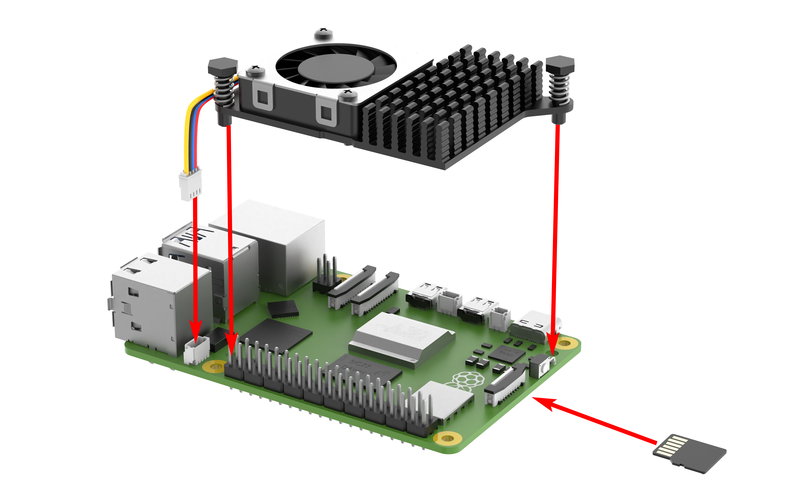
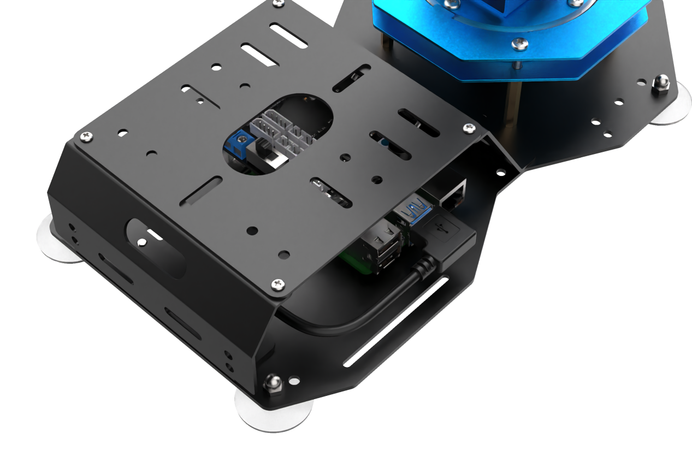
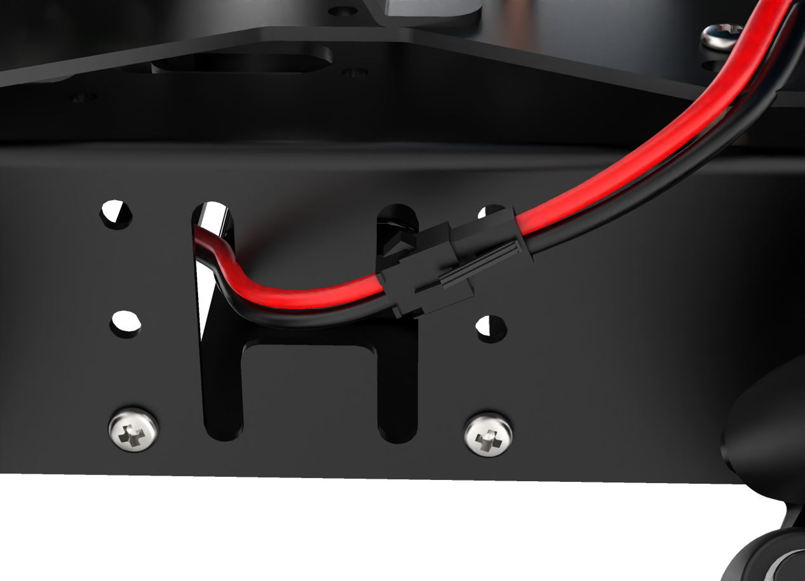
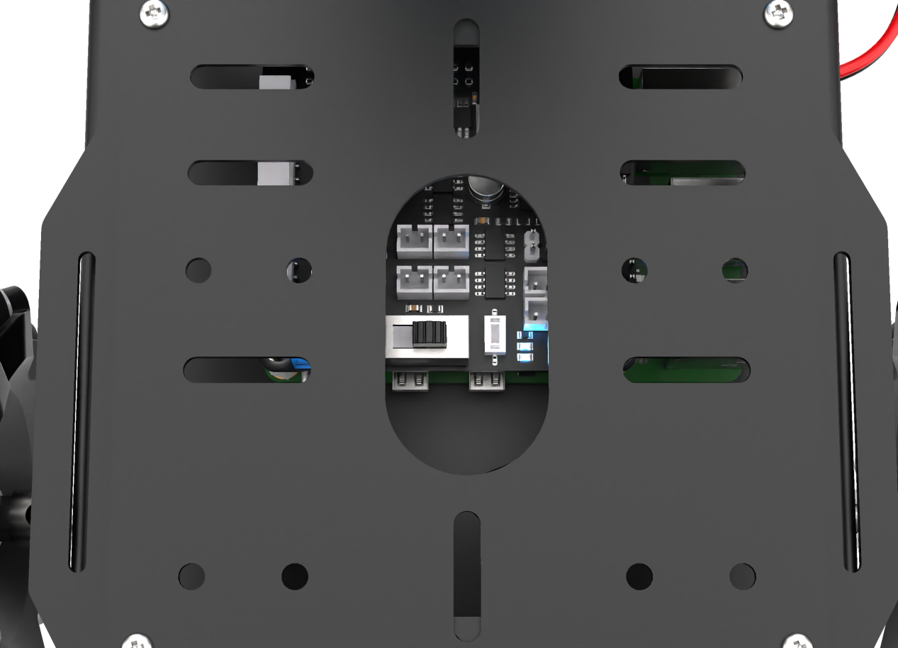
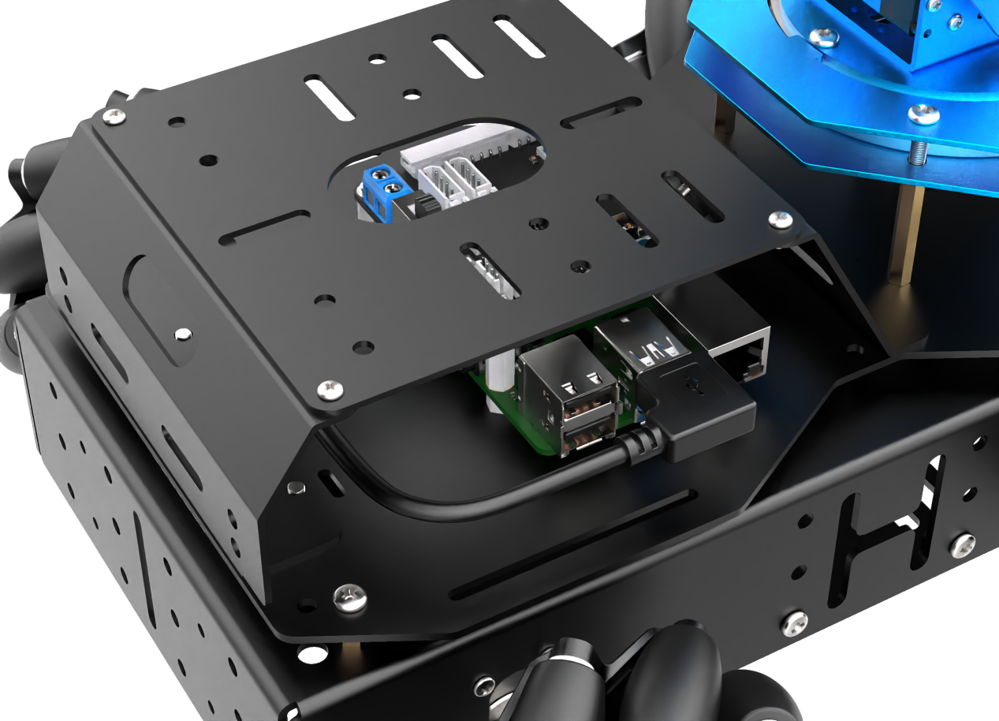
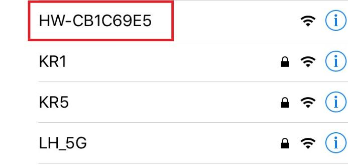

# 学前先看

## 1. 认识ArmPi Pro

### 1.1 产品简介

ArmPi Pro是一款基于ROS操作系统开发的智能视觉搬运机器人，以树莓派5为主控，采用Python编程，在原ArmPi FPV视觉机械臂的基础上，它增加了一个可以全向移动的麦克纳姆轮底盘，使得机器人可以进行移动抓取、目标追踪、智能搬运等功能。

ArmPi Pro底盘可以自由拆卸。它既可以作为桌面视觉机械臂使用，也可以作为移动视觉机械臂使用，是一款高性价比的二合一双模态教育机器人产品。

### 1.2 产品清单

##  2. 动手组装

:::{Note}
购买无主板套餐的用户需要参照 2.1 树莓派主板组装。
:::

###  2.1 树莓派主板组装（仅适用于无主板用户）

- #### Step 1

- #### Step 2

- #### Step 3

- #### Step 4

- #### Step 5

- #### Step 6

### 2.2 机器人组装

- #### Step 1

- #### Step 2

- #### Step 3

- #### Step 4

- #### Step 5

- #### Step 6

- #### Step 7

- #### Step 8

- #### Step 9

- #### Step 10

- #### Step 11

- #### Step 12

- #### Step 13

- #### Step 14

- #### Step 15

- #### Step 16

- #### Step 17

- #### Step 18

- #### Step 19

- #### Step 20

##  3. 首次开机

### 3.1 检查摄像头是否连接

在开机之前请先确认摄像头连接线是否已连接牢固（摄像头连接线可接入树莓派主板上4个USB接口的任意一个）。

### 3.2 电源连接与充电

- #### 电源连接

确认树莓派扩展板开关置于OFF档，将拓展板上的对接线与电源对接线以红接红、黑接黑的方式进行连接。

- #### 充电方法

1)  拿出充电器，将插头端连接至电源另一端带圆孔的插口内。

2)  等待充电完成（适配器指示灯在未通电的状态下为绿色，通电后为红色代表充电中（充电时长约为3个小时左右）、指示灯由红色变为绿色代表充电完成），充电完成后，请尽快拔掉充电器，切勿一直充电。

### 3.3 开关机

- ####  开机

1)  将树莓派扩展板的开关由“OFF”推动到“ON”，此时树莓派的LED1、LED2常亮，稍等片刻后LED2由常亮变为每隔2秒闪亮一次、机械臂回到初始姿态、蜂鸣器发出“嘀”的一声，即设备成功开机。

树莓派本身也是电脑，开机启动需要一小段时间，请耐心等待。

2)  设备开机成功后，出厂默认为AP直连模式，并将产生一个以HW开头的热点。

- #### 关机

关机可分为硬关机和软关机两种方法，具体步骤如下表格：

|  方法  |                     步骤                      |
|:------:|:---------------------------------------------:|
| 硬关机 | 将树莓派扩展板的开关由“**ON**”推动到“**OFF**” |
| 软关机 |       打开终端，运行“**poweroff**”命令        |

注意：使用软件关机时，需在电脑端远程连接ArmPi Pro；具体步骤可前往“**[远程工具安装及容器进入方法\1. 远程桌面工具安装与连接]()**”进行学习。

接下来您可前往“**[上手试玩]()**”继续学习后续内容。
