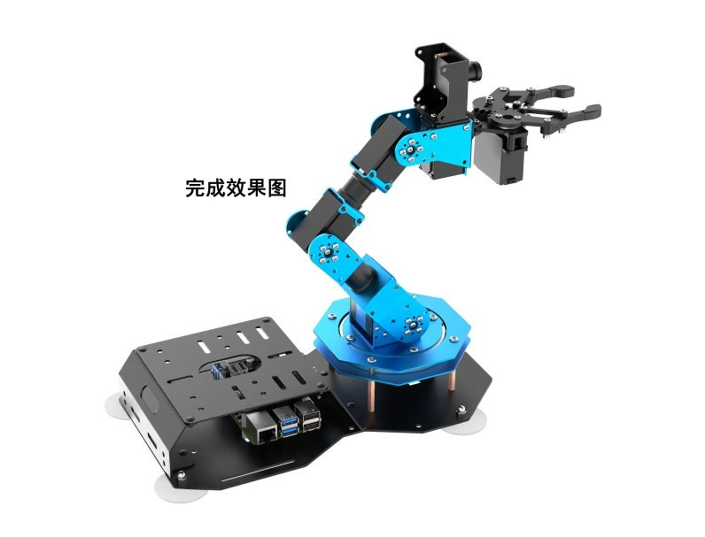

# 学前先看

## 1. 认识ArmPi Pro

### 1.1产品简介

ArmPi Pro是一款基于ROS操作系统开发的智能视觉搬运机器人，以树莓派5为主控，采用Python编程，在原ArmPi FPV视觉机械臂的基础上，它增加了一个可以全向移动的麦克纳姆轮底盘，使得机器人可以进行移动抓取、目标追踪、智能搬运等功能。

ArmPi Pro底盘可以自由拆卸。它既可以作为桌面视觉机械臂使用，也可以作为移动视觉机械臂使用，是一款高性价比的二合一双模态教育机器人产品。

### 1.2 产品清单

##  2. 动手组装

:::{Note}
购买无主板套餐的用户需要参照 2.1 树莓派主板组装。
:::

###  2.1 树莓派主板组装（仅适用于无主板用户）

- #### Step 1

- #### Step 2

- #### Step 3

- #### Step 4

- #### Step 5

- #### Step 6

### 2.2 机器人组装

- #### Step 1

- #### Step 2

- #### Step 3

- #### Step 4

- #### Step 5

- #### Step 6

- #### Step 7

- #### Step 8

- #### Step 9

- #### Step 10

- #### Step 11

- #### Step 12

- #### Step 13

- #### Step 14

- #### Step 15

- #### Step 16

- #### Step 17

- #### Step 18

- #### Step 19

- #### Step 20

