# 上手试玩

## 1. 手机APP安装与连接

### 1.1 准备工作

- **APP安装**

**[安卓系统](https://play.google.com/store/apps/details?id=com.Wonder.Pi)**： 需要注意，请务必在手机设置内为APP开启所有权限，否则可能会影响正常功能实现！

**[iOS系统](https://apps.apple.com/cn/app/wonderpi/id1477946178)**

- **设备开机**

按照"**[学前先看\3. 首次开机](https://docs.hiwonder.com/projects/ArmPi_Pro/en/latest/docs/1_read_before_studying.html#id13)**"所学内容，打开树莓派扩展板电源开关，等待开机完成。

### 1.2 设备连接

ArmPi Pro开机成功后，会进入AP直连模式并生成一个以"**HW**"开头的热点，使用手机APP连接该热点后，即可启动其对应玩法。

1)  打开手机APP，在主界面选择"**进阶平台-\>ArmPi**"。

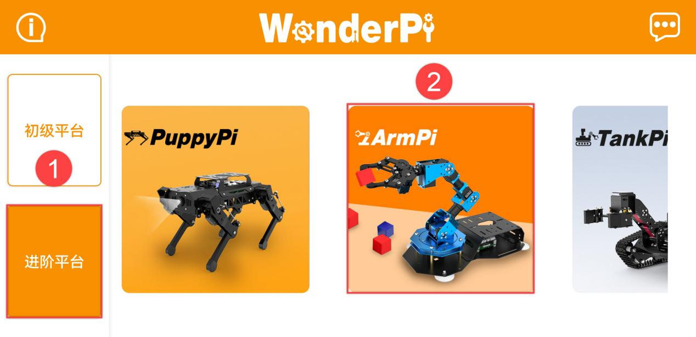

2)  在"**产品选择**"界面中选择"**ArmPi Pro**"。

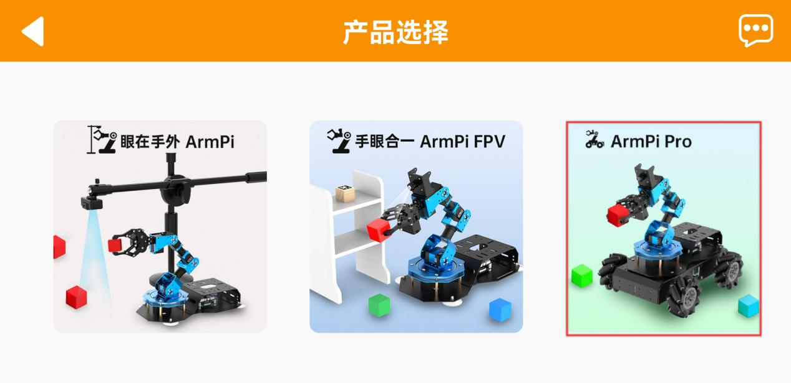

3)  如出现开启权限的提示，直接点击"**允许**"即可。

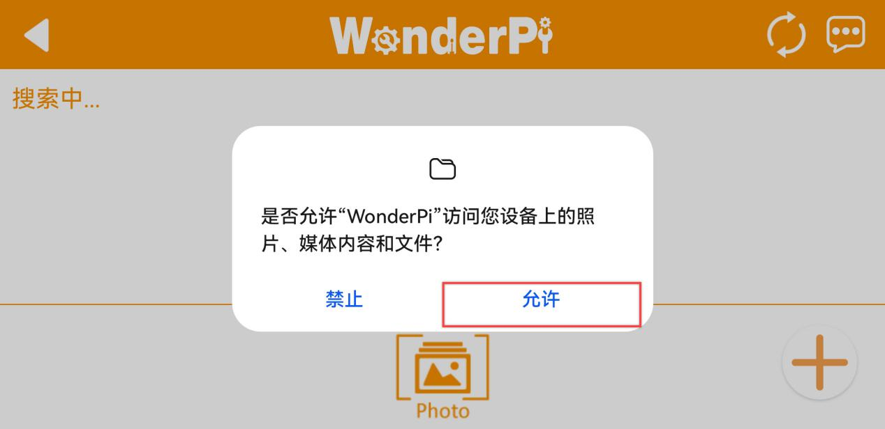

4)  点击界面右下角的"**+**"按钮，选择"**直连模式**"。

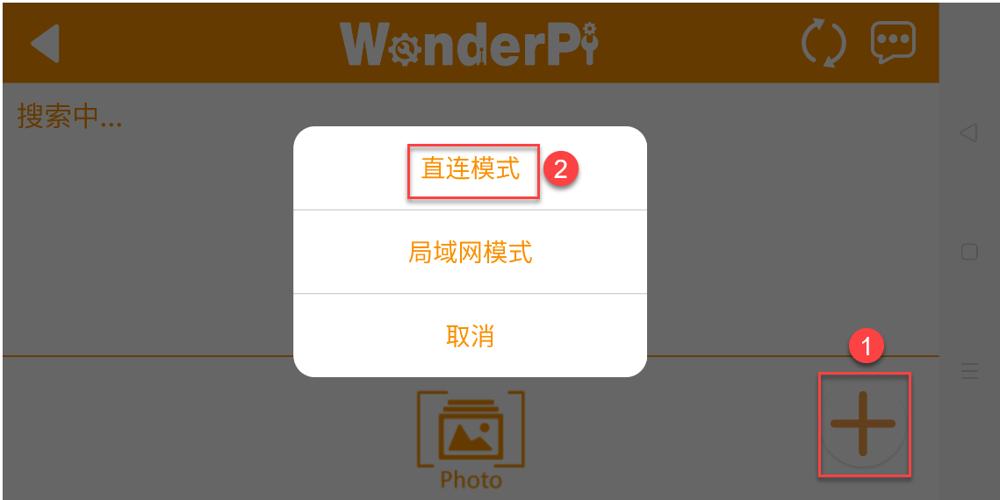

5)  按照画面提示，前往手机设置连接"**HW**"名开头的热点。

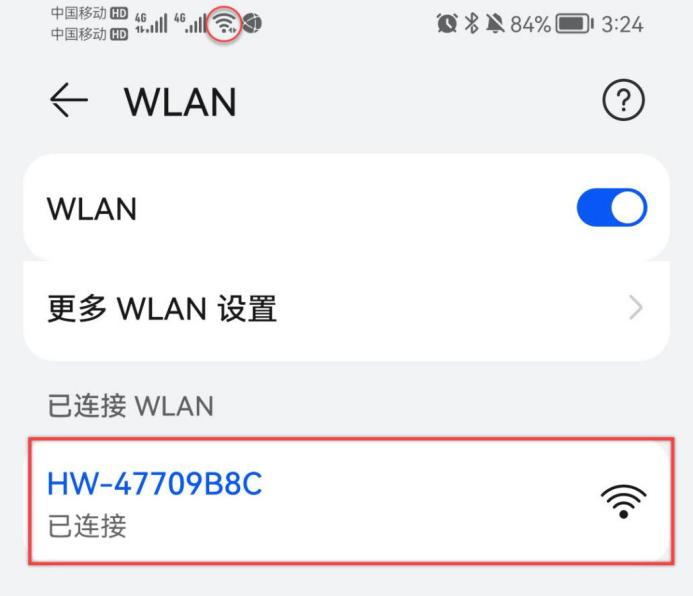

:::{Note}
若使用苹果手机进行操作，在连接热点时，切记要等待手机上方出现了Wi-Fi连接成功的图标之后再返回APP，否则可能会搜索不到设备。出现此情况可点击进行刷新，一般来说多刷新几次，就可以搜索到设备。
:::

6)  连接热点后，返回手机APP，APP将自动连接设备。稍等片刻，当搜索到下图所示图标时，即为连接成功。

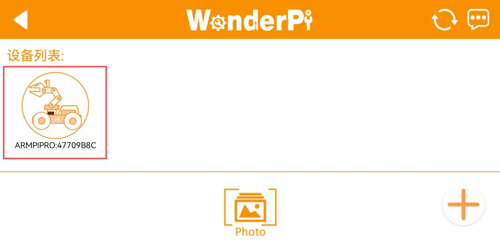

## 2. 通过手机APP进行试玩

### 2.1 准备工作

请参照"**[1. 手机APP的安装和连接](https://docs.hiwonder.com/projects/ArmPi_Pro/en/latest/docs/2_play_first_hand.html)**"下的内容，安装手机APP，并连接ArmPi Pro机器人。

### 2.2 开始试玩

点击ArmPi Pro图标，进入玩法选择界面。

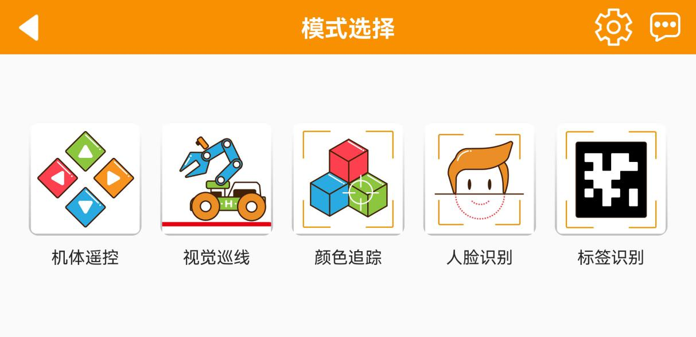

- #### 2.2.1 机体遥控

1)  在功能选择界面中点击"**机体遥控**"，进入玩法界面后，机械臂会立即恢复初始姿态。

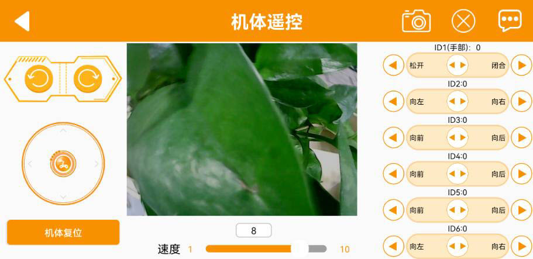

2)  "**机体遥控**"界面分为五个部分，其中，界面左侧可通过滑动摇杆来控制车体运动，其功能图标可参考下表：

| 图标 | 对应功能 |
|:--:|:--:|
| 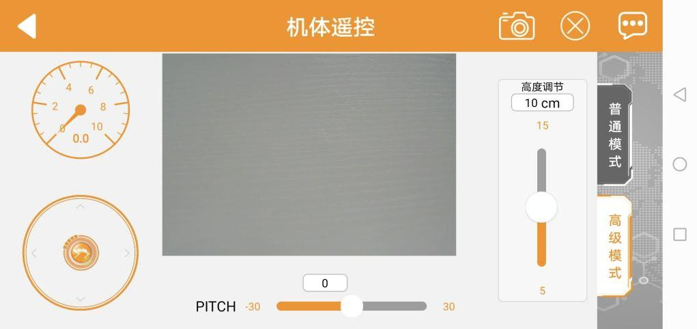 | 拖动摇杆可控制车体朝各个方向运动。 |
| 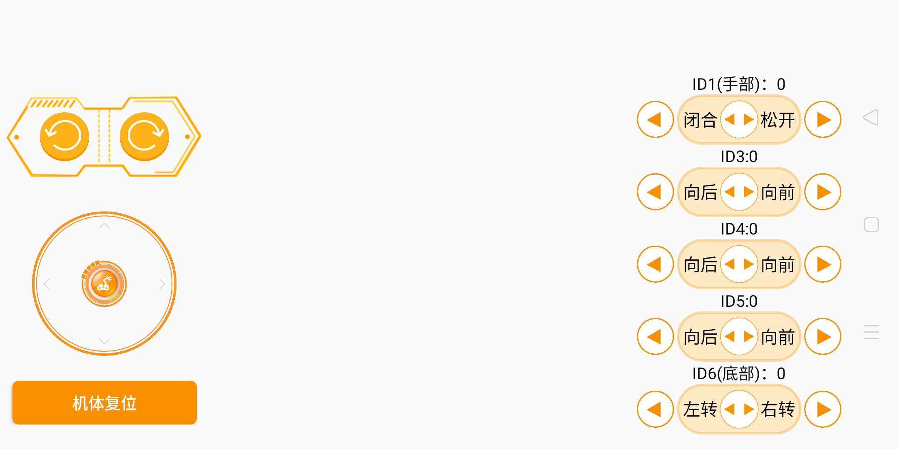 | 控制车体原地转动方向。 |
|  | 控制机械臂部分恢复到初始姿态。 |
|  | 显示当前回传界面。 |
| 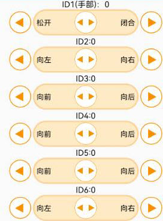 | 控制机械臂各个舵机转动。 |
|  | 调节麦轮的速度。 |

3)  如需返回到玩法选择界面，点击空白区调出标题栏，再点击左侧的左三角即可。

- #### 2.2.2 视觉巡线

:::{Note}
1.  请在光线充足的室内环境下进行，但尽量避免在强光直射下进行。
2.  识别时，摄像头画面内请勿应无同目标颜色相同或相近的杂物，避免干扰识别。
3.  如识别效果不佳，可前往目录"**[3. 颜色阈值设置教学](#anchor_3)**"查看文档，学习颜色阈值的调节方式。
:::

1)  点击"**视觉巡线**"，进入玩法界面。

2)  在"**巡线颜色选择**"栏选择线条颜色后，点击"**开始**"按钮，ArmPi Pro即可巡线行驶。

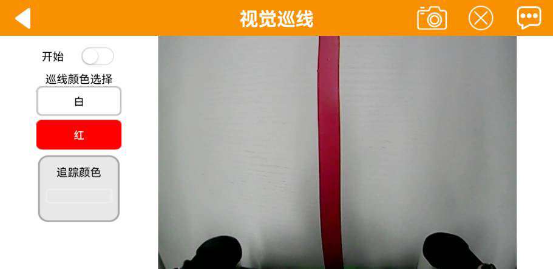

3)  如需返回到玩法选择界面，点击当前界面的空白区域，调出标题栏，随后点击按键即可。

- #### 2.2.3 颜色追踪

:::{Note}
1.  请在光线充足的室内环境下进行，但尽量避免在强光直射下进行。
2.  识别时，摄像头画面内请勿应无同目标颜色相同或相近的杂物，避免干扰识别。
3.  如识别效果不佳，可前往目录"**[上手试玩\ 3. 颜色阈值设置教学](#anchor_3)**"查看文档，学习颜色阈值的调节方式。
:::

1)  点击"**颜色追踪**"，进入玩法界面。

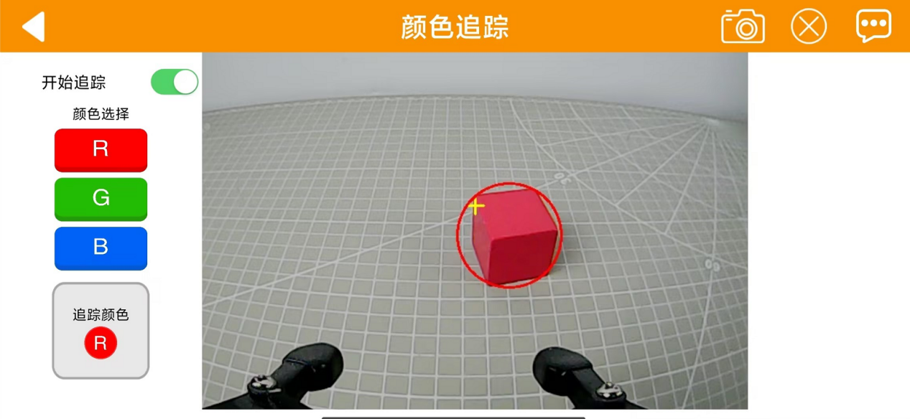

2)  在"**颜色选择**"栏选择颜色后，点击"**开始**"按钮，ArmPi Pro的机械臂即可跟随目标颜色移动。

3)  如需返回到玩法选择界面，点击当前界面的空白区域，调出标题栏，随后点击按键即可。

- #### 2.2.4 人脸识别

:::{Note}
1. 请在光线充足的室内环境下进行，但尽量避免在强光直射下进行。
2. 识别时，摄像头画面最多能出现一张人脸，否则影响玩法效果。
3. 识别人脸的最大距离约为1m。
:::

1)  点击"**人脸识别**"，进入玩法界面。

2)  点击"**开始**"选项，机械臂将跟随摄像头识别范围内的人脸移动而移动。

3)  如需返回到玩法选择界面，点击当前界面的空白区域，调出标题栏，随后点击按键即可。

2.5标签识别

1.  在玩法选择界面中点击"**标签识别**"，进入玩法界面。

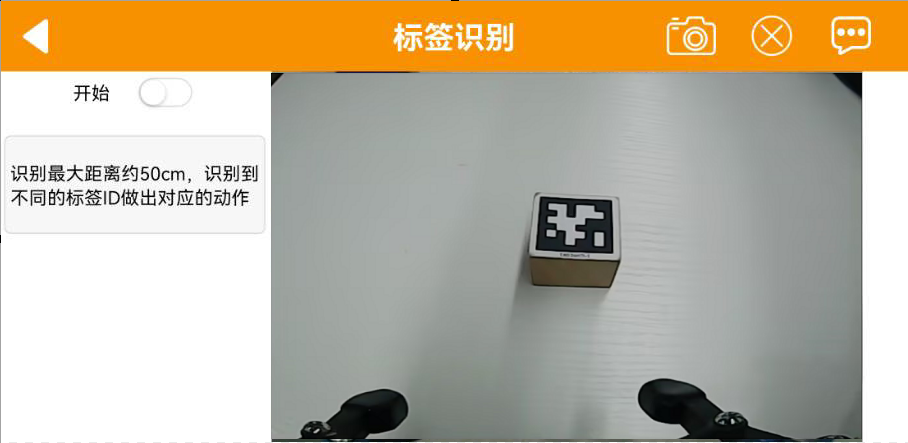

2.  点击"**开始**"按钮，ArmPi Pro对摄像头识别范围内的标签进行识别，根据ID的不同，将做出不同的反馈，具体动作如下表所示：

| **ID** |                   **执行动作**                   |
|:------:|:------------------------------------------------:|
|   1    |  麦轮以三角形为轨迹进行移动（车头朝向始终朝前）  |
|   2    |   麦轮以圆形为轨迹进行移动（车头朝向始终朝前）   |
|   3    | 麦轮以圆形为轨迹进行移动（车头朝向始终朝向圆心） |

## 3. 颜色阈值设置教学

我们在体验ArmPi Pro视觉玩法过程中，可能会受到周围环境光线的干扰，使得某些玩法达不到预期的效果。这个问题我们可以通过调节颜色阈值得以解决（本节以安卓界面为例进行说明，苹果手机用户也一致适用此方法）。

本节以调节红色为例，步骤如下：

1)  参照"**[上手试玩\ 2. 手机APP试玩](#anchor_2)**"内容，打开APP，连接设备。

2)  在APP控制界面内点击如下图框出按钮，进入阈值设置界面。

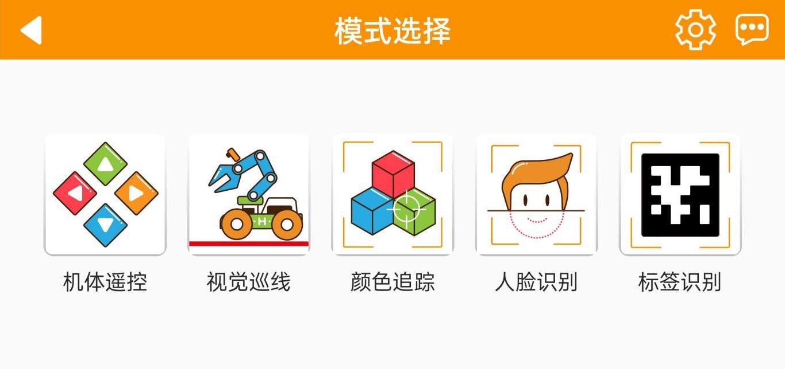

3)  我们将红色方块放置在摄像头底下，然后点击红色按钮。

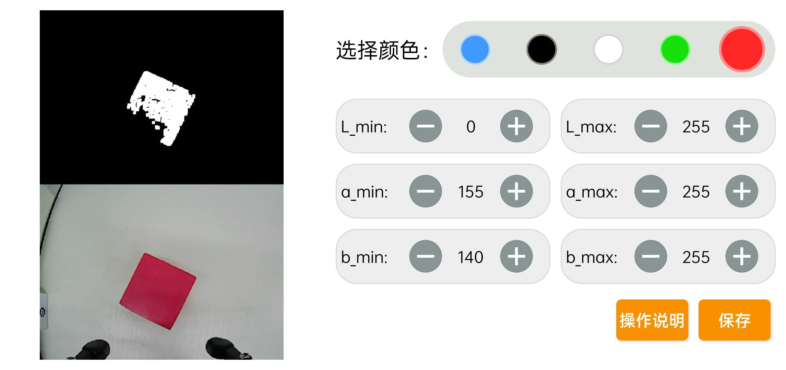

4)  点击"**操作说明**"按钮，进入帮助界面。

5)  我们可以看到红色位于Lab颜色模型图"+a"附近（在这里我们只截取了部分操作说明图片，用户可以往下滑动看到更详细的操作说明），故我们需要将阈值的区间往该处调整。点击"好的"返回阈值设置界面。

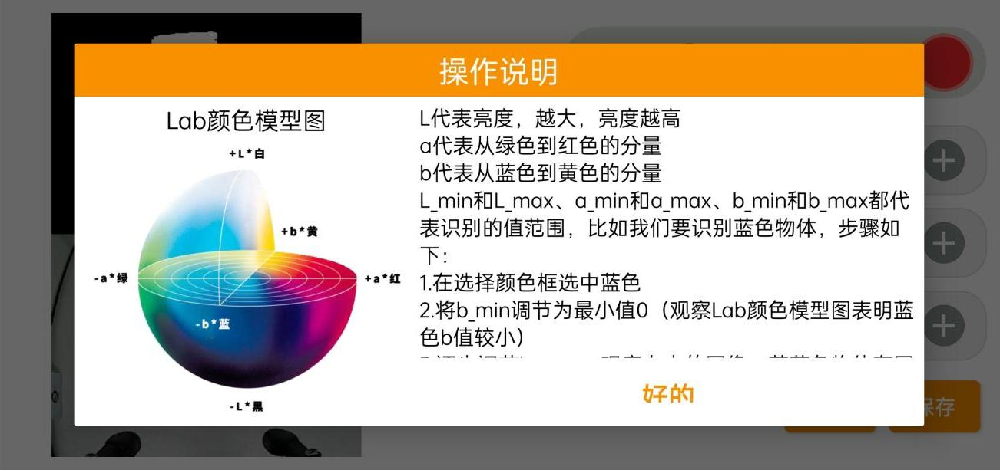

6)  将L、A、B三个颜色分量的数值范围都调整为0~255，即所有_min的参数都为0，所有_max的参数都为255。

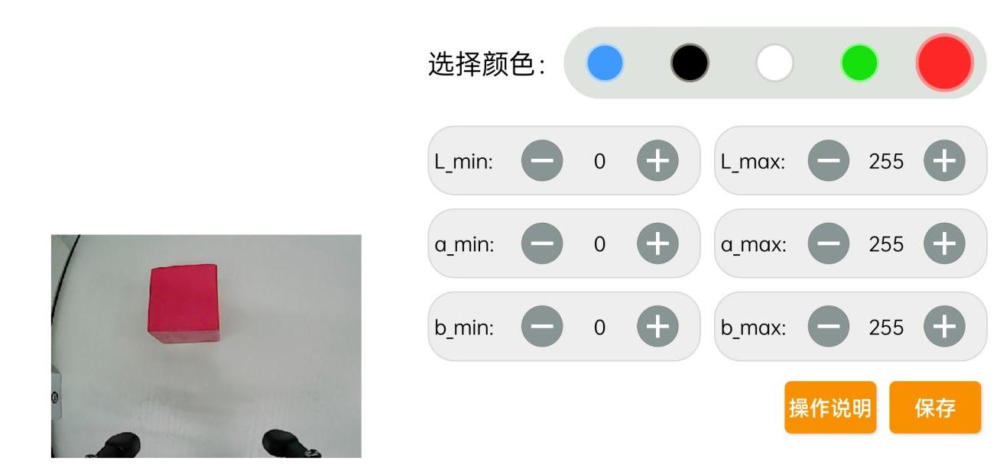

7)  保持A分量"a_max"的数值不变，将"a_min"的数值增大，直至画面显示区上方的颜色物 体区域变为白色，其它区域变为黑色。

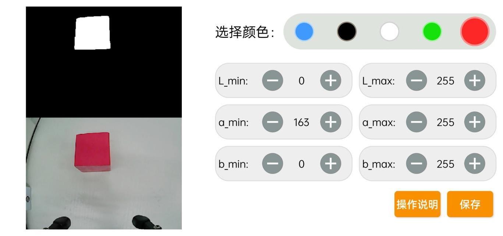

8)  再根据所处的环境修改L和B分量的数值。若红色偏浅，则增加L分量"L_min"的数值；偏深，则减小L分量"L_max"的数值。若红色偏暖，则增加B分量"b_min"的数值；偏冷，则减小B 分量"b_max"的数值。调节完成后，点击"保存"。

9)  点击屏幕上方空白的地方调出"菜单栏"后点击"返回"即可

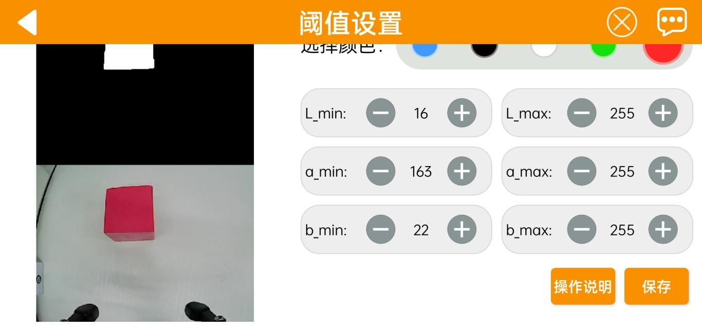
