# 2. Quick User Experience

## 2.1 APP Installation and Connection 

The following instructions use TurboPi as an example and apply to other Hiwonder Raspberry Pi series products as well.
In this section, you will learn how to use APP "**WonderPi**" to control TurboPi. The installation method is as follows.

:::{Note}

① Make sure all APP permissions are turned on in settings, otherwise APP functions will be limited!

② Turn on Location and WiFi before operation.

:::

### 2.1.1 Installation

**[APP Installation Pack (Android)](https://play.google.com/store/apps/details?id=com.Wonder.Pi)**

**[APP Installation Pack (iOS)](https://apps.apple.com/cn/app/wonderpi/id1477946178)**

:::{Note}
- Please turn TurboPi on before connecting. 

- Make sure all APP permissions are turned on in settings, otherwise APP functions will be limited!

- Turn on Location and WiFi before operation.

:::

### 2.1.2 APP Connection

(1) Start robot. (The switch is on Raspberry Pi expansion board). For detailed instruction, please refer to the file in "**[Getting Ready\1.4 Charging and Power-On Status Explanation](https://docs.hiwonder.com/projects/ArmPi_Pro/en/latest/docs/1_read_before_studying.html#charging-and-power-on-status-explanation)**".

(2) After TurboPi boots up successfully, it enters AP direct connection mode, and generates a WiFi starting with **"HW"**. Join this WiFi, and then you can experience robot games

* **Introduction to Connection Mode**

There are two connection modes, namely direct connection mode and LAN mode. APP functions are the same under these two modes.

(1) AP direct connection mode: RaspberryPi generates a WiFi which can be connected by phones. But this WiFi has no internet access. 

(2) STA LAN mode: Raspberry Pi actively connects to specific WiFi. In this mode, you can access internet.

* **Direct Connection Mode (MUST-READ)** 

:::{Note}
After TurboPi boots up successfully, it enters AP direct connection mode, and generates a WiFi starting with **"HW"**.
:::

(1) Open"**WonderPi**". Select **"Standard ->TurboPi"** in sequence.

(2) Tap **"+"** in bottom right corner, and then select **Direct Connection Mode**.

(3) Tap **"Go to connect device hotspot"**. Join WiFi starting with "**HW**". The password is **"hiwonder"**.

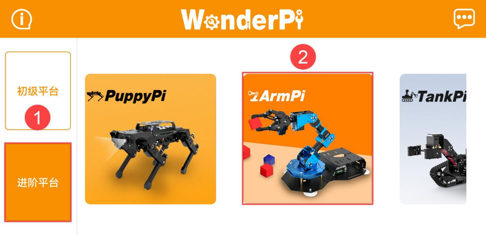

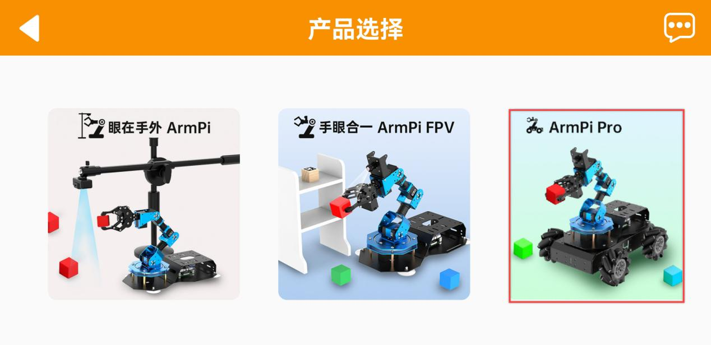

(4) Return back to APP after connection.

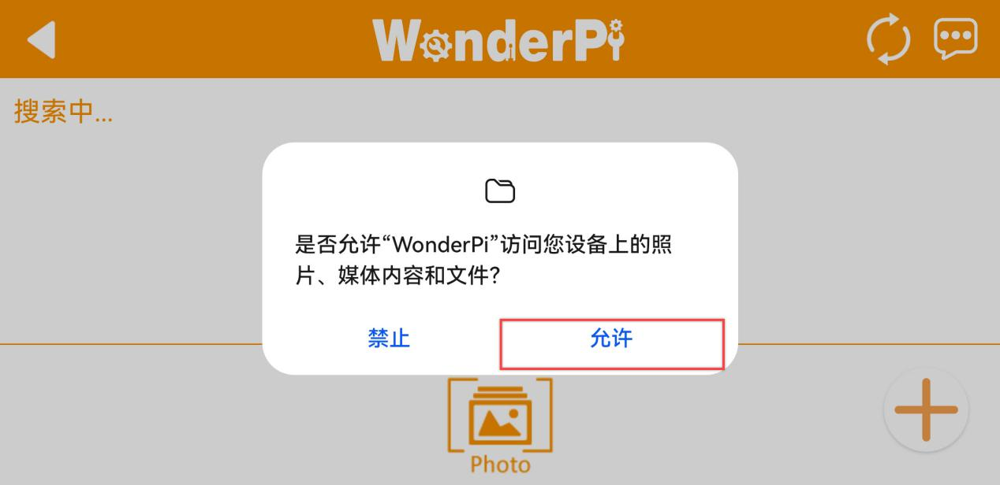

:::{Note}
 for iOS user, please don't return to APP until WiFi icon appears on status bar, otherwise robot cannot be searched. If robot cannot be searched by APP, tap 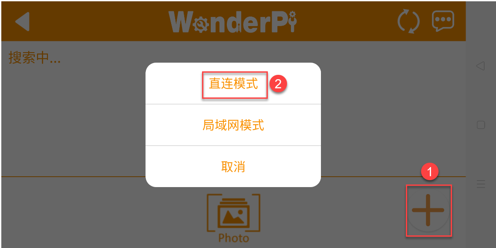 to refresh.
:::

(5) APP automatically connects to robot. When robot icon below occurs, connection completes. 

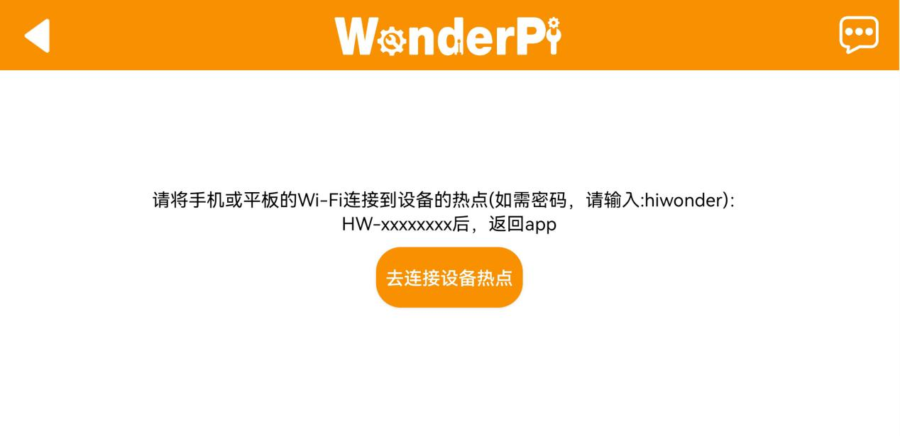

:::{Note}
if you are informed of "**No Internet. Whether to keep connection**", just select "**keep connected**".
:::

(6) Tap robot icon to enter mode selection interface.

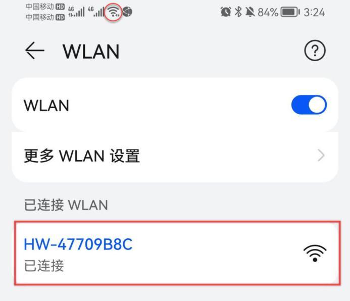

For detailed introduction to robot games, please refer to the file in "**[2.2 APP Control](#anchor_2_2)**".

* **LAN Connection Mode**

(1) Disconnect the WiFi generated by TurboPi. Connect your phone to a WiFi. Take **"Hiwonder"** as example.

(2) After connection, open **"WonderPi"**. Select **"Standard ->TurboPi"** in sequence.

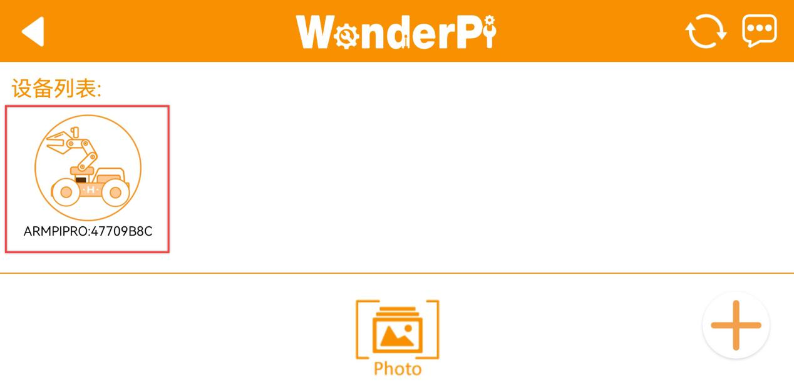

(3) Tap "**+**" in bottom right corner, and then select LAN Mode.

(4) Input the password of the WiFi your phone joins. Ensure the password you input is correct, otherwise APP fails to connect to robot. Tap **"OK"**.

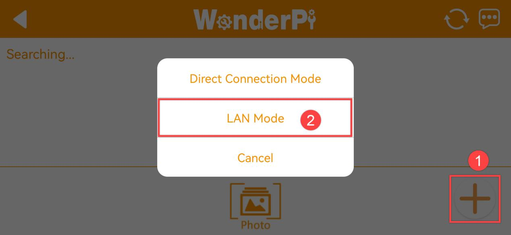

(5) Tap "  **to connect device hotspot**".

(6) Join the WiFi starting with **"HW".** The password is **"hiwonder"**. After connection, return back to APP.

(7) APP automatically configures network.

(8) After a while, robot icon below occurs, and LED on expansion board keeps on.

(9) Long press robot icon to check TurboPi's IP and ID.

(10) Tap robot icon to enter mode selection interface.

For detailed introduction to robot games, please refer to the file in"**[2.2 APP Control](#anchor_2_2)**".

## 2.2 App Control

### 2.2.1 Getting Ready

Please refer to "[**2.1 APP Installation and Connection**](#anchor_2_1)" to install the app and connect to ArmPi Pro.

### 2.2.2 Start Game

Click ArmPi Pro icon to enter mode selection. 

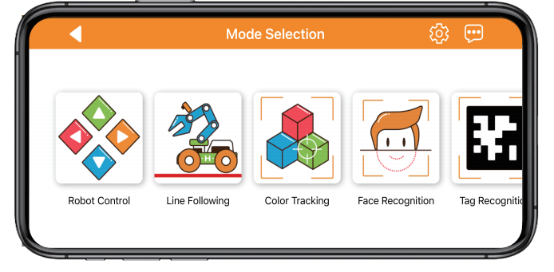

* **Robot Control** 

(1) Select "**Robot Control**" in Mode Selection interface to enter this game, robotic arm will return to the initial posture.

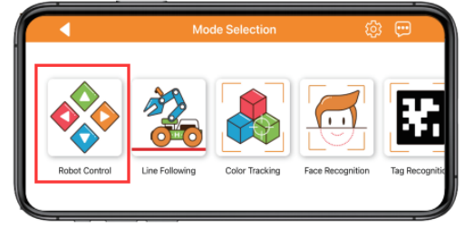

(2) The interface of "**Robot Control**" interface is divided into six parts. The left side is the interface to control the movement of robot by dragging the slider. Other function icons can refer to the following table:

|                                                         Icon                                                          | Function |
|:---------------------------------------------------------------------------------------------------------------------:|:--:|
| 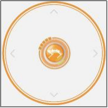  | Drag slider to control the movement of ArmPi Pro |
|  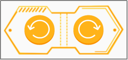  | Control the movement direction of ArmPi Pro |
|    | Control the robotic arm return to the initial posture |
| 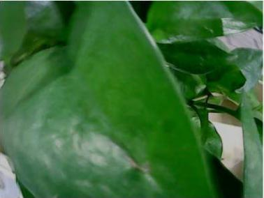 | Display the current transmitted image |
|           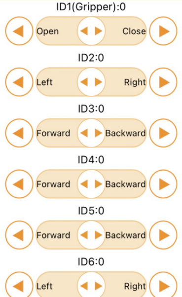            | Control the rotation of each servo of robotic arm |
|           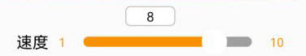            | Adjust the speed of mecanum wheel |

(3) If want to back to the mode selection interface, click the blank area of interface and then click  in the left side.

* **Line Following** 

:::{Note}
* Please start this game in a well-lit environment, but keep robot from the direct light.
* When recognizing, please do not have the same or similar colored object within the detected range to avoid interference.
* If the recognition effect is not good enough, please refer to  "[**2.3 Adjust Color Threshold**](#anchor_2_3)".
:::

(1) Click **"Line following"** to enter this game.

(2) After selecting color for the line, click **"Start"** to start following line.

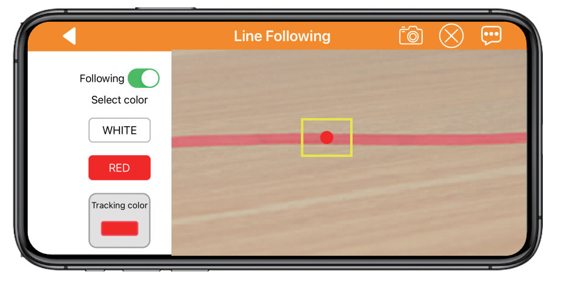

(3) If want to back to the mode selection interface, click the blank area of interface and then click  in the left side.

* **Color Tracking** 

:::{Note}

* Please start this game in a well-lit environment, but keep robot from the direct light.
* When recognizing, please do not have the same or similar colored object within the detected range to avoid interference.
* If the recognition effect is not good enough, please refer to  "[**2.3 Adjust Color Threshold**](#anchor_2_3)".
  :::

(1) Click "**Color Tracking**" to enter this game.

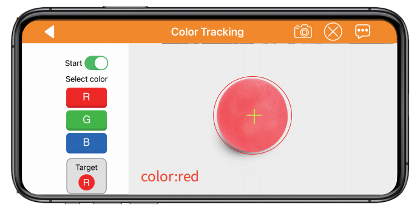

(2) After selecting color, click "**Start**" and then the robotic arm will follow the movement of recognized color.

(3) If want to back to the mode selection interface, click the blank area of interface and then click  in the left side.

* **Face Recognition** 

:::{Note}
* Please start this game in a well-lit environment, but keep robot from the direct light.
* When recognizing, one human face only is allowed to appear within the detected range. Otherwise, it will affect the game result.
:::

(1) Click "**Face Recognition**" to enter this game.

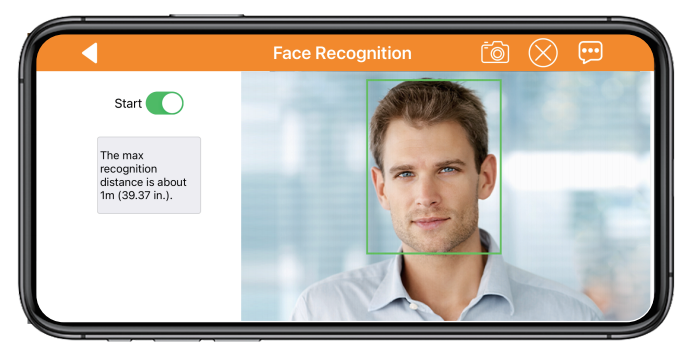

(2) After clicking "**Start**", robotic arm will search human face within the detected range. The recognized face will be framed in a green box after recognizing and the gripper will open. Then, the robotic arm will move with the recognized face.

(3) If want to back to the mode selection interface, click the blank area of interface and then click  in the left side.

* **Tag Recognition** 

(1) Click "**Tag Recognition**" in mode selection interface to enter this game.

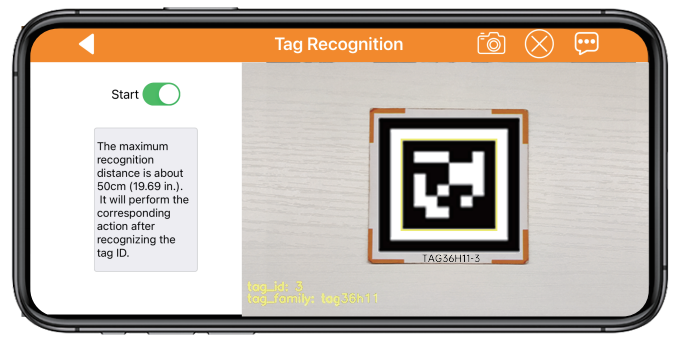

(2) Click "**Start**". Then ArmPi Pro will identify Tag within the detected range and carry out different actions according to the recognized ID. 

| **ID** |                                       **Corresponding Action**                                        |
| :----: |:-------------------------------------------------------------------------------------------------:|
|   1    |      The mecanum wheel moves in a triangular trajectory. (The car is always facing forward)       |
|   2    |        The mecanum wheel moves in a circle trajectory. (The car is always facing forward)         |
|   3    | The mecanum wheel moves in a circle trajectory. (The car is always towards the center of circle.) |

## 2.3 Adjust Color Threshold

Different light source will have different influence on the colors, which will result in recognition discrepancy. To tackle this problem, you can adjust color threshold via "**WonderPi**" APP.

### 2.3.1 Preparation

Start TurboPi. Open "**WonderPi**" APP, and connect it to TurboPi. For how to connect robot to APP, operate referring to "**[2.1 APP Installation and Connection ](#anchor_2_1)**".

### 2.3.2 Interface Layout

Tap  in upper right corner to enter color threshold adjustment interface.

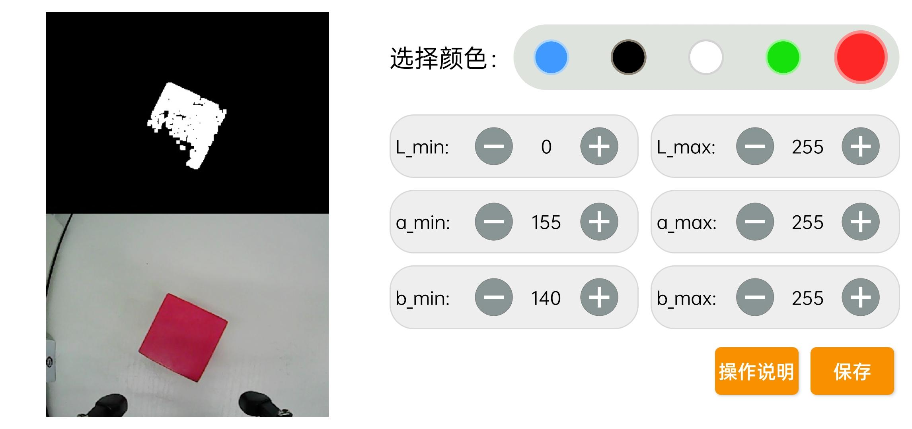

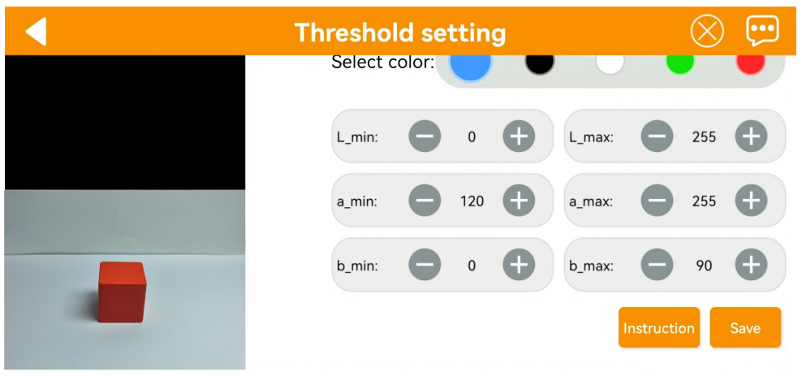

The table below list function of specific icon.

<table class="docutils-nobg" border="1">
<colgroup>
<col  />
<col  />
</colgroup>
<tbody>
<tr>
<td ><strong>Icon</strong></td>
<td ><strong>Function</strong></td>
</tr>
<tr>
<td ></td>
<td >
Processed camera returned image.

Target object is white, and other area is black.
</td>
</tr>
<tr>
<td ></td>
<td >Raw camera returned image.</td>
</tr>
<tr>
<td ></td>
<td >Select the color to be adjusted.</td>
</tr>
<tr>
<td >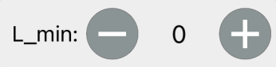</td>
<td >
Adjust L component of camera returned image. "<b>L_min</b>" is lower limit and "<b>L_max</b>" is upper limit.

</tr>
<tr>
<td >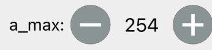</td>
<td >
Adjust A component of camera returned image. "<b>a_min</b>" is lower limit and "<b>a_max</b>" is upper limit.

</tr>
<tr>
<td >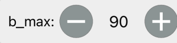</td>
<td >
Adjust B component of camera returned image. "b_min" is lower limit and "b_max" is upper limit.

</tr>
<tr>
<td ></td>
<td >Get instruction to check how to adjust color threshold.</td>
</tr>
<tr>
<td ></td>
<td >Save the adjusted color threshold.</td>
</tr>
<tr>
<td ></td>
<td >Return back to mode selection interface.</td>
</tr>
<tr>
<td ></td>
<td >Hide navigation bar.</td>
</tr>
<tr>
<td ></td>
<td >Display Hiwonder info.</td>
</tr>
</tbody>
</table>

### 2.3.3 Adjust Color Threshold

(1) Select color to be adjusted. Take red as example.

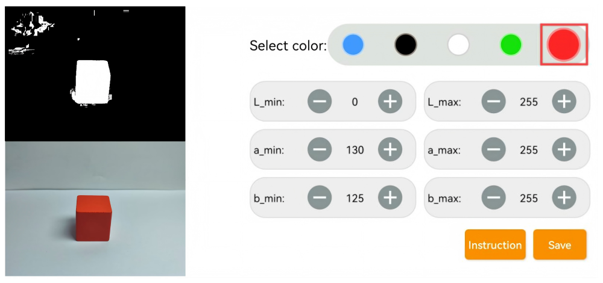

(2) Put red object within camera recognition zone. Set L_min, a_min and b_min to 0, and L_max, a_max and b_max to 255.

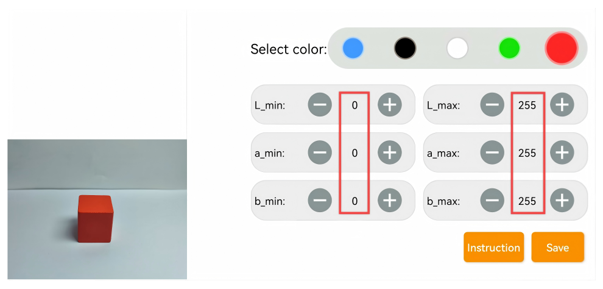

(3) Tap "**Instruction**" icon to check how to adjust color threshold.

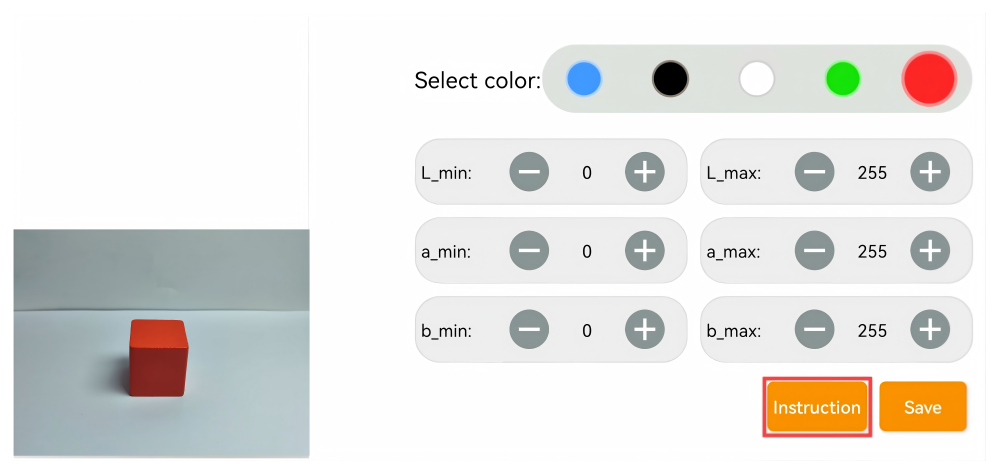

:::{Note}
if you need to close Instruction window, select "**OK**".
:::

(4) Red approaches "**+a**" zone, so you need to adjust A component.

(5) Keep "**a_max**" value the same, and then increase "**a_min**" value till red object turns white and other area is black.

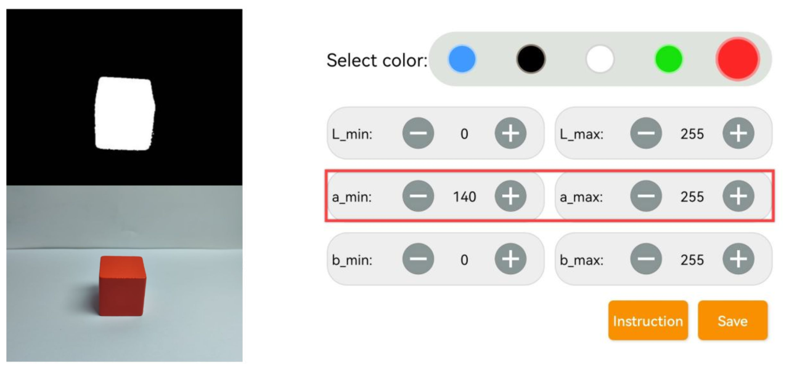

(6) Adjust "**L**" and "**B**" values. If it belongs to light red, increase L_min. Otherwise, decrease L_max. If it belongs to warm tone, increase B_min. Otherwise, decrease B_max.

(7) Remember to save the value after adjustment.

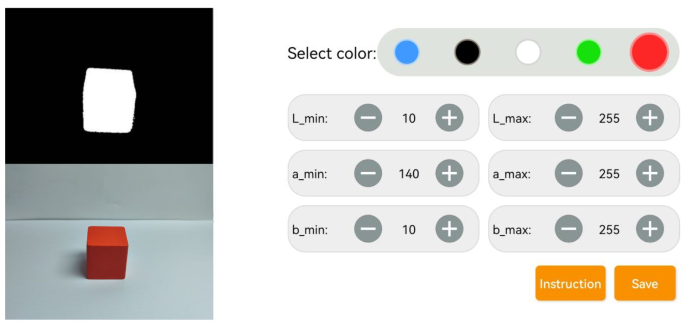
