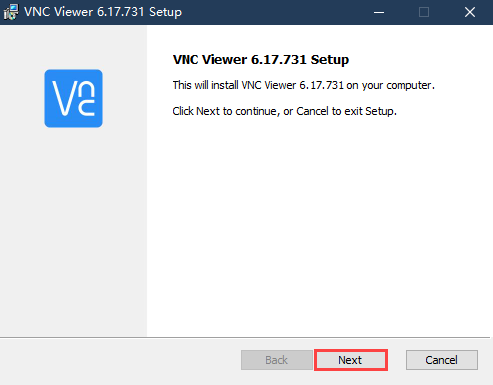
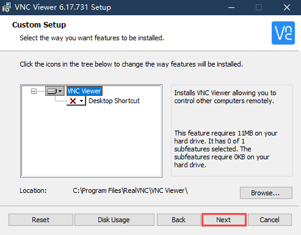
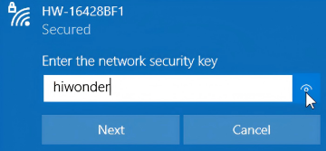
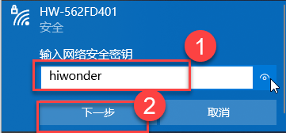
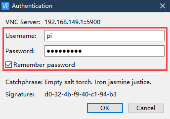
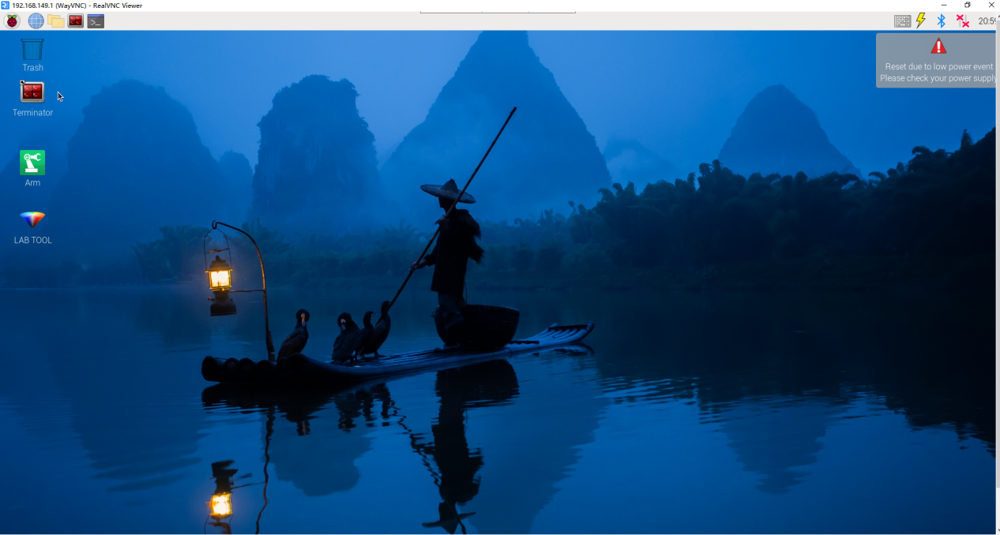
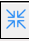

# 3. Remote Desktop Installation and Connection

## 3.1. VNC Installation and Connection

### 3.1.1 Preparation

* **Hardware**

Prepare a computer. If you are using desktop computer, wireless network card is required.The network card should support 5G band.

* **Install VNC**

VNC is a graphical remote desktop control software. Through connecting your computer to the WiFi generated by Raspberry Pi, you can control Raspberry Pi. Installation of VNC is as below.

(1) Double-click the installation program "**VNC-Viewer-6.17.731-Windows**" in the same directory as this section. Select the installation language as "**English**" and lick "**OK**".

(2) Click "**Next**".

(3) Tick **"I accept the terms in the License Agreement"**. Then click **"Next"**.

(4) Remain default location where the software is installed. Click **"Next"** to proceed next interface. Then directly click **"Install"**.

(5) When the installation completes, click **"Finish"**.

(6) Click  to open VNC.

* **Start Robot**

Start Robot When LED1 on expansion board starts flickering and buzzer emits one beep, robot boots up successfully.

### 3.1.2 Connect to Robot

(1) After turning Robot on successfully, the default mode is AP direct connection mode. Robot generates a WiFi starting with HW. Connect your computer to this WiFi.

(2) Input password. The password is **"hiwonder"**.

(3) After connection, open VNC Viewer. Input the default IP address of Raspberry Pi, **192.168.149.1**, and then press Enter. If you receive security warning, select **"Continue"**.

(4) Input username and password. **(Username: pi  Password: raspberrypi)**. Click **"OK"** to enter Raspberry Pi desktop.

(5) The desktop is as pictured. If black screen occurs or only cursor leaves on the screen, restart Raspberry Pi.

### 3.1.3 Introduction to Desktop

The desktop is as pictured after connecting Robot through VNC successfully.

The following table demonstrates common functions:

<table  class="docutils-nobg" border="1">
<colgroup>
<col  />
<col  />
</colgroup>
<tbody>
<tr>
<td >Icon</td>
<td >Function</td>
</tr>
<tr>
<td ></td>
<td >
Application menu. Click to select different applications.

</td>
</tr>
<tr>
<td ></td>
<td >Browser.</td>
</tr>
<tr>
<td ></td>
<td >File manager.</td>
</tr>
<tr>
<td ></td>
<td >LX terminal. Click to input command line in the opened interface.</td>
</tr>
<tr>
<td ></td>
<td >Trash. You can find the files deleted here.</td>
</tr>
<tr>
<td ></td>
<td >PC software. You can adjust pan tilt and adjust color threshold on it.</td>
</tr>
<tr>
<td ></td>
<td >Full screen or exit full screen.。</td>
</tr>
<tr>
<td ></td>
<td >Exit full screen.</td>
</tr>
<tr>
<td ></td>
<td >
Shut down, reboot and logout

</td>
</tr>
</tbody>
</table>
