# 4. Mecanum Wheel Chassis Course

## 4.1 Introduction to Mecanum Car Movement

### 4.1.1 Preface 

ArmPi Pro uses omnidirectional movement mecanum wheels. According to the the included angle 45° between the roller and axle of the mecanum wheels, the wheels can be divided into wheel A and wheel B which are in mirror-image relationship with each other, as the figure shown below:   

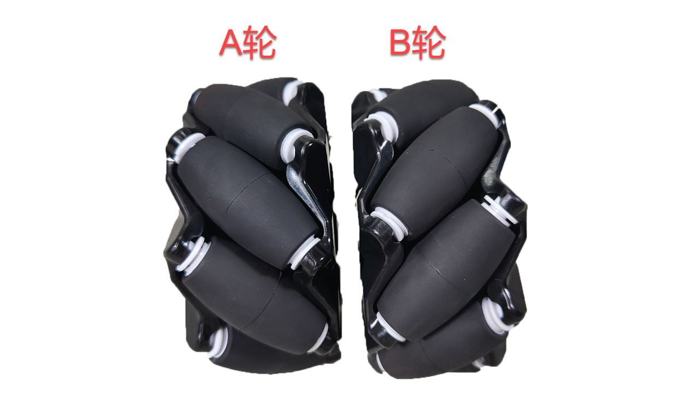

Featuring 360° movement, flexibility and stability, the mecanum wheel is a successful omnidirectional wheel. The combination of four mecanum wheels can be more flexible to realize the omnidirectional movement.

### 4.1.2 Working Principle 

* **Hardware Structure and Physical Characteristics** 

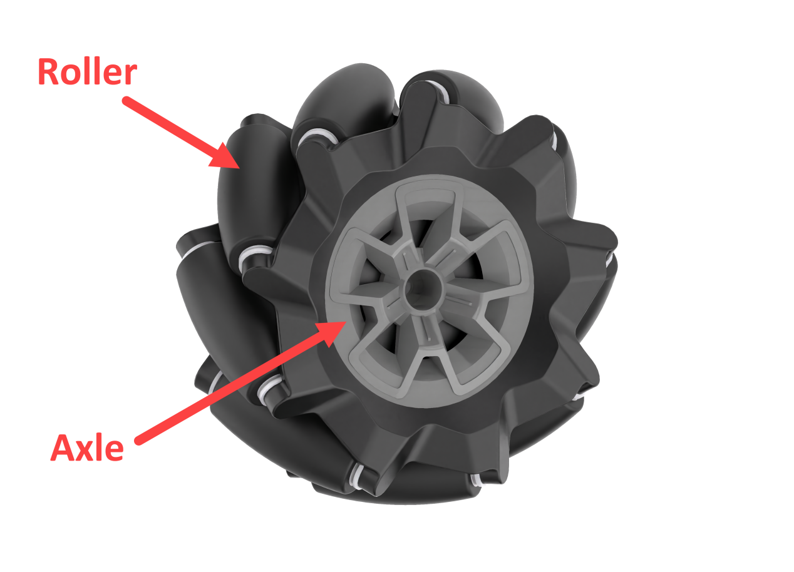

The mecanum wheel is composed of rollers and axle. The axle is as the main bracket of the whole wheel and a series of rubberized external rollers obliquely attached to the whole circumference of its rim. The rollers at its rim oriented at an angle of 45° to the wheel circumference. Mecanum wheels are typically used in sets of four, with two left-rotating wheels (A wheels) and two right-rotating wheels (B wheels), which are symmetrical to each other.
There are several configuration methods of four mecanum wheels, such as AAAA, BBBB, AABB, ABAB, BABA. Not all combination methods of the wheels enable robot car move forward, backward, and sideways, etc. The combination of ArmPi Pro's wheels are ABAB, which can realize omnidirectional movement.

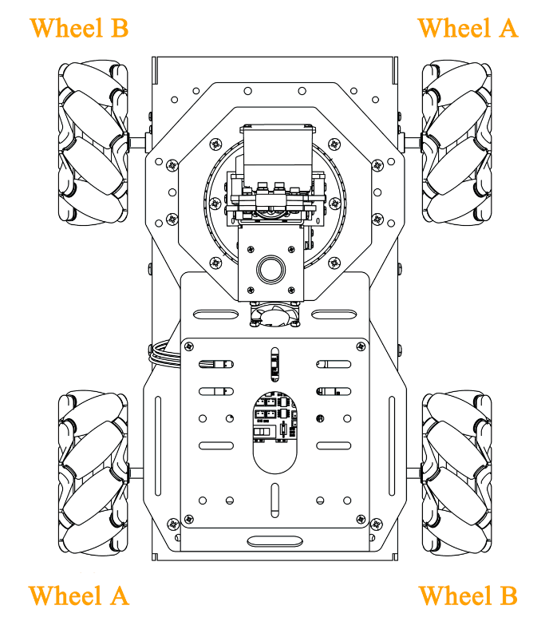

* **Physical Characteristics** 

The omni-directional motion of the vehicle is achieved as the vector summation of propelling forces on the ground-engaging rollers can be in any direction by adjusting the wheel rotation direction and torque magnitude of the four wheels.
Due to the rollers at its rim oriented at an certain angle to the wheel circumference, the mecanum wheels can slip in sideways direction. The generatrix of small rollers are special. When the mecanum wheel revolves around its fixed axle, the envelope of each small roller is a cylindrical surface so that the wheel can roll forward continuously.

### 4.1.3 Motion Mode Analysis

Let's demonstrate by the wheels rotating forward, and only analyze the roller in contact with the ground. When the wheels rotate forward, the roller in contact with the ground can be considered as a stationary point for friction, and the ground will give the roller a frictional force forward. This frictional force can be resolved into two components, one parallel to the roller and the other perpendicular to the roller. The specific analysis is as follow:

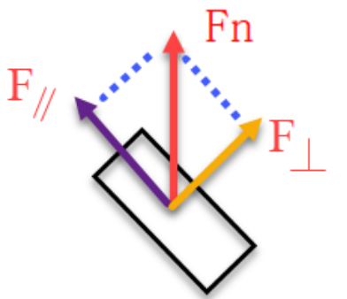

The component perpendicular to the roller will cause the roller to rotate, which is rolling friction and is very small. Therefore, it does not affect the motion of the wheel, and can be assumed to be canceled out due to the rolling of the roller. 
However, because of the physical limit of the roller, it cannot roll in the direction parallel to the roller axis, Therefore, the force parallel to the roller axis produces sliding friction. This force is crucial for the motion of the wheels, and its direction is naturally the direction in which the wheel moves forward when rolling. 

In other words, when the mecanum wheel in the diagram is rolling forward, it will move towards the left front.

:::{Note}
The force analysis is conducted on the roller that is in contact with the ground, and the corresponding roller directly above it is perpendicular to it. In the following lessons, the force will be analyzed from an overhead view, and the direction of force will be perpendicular to the roller directly above it.
:::

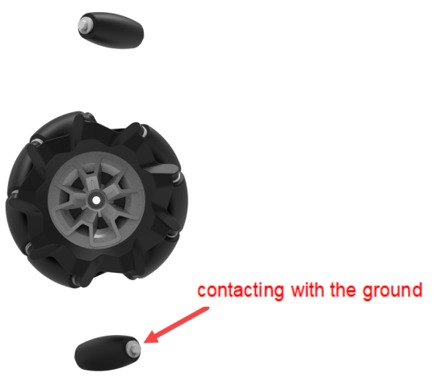

## 4.2 Move Forward

### 4.2.1 Working Principle

According to the characteristic of mecanum wheel, when the car moves forward, the four wheels must rotate clockwise. The force analysis is shown in the following figure: 

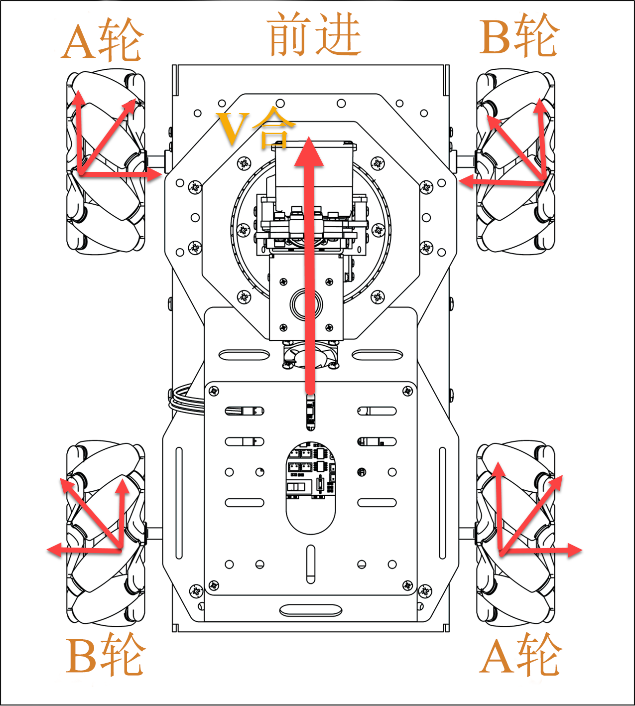

According to physical kinematics, when forces are equal and opposite to each other, they will counteract each other. Any force can be decomposed into two perpendicular vectors. Suppose the speed of wheel A and wheel B rotates at the same speed, a right force decomposed by wheel A and a left force decomposed by wheel B will counteract each other, which the direction of resultant velocity is forward. 
Based on Newton's second law (F=ma), if the direction of acceleration is forward, the final resultant force is also forward.

<p id="anchor_4_2_2"></p>

### 4.2.2 Operation Steps

:::{Note}
It should be case sensitive when entering command, and the **"Tab"** key can be used to complete the keywords.
:::

(1) Power on the robot and use VNC Viewer to connect to the remote desktop.


(2) Click  in the upper left corner of the system desktop to open the "**Terminator**".


(3) Enter the following command and press "**Enter**" to enter the directory of game programmings. 

```bash
cd armpi_pro/src/armpi_pro_demo/chassis_control_demo
```

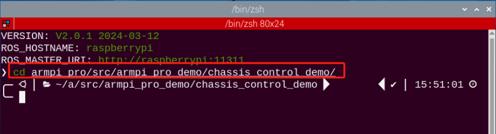

(4) Enter the command below and press "**Enter**" to start game.

```bash
python3 car_forward_demo.py
```

(5) If want to exit the game, press "**Ctrl+C**" in terminal. If fail to exit, please keep trying until the program is closed. 

### 4.2.3 Project Outcome

After starting the game, ArmPi Pro will move forward.

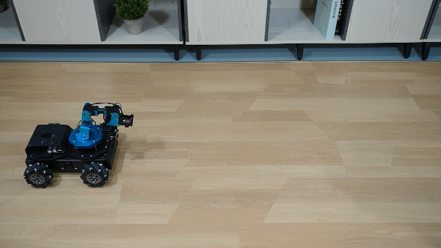


### 4.2.4 Program Analysis

The source code of program is located in: [home/ubuntu/armpi_pro/src/armpi_pro_demo/chassis_control_demo/car_forward_demo.py](../_static/source_code/car_forward_demo.zip)

{lineno-start=25}

```python
start = True
#关闭前处理
def stop():
    global start

    start = False
    print('关闭中...')
    set_velocity.publish(0,0,0)  # 发布底盘控制消息,停止移动
    
if __name__ == '__main__':
    # 初始化节点
    rospy.init_node('car_forward_demo', log_level=rospy.DEBUG)
    rospy.on_shutdown(stop)
    # 麦轮底盘控制
    set_velocity = rospy.Publisher('/chassis_control/set_velocity', SetVelocity, queue_size=1)
    
    while start:
        # 发布底盘控制消息,线速度60，方向角90，偏航角速度0(小于0，为顺时针方向)
        set_velocity.publish(60,90,0) # 向前移动
        rospy.sleep(1)
        
    set_velocity.publish(0,0,0)  # 发布底盘控制消息,停止移动
    print('已关闭')
```

Control motor through the `set_velocity.publish()` function. There are three parameters in function. Take the code `chassis.set_velocity(60,90,0)` as an example:

(1) The first parameter `60` represents the motor speed in the unit of mm/s and it ranges from -100 to 100. When the value is negative, the motor rotates counterclockwise.

(2) The second parameter `90` represents the movement direction of car, the unit is degree and it ranges from 0 to 360. The value of 90°refers to move forward. 270°refers to move backward. 0°refers to move to the right. 180°refers to move the left. Other movement directions are obtained according to the same reference method.  

(3) The third parameter `0` represents the rotation speed of the car, its unit is 5°/s and it ranges from -2 to 2. When the parameter value is positive, the car will rotate clockwise. When the parameter value is negative, the car will rotate counterclockwise.

### 4.2.5 Function Extension

The default movement speed is 60. In this section, change the car speed to 90. Please refer to the following specific steps: 

(1) Click  in the upper left corner of the system desktop to open the "**Terminator**".


(2) Enter the following command and press **"Enter"** to come to the directory of game programmings.

```bash
cd armpi_pro/src/armpi_pro_demo/chassis_control_demo/
```

(3) Enter the following command and press "**Enter**" to open the program file.

```bash
vim car_forward_demo.py
```

(4) Find the code to be modified and press "**i**" to switch to the editing mode.

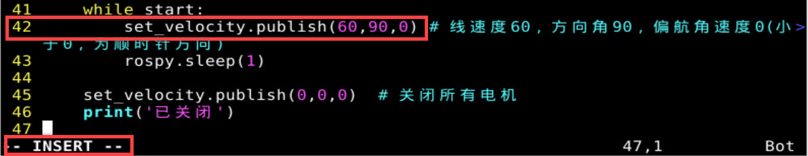

(5) In `set_velocity.publish()` function, the first parameter represents the motor speed and we change it to 90. After changing , press "**Esc**" and enter "**:wq**", and then press "**Enter**" to save and exit.

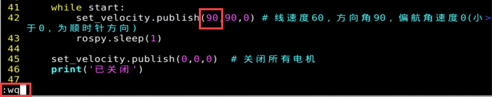

:::{Note}
 The adjustable range of speed is "**-100~100**". When the value is positive, the motor will rotate clockwise. When the value is negative, the motor will rotate counterclockwise. When the positive value is changed to negative value, it may change the movement direction. Therefore, it is recommended to modify the value between 0 and 100.
:::

(6) After modifying, please refer to the content of "[**4.2.2 Operation Steps**](#anchor_4_2_2)" to check the outcome.

## 4.3 Turning

### 4.3.1 Working Principle

According to the characteristics of mecanum wheel , running (all at the same speed) both wheels on one side in one direction while the other side in the opposite direction, will result in a stationary rotation of the chassis car.
Therefore, when the left mecanum wheels rotate clockwise and the right mecanum wheels rotate counterclockwise, the chassis car will be counterclockwise stationary rotation. When the left mecanum wheels rotate clockwise and the right wheels rotates counterclockwise, the chassis car will be clockwise stationary rotation. 
The force analysis of two situation is as follow: 

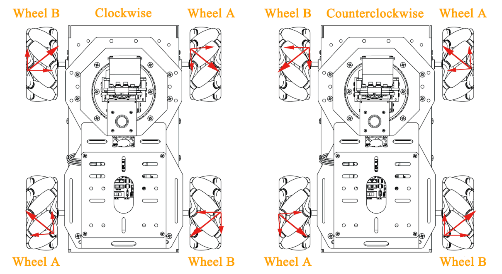

<p id="anchor_4_3_2"></p>

### 4.3.2 Start and Close the Game

:::{Note}
It should be case sensitive when entering command, and the "**Tab**" key can be used to complete the keywords.
:::

(1) Power on the robot and use VNC Viewer to connect to the remote desktop.


(2) Click  in the upper left corner of the system desktop to open the "Terminator".


(3) Enter the following command and press "**Enter**" to enter the directory of game programmings. 

```bash
cd armpi_pro/src/armpi_pro_demo/chassis_control_demo/
```


(4) Enter the following command and press "**Enter**" to start game.

```bash
python3 car_turn_demo.py
```

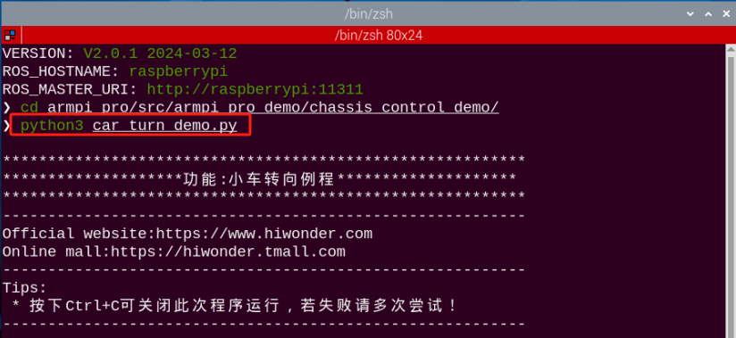

(5) If want to exit the game, press "**Ctrl+C**" in terminal. If fail to exit, please keep trying until the program is closed. 

### 4.3.3 Project Outcome

After starting the game, ArmPi Pro will be clockwise stationary rotation, and then counterclockwise stationary rotation. 

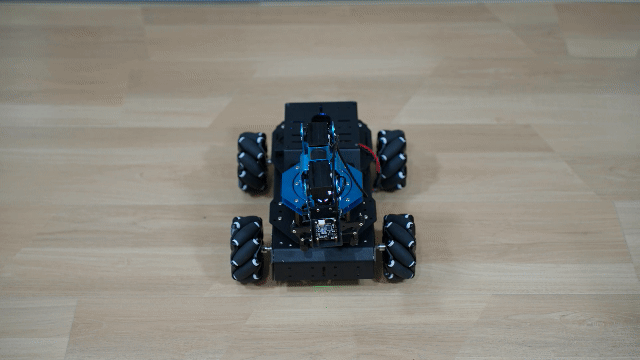


### 4.3.4 Program Analysis 

The source code of the program is located in: [home/ubuntu/armpi_pro/src/armpi_pro_demo/chassis_control_demo/car_turn_demo.py](../_static/source_code/car_turn_demo.zip)

{lineno-start=24}

```python
start = True
#关闭前处理
def stop():
    global start

    start = False
    print('关闭中...')
    set_velocity.publish(0,0,0)  # 关闭所有电机
    
if __name__ == '__main__':
    # 初始化节点
    rospy.init_node('car_turn_demo', log_level=rospy.DEBUG)
    rospy.on_shutdown(stop)
    # 麦轮底盘控制
    set_velocity = rospy.Publisher('/chassis_control/set_velocity', SetVelocity, queue_size=1)
    
    while start:
        set_velocity.publish(0,90,-0.3)# 顺时针旋转
        rospy.sleep(2)
        set_velocity.publish(0,90, 0.3)# 逆时针旋转
        rospy.sleep(2)
    set_velocity.publish(0,0,0)  # 关闭所有电机
    print('已关闭')
```


Control motor through `set_velocity.publish()` function. There are three parameters in function. Take the code `set_velocity.publish(0,90,-0.3)` as an example:

(1) The first parameter `0` represents the motor speed in the unit of mm/s and it ranges from -100 to 100. When the value is negative, the motor rotates counterclockwise.

(2) The second parameter `90` represents the movement direction of car, and its unit is degree and it ranges from 0 to 360. The value of 90°refer to move forward. 270°refers to move backward. 0°refers to move to the right. 180°refers to move the left. Other movement directions are obtained according to the same reference method.  

(3) The third parameter `-0.3` represents the rotation speed of the car, and its unit is 5°/s and it ranges from -2 to 2. When the parameter value is positive, the car will rotate clockwise. When the parameter value is negative, the car will rotate counterclockwise.

### 4.3.5 Function Extension

The default rotation speed of moving forwards is 0.3. This section will modify the clockwise rotation speed of car to 0.5 and the specific operation steps are as follow:

(1) Click  in the upper left corner of the system desktop to open the "**Terminator**".


(2) Enter the following command and press "**Enter**" to come to the directory of game programmings.

```bash
cd armpi_pro/src/armpi_pro_demo/chassis_control_demo/
```

(3) Enter the following command and press "**Enter**" to open the program file.

```bash
vim car_turn_demo.py
```

(4) Find the code to be modified and press "**i**" to switch to the editing mode.

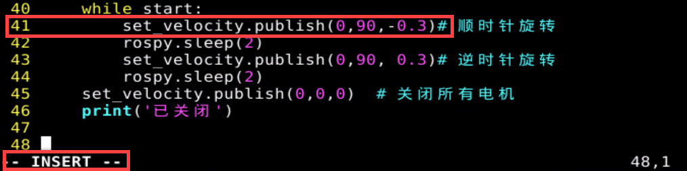

(5) In `set_velocity.publish()` function, the first parameter represents the motor speed and we change it to 90. After changing , press "**Esc**" and enter "**:wq**", and then press "**Enter**" to save and exit.

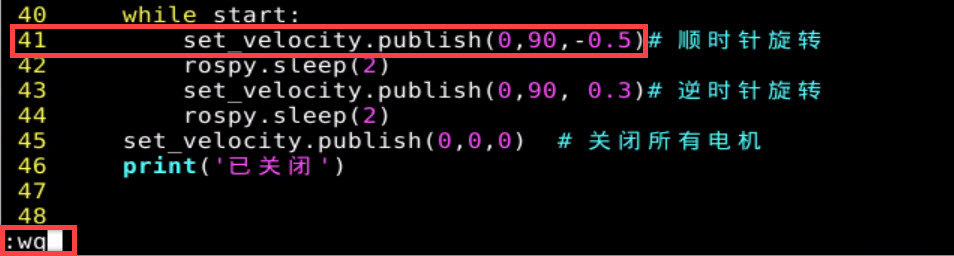

:::{Note}
The adjustable range of speed is "**-2~2**". When the value is positive, the motor will rotate clockwise. When the value is negative, the motor will rotate counterclockwise. It is recommended to modify the value between 0 and 100.
:::

(6) After modifying, please refer to the content of "[**4.3.2 Start and Close the Game**](#anchor_4_3_2)" to check the outcome.

## 4.4 Robot Car Forward, Backward, and Lateral Movement

### 4.4.1 Working Principle

According to the characteristics of mecanum wheel, when all wheels rotate clockwise, the car will move forward; when all wheels rotate counterclockwise, the car will move backwards. When two A wheels rotate counterclockwise and two B wheels rotate clockwise, the car will move sideways to the left; when two wheels B rotates counterclockwise and wheels A rotates clockwise, the car will move sideways to the right. The force analysis for moving forwards, backwards and sideways is shown in the following figure:  

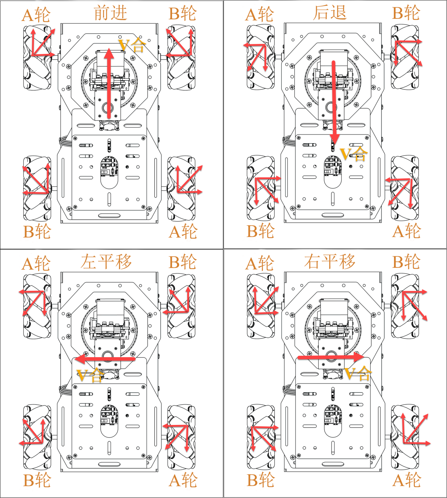

According to physical kinematics, when forces are equal and opposite to each other, they will counteract each other. Any force can be decomposed into two perpendicular vectors. Suppose the speed of wheel A and wheel B rotates at the same speed, a right force decomposed by wheel A and a left force decomposed by wheel B will counteract each other, which the direction of resultant  force is forward. 

Based on Newton's second law (F=ma), if the direction of acceleration is forward, the final  resultant  force  is also forward. 

<p id="anchor_4_4_2"></p>

### 4.4.2 Start and Close the Game

:::{note}
It should be case sensitive when entering command, and the "**Tab**" key can be used to complete the keywords.
:::

(1) Power on the robot and use VNC Viewer to connect to the remote desktop.


(2) Click  in the upper left corner of the system desktop to open the "**Terminator**".


(3) Enter the following command and press "**Enter**" to enter the directory of game programmings. 

```bash
cd armpi_pro/src/armpi_pro_demo/chassis_control_demo/
```

(4) Enter the command below and press "**Enter**" to start the game.

```bash
python3 car_move_demo.py
```

(5) If you want to exit the game, press "Ctrl+C" in terminal. If fail to exit, please keep trying until the program is closed. 

### 4.4.3 Project Outcome

After starting the game, ArmPi Pro will move forward, shift to right, backwards, shift to the left in sequence.

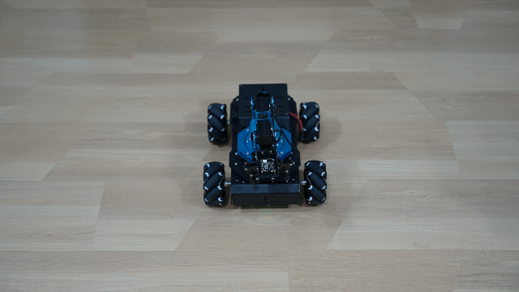

### 4.4.4 Program Analysis 

The source code of program is located in: [home/ubuntu/armpi_pro/src/armpi_pro_demo/chassis_control_demo/car_move_demo.py](../_static/source_code/car_move_demo.zip)

{lineno-start=24}

```python
start = True
#关闭前处理
def stop():
    global start

    start = False
    print('关闭中...')
    set_velocity.publish(0,0,0)  # 发布底盘控制消息,停止移动
    
if __name__ == '__main__':
    # 初始化节点
    rospy.init_node('car_move_demo', log_level=rospy.DEBUG)
    rospy.on_shutdown(stop)
    # 麦轮底盘控制
    set_velocity = rospy.Publisher('/chassis_control/set_velocity', SetVelocity, queue_size=1)
    
    while start:
        # 发布底盘控制消息,线速度60，方向角90，偏航角速度0(小于0，为顺时针方向)
        set_velocity.publish(60,90,0) # 向前移动
        rospy.sleep(2) # 延时2秒
        set_velocity.publish(60,0,0) # 向右移动
        rospy.sleep(2) # 延时2秒
        set_velocity.publish(60,270,0) # 向后移动
        rospy.sleep(2) # 延时2秒
        set_velocity.publish(60,180,0) # 向左移动
        rospy.sleep(2)
    set_velocity.publish(0,0,0)  # 发布底盘控制消息,停止移动
    print('已关闭')
```

Control motor through  `set_velocity.publish()` function. There are three parameters in function. Take the code `set_velocity.publish(60,90,0)` as an example:

The first parameter  `60`  represents the motor speed, its unit is mm/s and it ranges from -100 to 100. When the value is positive, the motor rotates counterclockwise.

The second parameter  `90`  represents the movement direction of car, its unit is degree and it ranges from 0 to 360. The value of 90°refer to move forward. 270°refers to move backward. 0°refers to move to the right. 180°refers to move the left. Other movement directions are obtained according to the same reference method.  

The third parameter  `0`  represents the rotation speed of the car, its unit is 5 degree/s and it ranges from -2 to 2. When the parameter value is positive, the car will rotate clockwise. When the parameter value is negative, the car will rotate counterclockwise.

### 4.4.5 Function Extension

The default speed is 60. This section will change the moving speed to 90 and the specific operation steps are as follow: 

(1) click  in the upper left corner of the system desktop to open the "**Terminator**".


(2) Enter the following command and press "**Enter**" to come to the directory of game programmings.

```bash
cd armpi_pro/src/armpi_pro_demo/chassis_control_demo/
```

(3) Enter the following command and press "**Enter**" to open the program file.

```bash
vim car_move_demo.py
```

(4) Find the code to be modified and press "**i**" to switch to the editing mode.

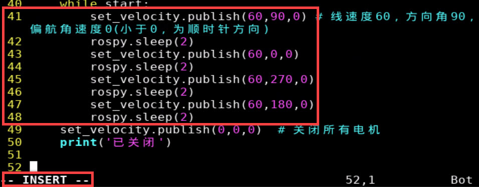

(5) In `set_velocity.publish()` function, the first parameter represents the motor speed and we change it to 90. 

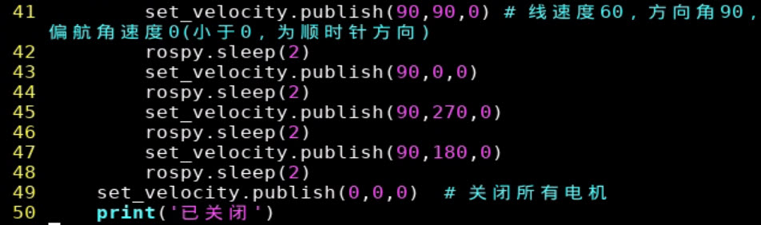

(6) After changing , press "**Esc**" and enter "**:wq**", and then press "**Enter**" to save and exit.

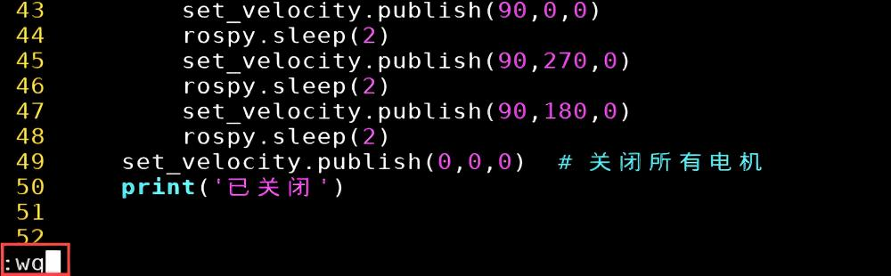

:::{Note}
The adjustable range of speed is "**-100~100**". When the value is positive, the motor will rotate clockwise. When the value is negative, the motor will rotate counterclockwise. Therefore, it is recommended to modify the value between 0 and 100.
:::

(7) After modifying, please refer to the content of "[**4.4.2 Start and Close the Game**](#anchor_4_4_2)" to check the outcome.

## 4.5 Oblique Movement

### 4.5.1 Working Principle

According to the characteristics of mecanum wheel , when wheel A does not move and wheel B rotates clockwise, the car moves to the left front. When wheel B rotates counterclockwise, the car moves to the right rear. When the wheel B does not move and wheel A rotates clockwise, the car will move to the front right. When the wheel A rotates counterclockwise, the car move to the left rear. The force analysis for oblique movement: 

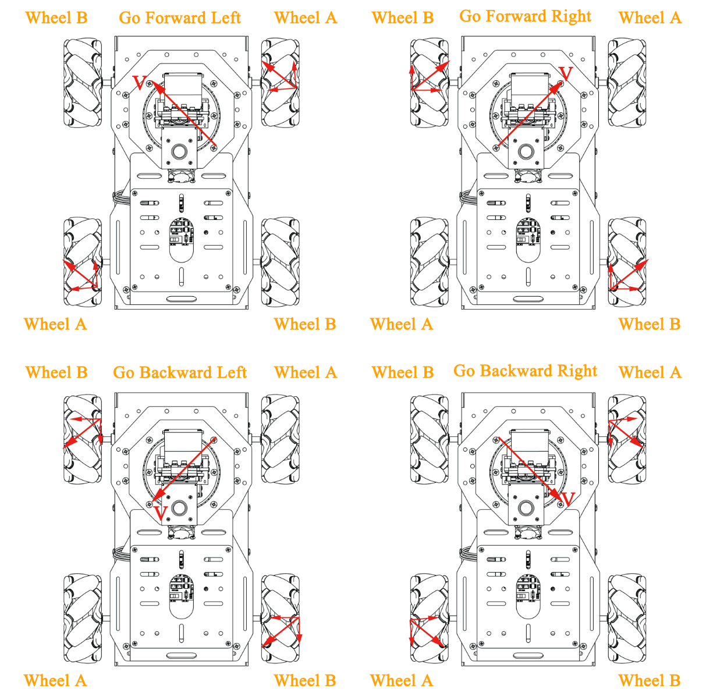

<p id="anchor_4_5_2"></p>

### 4.5.2 Operation Steps

:::{Note}
It should be case sensitive when entering command, and the "**Tab**" key can be used to complete the keywords.
:::

(1) Power on the robot and use VNC Viewer to connect to the remote desktop.


(2) Click  in the upper left corner of the system desktop to open the "Terminator".

(3) Enter the following command and press "**Enter**" to enter the directory of game programmings. 

```bash
cd armpi_pro/src/armpi_pro_demo/chassis_control_demo/
```

(4) Enter the following command and press "**Enter**" to start game.

```bash
python3 car_slant_demo.py
```

(5) If want to exit the game, press "**Ctrl+C**" in terminal. If fail to exit, please keep trying until the program is closed. 

### 4.5.3 Project Outcome

After starting the game, ArmPi Pro will move to the right front, to the right rear, to the left rear, and to the front left in sequence.

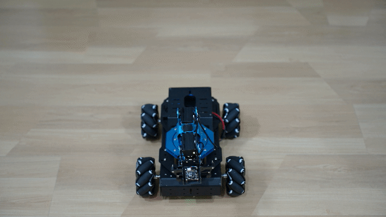

### 4.5.4 Program Analysis

The source code of program is located in: 

[home/ubuntu/armpi_pro/src/armpi_pro_demo/chassis_control_demo/car_slant_demo.py](../_static/source_code/car_slant_demo.zip)

{lineno-start=24}

```python
start = True
#关闭前处理
def stop():
    global start

    start = False
    print('关闭中...')
    set_velocity.publish(0,0,0)  # 关闭所有电机
    
if __name__ == '__main__':
    # 初始化节点
    rospy.init_node('car_slant_demo', log_level=rospy.DEBUG)
    rospy.on_shutdown(stop)
    # 麦轮底盘控制
    set_velocity = rospy.Publisher('/chassis_control/set_velocity', SetVelocity, queue_size=1)
    
    while start:
        set_velocity.publish(60,45,0) # 线速度60，方向角45，偏航角速度0(小于0，为顺时针方向)
        rospy.sleep(2)
        set_velocity.publish(60,315,0)
        rospy.sleep(2)
        set_velocity.publish(60,225,0)
        rospy.sleep(2)
        set_velocity.publish(60,135,0)
        rospy.sleep(2)
    set_velocity.publish(0,0,0)  # 关闭所有电机
    print('已关闭')
```


Control motor through the `set_velocity.publish()` function. There are three parameters in function. Take the code `chassis.set_velocity(60,45,0)` as an example:

The first parameter `60` represents the motor speed in the unit of mm/s and it ranges from -100 to 100. When the value is negative, the motor rotates counterclockwise.

The second parameter `45` represents the movement direction of car, the unit is degree and it ranges from 0 to 360. The value of 90°refers to move forward. 270°refers to move backward. 0°refers to move to the right. 180°refers to move the left. Other movement directions are obtained according to the same reference method.  

The third parameter `0` represents the rotation speed of the car, its unit is 5°/s and it ranges from -2 to 2. When the parameter value is positive, the car will rotate clockwise. When the parameter value is negative, the car will rotate counterclockwise.

### 4.5.5 Function Extension

By default, the program is set to a 45-degree diagonal movement. We can adjust the angle of the robot car's diagonal movement. In this case, we will modify the angle for the front-left direction to 60 degrees. The steps for making this adjustment are as follows:

(1) click in the upper left corner of the system desktop to open the "**Terminator**".


(2) Enter command and press "**Enter**" to come to the directory of game programmings.

```bash
cd armpi_pro/src/armpi_pro_demo/chassis_control_demo/
```

(3) Enter the following command and press "**Enter**" to open the program file.

```bash
vim car_slant_demo.py
```

(4) Find the code to be modified and press "**i**" to switch to the editing mode.

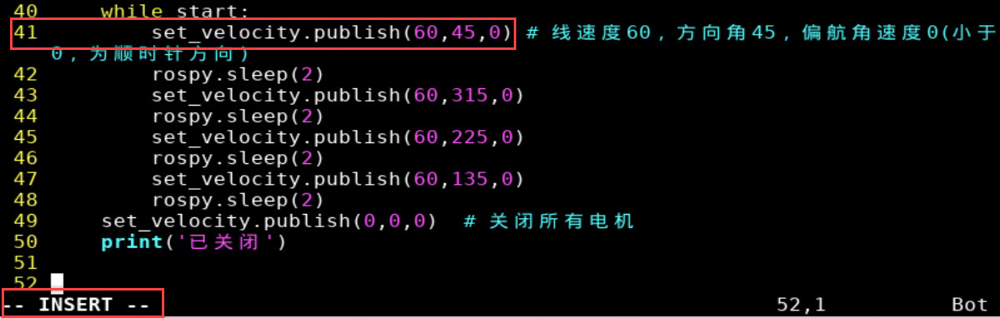

(5) In  `set_velocity.publish()`  function, the first parameter represents the motor speed and we change it to 90. After changing , press "**Esc**" and enter "**:wq**", and then press "**Enter**" to save and exit.

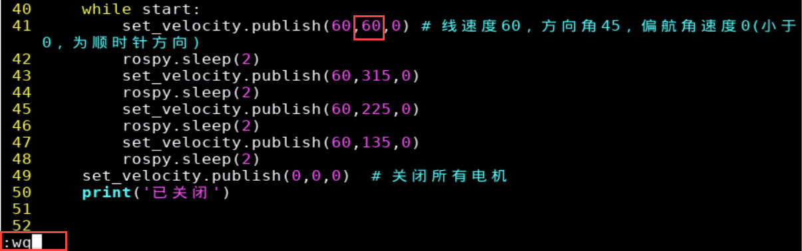

:::{Note}
 The adjustable range of speed is "**0-360**".  "**0**" moves right, "**9**" moves forward, "**180**" moves left, and "**270**" moves backwards.
:::

(6) After modifying, please refer to the content of "[**4.5.2 Operation Steps**](#anchor_4_5_2)" to check the outcome.

## 4.6 Drifting Movement

### 4.6.1 Working Principle

According to the characteristic of mecanum wheel characteristics, when the front two wheels do not move, the rear wheel A rotates clockwise and the rear wheel B rotates counterclockwise, the car drift clockwise. The force analysis for car drifting is shown in the following figure:

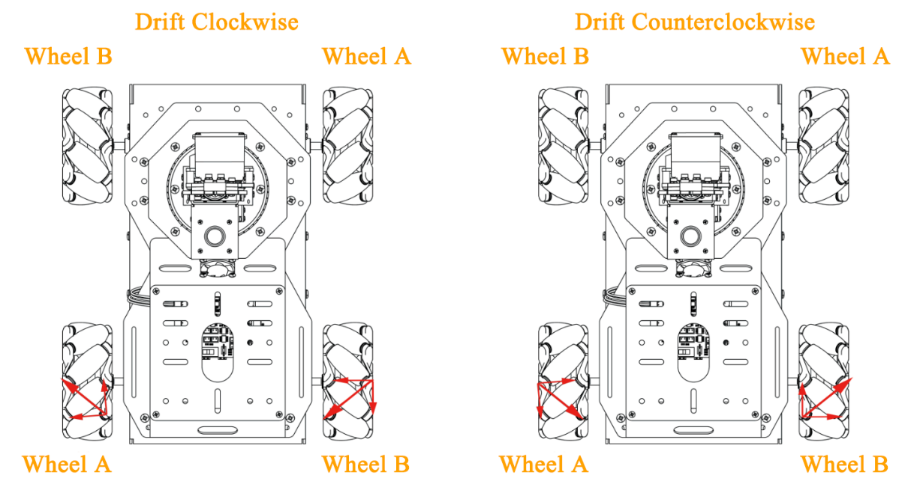

According to physical kinematics, when forces are equal and opposite to each other, they will counteract each other. Any force can be decomposed into two perpendicular vectors. Take counterclockwise drifting as example. Suppose the speed of wheel A and wheel B rotates at the same speed, a upward force decomposed by wheel A and a downward force decomposed by wheel B will counteract each other, which the direction of resultant velocity is to the right. 
Based on Newton's second law (F=ma), if the direction of acceleration is to the right, so the final resultant force is also to the right. At this time, if the front wheel does not move, the car will drift.    

<p id="anchor_4_6_2"></p>

### 4.6.2 Operation Steps

:::{Note}
It should be case sensitive when entering command, and the "**Tab**" key can be used to complete the keywords.
:::

(1) Power on the robot and use VNC Viewer to connect to the remote desktop.


(2) click  in the upper left corner of the system desktop to open the "**Terminator**".

(3) Enter the following command and press "**Enter**" to enter the directory of game programmings. 

```bash
cd armpi_pro/src/armpi_pro_demo/chassis_control_demo/
```

(4) Enter the command below and press "**Enter**" to start game.

```bash
python3 car_drifting_demo.py
```

(5) If want to exit the game, press "Ctrl+C" in terminal. If fail to exit, please keep trying until the program is closed. 

### 4.6.3 Project Outcome

After starting game, ArmPi Pro will drift counterclockwise first, then clockwise. 

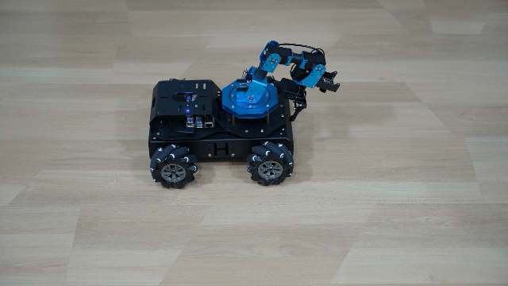

### 4.6.4 Program Analysis 

The source code of program is located in: [home/ubuntu/armpi_pro/src/armpi_pro_demo/chassis_control_demo/car_drifting_demo.py](../_static/source_code/car_drifting_demo.zip)

Control motor through set_velocity function. There are three parameters in function. Take the code `chassis.set_velocity(50,180,0.3)` as an example:

(1) The first parameter `50` represents the motor speed, its unit is mm/s and it ranges from -100 to 100. When the value is negative, the motor rotates counterclockwise.

(2) The second parameter `180` represents the movement direction of car, its unit is degree and it ranges from 0 to 360. The value of 90°refer to move forward. 270°refers to move backward. 0°refers to move to the right. 180°refers to move the left. Other movement directions are obtained according to the same reference method.  

(3) The third parameter `0.3` represents the rotation speed of the car, its unit is 5°/s and it ranges from -2 to 2. When the parameter value is positive, the car will rotate clockwise. When the parameter value is negative, the car will rotate counterclockwise.

### 4.6.5 Function Extension

The default speed of rotation is 0.3. This section will modify the rotation speed of clockwise drifting to 0.5 and the specific operation steps are as follow:

(1) click  in the upper left corner of the system desktop to open the "**Terminator**".

(2) Enter the following command and press "**Enter**" to come to the directory of game programmings.

```bash
cd armpi_pro/src/armpi_pro_demo/chassis_control_demo/
```

(3) Enter the command and press "**Enter**" to open the program file.

```bash
vim car_drifting_demo.py
```

(4) Find the code to be modified and press "**i**" to switch to the editing mode.

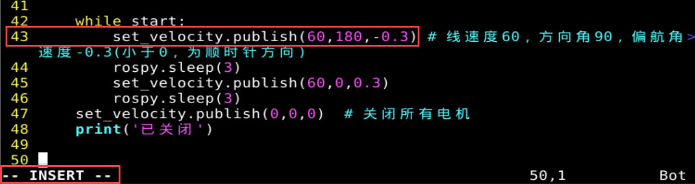

(5) In `set_velocity.publish()` function, the third parameter represents the rotation speed of the car and we change it to -0.5. After modifying, press "**Esc**" and enter "**:wq**", and then press "**Enter**" to save and exit.

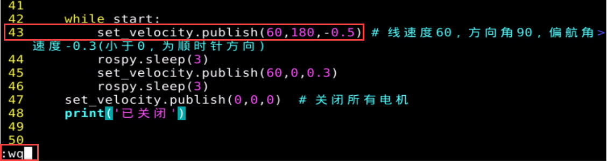

:::{Note}
The adjustable range of speed is from -2 to 2. When the value is negative, the car will rotate clockwise. When the value is positive, the car will rotate counterclockwise. Therefore, it is recommended to modify the value between 0 and 100.
:::

(6) After modifying, you can refer to the content of "[**4.6.2 Operation Steps**](#anchor_4_6_2)" to check the effect.

