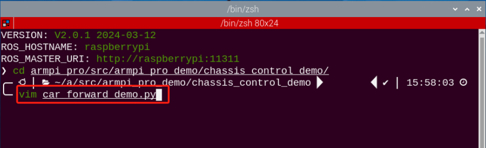

# 麦轮底盘小车运动控制课程

## 1. 麦轮小车运动介绍

### 1.1 前言

ArmPi Pro底座车轮采用的是全方位移动的麦克纳姆轮（以下简称为麦轮）。根据麦轮的夹角45度朝向不同，可以分为互为镜像关系的A轮和B轮，如下图所示：


麦轮具有万向性，灵活性，平稳性等特点，是一种很成功的全方位轮，通过这4个麦轮的组合，可以更灵活方便的实现ArmPi Pro全方位的移动功能。

### 1.2 原理说明

- #### 麦轮硬件结构及物理特性


麦轮整体结构由轮毂和辊子构成，轮毂是整个轮子的主体支架，辊子则是安装在轮毂上的鼓状物，麦轮的轮毂轴与辊子转轴呈 45度角。麦轮一般是四个一组使用，两个左旋轮（A轮），两个右旋轮（B轮），A轮和B轮具有对称性。

4个麦轮的组合方式有AAAA，BBBB，AABB，ABAB，BABA等，并不是所有的组合都可以实现前进、后退、旋转、左移、右移等功能，而ArmPi Pro的麦轮组合方式是ABAB，是一种可以实现全方位移动的组合。


- #### 麦轮物理特性

麦轮依靠各自机轮的方向和速度，这些力的最终合成在任何要求的方向上产生一个合力矢量从而保证了这个平台在最终的合力矢量的方向上能自由地移动，而不改变机轮自身的方向。

由于它的轮缘上斜向分布着许多小辊子，故轮子可以横向滑移。小辊子的母线很特殊，当轮子绕着固定的轮心轴转动时，各个小辊子的包络线为圆柱面，所以该轮能够连续地向前滚动。

### 1.3 运动方式分析

我们以轮子向前转为例，只对与**地面接触的辊子**分析。轮子前转的时候可以将接触地面的辊子当成一个静止的点进行摩擦，地面会给辊子一个向前的摩擦力。将这个摩擦力沿辊子、垂直辊子方向进行分解。具体分析如下：


分解成平行于辊子的力和垂直于辊子的力，其中垂直于辊子的力会导致辊子进行转动，这是滚动摩擦，是非常小的，因此对轮子的运动不会产生什么作用，我们可以认为这个方向上的力会因为辊子的滚动而被化掉了。

但是因为辊子有物理的限位，不会在平行于辊子轴的方向上进行滚动，因此平行于辊子轴的力产生的是滑动摩擦。这个力是对我们的轮子的运动起到至关重要的作用的力，这个力的方向自然也就是轮子在向前滚动时会移动的朝向。也就是说，图中的该麦轮在向前滚的时候会向左前方运动。

:::{Note}
受力分析是对与地面接触的辊子进行的，与它对应在正上方的辊子，和它是交叉的。在后面课程的受力分析，我们是以俯视的视角进行的，受力方向就与上面的辊子垂直。
:::


## 2. 小车前进

### 2.1 本节原理

根据麦克纳姆轮的特性，我们的小车要前进时，四个轮子都必须正转，如以下受力分析


根据物理运动学知识可知，大小相等，方向相反的力可以互相抵消，假设A轮和B轮正转的速度一样快，那么A轮分解出向右的力和B轮分解出向左的力刚好互相抵消，合力方向向前，根据牛顿第二运动定律 **(F=ma)** 可知，加速度方向向前，则最终合速度"**V合**"方向也向前。

<p id="anchor_2_2"></p>

### 2.2 玩法开启及关闭

:::{Note}
指令的输入需严格区分大小写，另外可按键盘"**Tab**"键进行关键词补齐。
:::

1)  将设备开机，并参照课程资料的"**[远程工具安装及容器进入方法\1. 远程桌面工具安装与连接]()**"内容，通过VNC远程连接工具连接。


2)  点击系统桌面左上角的图标，打开Terminator终端。


3)  输入玩法程序目录所在的指令：

```commandline
cd armpi_pro/src/armpi_pro_demo/chassis_control_demo
```


4)  输入玩法执行指令：

```commandline
python3 car_forward_demo.py
```


5)  如需关闭此玩法，只需终端界面中按下"**Ctrl+C**"，若关闭失败，可重复此操作，直至程序关闭。

### 2.3 实现效果

玩法开启后，ArmPi Pro就会开始一直前进。

### 2.4 功能延伸

**程序默认前进的速度是60，我们可以尝试调节小车的速度，这里我们把速度修改为90**，具体的修改步骤如下：

1)  点击系统桌面左上角的图标，打开Terminator终端。


2)  输入进到玩法程序所在目录的指令：

```commandline
cd armpi_pro/src/armpi_pro_demo/chassis_control_demo/
```


3)  输入打开程序文件的指令

```commandline
vim car_forward_demo.py
```



4)  找到要修改的代码部分，按下键盘的"**i**"键，当出现左下角框出内容时，即进入编辑模式。


5)  在"**set_velocity.publish()**"函数中，第一个参数代表电机的速度，这里我们修改为90，修改完成后，按下键盘的"**Esc**"键，并输入"**:wq**"，按下回车，即可完成保存与退出操作。


:::{Note}
速度的调整范围是"-100~100"，为正数时电机正转，为负数时电机反转。在修改成负数时可能会改变小车的移动方向，这里建议大家修改范围在"0~100"之间
:::

6)  修改完成后，可按照"[2.2 玩法开启及关闭](#anchor_2_2)"内容，再次运行程序，查看修改后的效果。

### 2.5 程序简析

程序逻辑流程图如下图所示。


该程序的源代码位于：**home/ubuntu/armpi_pro/src/armpi_pro_demo/chassis_control_demo/car_forward_demo.py**


主要通过**set_velocity.publish()**函数来控制电机。该函数中有三个参数，以代码"**chassis.set_velocity(60,90,0)**"为例：

第一个参数"**60**"，表示的是电机的速度，单位是毫米每秒，范围是"**-100~100**"，数值为负数时电机是反转。

第二个参数"**90**"，代表的是小车移动的方向，单位是度，范围是"**0~360**"，其中90度是向前方，270度是向后，0度是向右，180度向左，其他方向角度以此类推。

第三个参数"**0**"，代表的是小车的偏移速率，单位是5度每秒，范围是"**-2~2**"，正数是顺时针转动，负数是逆时针转动。

## 3. 小车转向

### 3.1 本节原理

根据麦克纳姆轮的特性，当小车左边的轮子反转，右边的轮子正转时，小车会原地逆时针旋转；当小车左边的轮子正转，右边的轮子反转时，小车会原地顺时针旋转。

两种情况的受力分析图如下所示：

 


<p id="anchor_3_2"></p>

### 3.2 玩法开启及关闭

:::{Note}
指令的输入需严格区分大小写，另外可按键盘"**Tab**"键进行关键词补齐。
:::

1)  将设备开机，并参照课程资料的"**[远程工具安装及容器进入方法\ 1. 远程桌面工具安装与连接]()**"内容，通过VNC远程连接工具连接。


2)  点击系统桌面左上角的图标，打开Terminator终端。


3)  输入玩法程序目录所在的指令：

```commandline
cd armpi_pro/src/armpi_pro_demo/chassis_control_demo/
```


4)  输入玩法执行指令：

```commandline
python3 car_turn_demo.py
```


5)  如需关闭此玩法，只需终端界面中按下"**Ctrl+C**"，若关闭失败，可重复此操作，直至程序关闭。

### 3.3 实现效果

玩法开启后，ArmPi Pro小车先原地顺时针旋转，再原地逆时针旋转。

### 3.4 能延伸

**程序默认前进的偏移速度是0.3，我们可以尝试调节小车旋转的速度，这里我们把顺时针速度修改为0.5**，具体的修改步骤如下：

1)  点击系统桌面左上角的图标，打开Terminator终端。


2)  输入进到玩法程序所在目录的指令：

```commandline
cd armpi_pro/src/armpi_pro_demo/chassis_control_demo/
```


3)  输入打开程序文件的指令：

```commandline
vim car_turn_demo.py
```


4)  找到要修改的代码部分，按下键盘的"**i**"键，当出现左下角框出内容时，即进入编辑模式。


5)  在"**set_velocity.publish()**"函数中，第三个参数代表小车偏移的速度，这里我们修改为-0.5，修改完成后，按下键盘的"**Esc**"键，并输入"**:wq**"，按下回车，即可完成保存与退出操作。


:::{Note}
速度的调整范围是"-2~2"，为负数时小车顺时针旋转，为正数时小车逆时针旋转。修改时建议根据实际情况小幅度调节。
:::

6)  修改完成后，可按照"[3.2 玩法开启及关闭](#anchor_3_2)"内容，再次运行程序，查看修改后的效果。

### 3.5 程序简析

程序逻辑流程图如下图所示。


该程序的源代码位于：**home/ubuntu/armpi_pro/src/armpi_pro_demo/chassis_control_demo/car_turn_demo.py**


主要通过**set_velocity.publish()**函数来控制电机。该函数中有三个参数，以代码"**set_velocity.publish(0,90,-0.3)**"为例：

第一个参数"**0**"，表示的是电机的速度，单位是毫米每秒，范围是"**-100~100**"，数值为负数时电机是反转。

第二个参数"**90**"，代表的是小车移动的方向，单位是度，范围是"0**~360**"，其中90度是向前方，270度是向后，0度是向右，180度向左，其他方向角度以此类推。

第三个参数"**-0.3**"，代表的是小车的偏移速率，单位是5度每秒，范围是"**-2~2**"，正数是顺时针转动，负数是逆时针转动。

## 4. 小车前后左右运动

### 4.1 本节原理

根据麦轮的特性，当小车轮子全部正转时，小车前进；当小车轮子全部反转时，小车后退；当A轮全部反转，B轮正转时，小车左平移；当B轮全部反转，A轮正转时，小车右平移。小车前后左右的运动受力分析图如下：


根据物理运动学知识可知，大小相等，方向相反的力可以互相抵消，假设A轮和B轮正转的速度一样快，那么A轮分解出向右的力和B轮分解出向左的力刚好互相抵消，合力方向向前。

根据牛顿第二运动定律（**F=ma**）可知，加速度方向向前，则最终合速度方向"**V合**"也向前。其他方向的速度解析也是以同样的思路来推导。

<p id="anchor_4_2"></p>

### 4.2 玩法开启及关闭

:::{note}
指令的输入需严格区分大小写，另外可按键盘"**Tab**"键进行关键词补齐。
:::

1)  将设备开机，并参照课程资料的"**[远程工具安装及容器进入方法\1. 远程桌面工具安装与连接]()**"内容，通过VNC远程连接工具连接。


2)  点击系统桌面左上角的图标，打开Terminator终端。


3)  输入玩法程序目录所在的指令：

```commandline
cd armpi_pro/src/armpi_pro_demo/chassis_control_demo/
```


4)  输入玩法执行指令：

```commandline
python3 car_move_demo.py
```


5)  如需关闭此玩法，只需终端界面中按下"**Ctrl+C**"，若关闭失败，可重复此操作，直至程序关闭。

### 4.3 实现效果

玩法开启后，ArmPi Pro小车将在前后左右四个方向移动。

### 4.4 功能延伸

**程序默认的速度是60，我们可以尝试调节小车的速度，这里我们把车体的移动的速度修改为90**，具体的修改步骤如下：

1)  点击系统桌面左上角的图标，打开Terminator终端。


2)  输入进到玩法程序所在目录的指令：

```commandline
cd armpi_pro/src/armpi_pro_demo/chassis_control_demo/
```


3)  输入打开程序文件的指令：

```commandline
vim car_move_demo.py
```


4)  找到要修改的代码部分，按下键盘的"**i**"键进入编辑模式，当出现左下角框出内容时，即进入编辑模式。


5)  然后将所有"**set_velocity.publish()**"函数中的第一个参数"**60**"改为"**90**"，即将速度修改为90，如下图所示：


6)  修改完成后，按下键盘的"**Esc**"键，并输入"**:wq**"，按下回车，即可完成保存与退出操作。


:::{Note}
速度的调整范围是"-100~100"，为负数时电机正转，为正数时电机反转。在修改成负数时可能会改变小车的移动方向，这里建议大家修改范围在"0~100"之间
:::

7)  修改完成后，再继续[4.2 玩法开启及关闭](#anchor_4_2)内容，即可查看修改好的效果。

### 4.5 程序简析

程序逻辑流程图如下图所示。


该程序的源代码位于：**home/ubuntu/armpi_pro/src/armpi_pro_demo/chassis_control_demo/car_move_demo.py**


主要通过**set_velocity.publish()**函数来控制电机。该函数中有三个参数，以代码"**set_velocity.publish(60,90,0)**"为例：

第一个参数"**60**"，表示的是电机的速度，单位是毫米每秒，范围是"**-100~100**"，数值为正数时电机是反转。

第二个参数"**90**"，代表的是小车移动的方向，单位是度，范围是"**0~360**"，其中90度是向前方，270度是向后，0度是向右，180度向左，其他方向角度以此类推。

第三个参数"**0**"，代表的是小车的偏移速率，单位是5度每秒，范围是"**-2~2**"，正数是顺时针转动，负数是逆时针转动。

## 5. 小车斜向运动

### 5.1 本节原理

根据麦克纳姆轮的特性，当小车A轮不动，B轮正转时，小车朝左前方移动；B轮反转时，小车朝右后方移动。当小车B轮不动，A轮正转时，小车朝右前方移动；A轮反转时，小车朝左后方移动。小车斜向移动受力分析图如下：


<p id="anchor_5_2"></p>

### 5.2 玩法开启及关闭

:::{Note}
指令的输入需严格区分大小写，另外可按键盘"**Tab**"键进行关键词补齐。
:::

1)  将设备开机，并参照课程资料的"**第8章 远程工具安装及容器进入方法\第1课 远程桌面工具安装与连接**"内容，通过VNC远程连接工具连接。


2)  点击系统桌面左上角的图标，打开Terminator终端。


3)  输入玩法程序目录所在的指令：

```commandline
cd armpi_pro/src/armpi_pro_demo/chassis_control_demo/
```


4)  输入玩法执行指令

```commandline
python3 car_slant_demo.py
```


5)  如需关闭此玩法，只需终端界面中按下"**Ctrl+C**"，若关闭失败，可重复此操作，直至程序关闭。

### 5.3 实现效果

玩法开启后，ArmPi Pro小车将按照右前方，右后方，左后方，左前方的顺序移动。

### 5.4 功能延伸

**程序默认都是斜向45度，我们可以尝试调节小车斜向移动的角度，这里我们把左前方的角度修改为60**，具体的修改步骤如下：

1)  点击系统桌面左上角的图标，打开Terminator终端。


2)  输入进到玩法程序所在目录的指令：

```commandline
cd armpi_pro/src/armpi_pro_demo/chassis_control_demo/
```


3)  输入打开程序文件的指令

```commandline
vim car_slant_demo.py
```


4)  找到要修改的代码部分，按下键盘的"**i**"键，当出现左下角框出内容时，即进入编辑模式。


5)  在"**set_velocity.publish()**"函数中，第二个参数代表前进的方向角度，这里我们修改为60，修改完成后，按下键盘的"**Esc**"键，并输入"**:wq**"，按下回车，即可完成保存与退出操作。


:::{Note}
方向角度的调整范围是"0~360"，0为向右，90为向前，180为向左，270为向后。
:::

6)  修改完成后，可按照"[5.2 玩法开启及关闭](#anchor_5_2)"内容，再次运行程序，查看修改后的效果。

### 5.5 程序简析

程序逻辑流程图如下图所示。


该程序的源代码位于：**home/ubuntu/armpi_pro/src/armpi_pro_demo/chassis_control_demo/car_slant_demo.py**


主要通过**set_velocity.publish()**函数来控制电机。该函数中有三个参数，以代码"**chassis.set_velocity(60,45,0)**"为例：

第一个参数"**60**"，表示的是电机的速度，单位是毫米每秒，范围是"**-100~100**"，数值为正数时电机是反转。

第二个参数"**45**"，代表的是小车移动的方向，单位是度，范围是"**0~360**"，其中90度是向前方，270度是向后，0度是向右，180度向左，其他方向角度以此类推。

第三个参数"**0**"，代表的是小车的偏移速率，单位是5度每秒，范围是"**-2~2**"，正数是顺时针转动，负数是逆时针转动。

## 6. 小车漂移运动

### 6.1 本节原理

根据麦克纳姆轮的特性，前面轮子不动时，后面A轮正转，B轮反转，小车逆时针漂移；后面B轮正转，A轮反转，小车顺时针漂移。小车漂移的受力分析图如下：


根据物理运动学知识可知，大小相等，方向相反的力可以互相抵消，以逆时针漂移为例，假设A轮和B轮转动的速度一样快，那么A轮分解出向上的力和B轮分解出向下的力刚好互相抵消，合力方向向右。

根据牛顿第二运动定律**（F=ma）**可知，加速度方向向右，则最终合速度方向也向右，而前轮不动，则会产生漂移。顺时针漂移也是同样的思路推导。

<p id="anchor_6_2"></p>

### 6.2 玩法开启及关闭

:::{Note}
指令的输入需严格区分大小写，另外可按键盘"**Tab**"键进行关键词补齐。
:::

1)  将设备开机，并参照课程资料的"**[远程工具安装及容器进入方法1. 远程桌面工具安装与连接]()**"内容，通过VNC远程连接工具连接。


2)  点击系统桌面左上角的图标，打开Terminator终端。


3)  输入玩法程序目录所在的指令：

```commandline
cd armpi_pro/src/armpi_pro_demo/chassis_control_demo/
```


4)  输入玩法执行指令：

```commandline
python3 car_drifting_demo.py
```


5)  如需关闭此玩法，只需终端界面中按下"**Ctrl+C**"，若关闭失败，可重复此操作，直至程序关闭。

### 6.3 实现效果

玩法开启后，ArmPi Pro小车将先逆时针漂移，再顺时针漂移，以此循环偏移。

### 6.4 功能延伸

**程序默认的偏移速度是0.3，我们可以尝试调节小车的偏移速度，这里我们修改顺时针漂移的偏移速度为0.5**，具体的修改步骤如下：

1)  点击系统桌面左上角的图标，打开Terminator终端。


2)  输入进到玩法程序所在目录的指令：

```commandline
cd armpi_pro/src/armpi_pro_demo/chassis_control_demo/
```


3)  输入打开程序文件的指令

```commandline
vim car_drifting_demo.py
```


4)  找到要修改的代码部分，按下键盘的"**i**"键，当出现左下角框出内容时，即进入编辑模式。


5)  在"**set_velocity.publish()**"函数中，第三个参数代表小车偏移的速度，这里我们修改为-0.5，修改完成后，按下键盘的"**Esc**"键，并输入"**:wq**"，按下回车，即可完成保存与退出操作。


:::{Note}
速度的调整范围是"-2~2"，为负数时小车顺时针旋转，为正数时小车逆时针旋转。修改时建议根据实际情况小幅度调节
:::

6)  修改完成后，可按照"[6.2 玩法开启及关闭](#anchor_6_2)"内容，再次运行程序，查看修改后的效果。

### 6.5 程序简析

程序逻辑流程图如下图所示:


该程序的源代码位于：**home/ubuntu/armpi_pro/src/armpi_pro_demo/chassis_control_demo/car_drifting_demo.py**


主要通过**set_velocity.publish()** 函数来控制电机。该函数中有三个参数，以代码"**chassis.set_velocity(50,180,0.3)**"为例：

第一个参数"**50**"，表示的是电机的速度，单位是毫米每秒，范围是"**-100~100**"，数值为负数时电机是反转。

第二个参数"**180**"，代表的是小车移动的方向，单位是度，范围是"**0~360**"，其中90度是向前方，270度是向后，0度是向右，180度向左，其他方向角度以此类推。

第三个参数"**0.3**"，代表的是小车的偏移速率，单位是5度每秒，范围是"**-2~2**"，正数是顺时针转动，负数是逆时针转动。

